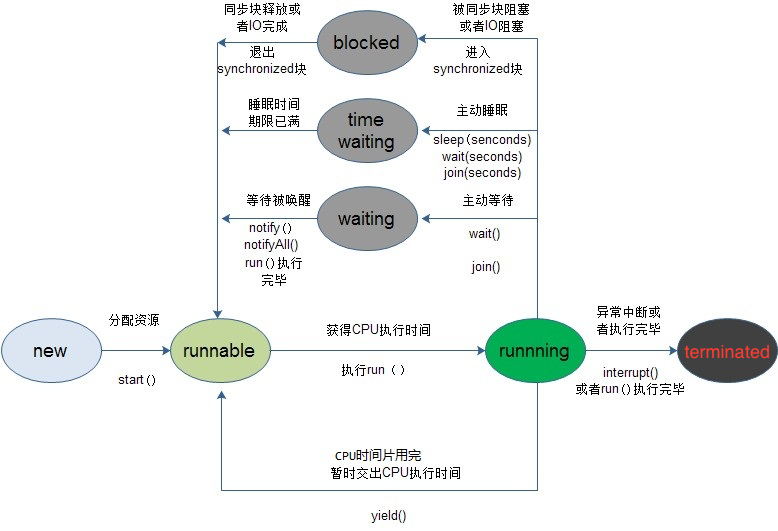
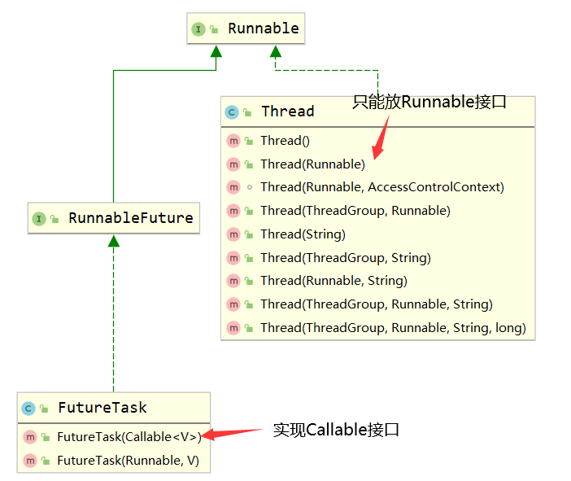
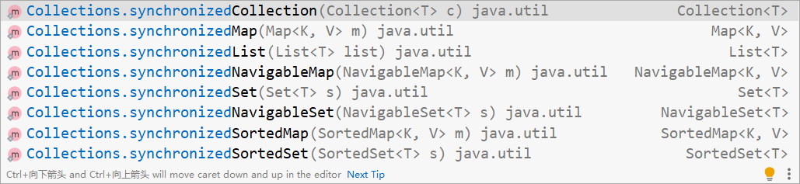
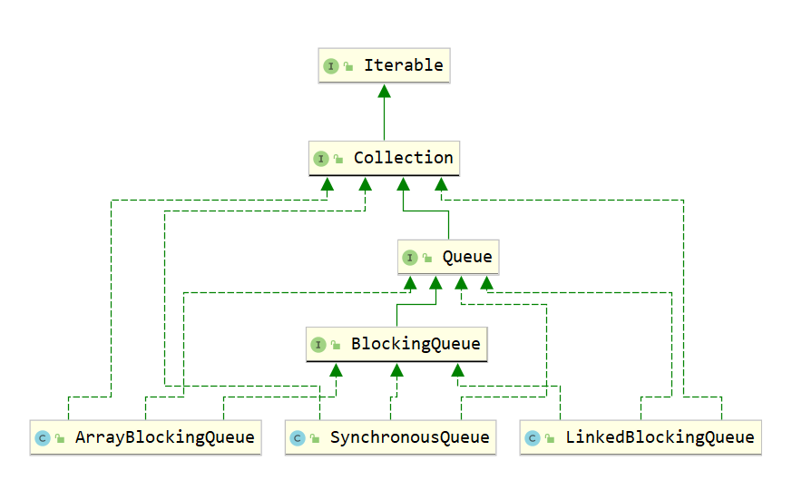
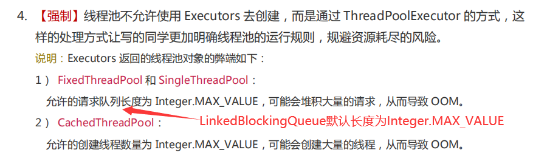
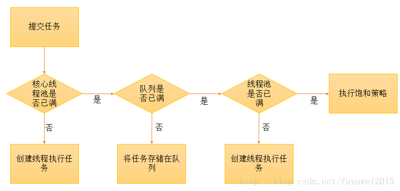
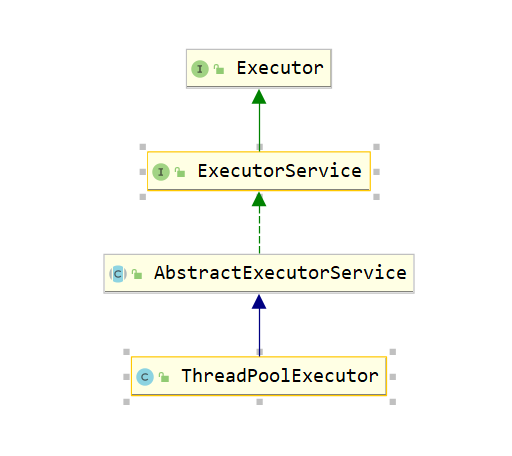

# 1、创建线程的4种方法

## 1.1、继承Thead类

```java
class MyThread extends Thread {
    @Override
    public void run() {
        System.out.println(Thread.currentThread().getName() + '\t');
    }
}
public class Demo {
    public static void main(String[] args) {
        new MyThread().start();
    }
}
```

## 1.2、实现Runnable接口

```java
class MyThread implements Runnable{
    @Override
    public void run() {
        System.out.println(Thread.currentThread().getName() + '\t');
    }
}
public class Demo {
    public static void main(String[] args) {
        // 方法一：将Runnable实现类作为Thread的构造参数传递到Thread类中，然后启动Thread类
        MyThread myThread = new MyThread();
        new Thread(myThread,"myThread-1").start();

        // 方法二：匿名内部类
        new Thread(new Runnable() {
            @Override
            public void run() {
                System.out.println(Thread.currentThread().getName() + '\t');
            }
        },"myThread-2").start();

        // 方法三：Lamda表达式
        new Thread( () -> {
            System.out.println(Thread.currentThread().getName() + '\t');
        },"myThread-3").start();
    }
}
```

## 1.3、实现Callable接口

```java
class MyThread implements Callable<Integer> {
    @Override
    public Integer call() throws Exception {
        System.out.println(Thread.currentThread().getName() + "\tcome in");
        int num = 0;
        for (int i = 0; i < 1000; i++) {
            num += i;
        }
        TimeUnit.SECONDS.sleep(5);
        System.out.println(Thread.currentThread().getName() + "\tcome out");
        return num;
    }
}

public class Demo {
    public static void main(String[] args) throws ExecutionException, InterruptedException {
        // 将Callable包装成FutureTask，FutureTask也是一种Runnable
        // 
        MyThread myThread = new MyThread();
        FutureTask<Integer> task = new FutureTask<>(myThread);
        new Thread(task, "Aizz").start();
        // get() 方法会阻塞调用的线程，即等待被调用的线程返回值
        Integer num = task.get();
        System.out.println(Thread.currentThread().getName() + "\t" + num);

        // 匿名内部类
        FutureTask<Integer> task1 = new FutureTask<>(new Callable<Integer>() {
            @Override
            public Integer call() throws Exception {
                return 0;
            }
        });
        new Thread(task1).start();

        // Lamda
        FutureTask<Integer> task2 = new FutureTask<>(() -> {
            return 0;
        });
        new Thread(task2).start();
    }
}
```

## 1.4、使用线程池

```java
public class Demo {
    public static void main(String[] args) throws ExecutionException, InterruptedException {
        // 创建一个线程池
        ExecutorService service = Executors.newFixedThreadPool(2);
        // execute() 用于实现 Runnable 接口
        service.execute(()->{
            System.out.println(Thread.currentThread().getName() + "\tcome in");
        });
        service.execute(()->{
            System.out.println(Thread.currentThread().getName() + "\tcome in");
        });
        service.execute(()->{
            System.out.println(Thread.currentThread().getName() + "\tcome in");
        });
        // submit() 用于实现 Callable 接口
        String future = service.submit(() -> {
            System.out.println(Thread.currentThread().getName());
            return "come in";
        }).get();
        System.out.println(future);
        // 关闭线程池
        service.shutdown();
    }
}
```

## 1.5、比较

-   Thread: 继承方式, 不建议使用, 因为Java是单继承的，继承了Thread就没办法继承其它类了，不够灵活

-   Runnable: 实现接口，比Thread类更加灵活，没有单继承的限制

-   Callable: Thread和Runnable都是重写的run()方法并且没有返回值，Callable是重写的call()方法并且有返回值并可以借助FutureTask类来判断线程是否已经执行完毕或者取消线程执行

    
    

当线程不需要返回值时使用Runnable，需要返回值时就使用Callable，一般情况下不直接把线程体代码放到Thread类中，一般通过Thread类来启动线程

Thread类是实现Runnable，Callable封装成FutureTask，FutureTask实现RunnableFuture，RunnableFuture继承Runnable，所以Callable也算是一种Runnable，所以三种实现方式本质上都是Runnable实现


# 2、线程的状态

## 2.1、源码

```java
public enum State {
    /*
    	new 一个线程
    */
    NEW,
    /*
    	调佣start()方法，此时线程并未开始执行run()方法，而只是进入了就绪态(Runnable)
    	需要等待cpu的调度才可进入运行态(Running),开始执行run()方法
    */
    RUNNABLE,
    /*
    	进入同步块，未获得锁资源，阻塞
    */
    BLOCKED,
    /*
    	不带时间的wait()、join(),如果没有唤醒，将一直等待下去
    	被唤醒，进入Runnable
    */
    WAITING,
    /*
    	带时间的sleep(seconds),wait(seconds),join(seconds)
    	睡眠时间结束，进入Runnable
    */
    TIMED_WAITING,
    /*
    	线程interrupt()、run()方法执行完毕
    */
    TERMINATED;
}
```

## 2.2、状态间的转换



## 2.3、wait() 和 sleep()

1、sleep()方法可以在任何地方使用；wait()方法则只能在同步方法或同步块中使用；

2、sleep()是线程线程类（Thread）的方法，调用会暂停此线程指定的时间，但监控依然保持，不会释放对象锁，到时间自动恢复；wait()是Object的方法，调用会放弃对象锁，进入等待队列，待调用notify()/notifyAll()唤醒指定的线程或者所有线程，才会进入锁池，不再次获得对象锁才会进入运行状态；


# 3、线程 操作 资源类

## 3.1、买票复习

```java
// 资源类
class SaleTicket {
    private int number = 40;
    // 操作(对外暴露的方法)
    public synchronized void sale() {
        if (number > 0) {
            System.out.println(Thread.currentThread().getName() + '\t' + number);
            number--;
        }
    }
}
// 资源类 使用Lock替换Synchronized
class SaleTicket {
    private int number = 40;
    Lock lock = new ReentrantLock();
    // 操作(对外暴露的方法)
    public void sale() {
        lock.lock();
        try {
            if (number > 0) {
                System.out.println(Thread.currentThread().getName() + '\t' + number);
                number--;
            }
        }finally {
            lock.unlock();
        }

    }
}
public class Demo {
    public static void main(String[] args) {
        SaleTicket saleTicket = new SaleTicket();
        // 线程
        new Thread(()->{
            for (int i = 0; i < 40; i++) {
                saleTicket.sale();
            }
        },"Aaa").start();
        new Thread(()->{
            for (int i = 0; i < 40; i++) {
                saleTicket.sale();
            }
        },"Bbb").start();
    }
}
```

## 3.2、生产消费复习

>   Synchronized+wait()+notify()\notifyAll()

```java
// 资源类
class PC {
    private int number = 0;
    public synchronized void increment(){
        // 判断
        while (number != 0){
            try {
                wait();
            } catch (InterruptedException e) {
                e.printStackTrace();
            }
        }
        // 干活
        number++;
        System.out.println(Thread.currentThread().getName()+"\t"+number);
        // 通知
        notifyAll();
    }
    public synchronized void decrement(){
        while (number != 1){
            try {
                wait();
            } catch (InterruptedException e) {
                e.printStackTrace();
            }
        }
        number--;
        System.out.println(Thread.currentThread().getName()+"\t"+number);
        notifyAll();
    }
}

/**
 * 题目：现在四个线程，可以操作初始值为零的一个变量，
 * 实现两个线程对该变量加1，两个线程对该变量-1，
 * 实现交替，来10轮，变量初始值为0.
 * 1.高内聚低耦合前提下，线程操作资源类
 * 2.判断/干活/通知
 * 3.防止虚假唤醒(判断只能用while，不能用if)
 * 知识小总结：多线程编程套路+while判断+新版写法
 */
public class Demo {
    public static void main(String[] args) {
        PC pc = new PC();
        // 线程
        new Thread(() -> {
            for (int i = 0; i < 10; i++) {
                pc.increment();
            }
        }, "生产者-1").start();
        new Thread(() -> {
            for (int i = 0; i < 10; i++) {
                pc.decrement();
            }
        }, "消费者-1").start();
        new Thread(() -> {
            for (int i = 0; i < 10; i++) {
                pc.increment();
            }
        }, "生产者-2").start();
        new Thread(() -> {
            for (int i = 0; i < 10; i++) {
                pc.decrement();
            }
        }, "消费者-2").start();
    }
}
```

>   Lock+await()+signal()\signalAll()

```java
// 资源类
class PC {
    private int flag = 1;
    private final Lock lock = new ReentrantLock();
    private final Condition condition1 = lock.newCondition();
    private final Condition condition2 = lock.newCondition();
    private final Condition condition3 = lock.newCondition();
    private final Condition[] conditions = new Condition[]{condition1,condition2,condition3};

    public void pr(int number){
        lock.lock();
        try {
            while(flag != number){
                conditions[number-1].await();
            }
            for (int i = 0; i < 5 * number; i++) {
                System.out.println(Thread.currentThread().getName()+"\t   "+number);
            }
            flag = flag == 3 ? 1 : flag + 1;
            conditions[flag-1].signal();
        } catch (InterruptedException e) {
            e.printStackTrace();
        } finally {
            lock.unlock();
        }
    }
}

/**
 * 备注：多线程之间按顺序调用，实现A->B->C
 * 三个线程启动，要求如下：
 * AA打印5次，BB打印10次，CC打印15次
 * 接着
 * AA打印5次，BB打印10次，CC打印15次
 * 来10轮
 *      1.高内聚低耦合前提下，线程操作资源类
 *      2.判断/干活/通知
 *      3.多线程交互中，防止虚假唤醒(判断只能用while，不能用if)
 *      4.标志位
 */
public class Demo {
    public static void main(String[] args) {
        PC pc = new PC();
        new Thread(()->{
            pc.pr(1);
            pc.pr(1);
        },"线程A").start();
        new Thread(()->{
            pc.pr(2);
            pc.pr(2);
        },"线程B").start();
        new Thread(()->{
            pc.pr(3);
            pc.pr(3);
        },"线程C").start();
    }
}
```


## 3.3、Synchronized 与 Lock的区别

|          |                       **synchronized**                       |                  **Lock**                   |
| -------- | :----------------------------------------------------------: | :-----------------------------------------: |
| 存在层次 |                  Java的关键字，在jvm层面上                   |                  是一个类                   |
| 锁的释放 | 1、以获取锁的线程执行完同步代码，释放锁 2、线程执行发生异常，jvm会让线程释放锁 | 在finally中必须释放锁，不然容易造成线程死锁 |
| 锁的获取 |  假设A线程获得锁，B线程等待。如果A线程阻塞，B线程会一直等待  |    分情况而定，Lock有多个锁获取的方式，     |
| 锁状态   |                           无法判断                           |                  可以判断                   |
| 锁类型   |                    可重入 不可中断 非公平                    |      可重入 可判断 可公平（两者皆可）       |
| 性能     |                           少量同步                           |                  大量同步                   |

1、ReentrantLock 拥有Synchronized相同的并发性和内存语义，此外还多了 锁投票，定时锁等候和中断锁等候

线程A和B都要获取对象O的锁定，假设A获取了对象O锁，B将等待A释放对O的锁定，如果使用 synchronized ，如果A不释放，B将一直等下去，不能被中断；如果 使用ReentrantLock，如果A不释放，可以使B在等待了足够长的时间以后，中断等待，而干别的事情

ReentrantLock获取锁定与三种方式：
a) lock(), 如果获取了锁立即返回，如果别的线程持有锁，当前线程则一直处于休眠状态，直到获取锁
b) tryLock(), 如果获取了锁立即返回true，如果别的线程正持有锁，立即返回false；
c)tryLock(long timeout,TimeUnit unit)， 如果获取了锁定立即返回true，如果别的线程正持有锁，会等待参数给定的时间，在等待的过程中，如果获取了锁定，就返回true，如果等待超时，返回false；
d) lockInterruptibly:如果获取了锁定立即返回，如果没有获取锁定，当前线程处于休眠状态，直到或者锁定，或者当前线程被别的线程中断

2、synchronized是在JVM层面上实现的，不但可以通过一些监控工具监控synchronized的锁定，而且在代码执行时出现异常，JVM会自动释放锁定，但是使用Lock则不行，lock是通过代码实现的，要保证锁定一定会被释放，就必须将unLock()放到finally{}中

3、在资源竞争不是很激烈的情况下，Synchronized的性能要优于ReetrantLock，但是在资源竞争很激烈的情况下，Synchronized的性能会下降几十倍，但是ReetrantLock的性能能维持常态；

5.0的多线程任务包对于同步的性能方面有了很大的改进，在原有synchronized关键字的基础上，又增加了ReentrantLock，以及各种Atomic类。了解其性能的优劣程度，有助与我们在特定的情形下做出正确的选择。


## 3.4、wait()+notify()\notifyAll() 和 await()+signal()\signalAll()

>wait()+notify()\notifyAll()

1、wait()、notify()和notifyAll()方法是本地方法，并且为final方法，无法被重写。

2、调用某个对象的wait()方法能让当前线程阻塞，并且当前线程必须拥有此对象的monitor（即锁）

3、调用某个对象的notify()方法能够唤醒一个正在等待这个对象的monitor的线程，如果有多个线程都在等待这个对象的monitor，则只能唤醒其中一个线程；

4、调用notifyAll()方法能够唤醒所有正在等待这个对象的monitor的线程；

>   await()+signal()\signalAll()

Condition是在java 1.5中才出现的，它用来替代传统的Object的wait()、notify()实现线程间的协作，相比使用Object的wait()、notify()，使用Condition1的await()、signal()这种方式实现线程间协作更加安全和高效。因此通常来说比较推荐使用Condition，在阻塞队列那一篇博文中就讲述到了，阻塞队列实际上是使用了Condition来模拟线程间协作。

1、Condition是个接口，基本的方法就是await()和signal()方法；

2、Condition依赖于Lock接口，生成一个Condition的基本代码是lock.newCondition() 

3、 调用Condition的await()和signal()方法，都必须在lock保护之内，就是说必须在lock.lock()和lock.unlock之间才可以使用


# 4、八锁问题

```java
class Phone{
    public /*static*/ synchronized void sendEmail(){
        try {
            TimeUnit.SECONDS.sleep(4);
        } catch (InterruptedException e) {
            e.printStackTrace();
        }
        System.out.println(Thread.currentThread().getName()+"\tsendEmail");
    }

    public /*static*/ synchronized void sendMs(){
        System.out.println(Thread.currentThread().getName()+"\tsendMs");
    }

    public void sayHello(){
        System.out.println(Thread.currentThread().getName()+"\tsayHello");
    }
}
/**
 * 1.标准访问，先打印邮件
 * 2.邮件设置暂停4秒方法，先打印邮件
 *      对象锁
 *      一个对象里面如果有多个synchronized方法，某一个时刻内，只要一个线程去调用其中的一个synchronized方法了，
 *      其他的线程都只能等待，换句话说，某一个时刻内，只能有唯一一个线程去访问这些synchronized方法，
 *      锁的是当前对象this，被锁定后，其他的线程都不能进入到当前对象的其他的synchronized方法
 * 3.新增sayHello方法，先打印sayHello
 *      加个普通方法后发现和同步锁无关
 * 4.两部手机，先打印短信
 *      换成两个对象后，不是同一把锁了，情况立刻变化
 * 5.两个静态同步方法，同一部手机，先打印邮件
 * 6.两个静态同步方法，同两部手机，先打印邮件，锁的同一个字节码对象
 *      全局锁
 *      synchronized实现同步的基础：java中的每一个对象都可以作为锁。
 *      具体表现为一下3中形式。
 *      对于普通同步方法，锁是当前实例对象，锁的是当前对象this，
 *      对于同步方法块，锁的是synchronized括号里配置的对象。
 *      对于静态同步方法，锁是当前类的class对象
 * 7.一个静态同步方法，一个普通同步方法，同一部手机，先打印短信
 * 8.一个静态同步方法，一个普通同步方法，同二部手机，先打印短信
 *      当一个线程试图访问同步代码块时，它首先必须得到锁，退出或抛出异常时必须释放锁。
 *      也就是说如果一个实例对象的普通同步方法获取锁后，该实例对象的其他普通同步方法必须等待获取锁的方法释放锁后才能获取锁，
 *      可是别的实例对象的普通同步方法因为跟该实例对象的普通同步方法用的是不同的锁，
 *      所以无需等待该实例对象已获取锁的普通同步方法释放锁就可以获取他们自己的锁。
 *
 *      所有的静态同步方法用的也是同一把锁--类对象本身，
 *      这两把锁(this/class)是两个不同的对象，所以静态同步方法与非静态同步方法之间是不会有静态条件的。
 *      但是一旦一个静态同步方法获取锁后，其他的静态同步方法都必须等待该方法释放锁后才能获取锁，
 *      而不管是同一个实例对象的静态同步方法之间，
 *      还是不同的实例对象的静态同步方法之间，只要它们同一个类的实例对象
 */
public class Demo {
    public static void main(String[] args) throws InterruptedException {
        Phone phone1 = new Phone();
        Phone phone2 = new Phone();
        new Thread(()->{
            phone1.sendEmail();
        },"线程A").start();
        TimeUnit.MILLISECONDS.sleep(100);
        new Thread(()->{
//            phone1.sendMs();
            phone2.sendMs();
//            phone1.sayHello();
        },"线程B").start();

    }
}
```


# 5、Callable接口

callable是创建线程的方法之一，能够返回值。

## 5.1、与Runnable的区别

```java
// Runnabl接口
@FunctionalInterface
public interface Runnable {
    public abstract void run();
}
// Callable接口
@FunctionalInterface
public interface Callable<V> {
    V call() throws Exception;
}
```

## 5.2、如何使用

Thread类只能启动实现Runnable接口的线程，所以需要通过FutureTask类来实现Callable接口。



## 5.3、具体实现

```java
class MyCallableThread implements Callable<Integer>{
    @Override
    public Integer call() throws Exception {
        TimeUnit.SECONDS.sleep(4);
        System.out.println(Thread.currentThread().getName()+"\tcallable1");
        return 128;
    }
}
public class Demo {
    public static void main(String[] args) throws ExecutionException, InterruptedException {
        FutureTask task = new FutureTask(new MyCallableThread());
        Thread a = new Thread(task, "A");
        Thread b = new Thread(task, "B");
        System.out.println("A线程的状态\t"+a.getState());
        System.out.println("B线程的状态\t"+b.getState());
        a.start();
        b.start();
        System.out.println("A线程的状态\t"+a.getState());
        TimeUnit.SECONDS.sleep(2);
        System.out.println("B线程的状态\t"+b.getState());
        System.out.println(Thread.currentThread().getName());
        System.out.println(task.get());
    }
}
```

注意：

1、get()方法回阻塞当前线程，如果被调用线程还没有执行结束，当前线程会一直（有参数）等待。

2、不管创建多少个Thread类去执行同一个线程，该线程只会执行一次。


# 6、不安全的集合类

## 6.1、ArrayList

常用的ArrayList是线程不安全的，在高并发的情况下回抛出==java.util.ConcurrentModificationException==异常。

```java
public class Demo {
    public static void main(String[] args) {
        List<Integer> list = new ArrayList<>();
        for (int i = 0; i < 30; i++) {
            new Thread(()->{
                list.add(7);
                System.out.println(list);
            }).start();
        }
    }
}
```

解决方法一：

使用Vector，读写方法都加了synchronized关键字，所以同时只允许一个线程读或写，效率低。

解决方法二：

使用Collections工具类的方法。



解决方法三：

使用JUC包下的安全集合类。

```java
public class Demo {
    public static void main(String[] args) {
        List<Integer> list = new CopyOnWriteArrayList<>();
        for (int i = 0; i < 30; i++) {
            new Thread(()->{
                list.add(7);
                System.out.println(list);
            }).start();
        }
    }
}
```

CopyOnWriteArrayList在底层给Object数组加了volatile。在写操作时先加lock锁，再复制一份源数据，在复制的数据上做修改，最后写回原数组。**读写分离**

## 6.2、HashSet

与ArrayList类似。

## 6.3、HashMap

HashTable和Vector一样，在读写方法上都加了synchronized，效率低。

在JUC下提供了一个ConcurrentHashMap来实现更加高效、安全的map。底层使用的是synchronized同步块。


# 7、JUC包下的工具


```java
public class Demo {
    public static void main(String[] args) throws InterruptedException, BrokenBarrierException {
       
    }

    /**
     *  Semaphore的作用是并发限流，控制并发线程数为permits
     */
    private static void semaphoreDemo() {
        Semaphore semaphore = new Semaphore(4);
        for (int i = 0; i < 8; i++) {
            new Thread(()->{
                try {
                    semaphore.acquire();
                } catch (InterruptedException e) {
                    e.printStackTrace();
                }
                System.out.println(Thread.currentThread().getName()+"\t 占用");
                try {
                    TimeUnit.SECONDS.sleep(1);
                } catch (InterruptedException e) {
                    e.printStackTrace();
                }
                System.out.println(Thread.currentThread().getName()+"\t 占用结束");
                semaphore.release();
            },String.valueOf(i)).start();
        }
    }

    /**
     *  CyclicBarrier的作用为一个线程调用await()方法，计数加1，并在达到parties时，
     *  执行barrierAction线程
     */
    private static void cyclicBarrierDemo() throws BrokenBarrierException, InterruptedException {
        CyclicBarrier cyclicBarrier = new CyclicBarrier(7,() -> {
            System.out.println("执行结束");
        });
        for (int i = 0; i < 10; i++) {
            new Thread(()->{
                try {
                    TimeUnit.SECONDS.sleep(1);
                } catch (InterruptedException e) {
                    e.printStackTrace();
                }
                System.out.println(Thread.currentThread().getName());
                try {
                    cyclicBarrier.await();
                } catch (InterruptedException | BrokenBarrierException e) {
                    e.printStackTrace();
                }
            },String.valueOf(i)).start();
        }
    }

    /**
     * CountDownLatch主要有两个方法，当一个或多个线程调用await方法时，这些线程会阻塞。
     * 其他线程调用countDown方法会将计数器减1(调用countDown方法的线程不会阻塞)，
     * 当计数器的值变为0时，因await方法阻塞的线程会被唤醒，继续执行
     */
    private static void countDownLatchDemo() throws InterruptedException {
        CountDownLatch count = new CountDownLatch(5);
        for (int i = 0; i < 5; i++) {
            new Thread(()->{
                try {
                    TimeUnit.SECONDS.sleep(1);
                } catch (InterruptedException e) {
                    e.printStackTrace();
                }
                System.out.println(Thread.currentThread().getName()+"\t");
                count.countDown();
            },String.valueOf(i)).start();
        }
        count.await();
        System.out.println(Thread.currentThread().getName()+"结束");
    }
}
```


# 8、读写锁

传统的ReentrantLock对资源一旦加上锁，不管读和写其他线程都无法进入。ReentrantReadWriteLock锁的好处在于，可以多个线程同时读取资源，在读操作的同时不允许写操作。一个线程在写的时候，其它线程无法读和写。

```java
class MyCache {
    //volatile:保证可见性，不保证原子性，一个线程修改后，通知更新
    private volatile Map<String, Object> map = new HashMap<>();
    private final ReadWriteLock readWriteLock = new ReentrantReadWriteLock();

    public void put(String key, Object value) {
        readWriteLock.writeLock().lock();
        try {
            System.out.println(Thread.currentThread().getName() + "\t--写入数据" + key);
            //暂停一会线程
            try {
                TimeUnit.MICROSECONDS.sleep(300);
            } catch (Exception e) {
                e.printStackTrace();
            }
            map.put(key, value);
            System.out.println(Thread.currentThread().getName() + "\t--写入完成");

        } catch (Exception e) {
            e.printStackTrace();
        } finally {
            readWriteLock.writeLock().unlock();
        }
    }

    public void get(String key) {
        readWriteLock.readLock().lock();
        try {
            System.out.println(Thread.currentThread().getName() + "\t读取数据");
            Object result = map.get(key);
            System.out.println(Thread.currentThread().getName() + "\t读取完成" + result);
        } catch (Exception e) {
            e.printStackTrace();
        } finally {
            readWriteLock.readLock().unlock();
        }
    }
}
/**
 * 多个线程同时读一个资源类没有任何问题，所以为了满足并发量，读取共享资源应该可以同时进行。
 * 但是，如果有一个线程想去写共享资源来，就不应该再有其他线程可以对改资源进行读或写
 * 小总结：
 *      读-读能共存
 *      读-写不能共存
 *      写-写不能共存
 */
public class Demo {
    public static void main(String[] args) {
        MyCache myCache = new MyCache();
        for (int i = 1; i <= 5; i++) {
            final int tempInt = i;
            new Thread(()->{
                myCache.put(tempInt+"",tempInt+"");
            },String.valueOf(i)).start();
        }
        for (int i = 1; i <= 5; i++) {
            final int tempInt = i;
            new Thread(()->{
                myCache.get(tempInt+"");
            },String.valueOf(i)).start();
        }
    }
}
```


# 9、阻塞队列



## 9.1、常用的阻塞队列：

1、ArrayBlockingQueue：

2、LinkedBlockingQueue：

3、SynchronousQueue：单个元素的队列


## 9.2、几组入队、出队操作

1、抛出异常组

```java
// 入队，队满抛出IllegalStateException("Queue full")，入队返回boolean
queue.add(2);
// 出队，队空抛出NoSuchElementException，出队返回 E
queue.remove();
// 检查首元素，队空抛出NoSuchElementException，返回 E
queue.element();
```

2、返回特殊值

```java
// 入队，有空缺入队成功返回true，队满返回false
queue.offer(2);
// 出队，返回 E 或 null
queue.poll();
// 检查队首元素，返回 E 或 null
queue.peek();
```

3、阻塞

```java
// 入队，无返回，队满会一直阻塞
queue.put(2);
// 出队，返回 E，队空队一直阻塞
queue.take();
```

4、超时

在第二组的方法参数中加上时间，offer和poll如果队满或队空会等待指定时间。


# 10、线程池

如果并发的线程数量很多，并且每个线程都是执行一个时间很短的任务就结束了，这样频繁创建线程就会大大降低系统的效率，因为频繁创建线程和销毁线程需要时间。

线程池的作用是直接创建一定数量的线程，当有任务需求时线程取执行，没任务时也不会销毁，这样避免了频繁的创建与销毁，提高了并发效率。

## 10.1、Executors工具类

Executors工具类提供了三种线程池

```
// 固定大小的线程池
public static ExecutorService newFixedThreadPool(int nThreads) {
    return new ThreadPoolExecutor(nThreads, nThreads,
                                  0L, TimeUnit.MILLISECONDS,
                                  new LinkedBlockingQueue<Runnable>());
}
// 大小为 1 的线程池
public static ExecutorService newSingleThreadExecutor() {
        return new FinalizableDelegatedExecutorService
            (new ThreadPoolExecutor(1, 1,
                                    0L, TimeUnit.MILLISECONDS,
                                    new LinkedBlockingQueue<Runnable>()));
}
// 动态变化的线程池，线程数 0 ~ Integer.MAX_VALUE
public static ExecutorService newCachedThreadPool() {
        return new ThreadPoolExecutor(0, Integer.MAX_VALUE,
                                      60L, TimeUnit.SECONDS,
                                      new SynchronousQueue<Runnable>());
}
```

一般并不使用工具类来创建这三个线程池，因为



## 10.2、自定义创建

```java
public ThreadPoolExecutor(int corePoolSize,
                          int maximumPoolSize,
                          long keepAliveTime,
                          TimeUnit unit,
                          BlockingQueue<Runnable> workQueue,
                          ThreadFactory threadFactory,
                          RejectedExecutionHandler handler) {}
```

>   参数说明

**int** **corePoolSize**：核心线程数。当提交一个任务时，线程池创建一个新线程执行任务，直到当前线程数等于corePoolSize, 即使有其他空闲线程能够执行新来的任务, 也会继续创建线程；如果当前线程数为corePoolSize，继续提交的任务被保存到阻塞队列中，等待被执行。

**int** **maximumPoolSize**：最大线程数。如果当前阻塞队列满了，且继续提交任务，则创建新的线程执行任务，直到当前线程数小于maximumPoolSize；当阻塞队列是无界队列, 则maximumPoolSize则不起作用, 因为无法提交至核心线程池的线程会一直持续地放入workQueue。

**long** **keepAliveTime**：时间。多于corePoolSize数目的线程空闲时的存活时间，即当线程没有任务执行时，该线程继续存活的时间；默认情况下，该参数只在线程数大于`corePoolSize`时才有用, 超过这个时间的空闲线程将被终止。

**TimeUnit** **unit**：时间单位。

**BlockingQueue**<Runnable> **workQueue**：阻塞队列。用来保存等待被执行的任务。

**ThreadFactory threadFactory**：创建线程的工厂。通过自定义的线程工厂可以给每个新建的线程设置一个具有识别度的线程名。默认为DefaultThreadFactory。

**RejectedExecutionHandler handler**：拒绝策略。当阻塞队列满了，且没有空闲的工作线程，如果继续提交任务，必须采取一种策略处理该任务，线程池提供了4种策略：

```java
AbortPolicy // 默认策略，直接抛出异常
CallerRunsPolicy // 用调用者所在的线程来执行任务
DiscardPolicy // 来的任务直接丢弃
DiscardOldestPolicy // 丢弃阻塞队列队头任务，即等待时间最长的任务
```

## 10.3、关闭线程池

 ExecutorService提供了shutDown()和shutDownNow()两个函数来关闭线程池，底层还是通过逐个调用线程的interrupt()函数来实现中断线程从而关闭线程池的。

**shutDown()**函数会把线程池的状态则立刻变成SHUTDOWN状态。此时，则不能再往线程池中添加任何任务，否则将会抛出RejectedExecutionException异常。但是，此时线程池不会立刻退出，直到添加到线程池中的任务都已经处理完成，才会退出。

**shutDownNow()**函数会先将线程池状态修改为STOP，然后调用线程池里的所有线程的interrupt方法，并把工作队列中尚未来得及执行的任务清空到一个List中返回，getTask()方法返回null,从而线程退出 。但是ShutdownNow()并不代表线程池就一定立即就能退出，它可能必须要等待所有正在执行的任务都执行完成了才能退出.

## 10.4、线程池的状态

```java
RUNNING    // 接受新的任务并处理阻塞队列的任务
SHUTDOWN   // 不接受新的任务，但处理阻塞队列中的任务
STOP       // 不接受新的任务，也不处理阻塞队列中的任务
/**
* 当所有的任务已终止，ctl记录的”任务数量”为0，线程池会变为TIDYING状态。当线程池变为TIDYING状态时，会* 执行钩子函数terminated()。terminated()在ThreadPoolExecutor类中是空的，若用户想在线程池变为   * TIDYING时，进行相应的处理；可以通过重载terminated()函数来实现。 
*/
TIDYING    
TERMINATED // 线程池彻底终止
```


```java
// 源码
RUNNING -> SHUTDOWN
   On invocation of shutdown(), perhaps implicitly in finalize()
(RUNNING or SHUTDOWN) -> STOP
   On invocation of shutdownNow()
SHUTDOWN -> TIDYING
   When both queue and pool are empty
STOP -> TIDYING
   When pool is empty
TIDYING -> TERMINATED
   When the terminated() hook method has completed
```

## 10.5、线程池执行流程





线程池执行任务有两个方法：submit() 和 execute()。submit()方法底层也是调用了execute()方法。

1、ThreadPoolExecutor类中的变量

```java
private final AtomicInteger ctl = new AtomicInteger(ctlOf(RUNNING, 0));
private static final int COUNT_BITS = Integer.SIZE - 3; // 32 - 3 = 29
private static final int CAPACITY   = (1 << COUNT_BITS) - 1; // 3个0，29个1

// runState
private static final int RUNNING    = -1 << COUNT_BITS;
private static final int SHUTDOWN   =  0 << COUNT_BITS;
private static final int STOP       =  1 << COUNT_BITS;
private static final int TIDYING    =  2 << COUNT_BITS;
private static final int TERMINATED =  3 << COUNT_BITS;

// Packing and unpacking ctl
private static int runStateOf(int c)     { return c & ~CAPACITY; }
private static int workerCountOf(int c)  { return c & CAPACITY; }
private static int ctlOf(int rs, int wc) { return rs | wc; }

//包含池中所有工作线程的集合。 仅在持有 mainLock 时访问
private final HashSet<Worker> workers = new HashSet<Worker>();
// 阻塞队列
private final BlockingQueue<Runnable> workQueue;
```

线程池主要控制的状态是ctl，它是一个原子的整数，其包含两个概念字段：

-   workCountOf：有效的线程数量，低29位，初始为0。
-   runState：线程池的状态，高3位，初始为-1。

为了在一个整型值里面包含这两个字段，我们限制workerCount最多2的29次方减1。高3位存储runState，低29位存储workerCount。

2、调用execute()方法执行任务

```java
/*
	在execute方法中，有3处调用了addWork()方法
    第一处，如果当前有效线程数少于核心线程数，则调用之，此时线程数的边界是核心线程数
    第二处，如果当前有效线程数超过核心线程数，并且将新任务放到队列中，此时有效线程数是0，则创建一个新线程
    第三处，如果当前有效线程数超过核心线程数，并且队列已经放满了，并且有效线程数小于最大线程数，此时调用以创建新线程，
*/
public void execute(Runnable command) {
    if (command == null)
        throw new NullPointerException();
    
    int c = ctl.get();
    // 如果有效的线程数量 < 核心线程数，
    if (workerCountOf(c) < corePoolSize) {
        // 1、创建线程数至corePoolSize
        if (addWorker(command, true))
            return;
        c = ctl.get();
    }
    // RUNNING态，即可接收新的任务，尝试放入队列中
    if (isRunning(c) && workQueue.offer(command)) {
        int recheck = ctl.get();
        // 再次检查是已不是RUNNING态了，并且任务还未执行，则回滚
        if (! isRunning(recheck) && remove(command))
            reject(command);
        // 2、如果当前有效线程数超过核心线程数，并且将新任务放到队列中，此时有效线程数是0，则创建一个新线程
        else if (workerCountOf(recheck) == 0)
            addWorker(null, false);
    }
    // 3、队列已满，创建线程数至maximumPoolSize
    else if (!addWorker(command, false))
        reject(command);
}

private boolean addWorker(Runnable firstTask, boolean core) {
    retry:
    for (;;) {
        int c = ctl.get();
        int rs = runStateOf(c);// 获得运行状态
       	// 如果当前状态不为RUNNING
        if (rs >= SHUTDOWN &&
            ! (rs == SHUTDOWN &&
               firstTask == null &&
               ! workQueue.isEmpty()))
            return false;
        for (;;) {
            int wc = workerCountOf(c);// 获得有效线程数
            if (wc >= CAPACITY ||
                wc >= (core ? corePoolSize : maximumPoolSize))
                return false;
            // 给c+1，即将工作线程数+1，跳出循环，去创建工作线程
            if (compareAndIncrementWorkerCount(c))
                break retry;
            c = ctl.get();  // Re-read ctl
            if (runStateOf(c) != rs)
                continue retry;
           
        }
    }
    boolean workerStarted = false;
    boolean workerAdded = false;
    // Worker封装了任务(Runnable)和线程(Thread)
    Worker w = null;
    try {
        // 创建工作线程，获取线程
        w = new Worker(firstTask);
        final Thread t = w.thread;
        if (t != null) {
            final ReentrantLock mainLock = this.mainLock;
            mainLock.lock();
            try {                
                int rs = runStateOf(ctl.get());
                // 是RUNNING态
                if (rs < SHUTDOWN ||
                    (rs == SHUTDOWN && firstTask == null)) {
                    if (t.isAlive()) 
                        throw new IllegalThreadStateException();
                    // 放入到工作线程集中
                    workers.add(w);
                    int s = workers.size();
                    if (s > largestPoolSize)
                        largestPoolSize = s;
                    workerAdded = true;
                }
            } finally {
                mainLock.unlock();
            }
            if (workerAdded) {
                t.start();
                workerStarted = true;
            }
        }
    } finally {
        if (! workerStarted)
            addWorkerFailed(w);
    }
    return workerStarted;
}
```

3、内部类Worker

```java
private final class Worker
    extends AbstractQueuedSynchronizer
    implements Runnable
{
    // 该worker的运行线程
    final Thread thread;
    // 要运行的初始任务
	Runnable firstTask;
    // 构造方法
    Worker(Runnable firstTask) {
            setState(-1); // inhibit interrupts until runWorker
            this.firstTask = firstTask;
            this.thread = getThreadFactory().newThread(this);
    }
    // 重写run()
    public void run() {
            runWorker(this);
    }
}

final void runWorker(Worker w) {
    Thread wt = Thread.currentThread();
    Runnable task = w.firstTask;
    w.firstTask = null;
    w.unlock(); // allow interrupts
    boolean completedAbruptly = true;
    try {
        // 没任务了，调用getTask()获取任务
        while (task != null || (task = getTask()) != null) {
            w.lock();
            // If pool is stopping, ensure thread is interrupted;
            // if not, ensure thread is not interrupted.  This
            // requires a recheck in second case to deal with
            // shutdownNow race while clearing interrupt
            if ((runStateAtLeast(ctl.get(), STOP) ||
                 (Thread.interrupted() &&
                  runStateAtLeast(ctl.get(), STOP))) &&
                !wt.isInterrupted())
                wt.interrupt();
            try {
                beforeExecute(wt, task);
                Throwable thrown = null;
                try {
                    task.run();
                } catch (RuntimeException x) {
                    thrown = x; throw x;
                } catch (Error x) {
                    thrown = x; throw x;
                } catch (Throwable x) {
                    thrown = x; throw new Error(x);
                } finally {
                    afterExecute(task, thrown);
                }
            } finally {
                // 任务执行完毕
                task = null;
                w.completedTasks++;
                w.unlock();
            }
        }
        completedAbruptly = false;
    } finally {
        processWorkerExit(w, completedAbruptly);
    }
}

private Runnable getTask() {
    boolean timedOut = false; // Did the last poll() time out?
    for (;;) {
        int c = ctl.get();
        int rs = runStateOf(c);
        // 已不再接受新的任务，并且队列已空，削减工作线程数
        if (rs >= SHUTDOWN && (rs >= STOP || workQueue.isEmpty())) {
            decrementWorkerCount();
            return null;
        }
        int wc = workerCountOf(c);
        // Are workers subject to culling?
        boolean timed = allowCoreThreadTimeOut || wc > corePoolSize;
        if ((wc > maximumPoolSize || (timed && timedOut))
            && (wc > 1 || workQueue.isEmpty())) {
            if (compareAndDecrementWorkerCount(c))
                return null;
            continue;
        }
        try {
            // 从队列中获取任务
            Runnable r = timed ?
                workQueue.poll(keepAliveTime, TimeUnit.NANOSECONDS) :
                workQueue.take();
            if (r != null)
                return r;
            timedOut = true;
        } catch (InterruptedException retry) {
            timedOut = false;
        }
    }
}
```

4、reject()的拒绝策略

```java
// 默认策略，调用后直接抛出异常
public static class AbortPolicy implements RejectedExecutionHandler {
    public AbortPolicy() { } 
    public void rejectedExecution(Runnable r, ThreadPoolExecutor e) {
        throw new RejectedExecutionException("Task " + r.toString() +
                                             " rejected from " +
                                             e.toString());
    }
}
// 判断线程池的状态，是RUNNING态就将任务交由本线程执行
public static class CallerRunsPolicy implements RejectedExecutionHandler {
    public CallerRunsPolicy() { }  
    public void rejectedExecution(Runnable r, ThreadPoolExecutor e) {
        if (!e.isShutdown()) {
            r.run();
        }
    }
}
// 没有任何实现，即直接不管，丢弃r
public static class DiscardPolicy implements RejectedExecutionHandler {   
    public DiscardPolicy() { } 
    public void rejectedExecution(Runnable r, ThreadPoolExecutor e) {
    }
}
// 是RUNNING态，将队头元素丢弃，r重新由execute()提交，不一定会进入队列等待
public static class DiscardOldestPolicy implements RejectedExecutionHandler {
    public DiscardOldestPolicy() { }
    public void rejectedExecution(Runnable r, ThreadPoolExecutor e) {
        if (!e.isShutdown()) {
            e.getQueue().poll();
            e.execute(r);
        }
    }
}
```

## 10.6、线程数的参数选择

```java
// 获取设备的核心数
Runtime.getRuntime().availableProcessors()
```

CPU密集型：核心线程数 = CPU核数 + 1

IO密集型：核心线程数 = CPU核数 * 2


# 11、AQS

https://www.cnblogs.com/waterystone/p/4920797.html