# Linux

>   Linux简介

Linux 内核最初只是由芬兰人林纳斯·托瓦兹（Linus Torvalds）在赫尔辛基大学上学时出于个人爱好而编写的。

Linux 是一套免费使用和自由传播的**类** **Unix** 操作系统，是一个基于 POSIX（可移植操作系统接口） 和 UNIX 的**多用户、多任务、支持多线程和多 CPU 的操作系统**。

Linux 能运行主要的 UNIX 工具软件、应用程序和网络协议。它支持 32 位和 64 位硬件。Linux 继承了 Unix 以网络为核心的设计思想，是一个性能稳定的多用户网络操作系统。

>   Linux发行版

Linux 的发行版说简单点就是将 Linux 内核与应用软件做一个打包。

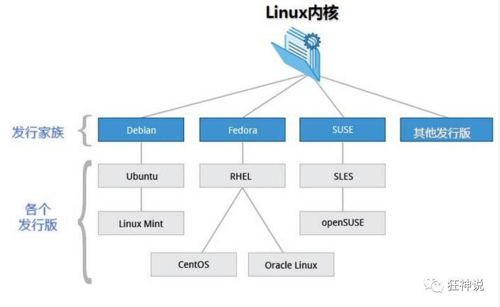

>   Linux与Windows

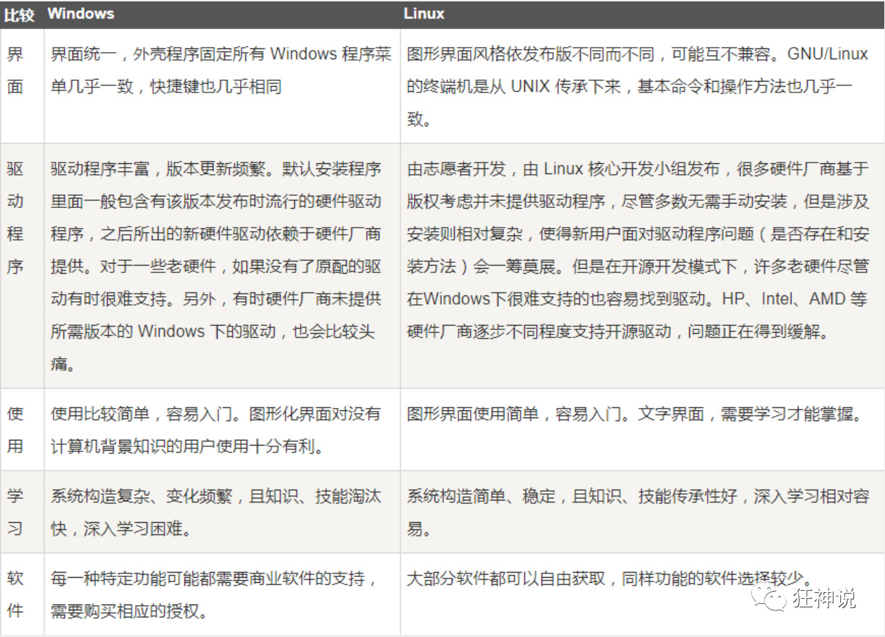

## 环境搭建

>   安装CentOS（虚拟机安装）

安装 VMware 虚拟机软件

>   购买云服务器

虚拟机安装后占用空间，也会有些卡顿，我们作为程序员其实可以选择购买一台自己的服务器，这样的话更加接近真实线上工作；

1、阿里云购买服务器：https://www.aliyun.com/minisite/goods?userCode=0phtycgr

2、购买完毕后，获取服务器的ip地址，重置服务器密码，就可以远程登录了

3、下载 xShell 工具，进行远程连接使用！连接成功效果如下：

# 1、Linux入门

>   开机登入

开机会启动许多程序。它们在Windows叫做"服务"（service），在Linux就叫做"守护进程"（daemon）。

开机成功后，它会显示一个文本登录界面，这个界面就是我们经常看到的登录界面，在这个登录界面中会提示用户输入用户名，而用户输入的用户将作为参数传给login程序来验证用户的身份，密码是不显示的，输完回车即可！

一般来说，用户的登录方式有三种：

-   命令行登录
-   ssh登录
-   图形界面登录

最高权限账户为 root，可以操作一切！

>   关机

在linux领域内大多用在服务器上，很少遇到关机的操作。毕竟服务器上跑一个服务是永无止境的，除非特殊情况下，不得已才会关机。

关机指令为：**shutdown** ；

```bash
sync # 将数据由内存同步到硬盘中。

shutdown # 关机指令，你可以man shutdown 来看一下帮助文档。例如你可以运行如下命令关机：

shutdown –h 10 # 这个命令告诉大家，计算机将在10分钟后关机

shutdown –h now # 立马关机

shutdown –h 20:25 # 系统会在今天20:25关机

shutdown –h +10 # 十分钟后关机

shutdown –r now # 系统立马重启

shutdown –r +10 # 系统十分钟后重启

reboot # 就是重启，等同于 shutdown –r now

halt # 关闭系统，等同于shutdown –h now 和 poweroff
```

最后总结一下，不管是重启系统还是关闭系统，首先要运行 **sync** 命令，把内存中的数据写到磁盘中。

>   系统目录结构

登录系统后，在当前命令窗口下输入命令：

```bash
ls /
```

结果:

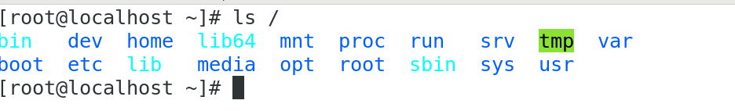

树状目录结构：（Linux的一切资源都挂载在这个 / 根节点下）

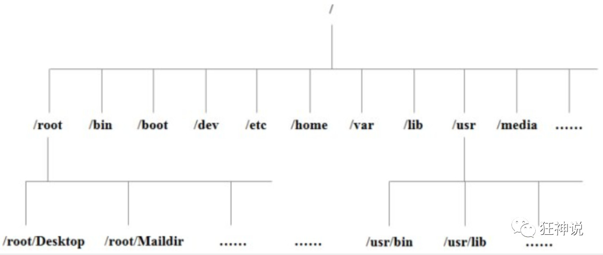

**以下是对这些目录的解释：**

-   **/bin**：bin是Binary的缩写, 这个目录存放着最经常使用的命令。
-   **/boot：** 这里存放的是启动Linux时使用的一些核心文件，包括一些连接文件以及镜像文件。
-   **/dev ：** dev是Device(设备)的缩写, 存放的是Linux的外部设备，在Linux中访问设备的方式和访问文件的方式是相同的。
-   **/etc：** 这个目录用来存放所有的系统管理所需要的配置文件和子目录。
-   **/home**：用户的主目录，在Linux中，每个用户都有一个自己的目录，一般该目录名是以用户的账号命名的。
-   **/lib**：这个目录里存放着系统最基本的动态连接共享库，其作用类似于Windows里的DLL文件。
-   **/lost+found**：这个目录一般情况下是空的，当系统非法关机后，这里就存放了一些文件。
-   **/media**：linux系统会自动识别一些设备，例如U盘、光驱等等，当识别后，linux会把识别的设备挂载到这个目录下。
-   **/mnt**：系统提供该目录是为了让用户临时挂载别的文件系统的，我们可以将光驱挂载在/mnt/上，然后进入该目录就可以查看光驱里的内容了。
-   **/opt**：这是给主机额外安装软件所摆放的目录。比如你安装一个ORACLE数据库则就可以放到这个目录下。默认是空的。
-   **/proc**：这个目录是一个虚拟的目录，它是系统内存的映射，我们可以通过直接访问这个目录来获取系统信息。
-   **/root**：该目录为系统管理员，也称作超级权限者的用户主目录。
-   **/sbin**：s就是Super User的意思，这里存放的是系统管理员使用的系统管理程序。
-   **/srv**：该目录存放一些服务启动之后需要提取的数据。
-   **/sys**：这是linux2.6内核的一个很大的变化。该目录下安装了2.6内核中新出现的一个文件系统 sysfs 。
-   **/tmp**：这个目录是用来存放一些临时文件的。
-   **/usr**(**Unix Software Resource**)：这是一个非常重要的目录，用户的很多应用程序和文件都放在这个目录下，类似于windows下的program files目录。
-   **/usr/bin：** 系统用户使用的应用程序。
-   **/usr/sbin：** 超级用户使用的比较高级的管理程序和系统守护程序。
-   **/usr/src：** 内核源代码默认的放置目录。
-   **/var**：这个目录中存放着在不断扩充着的东西，我们习惯将那些经常被修改的目录放在这个目录下。包括各种日志文件。
-   **/run**：是一个临时文件系统，存储系统启动以来的信息。当系统重启时，这个目录下的文件应该被删掉或清除。

# 2、常用的基本命令

## 2.1、目录管理

>   绝对路径和相对路径

Linux的目录结构为树状结构，最顶级的目录为根目录 / 。

其他目录通过挂载可以将它们添加到树中，通过解除挂载可以移除它们。

**绝对路径：**

路径的写法，由根目录 / 写起，例如：/usr/share/doc 这个目录。

**相对路径：**

路径的写法，不是由 / 写起，例如由 /usr/share/doc 要到 /usr/share/man 底下时，可以写成：cd ../man 这就是相对路径的写法啦！

>   处理目录的常用命令

-   ls: 列出目录
-   cd：切换目录
-   pwd：显示目前的目录
-   mkdir：创建一个新的目录
-   rmdir：删除一个空的目录
-   cp: 复制文件或目录
-   rm: 移除文件或目录
-   mv: 移动文件与目录，或修改文件与目录的名称

你可以使用 *man [命令]* 来查看各个命令的使用文档，如 ：man cp。

### 2.1.1、ls 	列出目录

Linux系统中，最常用的指令

语法：

```bash
#ls 	所要查看的目录路径,缺省代表查看当前目录下
```

参数：

-   -a：全部文件，连同隐藏文件（开头为 .XX 的文件）
-   -l：长数据串列出，包含文件的属性与权限等等数据

可组合使用

```bash
#ls -al
#ls -l 	等价于	 #ll
```

### 2.1.2、cd	 切换目录

cd是Change Directory的缩写，这是用来变换工作目录的命令。

语法：

```bash
#cd 	相对路径或绝对路径

#cd .. 	返回上一级

#cd / 	返回根目录

#cd ~	表示回到自己的家目录，亦即是 /root 这个目录
```

### 2.1.3、pwd 	显示目前所在的目录

pwd 是 **Print Working Directory** 的缩写，也就是显示目前所在目录的命令。

```bash
#pwd [-P]
```

选项与参数：**-P** ：显示出确实的路径，而非使用连接(link) 路径。

测试：

```bash
[root@localhost bin]# pwd
/bin
[root@localhost bin]# pwd -P
/usr/bin
```

### 2.1.4、mkdir	创建新目录

如果想要创建新的目录的话，那么就使用mkdir (make directory)。

```bash
mkdir [-mp] 目录名称
```

-   -m ：配置文件的权限喔！直接配置，不需要看默认权限 (umask) 的脸色～
-   -p ：帮助你直接将所需要的目录(包含上一级目录)递归创建起来！

测试：

```bash
[root@localhost bin]# cd /home
[root@localhost home]# ls
aizhong  test1.txt

[root@localhost home]# mkdir test
[root@localhost home]# ll
total 8
drwx------. 15 aizhong aizhong 4096 Jun  6 15:33 aizhong
drwxr-xr-x.  2 root    root       6 Jun  8 12:32 test
-rw-r--r--.  1 root    root      26 Jun  6 17:22 test1.txt

[root@localhost home]# mkdir -m 711 test2
[root@localhost home]# ll
total 8
drwx------. 15 aizhong aizhong 4096 Jun  6 15:33 aizhong
drwxr-xr-x.  2 root    root       6 Jun  8 12:32 test
-rw-r--r--.  1 root    root      26 Jun  6 17:22 test1.txt
drwx--x--x.  2 root    root       6 Jun  8 12:33 test2

[root@localhost home]# mkdir test/test0/test00
mkdir: cannot create directory ‘test/test0/test00’: No such file or directory
[root@localhost home]# mkdir -p test/test0/test00
```

### 2.1.5、rmdir	删除的**空**目录

语法：

```bash
rmdir [-p] 目录名称
```

选项与参数：**-p ：**连同上一级『空的』目录也一起删除

### 2.1.6、cp 	 复制文件或目录 

语法：

```bash
#cp [-adfilprsu] 来源档(source) 目标档(destination)
#cp [options] source1 source2 source3 .... directory
```

选项与参数：

-   **-a：**相当於 -pdr 的意思，至於 pdr 请参考下列说明；(常用)
-   **-p：**连同文件的属性一起复制过去，而非使用默认属性(备份常用)；
-   **-d：**若来源档为连结档的属性(link file)，则复制连结档属性而非文件本身；
-   **-r：**递归持续复制，用於目录的复制行为；(常用)
-   **-f：**为强制(force)的意思，若目标文件已经存在且无法开启，则移除后再尝试一次；
-   **-i：**若目标档(destination)已经存在时，在覆盖时会先询问动作的进行(常用)
-   **-l：**进行硬式连结(hard link)的连结档创建，而非复制文件本身。
-   **-s：**复制成为符号连结档 (symbolic link)，亦即『捷径』文件；
-   **-u：**若 destination 比 source 旧才升级 destination ！

### 2.1.7、rm	移除文件或目录 

语法：

```bash
#rm [fir] 文件或目录
```

选项与参数：

-   -f ：就是 force 的意思，忽略不存在的文件，不会出现警告信息；
-   -i ：互动模式，在删除前会询问使用者是否动作
-   -r ：递归删除啊！最常用在目录的删除了！这是非常危险的选项！！！

### 2.1.8、mv	移动文件与目录，或修改名称 

语法：

```bash
# mv [-fiu] source destination
# mv [options] source1 source2 source3 .... directory
```

选项与参数：

-   -f ：force 强制的意思，如果目标文件已经存在，不会询问而直接覆盖；
-   -i ：若目标文件 (destination) 已经存在时，就会询问是否覆盖！
-   -u ：若目标文件已经存在，且 source 比较新，才会升级 (update)

## 2.2、文件的基本属性

Linux系统是一种典型的多用户系统，不同的用户处于不同的地位，拥有不同的权限。为了保护系统的安全性，Linux系统对不同的用户访问同一文件（包括目录文件）的权限做了不同的规定。

在Linux中我们可以使用`ll`或者`ls –l`命令来显示一个文件的属性以及文件所属的用户和组，如：

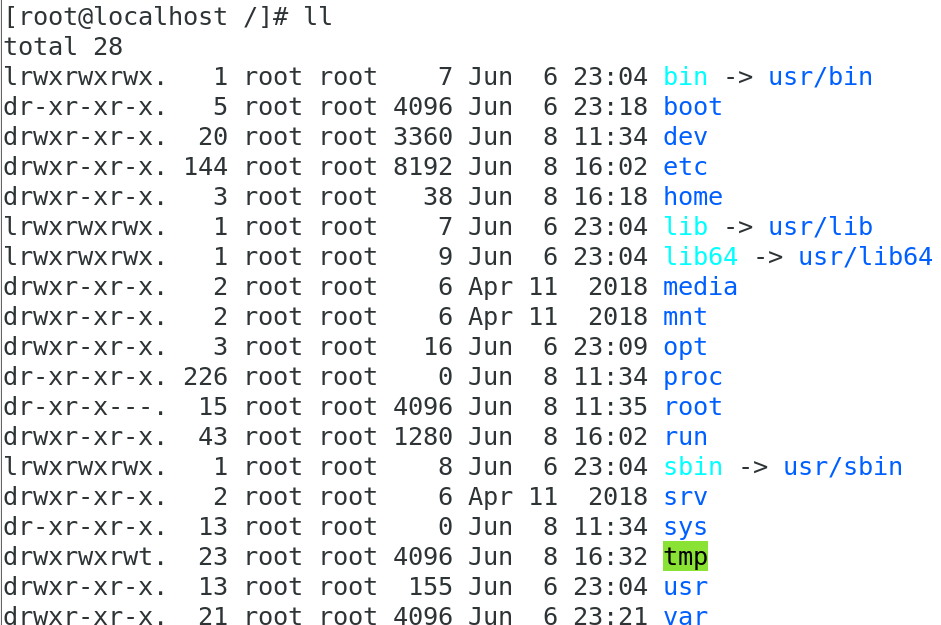

实例中，boot文件的第一个属性用"d"表示。"d"在Linux中代表该文件是一个目录文件。

在Linux中第一个字符代表这个文件是目录、文件或链接文件等等：

-   当为[ **d** ]则是目录
-   当为[ **-** ]则是文件；
-   若是[ **l** ]则表示为链接文档 ( link file )；
-   若是[ **b** ]则表示为装置文件里面的可供储存的接口设备 ( 可随机存取装置 )；
-   若是[ **c** ]则表示为装置文件里面的串行端口设备，例如键盘、鼠标 ( 一次性读取装置 )。

接下来的字符中，以三个为一组，且均为『rwx』 的三个参数的组合。

其中，[ r ]代表可读(read)、[ w ]代表可写(write)、[ x ]代表可执行(execute)。

要注意的是，这三个权限的位置不会改变，如果没有权限，就会出现减号[ - ]而已。

每个文件的属性由左边第一部分的10个字符来确定（如下图）：

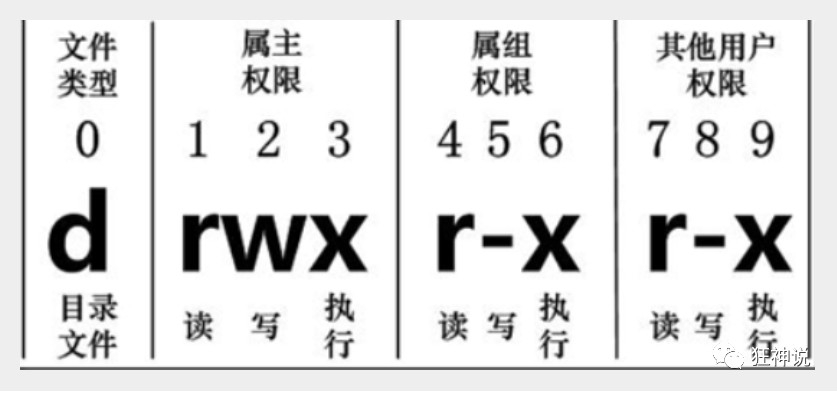

从左至右用0-9这些数字来表示。

第0位确定文件类型，第1-3位确定属主（该文件的所有者）拥有该文件的权限。第4-6位确定属组（所有者的同组用户）拥有该文件的权限，第7-9位确定其他用户拥有该文件的权限。

其中：

第1、4、7位表示读权限，如果用"r"字符表示，则有读权限，如果用"-"字符表示，则没有读权限；

第2、5、8位表示写权限，如果用"w"字符表示，则有写权限，如果用"-"字符表示没有写权限；

第3、6、9位表示可执行权限，如果用"x"字符表示，则有执行权限，如果用"-"字符表示，则没有执行权限。

对于文件来说，它都有一个特定的所有者，也就是对该文件具有所有权的用户。

同时，在Linux系统中，用户是按组分类的，一个用户属于一个或多个组。

文件所有者以外的用户又可以分为文件所有者的同组用户和其他用户。

因此，Linux系统按文件所有者、文件所有者同组用户和其他用户来规定了不同的文件访问权限。

在以上实例中，boot 文件是一个目录文件，属主和属组都为 root。

### 2.2.1、chgrp

-   更改文件属组

```bash
#chgrp [-R] 属组名 文件名
```

-R：递归更改文件属组，就是在更改某个目录文件的属组时，如果加上-R的参数，那么该目录下的所有文件的属组都会更改。

### 2.2.2、 chown

-   更改文件属主，同时也可以更改属组

```bash
#chown [-R] 属主名 文件名
#chown [-R] 属主名：数组名 文件名
```

### 2.2.3、 chmod

-   更改文件9个属性

```bash
#chmod [-R] xyx 文件或目录
```

Linux文件属性有两种设置方法，一种是数字，一种是符号。

Linux文件的基本权限就有九个，分别是owner/group/others三种身份各有自己的read/write/execute权限。

先复习一下刚刚上面提到的数据：文件的权限字符为：『-rwxrwxrwx』， 这九个权限是三个三个一组的！其中，我们可以使用数字来代表各个权限，各权限的分数对照表如下：

```
r:4     w:2         x:1
```

每种身份(owner/group/others)各自的三个权限(r/w/x)分数是需要累加的，例如当权限为：[-rwxrwx---] 分数则是：

-   owner = rwx = 4+2+1 = 7

-   group = rwx = 4+2+1 = 7

-   others= --- = 0+0+0 = 0

    ```bash
    #chmod 777 文件名
    ```

## 2.3、文件内容查看

Linux系统中使用以下命令来查看文件的内容：

-   cat 由第一行开始显示文件内容
-   tac 从最后一行开始显示，可以看出 tac 是 cat 的倒着写！
-   nl  显示的时候，输出行号！
-   more 一页一页的显示文件内容
-   less 与 more 类似，但是比 more 更好的是，他可以往前翻页！
-   head 只看头几行
-   tail 只看尾巴几行

### 2.3.1、cat

语法：

```bash
#cat [-AbEnTv] 文件
```

选项与参数：

-   -A ：相当於 -vET 的整合选项，可列出一些特殊字符而不是空白而已；
-   -b ：列出行号，仅针对非空白行做行号显示，空白行不标行号！
-   -E ：将结尾的断行字节 $ 显示出来；
-   -n ：列印出行号，连同空白行也会有行号，与 -b 的选项不同；
-   -T ：将 [tab] 按键以 ^I 显示出来；
-   -v ：列出一些看不出来的特殊字符

### 2.3.2、tac

tac与cat命令刚好相反，文件内容从最后一行开始显示，可以看出 tac 是 cat 的倒着写

### 2.3.3、nl 

语法：

```bash
#nl [-bnw] 文件
```

选项与参数：

-   -b ：指定行号指定的方式，主要有两种：-b a ：表示不论是否为空行，也同样列出行号(类似 cat -n)；-b t ：如果有空行，空的那一行不要列出行号(默认值)；
-   -n ：列出行号表示的方法，主要有三种：-n ln ：行号在荧幕的最左方显示；-n rn ：行号在自己栏位的最右方显示，且不加 0 ；-n rz ：行号在自己栏位的最右方显示，且加 0 ；
-   -w ：行号栏位的占用的位数。

### 2.3.4、more

在 more 这个程序的运行过程中，你有几个按键可以按的：

-   空白键 (space)：代表向下翻一页；
-   Enter   ：代表向下翻『一行』；
-   /字串   ：代表在这个显示的内容当中，向下搜寻『字串』这个关键字；
-   :f    ：立刻显示出档名以及目前显示的行数；
-   q    ：代表立刻离开 more ，不再显示该文件内容。
-   b 或 [ctrl]-b ：代表往回翻页，不过这动作只对文件有用，对管线无用。

### 2.3.5、less

less运行时可以输入的命令有：

-   空白键  ：向下翻动一页；
-   [pagedown]：向下翻动一页；
-   [pageup] ：向上翻动一页；
-   /字串  ：向下搜寻『字串』的功能；
-   ?字串  ：向上搜寻『字串』的功能；
-   n   ：重复前一个搜寻 (与 / 或 ? 有关！)
-   N   ：反向的重复前一个搜寻 (与 / 或 ? 有关！)
-   q   ：离开 less 这个程序；

### 2.3.6、head

语法：

```bash
#head [-n] 文件
```

选项与参数：**-n** 后面接数字，代表显示几行的意思！

### 2.3.7、tail

语法：

```bash
#tail [-n] 文件
```

## 2.4、Linux连接

Linux 链接分两种，一种被称为硬链接（Hard Link），另一种被称为符号链接（Symbolic Link）。

**硬连接**

硬连接指通过索引节点来进行连接。在 Linux 的文件系统中，保存在磁盘分区中的文件不管是什么类型都给它分配一个编号，称为索引节点号(Inode Index)。在 Linux 中，多个文件名指向同一索引节点是存在的。比如：A 是 B 的硬链接（A 和 B 都是文件名），则 A 的目录项中的 inode 节点号与 B 的目录项中的 inode 节点号相同，即一个 inode 节点对应两个不同的文件名，两个文件名指向同一个文件，A 和 B 对文件系统来说是完全平等的。删除其中任何一个都不会影响另外一个的访问。

硬连接的作用是允许一个文件拥有多个有效路径名，这样用户就可以建立硬连接到重要文件，以防止“误删”的功能。其原因如上所述，因为对应该目录的索引节点有一个以上的连接。只删除一个连接并不影响索引节点本身和其它的连接，只有当最后一个连接被删除后，文件的数据块及目录的连接才会被释放。也就是说，文件真正删除的条件是与之相关的所有硬连接文件均被删除。

**软连接**

另外一种连接称之为**符号连接**（Symbolic Link），也叫软连接。软链接文件有类似于 Windows 的快捷方式。它实际上是一个特殊的文件。在符号连接中，文件实际上是一个文本文件，其中包含的有另一文件的位置信息。比如：A 是 B 的软链接（A 和 B 都是文件名），A 的目录项中的 inode 节点号与 B 的目录项中的 inode 节点号不相同，A 和 B 指向的是两个不同的 inode，继而指向两块不同的数据块。但是 A 的数据块中存放的只是 B 的路径名（可以根据这个找到 B 的目录项）。A 和 B 之间是“主从”关系，如果 B 被删除了，A 仍然存在（因为两个是不同的文件），但指向的是一个无效的链接。

```bash
[root@localhost home]# touch f1	# 创建一个测试文件f1
[root@localhost home]# ls
aizhong  f1
[root@localhost home]# ln f1 f2	 # 创建f1的一个硬连接文件f2
[root@localhost home]# ln -s f1 f3	# 创建f1的一个符号连接文件f3
[root@localhost home]# ls -li	# -i参数显示文件的inode节点信息
total 4
 67 drwx------. 15 aizhong aizhong 4096 Jun  6 15:33 aizhong
 75 -rw-r--r--.  2 root    root       0 Jun  8 17:10 f1
 75 -rw-r--r--.  2 root    root       0 Jun  8 17:10 f2
102 lrwxrwxrwx.  1 root    root       2 Jun  8 17:10 f3 -> f1
```

从上面的结果中可以看出，硬连接文件 f2 与原文件 f1 的 inode 节点相同，均为 75，然而符号连接文件的 inode 节点不同。

```bash
# echo 字符串输出 >> f1 输出到 f1文件
[root@localhost home]# echo "I am f1 file">>f1
[root@localhost home]# cat f1
I am f1 file
[root@localhost home]# cat f2
I am f1 file
[root@localhost home]# cat f3
I am f1 file
[root@localhost home]# rm -rf f1
[root@localhost home]# cat f2
I am f1 file
[root@localhost home]# cat f3
cat: f3: No such file or directory
```

通过上面的测试可以看出：当删除原始文件 f1 后，硬连接 f2 不受影响，但是符号连接 f1 文件无效；

依此您可以做一些相关的测试，可以得到以下全部结论：

-   删除符号连接f3,对f1,f2无影响；
-   删除硬连接f2，对f1,f3也无影响；
-   删除原文件f1，对硬连接f2没有影响，导致符号连接f3失效；
-   同时删除原文件f1,硬连接f2，整个文件会真正的被删除。


# 3、vim使用

Vim是从 vi 发展出来的一个文本编辑器。代码补完、编译及错误跳转等方便编程的功能特别丰富，在程序员中被广泛使用。

简单的来说， vi 是老式的字处理器，不过功能已经很齐全了，但是还是有可以进步的地方。

vim 则可以说是程序开发者的一项很好用的工具。

所有的 Unix Like 系统都会内建 vi 文书编辑器，其他的文书编辑器则不一定会存在。

连 vim 的官方网站 (http://www.vim.org) 自己也说 vim 是一个程序开发工具而不是文字处理软件。

vim 键盘图：

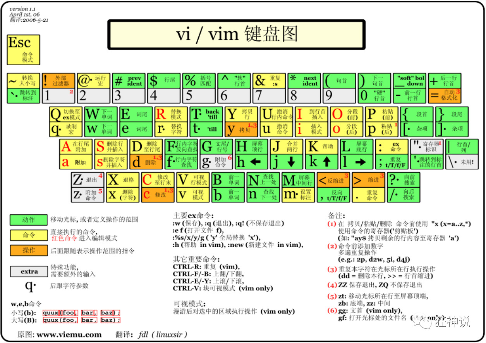

## 3.1、三种使用模式

基本上 vi/vim 共分为三种模式，分别是**命令模式（Command mode）**，**输入模式（Insert mode）**和**底线命令模式（Last line mode）**。这三种模式的作用分别是：

>   **命令模式：**

用户刚刚启动 vi/vim，便进入了命令模式。

此状态下敲击键盘动作会被Vim识别为命令，而非输入字符。比如我们此时按下i，并不会输入一个字符，i被当作了一个命令。

以下是常用的几个命令：

-   **i** 切换到输入模式，以输入字符。
-   **x** 删除当前光标所在处的字符。
-   **:** 切换到底线命令模式，以在最底一行输入命令。

若想要编辑文本：启动Vim，进入了命令模式，按下i，切换到输入模式。

命令模式只有一些最基本的命令，因此仍要依靠底线命令模式输入更多命令。

>   **输入模式：**

在命令模式下按下i就进入了输入模式。

在输入模式中，可以使用以下按键：

-   **字符按键以及Shift组合**，输入字符
-   **ENTER**，回车键，换行
-   **BACK SPACE**，退格键，删除光标前一个字符
-   **DEL**，删除键，删除光标后一个字符
-   **方向键**，在文本中移动光标
-   **HOME**/**END**，移动光标到行首/行尾
-   **Page Up**/**Page Down**，上/下翻页
-   **Insert**，切换光标为输入/替换模式，光标将变成竖线/下划线
-   **ESC**，退出输入模式，切换到命令模式

>   **底线命令模式**

在命令模式下按下:（英文冒号）就进入了底线命令模式。

底线命令模式可以输入单个或多个字符的命令，可用的命令非常多。

在底线命令模式中，基本的命令有（已经省略了冒号）：

-   q 退出程序
-   w 保存文件

按ESC键可随时退出底线命令模式。

简单的说，我们可以将这三个模式想成底下的图标来表示：

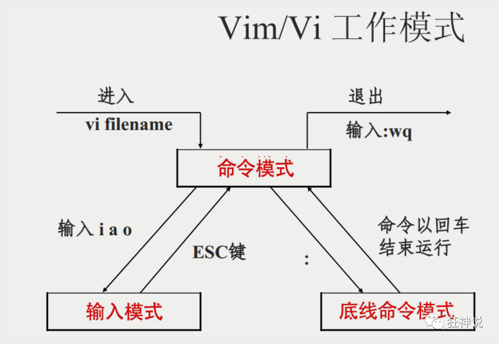

## 3.2、使用

命令

```bash
#vim 文件名
```

当文件不存在时，会自动创建

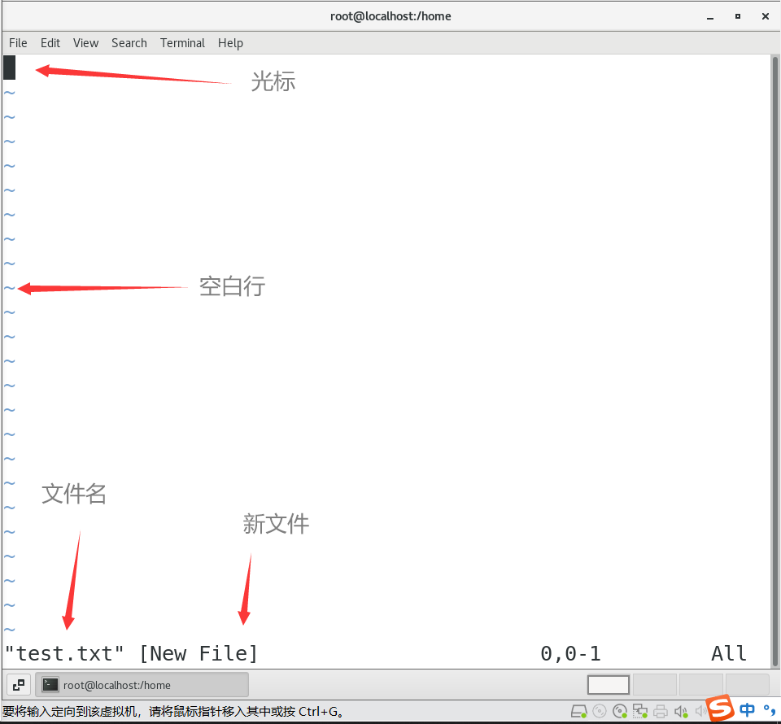

**按下 i 进入输入模式(也称为编辑模式)，开始编辑文字**

在一般模式之中，只要按下 i, o, a 等字符就可以进入输入模式了！

在编辑模式当中，你可以发现在左下角状态栏中会出现 –INSERT- 的字样，那就是可以输入任意字符的提示。

这个时候，键盘上除了 **Esc** 这个按键之外，其他的按键都可以视作为一般的输入按钮了，所以你可以进行任何的编辑。

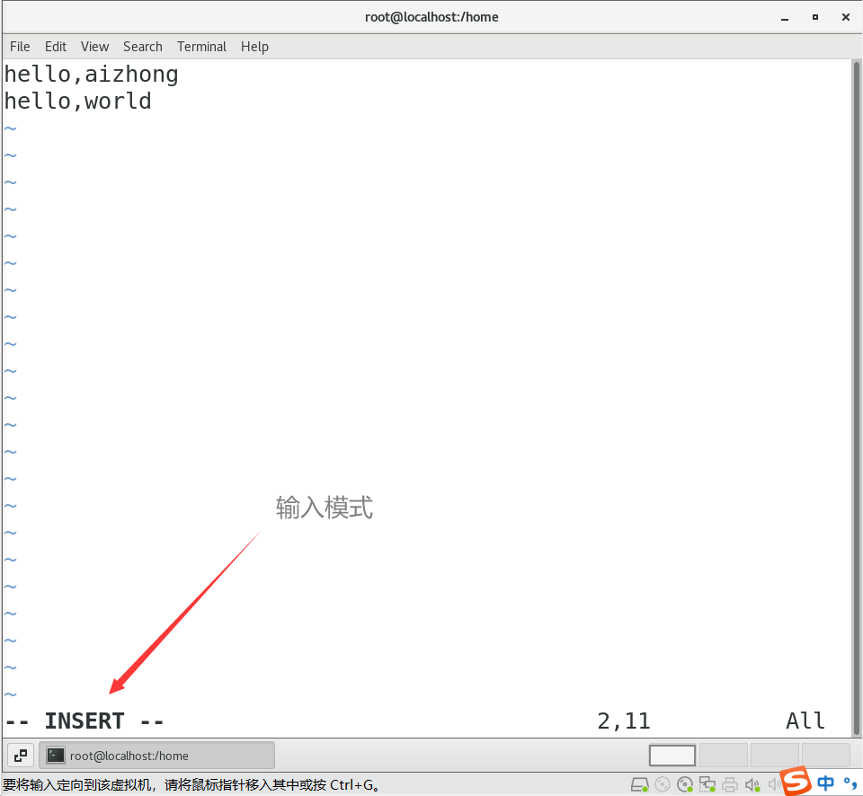

**按下 ESC 按钮回到一般模式**

好了，假设我已经按照上面的样式给他编辑完毕了，那么应该要如何退出呢？是的！没错！就是给他按下 **Esc** 这个按钮即可！马上你就会发现画面左下角的 – INSERT – 不见了！

在一般模式中按下 **:wq** 储存后离开 vim！

这样就创建了一个test.txt文件了

```bash
[root@localhost home]# cat test.txt 
hello,aizhong
hello,world
```

## 3.3、Vim按键说明

| 移动光标的方法     |                                                              |
| :----------------- | ------------------------------------------------------------ |
| h 或 向左箭头键(←) | 光标向左移动一个字符                                         |
| j 或 向下箭头键(↓) | 光标向下移动一个字符                                         |
| k 或 向上箭头键(↑) | 光标向上移动一个字符                                         |
| l 或 向右箭头键(→) | 光标向右移动一个字符                                         |
| [Ctrl] + [f]       | 屏幕『向下』移动一页，相当于 [Page Down]按键 (常用)          |
| [Ctrl] + [b]       | 屏幕『向上』移动一页，相当于 [Page Up] 按键 (常用)           |
| [Ctrl] + [d]       | 屏幕『向下』移动半页                                         |
| [Ctrl] + [u]       | 屏幕『向上』移动半页                                         |
| +                  | 光标移动到非空格符的下一行                                   |
| -                  | 光标移动到非空格符的上一行                                   |
| n< space>          | 那个 n 表示『数字』，例如 20 。按下数字后再按空格键，光标会向右移动这一行的 n 个字符。 |
| 0 或功能键[Home]   | 这是数字『 0 』：移动到这一行的最前面字符处 (常用)           |
| $ 或功能键[End]    | 移动到这一行的最后面字符处(常用)                             |
| H                  | 光标移动到这个屏幕的最上方那一行的第一个字符                 |
| M                  | 光标移动到这个屏幕的中央那一行的第一个字符                   |
| L                  | 光标移动到这个屏幕的最下方那一行的第一个字符                 |
| G                  | 移动到这个档案的最后一行(常用)                               |
| nG                 | n 为数字。移动到这个档案的第 n 行。例如 20G 则会移动到这个档案的第 20 行(可配合 :set nu) |
| gg                 | 移动到这个档案的第一行，相当于 1G 啊！(常用)                 |
| n< Enter>          | n 为数字。光标向下移动 n 行(常用)                            |

| 搜索替换 |                                                              |
| :------- | ------------------------------------------------------------ |
| /word    | 向光标之下寻找一个名称为 word 的字符串。例如要在档案内搜寻 vbird 这个字符串，就输入 /vbird 即可！(常用) |
| ?word    | 向光标之上寻找一个字符串名称为 word 的字符串。               |
| n        | 这个 n 是英文按键。代表重复前一个搜寻的动作。举例来说， 如果刚刚我们执行 /vbird 去向下搜寻 vbird 这个字符串，则按下 n 后，会向下继续搜寻下一个名称为 vbird 的字符串。如果是执行 ?vbird 的话，那么按下 n 则会向上继续搜寻名称为 vbird 的字符串！ |
| N        | 这个 N 是英文按键。与 n 刚好相反，为『反向』进行前一个搜寻动作。例如 /vbird 后，按下 N 则表示『向上』搜寻 vbird 。 |

| 删除、复制与粘贴 |                                                              |
| :--------------- | ------------------------------------------------------------ |
| x, X             | 在一行字当中，x 为向后删除一个字符 (相当于 [del] 按键)， X 为向前删除一个字符(相当于 [backspace] 亦即是退格键) (常用) |
| nx               | n 为数字，连续向后删除 n 个字符。举例来说，我要连续删除 10 个字符， 『10x』。 |
| dd               | 删除游标所在的那一整行(常用)                                 |
| ndd              | n 为数字。删除光标所在的向下 n 行，例如 20dd 则是删除 20 行 (常用) |
| d1G              | 删除光标所在到第一行的所有数据                               |
| dG               | 删除光标所在到最后一行的所有数据                             |
| d$               | 删除游标所在处，到该行的最后一个字符                         |
| d0               | 那个是数字的 0 ，删除游标所在处，到该行的最前面一个字符      |
| yy               | 复制游标所在的那一行(常用)                                   |
| nyy              | n 为数字。复制光标所在的向下 n 行，例如 20yy 则是复制 20 行(常用) |
| y1G              | 复制游标所在行到第一行的所有数据                             |
| yG               | 复制游标所在行到最后一行的所有数据                           |
| y0               | 复制光标所在的那个字符到该行行首的所有数据                   |
| y$               | 复制光标所在的那个字符到该行行尾的所有数据                   |
| p, P             | p 为将已复制的数据在光标下一行贴上，P 则为贴在游标上一行！举例来说，我目前光标在第 20 行，且已经复制了 10 行数据。则按下 p 后， 那 10 行数据会贴在原本的 20 行之后，亦即由 21 行开始贴。但如果是按下 P 呢？那么原本的第 20 行会被推到变成 30 行。(常用) |
| J                | 将光标所在行与下一行的数据结合成同一行                       |
| c                | 重复删除多个数据，例如向下删除 10 行，[ 10cj ]               |
| u                | 复原前一个动作。(常用)                                       |
| [Ctrl]+r         | 重做上一个动作。(常用)                                       |

| 进入输入或取代的编辑模式 |                                                              |
| :----------------------- | ------------------------------------------------------------ |
| i, I                     | 进入输入模式(Insert mode)：i 为『从目前光标所在处输入』， I 为『在目前所在行的第一个非空格符处开始输入』。(常用) |
| a, A                     | 进入输入模式(Insert mode)：a 为『从目前光标所在的下一个字符处开始输入』， A 为『从光标所在行的最后一个字符处开始输入』。(常用) |
| o, O                     | 进入输入模式(Insert mode)：这是英文字母 o 的大小写。o 为『在目前光标所在的下一行处输入新的一行』；O 为在目前光标所在处的上一行输入新的一行！(常用) |
| r, R                     | 进入取代模式(Replace mode)：r 只会取代光标所在的那一个字符一次；R会一直取代光标所在的文字，直到按下 ESC 为止；(常用) |
| [Esc]                    | 退出编辑模式，回到一般模式中(常用)                           |

| 指令行的储存、离开等指令                                     |                                                              |
| :----------------------------------------------------------- | ------------------------------------------------------------ |
| :w                                                           | 将编辑的数据写入硬盘档案中(常用)                             |
| :w!                                                          | 若文件属性为『只读』时，强制写入该档案。不过，到底能不能写入， 还是跟你对该档案的档案权限有关啊！ |
| :q                                                           | 离开 vi (常用)                                               |
| :q!                                                          | 若曾修改过档案，又不想储存，使用 ! 为强制离开不储存档案。    |
| 注意一下啊，那个惊叹号 (!) 在 vi 当中，常常具有『强制』的意思～ |                                                              |
| :wq                                                          | 储存后离开，若为 :wq! 则为强制储存后离开 (常用)              |
| ZZ                                                           | 这是大写的 Z 喔！若档案没有更动，则不储存离开，若档案已经被更动过，则储存后离开！ |
| :w [filename]                                                | 将编辑的数据储存成另一个档案（类似另存新档）                 |
| :r [filename]                                                | 在编辑的数据中，读入另一个档案的数据。亦即将 『filename』 这个档案内容加到游标所在行后面 |
| :n1,n2 w [filename]                                          | 将 n1 到 n2 的内容储存成 filename 这个档案。                 |
| :! command                                                   | 暂时离开 vi 到指令行模式下执行 command 的显示结果！例如 『:! ls /home』即可在 vi 当中看 /home 底下以 ls 输出的档案信息！ |
| :set nu                                                      | 显示行号，设定之后，会在每一行的前缀显示该行的行号           |
| :set nonu                                                    | 与 set nu 相反，为取消行号！                                 |

# 4、账号管理

Linux系统是一个多用户多任务的分时操作系统，任何一个要使用系统资源的用户，都必须首先向系统管理员申请一个账号，然后以这个账号的身份进入系统。

用户的账号一方面可以帮助系统管理员对使用系统的用户进行跟踪，并控制他们对系统资源的访问；另一方面也可以帮助用户组织文件，并为用户提供安全性保护。

每个用户账号都拥有一个唯一的用户名和各自的口令。

用户在登录时键入正确的用户名和口令后，就能够进入系统和自己的主目录。

实现用户账号的管理，要完成的工作主要有如下几个方面：

-   用户账号的添加、删除与修改。
-   用户口令的管理。
-   用户组的管理。

## 4.1、用户账号管理

>   useradd	添加账号

增加用户账号就是在/etc/passwd文件中为新用户增加一条记录，同时更新其他系统文件如/etc/shadow, /etc/group等。

语法：

```bash
#useradd 选项 用户名
```

参数说明：

-   选项 :

-   -   -c comment 指定一段注释性描述。
    -   -d 目录 指定用户主目录，如果此目录不存在，则同时使用-m选项，可以创建主目录。
    -   -g 用户组 指定用户所属的用户组。
    -   -G 用户组，用户组 指定用户所属的附加组。
    -   -m　使用者目录如不存在则自动建立。
    -   -s Shell文件 指定用户的登录Shell。
    -   -u 用户号 指定用户的用户号，如果同时有-o选项，则可以重复使用其他用户的标识号。

-   用户名 :

-   -   指定新账号的登录名。

>   su	切换用户

语法：

```bash
su 用户名
```

1.切换用户的命令为：su username 【username是你的用户名哦】

2.从普通用户切换到root用户，还可以使用命令：sudo su

3.在终端输入exit或logout或使用快捷方式ctrl+d，可以退回到原来用户，其实ctrl+d也是执行的exit命令

4.在切换用户时，如果想在切换用户之后使用新用户的工作环境，可以在su和username之间加-，例如：【su - root】

$表示普通用户

\#表示超级用户，也就是root用户

>   userdel	删除用户

此命令删除用户kuangshen在系统文件中（主要是/etc/passwd, /etc/shadow, /etc/group等）的记录，同时删除用户的主目录。

如果一个用户的账号不再使用，可以从系统中删除。

删除用户账号就是要将/etc/passwd等系统文件中的该用户记录删除，必要时还删除用户的主目录。

删除一个已有的用户账号使用userdel命令，其格式如下：

```bash
#userdel 选项 用户名
```

常用的选项是 **-r**，它的作用是把用户的主目录一起删除。

>   修改账号

修改用户账号就是根据实际情况更改用户的有关属性，如用户号、主目录、用户组、登录Shell等。

修改已有用户的信息使用usermod命令，其格式如下：

```bash
#usermod 选项 用户名
```

常用的选项包括-c, -d, -m, -g, -G, -s, -u以及-o等，这些选项的意义与useradd命令中的选项一样，可以为用户指定新的资源值。

>   用户口令的管理

用户管理的一项重要内容是用户口令的管理。用户账号刚创建时没有口令，但是被系统锁定，无法使用，必须为其指定口令后才可以使用，即使是指定空口令。

指定和修改用户口令的Shell命令是passwd。超级用户可以为自己和其他用户指定口令，普通用户只能用它修改自己的口令。

命令的格式为：

```bash
#passwd 选项 用户名
```

可使用的选项：

-   -l 锁定口令，即禁用账号。
-   -u 口令解锁。
-   -d 使账号无口令。
-   -f 强迫用户下次登录时修改口令。

如果默认用户名，则修改当前用户的口令。

如果是超级用户，可以用下列形式指定任何用户的口令：

```bash
[root@localhost home]# passwd Aizz
Changing password for user Aizz.
New password: （隐藏）
BAD PASSWORD: The password is shorter than 8 characters
Retype new password: （隐藏）
passwd: all authentication tokens updated successfully.
```

如果是普通用户，则下面的命令修改该用户自己的口令：

```bash
[Aizz@localhost home]$ passwd 
Old password:******
New password:*******
Re-enter new password:*******
```

普通用户修改自己的口令时，passwd命令会先询问原口令，验证后再要求用户输入两遍新口令，如果两次输入的口令一致，则将这个口令指定给用户；而超级用户为用户指定口令时，就不需要知道原口令。

# 5、用户组管理

每个用户都有一个用户组，系统可以对一个用户组中的所有用户进行集中管理。不同Linux 系统对用户组的规定有所不同，如Linux下的用户属于与它同名的用户组，这个用户组在创建用户时同时创建。

用户组的管理涉及用户组的添加、删除和修改。组的增加、删除和修改实际上就是对**/etc/group**文件的更新。

>   groupadd	增加一个新的用户组

语法：

```bash
#groupadd 选项 用户组
```

可以使用的选项有：

-   -g GID 指定新用户组的组标识号（GID）。
-   -o 一般与-g选项同时使用，表示新用户组的GID可以与系统已有用户组的GID相同。

>   groupdel	删除一个已有的用户组

语法：

```bash
#groupdel 用户组
```

>   groupmod	修改用户组的属性

语法：

```bash
#groupmod 选项 用户组
```

常用的选项有：

-   -g GID 为用户组指定新的组标识号。
-   -o 与-g选项同时使用，用户组的新GID可以与系统已有用户组的GID相同。
-   -n新用户组 将用户组的名字改为新名字

>   newgrp	切换组

如果一个用户同时属于多个用户组，那么用户可以在用户组之间切换，以便具有其他用户组的权限。

用户可以在登录后，使用命令newgrp切换到其他用户组，这个命令的参数就是目的用户组。例如：

这条命令将当前用户切换到root用户组，前提条件是root用户组确实是该用户的主组或附加组。

>   /etc/passwd

完成用户管理的工作有许多种方法，但是每一种方法实际上都是对有关的系统文件进行修改。

与用户和用户组相关的信息都存放在一些系统文件中，这些文件包括/etc/passwd, /etc/shadow, /etc/group等。

下面分别介绍这些文件的内容。

**/etc/passwd文件是用户管理工作涉及的最重要的一个文件。**

Linux系统中的每个用户都在/etc/passwd文件中有一个对应的记录行，它记录了这个用户的一些基本属性。

这个文件对所有用户都是可读的。它的内容类似下面的例子：

```bash
bin/nologin
postfix:x:89:89::/var/spool/postfix:/sbin/nologin
tcpdump:x:72:72::/:/sbin/nologin
aizhong:x:1000:1000:aizhong:/home/aizhong:/bin/bash
Aizz:x:1001:1001::/home/Aizz:/bin/bash
```

从上面的例子我们可以看到，/etc/passwd中一行记录对应着一个用户，每行记录又被冒号(:)分隔为7个字段，其格式和具体含义如下：

```bash
用户名:口令:用户标识号:组标识号:注释性描述:主目录:登录Shell
```

1）"用户名"是代表用户账号的字符串。

通常长度不超过8个字符，并且由大小写字母和/或数字组成。登录名中不能有冒号(:)，因为冒号在这里是分隔符。

为了兼容起见，登录名中最好不要包含点字符(.)，并且不使用连字符(-)和加号(+)打头。

2）“口令”一些系统中，存放着加密后的用户口令字。

虽然这个字段存放的只是用户口令的加密串，不是明文，但是由于/etc/passwd文件对所有用户都可读，所以这仍是一个安全隐患。因此，现在许多Linux 系统（如SVR4）都使用了shadow技术，把真正的加密后的用户口令字存放到/etc/shadow文件中，而在/etc/passwd文件的口令字段中只存放一个特殊的字符，例如“x”或者“*”。

3）“用户标识号”是一个整数，系统内部用它来标识用户。

一般情况下它与用户名是一一对应的。如果几个用户名对应的用户标识号是一样的，系统内部将把它们视为同一个用户，但是它们可以有不同的口令、不同的主目录以及不同的登录Shell等。

通常用户标识号的取值范围是0～65 535。0是超级用户root的标识号，1～99由系统保留，作为管理账号，普通用户的标识号从100开始。在Linux系统中，这个界限是500。

4）“组标识号”字段记录的是用户所属的用户组。

它对应着/etc/group文件中的一条记录。

5)“注释性描述”字段记录着用户的一些个人情况。

例如用户的真实姓名、电话、地址等，这个字段并没有什么实际的用途。在不同的Linux 系统中，这个字段的格式并没有统一。在许多Linux系统中，这个字段存放的是一段任意的注释性描述文字，用作finger命令的输出。

6)“主目录”，也就是用户的起始工作目录。

它是用户在登录到系统之后所处的目录。在大多数系统中，各用户的主目录都被组织在同一个特定的目录下，而用户主目录的名称就是该用户的登录名。各用户对自己的主目录有读、写、执行（搜索）权限，其他用户对此目录的访问权限则根据具体情况设置。

7)用户登录后，要启动一个进程，负责将用户的操作传给内核，这个进程是用户登录到系统后运行的命令解释器或某个特定的程序，即Shell。

Shell是用户与Linux系统之间的接口。Linux的Shell有许多种，每种都有不同的特点。常用的有sh(Bourne Shell), csh(C Shell), ksh(Korn Shell), tcsh(TENEX/TOPS-20 type C Shell), bash(Bourne Again Shell)等。

系统管理员可以根据系统情况和用户习惯为用户指定某个Shell。如果不指定Shell，那么系统使用sh为默认的登录Shell，即这个字段的值为/bin/sh。

用户的登录Shell也可以指定为某个特定的程序（此程序不是一个命令解释器）。

利用这一特点，我们可以限制用户只能运行指定的应用程序，在该应用程序运行结束后，用户就自动退出了系统。有些Linux 系统要求只有那些在系统中登记了的程序才能出现在这个字段中。

8)系统中有一类用户称为伪用户（pseudo users）。

这些用户在/etc/passwd文件中也占有一条记录，但是不能登录，因为它们的登录Shell为空。它们的存在主要是方便系统管理，满足相应的系统进程对文件属主的要求。

常见的伪用户如下所示：

```
伪 用 户 含 义
bin 拥有可执行的用户命令文件
sys 拥有系统文件
adm 拥有帐户文件
uucp UUCP使用
lp lp或lpd子系统使用
nobody NFS使用
```

>   /etc/shadow

**1、除了上面列出的伪用户外，还有许多标准的伪用户，例如：audit, cron, mail, usenet等，它们也都各自为相关的进程和文件所需要。**

由于/etc/passwd文件是所有用户都可读的，如果用户的密码太简单或规律比较明显的话，一台普通的计算机就能够很容易地将它破解，因此对安全性要求较高的Linux系统都把加密后的口令字分离出来，单独存放在一个文件中，这个文件是/etc/shadow文件。有超级用户才拥有该文件读权限，这就保证了用户密码的安全性。

**2、/etc/shadow中的记录行与/etc/passwd中的一一对应，它由pwconv命令根据/etc/passwd中的数据自动产生**

它的文件格式与/etc/passwd类似，由若干个字段组成，字段之间用":"隔开。这些字段是：

```
登录名:加密口令:最后一次修改时间:最小时间间隔:最大时间间隔:警告时间:不活动时间:失效时间:标志
```

1.  "登录名"是与/etc/passwd文件中的登录名相一致的用户账号
2.  "口令"字段存放的是加密后的用户口令字，长度为13个字符。如果为空，则对应用户没有口令，登录时不需要口令；如果含有不属于集合 { ./0-9A-Za-z }中的字符，则对应的用户不能登录。
3.  "最后一次修改时间"表示的是从某个时刻起，到用户最后一次修改口令时的天数。时间起点对不同的系统可能不一样。例如在SCO Linux 中，这个时间起点是1970年1月1日。
4.  "最小时间间隔"指的是两次修改口令之间所需的最小天数。
5.  "最大时间间隔"指的是口令保持有效的最大天数。
6.  "警告时间"字段表示的是从系统开始警告用户到用户密码正式失效之间的天数。
7.  "不活动时间"表示的是用户没有登录活动但账号仍能保持有效的最大天数。
8.  "失效时间"字段给出的是一个绝对的天数，如果使用了这个字段，那么就给出相应账号的生存期。期满后，该账号就不再是一个合法的账号，也就不能再用来登录了。

>   /etc/group

用户组的所有信息都存放在/etc/group文件中。

将用户分组是Linux 系统中对用户进行管理及控制访问权限的一种手段。

每个用户都属于某个用户组；一个组中可以有多个用户，一个用户也可以属于不同的组。

当一个用户同时是多个组中的成员时，在/etc/passwd文件中记录的是用户所属的主组，也就是登录时所属的默认组，而其他组称为附加组。

用户要访问属于附加组的文件时，必须首先使用newgrp命令使自己成为所要访问的组中的成员。

用户组的所有信息都存放在/etc/group文件中。此文件的格式也类似于/etc/passwd文件，由冒号(:)隔开若干个字段，这些字段有：

```
组名:口令:组标识号:组内用户列表
```

1.  "组名"是用户组的名称，由字母或数字构成。与/etc/passwd中的登录名一样，组名不应重复。
2.  "口令"字段存放的是用户组加密后的口令字。一般Linux 系统的用户组都没有口令，即这个字段一般为空，或者是*。
3.  "组标识号"与用户标识号类似，也是一个整数，被系统内部用来标识组。
4.  "组内用户列表"是属于这个组的所有用户的列表/b]，不同用户之间用逗号(,)分隔。这个用户组可能是用户的主组，也可能是附加组。


# 6、磁盘管理

Linux磁盘管理好坏直接关系到整个系统的性能问题。

Linux磁盘管理常用命令为 df、du。

-   df ：列出文件系统的整体磁盘使用量
-   du：检查磁盘空间使用量

## 6.1、df

df命令参数功能：检查文件系统的磁盘空间占用情况。可以利用该命令来获取硬盘被占用了多少空间，目前还剩下多少空间等信息。

语法：

```bash
df [-ahikHTm] [目录或文件名]
```

选项与参数：

-   -a ：列出所有的文件系统，包括系统特有的 /proc 等文件系统；
-   -k ：以 KBytes 的容量显示各文件系统；
-   -m ：以 MBytes 的容量显示各文件系统；
-   -h ：以人们较易阅读的 GBytes, MBytes, KBytes 等格式自行显示；
-   -H ：以 M=1000K 取代 M=1024K 的进位方式；
-   -T ：显示文件系统类型, 连同该 partition 的 filesystem 名称 (例如 ext3) 也列出；
-   -i ：不用硬盘容量，而以 inode 的数量来显示

## 6.2、du

Linux du命令也是查看使用空间的，但是与df命令不同的是Linux du命令是对文件和目录磁盘使用的空间的查看，还是和df命令有一些区别的，这里介绍Linux du命令。

语法：

```bash
du [-ahskm] 文件或目录名称
```

选项与参数：

-   -a ：列出所有的文件与目录容量，因为默认仅统计目录底下的文件量而已。
-   -h ：以人们较易读的容量格式 (G/M) 显示；
-   -s ：列出总量而已，而不列出每个各别的目录占用容量；
-   -S ：不包括子目录下的总计，与 -s 有点差别。
-   -k ：以 KBytes 列出容量显示；
-   -m ：以 MBytes 列出容量显示；

# 7、进程管理

-   在LINUX中，每个执行的程序（代码）都称为一个进程。每一个进程都分配一个ID号。


-   每一个进程，都会对应一个父进程，而这个父进程可以复制多个子进程。


-   每个进程都可能以两种方式存在的。前台与后台，所谓前台进程就是用户目前的屏幕上可以进行操作的。后台进程则是实际在操作，但由于屏幕上无法看到的进程，通常使用后台方式执行。


-   一般系统的服务都是以后台进程的方式存在，而且都会常驻在系统中。直到关机才才结束。


## 7.1、ps

使用ps指令即可查看当前系统中正在执行的进程的各种进程信息，

常常于 **grep** 过滤指令搭配 **|** 管道符搭配使用

语法：

```bash
ps -选项
```

**选项说明：**

-   -a：显示当前终端的所有进程信息

-   -u：以用户的形式显示进程信息

-   -x：显示后台进程运行的参数

-   -e： 显示所有进程

-   -f ：全格式

如 ps -aux|grep mysql 

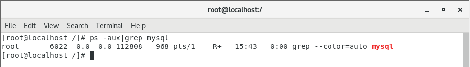

字段

-   USER：用户名称


-   PID：进程号


-    %CPU：进程占用CPU的百分比


-   %MEM：进程占用物理内存的百分比


-   VSZ：进程占用的虚拟内存大小（单位：KB）


-    RSS：进程占用的物理内存大小（单位：KB）


-   TT：终端名称,缩写 .


-    STAT：进程状态，其中S-睡眠，s-表示该进程是会话的先导进程，N-表示进程拥有比普通优先级更低的优先级，R-正在运行，D-短期等待，Z-僵死进程，T-被跟踪或者被停止等等


-   STARTED：进程的启动时间


-   TIME：CPU时间，即进程使用CPU的总时间


-    COMMAND：启动进程所用的命令和参数，如果过长会被截断显示

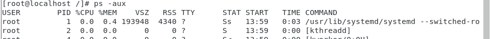

使用ps -ef可查看父进程

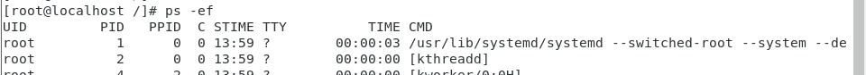

-   UID：用户ID

-   PID：进程ID

-   **PPID：父进程ID**

-   C：CPU用于计算执行优先级的因子。数值越大，表明进程是CPU密集型运算， 执行优先级会降低；数值越小，表明进程是I/O密集型运算，执行优先级会提高


-   STIME：进程启动的时间


-   TTY：完整的终端名称


-   TIME：CPU时间


-   CMD：启动进程所用的命令和参数

## 7.2、kill，killall

 kill指令就像是Windows系统中的任务管理->结束任务一样

语法：

```bash
kill -选项 进程号	(通过进程号杀死进程)
killall 进程名称	(通过进程名称杀死进程，也支持通配符，这在系统因负 载过大而变得很慢时很有用)
```

常用选项：

-   -9：表示强迫进程立即停止

## 7.3、pstree

查看进程树

语法：

```bash
pstree -选项
```

常用选项：

-   -p：显示进程的PID
-   -u：显示进程的所属用户

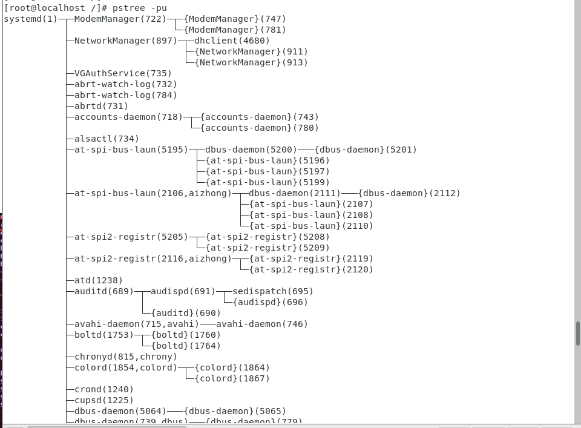

# 8、安装

## 8.1、rpm安装（jdk）

**rpm安装jdk无需配置环境变量**

1、下载相应rpm包放到虚拟机中


2、执行命令

```bash
# rpm -ivh jdk-8u291-linux-x64.rpm 
```

3、测试

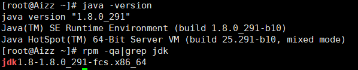

## 8.2、tar.gz压缩包安装（Tomcat）

1、下载相应的tar.gz压缩包


2、执行命令

```bash
# tar -zxvf apache-tomcat-9.0.50.tar.gz 
```

安装成功后会有一个apache-tomcat-9.0.50的文件夹，里面有个bin文件夹，和Windows一样，Tomcat的执行文件都在这里面，但windows的是.bat，linux的是.sh

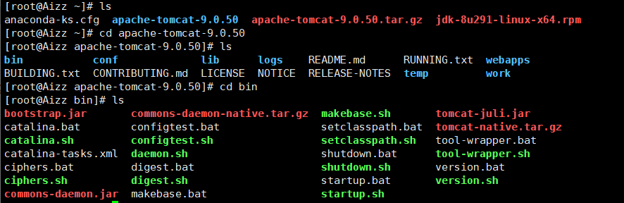

3、启动Tomcat

命令 ./	执行

```bash
./startup.sh	开启
./shutdown.sh	关闭
```

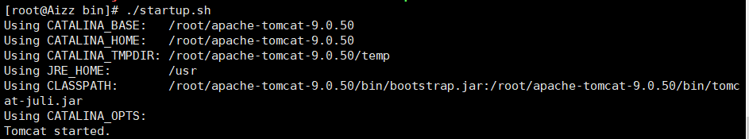

配置后防火墙后就可以访问Tomcat的web。

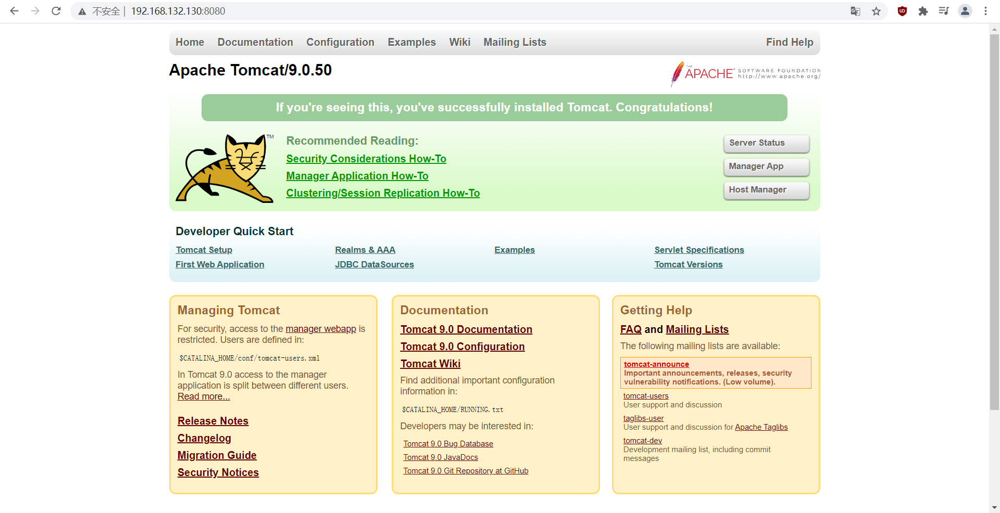

# 9、关于防火墙的设置

-   systemctl status firewalld

    查看firewall服务状态

-   service firewalld start/restart/stop

    开启/重启/关闭firewalld.service服务

-   firewall-cmd –list-all

    查看全部的防火墙规则

-   firewall-cmd –list-port

    只查看端口信息

-   firewall-cmd --zone=public --add-port=8080/tcp --permanent

    开启端口

    –zone 	作用域

    –add-port=端口/通讯协议

    –permanent	永久生效，没有此参数重启后会失效

-   systemctl restart firewalld.service

    重启防火墙

    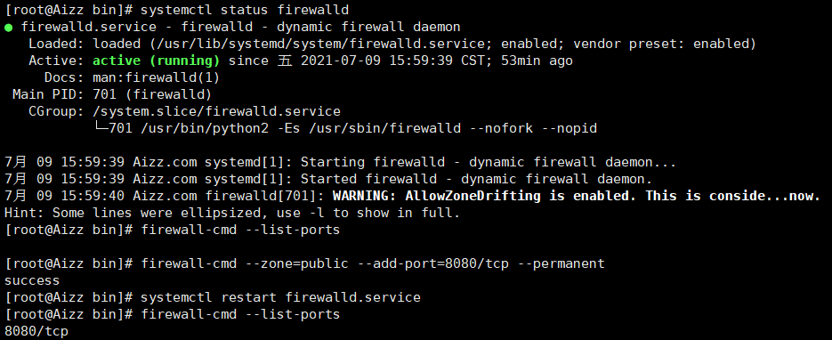