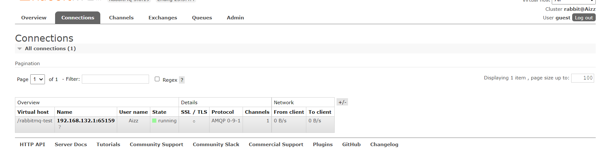
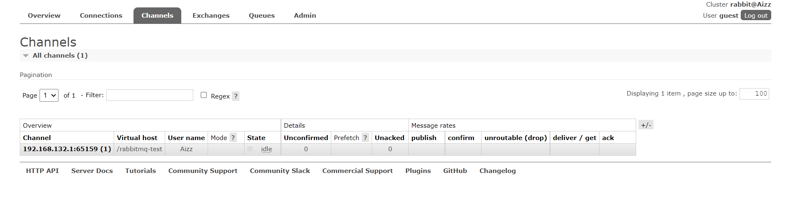
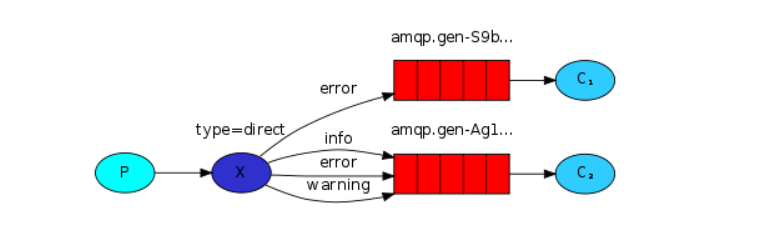

# 1、MQ

## 1.1、什么是MQ

MQ(Message Quene) :  翻译为消息队列,通过典型的生产者和消费者模型,生产者不断向消息队列中生产消息，消费者不断的从队列中获取消息。因为消息的生产和消费都是异步的，而且只关心消息的发送和接收，没有业务逻辑的侵入,轻松的实现系统间解耦。别名为 消息中间件通过利用高效可靠的消息传递机制进行平台无关的数据交流，并基于数据通信来进行分布式系统的集成。


## 1.2、MQ有哪些

1.  老牌的ActiveMQ

    >   ActiveMQ 是Apache出品，最流行的，能力强劲的开源消息总线。它是一个完全支持JMS规范的的消息中间件。丰富的API,多种集群架构模式让ActiveMQ在业界成为老牌的消息中间件,在==中小型企业==颇受欢迎!

2.  RabbitMQ

    >RabbitMQ是使用Erlang语言开发的开源消息队列系统，基于AMQP协议来实现。AMQP的主要特征是面向消息、队列、路由（包括点对点和发布/订阅）、可靠性、安全。AMQP协议更多用在企业系统内对==数据一致性==、==稳定性==和==可靠性==要求很高的场景，对性能和吞吐量的要求还在其次。

3.  炙手可热的Kafka

    >Kafka是LinkedIn开源的分布式发布-订阅消息系统，目前归属于Apache顶级项目。Kafka主要特点是基于Pull的模式来处理消息消费，追求高吞吐量，一开始的目的就是用于日志收集和传输。0.8版本开始支持复制，不支持事务，对消息的重复、丢失、错误没有严格要求，适合产生==大量数据==的互联网服务的数据收集业务。

4.  阿里的RocketMQ

    >RocketMQ是阿里开源的消息中间件，它是纯Java开发，具有==高吞吐量==、==高可用性==、==适合大规模分布式系统应用==的特点。RocketMQ思路起源于Kafka，但并不是Kafka的一个Copy，它对消息的可靠传输及事务性做了优化，目前在阿里集团被广泛应用于交   易、充值、流计算、消息推送、日志流式处理、binglog分发等场景。

5.  。。。


# 2、RabbitMQ

## 2.1、RabbitMQ引言

基于AMQP协议，erlang语言开发，是部署最广泛的开源消息中间件,是最受欢迎的开源消息中间件之一。

**AMQP**（advanced message queuing protocol）：在2003年时被提出，最早用于解决金融领不同平台之间的消息传递交互问题。顾名思义，AMQP是一种协议，更准确的说是一种binary wire-level protocol（链接协议）。这是其和JMS的本质差别，AMQP不从API层进行限定，而是直接定义网络交换的数据格式。这使得实现了AMQP的provider天然性就是跨平台的。

AMQP协议模型：


## 2.2、RabbitMQ安装

1、准备rabbitMQ3.8.X和erlang-23.X的安装包，并上传到linux中。


2、安装Erlang依赖包

```base
rpm -ivh erlang-23.3.4.4-1.el7.x86_64.rpm
```

3、安装RabbitMQ安装包(需要联网)

```base
yum install -y rabbitmq-server-3.8.19-1.el7.noarch.rpm
```

4、安装插件

```base
rabbitmq-plugins enable rabbitmq_management
```

5、修改hosts文件

```bash
vim /etc/hosts
# 添加
192.168.132.130 Aizz
```


6、在 /etc/rabbit 目录下创建 rabbitmq.conf  配置文件，内容从官网copy。

https://github.com/rabbitmq/rabbitmq-server/blob/v3.8.x/deps/rabbit/docs/rabbitmq.conf.example

并修改


7、开启防火墙5672、15672、25672端口，并重启防火墙

```bash
firewall-cmd --zone=public --add-port=5672/tcp --permanent
firewall-cmd --zone=public --add-port=15672/tcp --permanent
firewall-cmd --zone=public --add-port=25672/tcp --permanent
systemctl restart firewalld.service
```


8、rabbitmq服务指令

```bash
# 启动
systemctl start rabbitmq-server 
# 重启
systemctl restart rabbitmq-server 
# 关闭
systemctl stop rabbitmq-server 
# 查看状态
systemctl status rabbitmq-server
# 开启自启
systemctl enable rabbitmq-server 
```

9、访问192.168.132.130:15672网页管理，使用guest，guest登入


## 2.3、RabbitMQ管理界面

1、连接界面

connections：无论生产者还是消费者，都需要与RabbitMQ建立连接后才可以完成消息的生产和消费，在这里可以查看连接情况

		2、通道界面

channels：通道，建立连接后，会形成通道，消息的投递获取依赖通道。



3、交换机界面

Exchanges：交换机，用来实现消息的路由


4、队列界面

Queues：队列，即消息队列，消息存放在队列中，等待消费， 消费后被移除队列。


5、用户界面


# 3、简单案例

## 3.1、RabbitMQ支持的消息模型


## 4.2、环境准备

```xml
<dependency>
  <groupId>com.rabbitmq</groupId>
  <artifactId>amqp-client</artifactId>
  <version>5.12.0</version>
</dependency>
```

## 4.3、第一种模型

1、直连模型


>在上图的模型中，有以下概念：
>
>P：生产者，也就是要发送消息的程序
>
>C：消费者：消息的接受者，会一直等待消息到来。
>		queue：消息队列，图中红色部分。类似一个邮箱，可以缓存消息；生产者向其中投递消息，消费者从其中取出消息。


2、Provider

```java
// 生产消息
public class Provider {

    public static void main(String[] args) throws IOException, TimeoutException {

        // 创建连接mq的连接工厂对象
        ConnectionFactory connectionFactory = new ConnectionFactory();
        // 设置连接的 rabbimq 主机
        connectionFactory.setHost("192.168.132.130");
        // 设置端口号
        connectionFactory.setPort(5672);
        // 设置连接的虚拟机
        connectionFactory.setVirtualHost("/rabbitmq-test");
        // 设置访问虚拟机的用户名和密码
        connectionFactory.setUsername("Aizz");
        connectionFactory.setPassword("123456");

        // 获取连接对象
        Connection connection = connectionFactory.newConnection();
        // 获取连接中的通道
        Channel channel = connection.createChannel();

        // 通道绑定对应的消息队列
        // 参数1 ： 队列名称，如果不存在自动创建
        // 参数2 ： 队列是否持久化
        // 参数3 ： 是否独占
        // 参数4 ： 是否在消息消费完后自动删除队列
        // 参数5 ： 额外参数
        channel.queueDeclare("hello", true, false, false, null);

        // 发布消息
        // 参数1 ： 交换机名称
        // 参数2 ： 队列名称
        // 参数3 ： 传递消息额外设置
        // 参数4 ： 消息体
        channel.basicPublish("", "hello", MessageProperties.PERSISTENT_TEXT_PLAIN, "hello world".getBytes(StandardCharsets.UTF_8));

        // 关闭资源
        channel.close();
        connection.close();
    }
}
```


3、consumer

```java
// 消费消息
public class Consumer {

    public static void main(String[] args) throws IOException, TimeoutException {

        ConnectionFactory connectionFactory = new ConnectionFactory();

        connectionFactory.setHost("192.168.132.130");
        connectionFactory.setPort(5672);
        connectionFactory.setVirtualHost("/rabbitmq-test");
        connectionFactory.setUsername("Aizz");
        connectionFactory.setPassword("123456");

        Connection connection = connectionFactory.newConnection();
        Channel channel = connection.createChannel();

        channel.queueDeclare("hello", true, false, false, null);
        // 参数 1 ：判定队列名称
        // 参数 2 ：自动确认 
        channel.basicConsume("hello", true, new DefaultConsumer(channel){
            @Override
            public void handleDelivery(String consumerTag, Envelope envelope, AMQP.BasicProperties properties, byte[] body) throws IOException {
                System.out.println("消费者: "+new String(body));
            }
        });

    }
}
```


4、工具类

```java
public class RabbitMQUtil {

    private static final ConnectionFactory connectionFactory;

    static{
        //重量级资源  类加载执行之执行一次
        connectionFactory = new ConnectionFactory();
        connectionFactory.setHost("192.168.132.130");
        connectionFactory.setPort(5672);
        connectionFactory.setVirtualHost("/rabbitmq-test");
        connectionFactory.setUsername("Aizz");
        connectionFactory.setPassword("123456");
    }

    //定义提供连接对象的方法
    public static Connection getConnection() {
        try {
            return connectionFactory.newConnection();
        } catch (Exception e) {
            e.printStackTrace();
        }
        return null;
    }

    //关闭通道和关闭连接工具方法
    public static void closeConnectionAndChanel(Channel channel, Connection conn) {
        try {
            if(channel!=null) channel.close();
            if(conn!=null)   conn.close();
        } catch (Exception e) {
            e.printStackTrace();
        }
    }
}
```


## 4.4、第二种模型

1、任务模型


>Work queues，也被称为（Task queues），任务模型。
>		当消息处理比较耗时的时候，可能生产消息的速度会远远大于消息的消费速度。长此以往，消息就会堆积越来越多，无法及时处理。此时就可以使用work 模型：让多个消费者绑定到一个队列，共同消费队列中的消息。队列中的消息一旦消费，就会消失，因此任务是不会被重复执行的。


2、provider

```java
channel.queueDeclare("workQueue", true, false, false, null);
for (int i = 0; i < 10; i++) {
    channel.basicPublish("", "workQueue", null, (i+"====>:我是消息").getBytes());
}
```


3、consumer 1

```java
channel.queueDeclare("workQueue",true,false,false,null);
        channel.basicConsume("workQueue",true,new DefaultConsumer(channel){
            @Override
            public void handleDelivery(String consumerTag, Envelope envelope, AMQP.BasicProperties properties, byte[] body) throws IOException {
                try {
                    // 模拟延时
                    TimeUnit.SECONDS.sleep(1);
                } catch (InterruptedException e) {
                    e.printStackTrace();
                }
                System.out.println("消费者1: "+new String(body));
            }
        });
```


4、consumer 2

```java
channel.queueDeclare("workQueue",true,false,false,null);
channel.basicConsume("workQueue",true,new DefaultConsumer(channel){

    public void handleDelivery(String consumerTag, Envelope envelope, AMQP.BasicProperties properties, byte[] body) throws IOException {
        System.out.println("消费者2: "+new String(body));
    }
});
```


5、测试


6、总结

>默认情况下，RabbitMQ将按顺序将每个消息发送给下一个使用者。平均而言，每个消费者都会收到相同数量的消息。这种分发消息的方式称为 ==轮训==。 不同消费者获得消息的数量是相同的，但处理速度可能不同，就会导致资源分配不均。


## 4.5、消息确认机制

完成一项任务可能需要几秒钟。您可能想知道，如果其中一个消费者开始了一项长期任务，但只完成了一部分就死了，会发生什么情况。在我们当前的代码中，一旦RabbitMQ将消息传递给使用者，它就会立即将其标记为删除。在这种情况下，如果您杀死一个worker，我们将丢失它刚刚处理的消息。我们还将丢失发送给该特定工作进程但尚未处理的所有消息。但我们不想失去任何任务。如果一个worker死了，我们希望把任务交给另一个工人。


1、consumer 3

```java
public class Consumer_3 {

    public static void main(String[] args) throws IOException {
        Connection connection = RabbitMQUtil.getConnection();

        final Channel channel = connection.createChannel();

        // 每次只消费一个消息
        channel.basicQos(1);
        channel.queueDeclare("workQueue",true,false,false,null);
        // 参数 2：关闭自动确认
        channel.basicConsume("workQueue",false,new DefaultConsumer(channel){

            public void handleDelivery(String consumerTag, Envelope envelope, AMQP.BasicProperties properties, byte[] body) throws IOException {
                try {
                    // 延时
                    TimeUnit.SECONDS.sleep(1);
                } catch (InterruptedException e) {
                    e.printStackTrace();
                }
                System.out.println("消费者3: "+new String(body));
                // 参数 1：确认队列中的那个具体消息
                // 参数 2：是否开启多个消息同时确认
                channel.basicAck(envelope.getDeliveryTag(), false);
            }
        });

    }
}
```


2、consumer 4

```java
// 每次只消费一个消息
channel.basicQos(1);
channel.queueDeclare("workQueue",true,false,false,null);
// 参数 2：关闭自动确认
channel.basicConsume("workQueue",false,new DefaultConsumer(channel){

    public void handleDelivery(String consumerTag, Envelope envelope, AMQP.BasicProperties properties, byte[] body) throws IOException {
        System.out.println("消费者4: "+new String(body));
        // 参数 1：确认队列中的那个具体消息
        // 参数 2：是否开启多个消息同时确认
        channel.basicAck(envelope.getDeliveryTag(), false);
    }
});
```


3、测试结果


## 4.6、第三种模型

1、广播模型


>在广播模式下，消息发送流程是这样的：
>
>可以有多个消费者每个消费者有自己的queue（队列，每个队列都要绑定到Exchange（交换机），生产者发送的消息，只能发送到交换机，交换机来决定要发给哪个队列，生产者无法决定。交换机把消息发送给绑定过的所有队列，队列的消费者都能拿到消息。实现一条消息被多个消费者消费。


2、provider

```java
public class Provider {

    public static void main(String[] args) throws IOException {
        Connection connection = RabbitMQUtil.getConnection();
        Channel channel = connection.createChannel();

        // 将通道声明指定交换机
        // 参数1: 交换机名称
        // 参数2: 交换机类型  fanout 广播类型
        channel.exchangeDeclare("logs", BuiltinExchangeType.FANOUT);

        // 发布消息
        // 参数1 ： 交换机名称
        // 参数2 ： 队列名称,  null 发给所有
        // 参数3 ： 传递消息额外设置
        // 参数4 ： 消息体
        channel.basicPublish("logs", "", null, "fanout type message".getBytes(StandardCharsets.UTF_8));

        RabbitMQUtil.closeConnectionAndChanel(channel, connection);
    }
}
```


3、consumer 1

```java
public class Consumer_1 {

    public static void main(String[] args) throws IOException {

        Connection connection = RabbitMQUtil.getConnection();
        Channel channel = connection.createChannel();

        //通道绑定交换机
        //channel.exchangeDeclare("logs",BuiltinExchangeType.FANOUT);

        //临时队列
        String queueName = channel.queueDeclare().getQueue();
        //System.out.println(queueName);
        
        //绑定交换机和队列
        channel.queueBind(queueName,"logs","");

        //消费消息
        channel.basicConsume(queueName,true,new DefaultConsumer(channel){
            @Override
            public void handleDelivery(String consumerTag, Envelope envelope, AMQP.BasicProperties properties, byte[] body) throws IOException {
                System.out.println("消费者1: "+new String(body));
            }
        });
    }
}
```


4、测试结果


>一条消息可被多个消费者获取


## 4.7、第四种模型

>在Fanout模式中，一条消息，会被所有订阅的队列都消费。但是，在某些场景下，我们希望不同的消息被不同的队列消费。这时就要用到Direct类型的Exchange。

### 1、订阅模型—Direct直连

>在Direct模型下：队列与交换机的绑定，不能是任意绑定了，而是要指定一个RoutingKey（路由key）
>消息的发送方在 向 Exchange发送消息时，也必须指定消息的 RoutingKey。
>
>Exchange不再把消息交给每一个绑定的队列，而是根据消息的Routing Key进行判断，只有队列的Routingkey与消息的 Routing key完全一致，才会接收到消息。




2、provider

```java
public class Provider {
    public static void main(String[] args) throws IOException {
        //获取连接对象
        Connection connection = RabbitMQUtil.getConnection();
        //获取连接通道对象
        Channel channel = connection.createChannel();
        String exchangeName = "logs_direct";
        // 通过通道声明交换机
        // 参数1:交换机名称
        // 参数2:路由模式   direct 直连
        channel.exchangeDeclare(exchangeName, BuiltinExchangeType.DIRECT);
        //发送消息
        String routingkey = "error";
        channel.basicPublish(exchangeName,routingkey,null,("这是direct模型发布的基于route key: ["+routingkey+"] 发送的消息").getBytes());

        //关闭资源
        RabbitMQUtil.closeConnectionAndChanel(channel,connection);
    }
}
```


3、consumer 1

```java
public class Consumer_1 {

    public static void main(String[] args) throws IOException {
        Connection connection = RabbitMQUtil.getConnection();
        Channel channel = connection.createChannel();

        String exchangeName = "logs_direct";

        //通道声明交换机以及交换的类型
        channel.exchangeDeclare(exchangeName, BuiltinExchangeType.DIRECT);

        //创建一个临时队列
        String queue = channel.queueDeclare().getQueue();

        //基于route key绑定队列和交换机
        channel.queueBind(queue, exchangeName, "error");

        //获取消费的消息
        channel.basicConsume(queue, true, new DefaultConsumer(channel) {
            @Override
            public void handleDelivery(String consumerTag, Envelope envelope, AMQP.BasicProperties properties, byte[] body) throws IOException {
                System.out.println("消费者1: " + new String(body));
            }
        });
    }

}
```


4、consumer 2

```java
public class Consumer_2 {
    public static void main(String[] args) throws IOException {
        Connection connection = RabbitMQUtil.getConnection();
        Channel channel = connection.createChannel();

        String exchangeName = "logs_direct";

        //声明交换机 以及交换机类型 direct
        channel.exchangeDeclare(exchangeName,BuiltinExchangeType.DIRECT);

        //创建一个临时队列
        String queue = channel.queueDeclare().getQueue();

        //临时队列和交换机绑定
        channel.queueBind(queue,exchangeName,"info");
        channel.queueBind(queue,exchangeName,"error");
        channel.queueBind(queue,exchangeName,"warning");

        //消费消息
        channel.basicConsume(queue,true,new DefaultConsumer(channel){
            @Override
            public void handleDelivery(String consumerTag, Envelope envelope, AMQP.BasicProperties properties, byte[] body) throws IOException {
                System.out.println("消费者2: "+new String(body));
            }
        });
    }
}
```


5、测试结果


### 2、订阅模型—Topic动态

>Topic类型的Exchange与Direct相比，都是可以根据RoutingKey把消息路由到不同的队列。只不过Topic类型Exchange可以让队列在绑定Routing key的时候使用通配符！这种模型Routingkey 一般都是由一个或多个单词组成，多个单词之间以 ”.” 分割，


		统配符
		* (star) can substitute for exactly one word.    匹配不多不少恰好1个词
		# (hash) can substitute for zero or more words.  匹配零个、一个或多个词
