# 0、redis

## 0.1、NoSQL引言

**NoSQL**(`Not Only SQL` )，意即**不仅仅是SQL**, 泛指非关系型的数据库。Nosql这个技术门类,早期就有人提出,发展至2009年趋势越发高涨。

## 0.2、为什么是NoSQL

随着互联网网站的兴起，传统的关系数据库在应付动态网站，特别是超大规模和高并发的纯动态网站已经显得力不从心，暴露了很多难以克服的问题。如==商城网站中对商品数据频繁查询==、==对热搜商品的排行统计==、==订单超时问题==、以及==微信朋友圈（音频，视频）存储==等相关使用传统的关系型数据库实现就显得非常复杂，虽然能实现相应功能但是在性能上却不是那么乐观。nosql这个技术门类的出现，更好的解决了这些问题，它告诉了世界不仅仅是sql。

## 0.3、NoSQL的四大分类

1、键值(Key-Value)存储数据库

```bash
# 1.说明: 
- 这一类数据库主要会使用到一个哈希表，这个表中有一个特定的键和一个指针指向特定的数据。

# 2.特点
- Key/value模型对于IT系统来说的优势在于简单、易部署。  
- 但是如果DBA只对部分值进行查询或更新的时候，Key/value就显得效率低下了。

# 3.相关产品
- Tokyo Cabinet/Tyrant,
- `Redis`
- SSDB
- Voldemort 
- Oracle BDB
```

2、列存储数据库

```bash
# 1.说明
- 这部分数据库通常是用来应对分布式存储的海量数据。

# 2.特点
- 键仍然存在，但是它们的特点是指向了多个列。这些列是由列家族来安排的。

# 3.相关产品
- Cassandra、HBase、Riak.
```

3、文档型数据库

```bash
# 1.说明
- 文档型数据库的灵感是来自于Lotus Notes办公软件的，而且它同第一种键值存储相类似该类型的数据模型是版本化的文档，半结构化的文档以特定的格式存储，比如JSON。文档型数据库可 以看作是键值数据库的升级版，允许之间嵌套键值。而且文档型数据库比键值数据库的查询效率更高

# 2.特点
- 以文档形式存储

# 3.相关产品
- `MongoDB`、CouchDB、 MongoDb(4.x). 国内也有文档型数据库SequoiaDB，已经开源。
```

4、图形数据库

```bash
# 1.说明
- 图形结构的数据库同其他行列以及刚性结构的SQL数据库不同，它是使用灵活的图形模型，并且能够扩展到多个服务器上。
- NoSQL数据库没有标准的查询语言(SQL)，因此进行数据库查询需要制定数据模型。许多NoSQL数据库都有REST式的数据接口或者查询API。

# 2.特点

# 3.相关产品
- Neo4J、InfoGrid、 Infinite Graph、
```

## 0.4、NoSQL应用场景

-   数据模型比较简单
-   需要灵活性更强的IT系统
-   对数据库性能要求较高
-   ==不需要高度的数据一致性==

## 0.5、什么是Redis

>Redis is an open source (BSD licensed), in-memory data structure store, used as a database, cache and message broker.

Redis 开源 遵循BSD 基于内存数据存储 被用于作为 数据库 缓存 消息中间件

-   总结: redis是一个内存型的数据库

## 0.6、Redis特点

-   Redis是一个高性能key/value内存型数据库
-   Redis支持丰富的数据类型
-   Redis支持持久化
-   Redis单进程,单线程

# 1、Redis安装

1、官网下载redis


2、上传到linux中

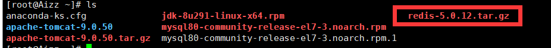

3、解压

```bash
tar -zxvf redis-5.0.12.tar.gz 
```

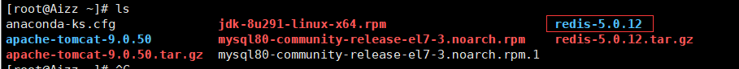

 将解压出来的文件夹移动到/usr/local下

```
 mv redis-5.0.12 /usr/local/
```

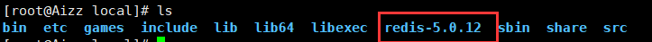

4、安装c++环境

```bash
yum -y install gcc-c++
```

检测环境是否c++成功

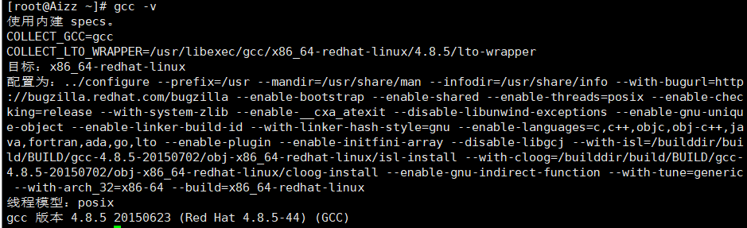

5、进入redis的文件夹执行==make==命令

```bash
[root@Aizz redis-5.0.12]# make
```

6、进入redis下的src执行==make install==

```bash
[root@Aizz redis-5.0.12]# cd src
[root@Aizz src]# make install
```

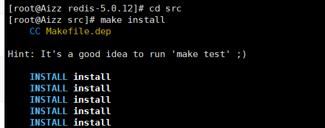

7、redis的默认安装路径为==/usr/local/bin==

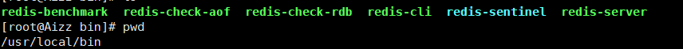

8、将redis的配置文件复制到当前文件夹中

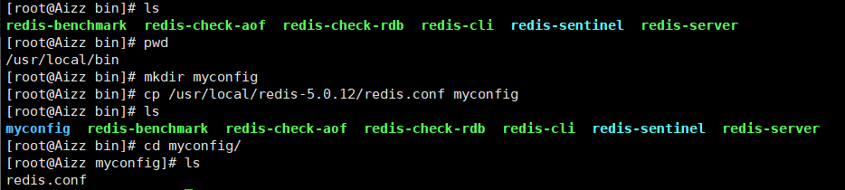

9、redis默认不是后台启动，在redis.conf配置文件中修改,找到daemonize项改为yes。

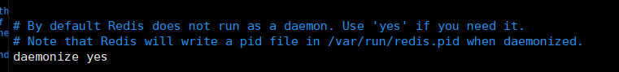

10、启动redis服务

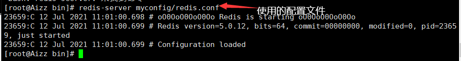

11、进入redis客户端，exit退出


系统进程

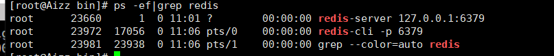

==shutdown==结束redis进程

```
127.0.0.1:6379> shutdown
```

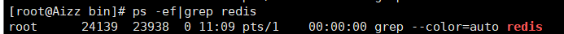

## 1.1、密码设置

-   永久设置

    在配置文件中的SECURITY栏目中修改

    ```bash
    # requirepass foobared	# 取消注释，更改密码
    ```

    ==重启redis服务==

     redis的查询速度是非常快的，外部用户一秒内可以尝试多大150K个密码；所以密码要尽量长（对于DBA 没有必要必须记住密码）；

-   临时设置

    ```bash
    127.0.0.1:6379> CONFIG set requirepass aizhong0126	# 设置密码
    OK
    127.0.0.1:6379> config get requirepass	# 未验证获取密码，报错
    (error) NOAUTH Authentication required.
    127.0.0.1:6379> auth aizhong0126	# 验证密码
    OK
    127.0.0.1:6379> config get requirepass
    1) "requirepass"
    2) "aizhong0126"
    127.0.0.1:6379> 
    ```

    redis服务重启后密码会失效

-   登录时验证

    ```bash
    redis-cli -p 6379 -a aizhong0126
    ```

-   登入后验证

    ```bash
    redis-cli -p 6379
    redis 127.0.0.1:6379> auth test123
    OK
    ```

# 2、Redis数据库相关指令

## 2.1、数据库操作指令

```bash
# 1.Redis中库说明
- 使用redis的默认配置器动redis服务后,默认会存在16个库,编号从0-15
- 可以使用select 库的编号 来选择一个redis的库

# 2.Redis中操作库的指令
- 清空当前的库  FLUSHDB
- 清空全部的库  FLUSHALL

# 3.redis客户端显示中文
-	./redis-cli  -p 6379 --raw
```

## 2.2、操作key相关指令

```bash
# 1.DEL指令
- 语法 :  DEL key [key ...] 
- 作用 :  删除给定的一个或多个key 。不存在的key 会被忽略。
- 可用版本： >= 1.0.0
- 返回值： 被删除key 的数量。 

# 2.EXISTS指令
- 语法:  EXISTS key
- 作用:  检查给定key 是否存在。
- 可用版本： >= 1.0.0
- 返回值： 若key 存在，返回1 ，否则返回0。

# 3.EXPIRE
- 语法:  EXPIRE key seconds
- 作用:  为给定key 设置生存时间，当key 过期时(生存时间为0 )，它会被自动删除。
- 可用版本： >= 1.0.0
- 时间复杂度： O(1)
- 返回值：设置成功返回1 。

# 4.KEYS
- 语法 :  KEYS pattern
- 作用 :  查找所有符合给定模式pattern 的key 。
- 语法:
	KEYS * 匹配数据库中所有key 。
	KEYS h?llo 匹配hello ，hallo 和hxllo 等。
	KEYS h*llo 匹配hllo 和heeeeello 等。
	KEYS h[ae]llo 匹配hello 和hallo ，但不匹配hillo 。特殊符号用 "\" 隔开
- 可用版本： >= 1.0.0
- 返回值： 符合给定模式的key 列表。

# 5.MOVE
- 语法 :  MOVE key db
- 作用 :  将当前数据库的key 移动到给定的数据库db 当中。
- 可用版本： >= 1.0.0
- 返回值： 移动成功返回1 ，失败则返回0 。

# 6.PEXPIRE
- 语法 :  PEXPIRE key milliseconds
- 作用 :  这个命令和EXPIRE 命令的作用类似，但是它以毫秒为单位设置key 的生存时间，而不像EXPIRE 命令那样，以秒为单位。
- 可用版本： >= 2.6.0
- 时间复杂度： O(1)
- 返回值：设置成功，返回1  key 不存在或设置失败，返回0

# 7.PEXPIREAT
- 语法 :  PEXPIREAT key milliseconds-timestamp
- 作用 :  这个命令和EXPIREAT 命令类似，但它以毫秒为单位设置key 的过期unix 时间戳，而不是像EXPIREAT那样，以秒为单位。
- 可用版本： >= 2.6.0
- 返回值：如果生存时间设置成功，返回1 。当key 不存在或没办法设置生存时间时，返回0 。(查看EXPIRE 命令获取更多信息)

# 8.TTL
- 语法 :   TTL key
- 作用 :   以秒为单位，返回给定key 的剩余生存时间(TTL, time to live)。
- 可用版本： >= 1.0.0
- 返回值：
	当key 不存在时，返回-2 。
	当key 存在但没有设置剩余生存时间时，返回-1 。
	否则，以秒为单位，返回key 的剩余生存时间。
- Note : 在Redis 2.8 以前，当key 不存在，或者key 没有设置剩余生存时间时，命令都返回-1 。

# 9.PTTL
- 语法 :  PTTL key
- 作用 :  这个命令类似于TTL 命令，但它以毫秒为单位返回key 的剩余生存时间，而不是像TTL 命令那样，以秒为单位。
- 可用版本： >= 2.6.0
- 返回值： 当key 不存在时，返回-2 。当key 存在但没有设置剩余生存时间时，返回-1 。
- 否则，以毫秒为单位，返回key 的剩余生存时间。
- 注意 : 在Redis 2.8 以前，当key 不存在，或者key 没有设置剩余生存时间时，命令都返回-1 。

# 10.RANDOMKEY
- 语法 :  RANDOMKEY
- 作用 :  从当前数据库中随机返回(不删除) 一个key 。
- 可用版本： >= 1.0.0
- 返回值：当数据库不为空时，返回一个key 。当数据库为空时，返回nil 。

# 11.RENAME
- 语法 :  RENAME key newkey
- 作用 :  将key 改名为newkey 。当key 和newkey 相同，或者key 不存在时，返回一个错误。当newkey 已经存在时，RENAME 命令将覆盖旧值。
- 可用版本： >= 1.0.0
- 返回值： 改名成功时提示OK ，失败时候返回一个错误。

# 12.TYPE
- 语法 :  TYPE key
- 作用 :  返回key 所储存的值的类型。
- 可用版本： >= 1.0.0
- 返回值：
	none (key 不存在)
	string (字符串)
	list (列表)
	set (集合)
	zset (有序集)
	hash (哈希表)
```

## 2.3、String类型

1、内存模型

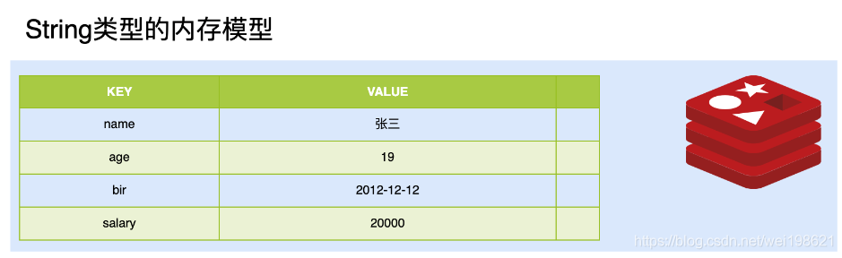

2、常用操作命令

|                    命令                    |                    说明                    |
| :----------------------------------------: | :----------------------------------------: |
|                    set                     |             设置一个key/value              |
|                    get                     |           根据key获得对应的value           |
|                    mset                    |           一次设置多个key value            |
|                    mget                    |           一次获得多个key的value           |
|                   getset                   |       获得原始key的值，同时设置新值        |
|                   strlen                   |         获得对应key存储value的长度         |
|                   append                   |          为对应key的value追加内容          |
|                  getrange                  |              截取value的内容               |
|                   setex                    |       设置一个key存活的有效期（秒）        |
|                   psetex                   |      设置一个key存活的有效期（毫秒）       |
|                   setnx                    |        存在不做任何操作,不存在添加         |
| msetnx原子操作(只要有一个存在不做任何操作) | 可以同时设置多个key,只有有一个存在都不保存 |
|                    decr                    |            进行数值类型的-1操作            |
|                   decrby                   |         根据提供的数据进行减法操作         |
|                    Incr                    |            进行数值类型的+1操作            |
|                   incrby                   |         根据提供的数据进行加法操作         |
|                Incrbyfloat                 |          根据提供的数据加入浮点数          |

## 2.4、List类型

list 列表 相当于java中list 集合 特点 元素有序 且 可以重复

1、内存模型

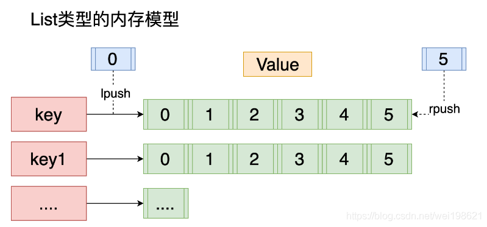

2、常用操作命令

| **命令** |               **说明**               |
| :------: | :----------------------------------: |
|  lpush   |    将某个值加入到一个key列表头部     |
|  lpushx  |  同lpush,但是必须要保证这个key存在   |
|  rpush   |    将某个值加入到一个key列表末尾     |
|  rpushx  |  同rpush,但是必须要保证这个key存在   |
|   lpop   |    返回和移除列表左边的第一个元素    |
|   rpop   |    返回和移除列表右边的第一个元素    |
|  lrange  |      获取某一个下标区间内的元素      |
|   llen   |           获取列表元素个数           |
|   lset   | 设置某一个指定索引的值(索引必须存在) |
|  lindex  |     获取某一个指定索引位置的元素     |
|   lrem   |             删除重复元素             |
|  ltrim   |      保留列表中特定区间内的元素      |
| linsert  |   在某一个元素之前，之后插入新元素   |

## 2.5、Set类型

特点: Set类型 Set集合 元素无序 不可以重复

1、内存模型

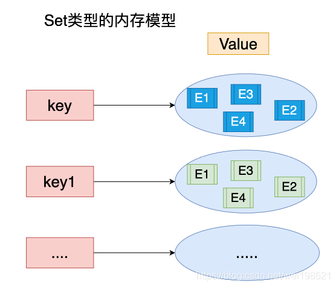

2、常用命令

|  **命令**   |                     **说明**                      |
| :---------: | :-----------------------------------------------: |
|    sadd     |                  为集合添加元素                   |
|  smembers   |              显示集合中所有元素 无序              |
|    scard    |               返回集合中元素的个数                |
|    spop     |       随机返回一个元素 并将元素在集合中删除       |
|    smove    | 从一个集合中向另一个集合移动元素 必须是同一种类型 |
|    srem     |               从集合中删除一个元素                |
|  sismember  |          判断一个集合中是否含有这个元素           |
| srandmember |                   随机返回元素                    |
|    sdiff    |   去掉第一个集合中其它集合含有的相同元素，差集    |
|   sinter    |                      求交集                       |
|   sunion    |                      求和集                       |

## 2.6、ZSet

特点: 可排序的set集合 排序 不可重复

ZSET 官方 可排序SET sortSet

1、内存模型

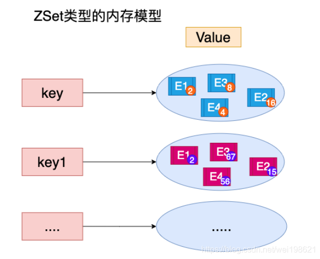

2、常用命令

|          **命令**          |           **说明**           |
| :------------------------: | :--------------------------: |
|            zadd            |     添加一个有序集合元素     |
|           zcard            |      返回集合的元素个数      |
| zrange 升序 zrevrange 降序 |     返回一个范围内的元素     |
|       zrangebyscore        | 按照分数查找一个范围内的元素 |
|           zrank            |           返回排名           |
|          zrevrank          |           倒序排名           |
|           zscore           |     显示某一个元素的分数     |
|            zrem            |        移除某一个元素        |
|          zincrby           |      给某个特定元素加分      |

## 2.7、Hash类型

特点: value 是一个map结构 存在key value key 无序的

1、内存模型

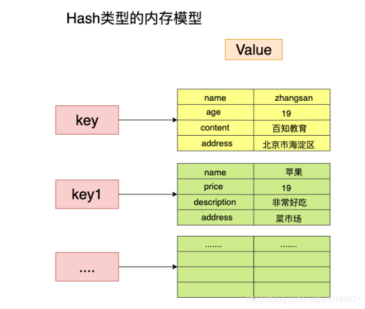

2、常用命令

|   **命令**   |        **说明**         |
| :----------: | :---------------------: |
|     hset     |   设置一个key/value对   |
|     hget     | 获得一个key对应的value  |
|   hgetall    |  获得所有的key/value对  |
|     hdel     |  删除某一个key/value对  |
|   hexists    |   判断一个key是否存在   |
|    hkeys     |      获得所有的key      |
|    hvals     |     获得所有的value     |
|    hmset     |    设置多个key/value    |
|    hmget     |   获得多个key的value    |
|    hsetnx    | 设置一个不存在的key的值 |
|   hincrby    |   为value进行加法运算   |
| hincrbyfloat |    为value加入浮点值    |

# 3、持久化机制

client redis[内存] -----> 内存数据- 数据持久化–>磁盘

Redis官方提供了两种不同的持久化方法来将数据存储到硬盘里面分别是:

-   快照(Snapshot)
-   AOF (Append Only File) 只追加日志文件

## 3.1、快照

1、特点

这种方式可以将某一时刻的所有数据都写入硬盘中,当然这也是**redis的默认开启持久化方式**,保存的文件是以.rdb形式结尾的文件因此这种方式也称之为RDB方式。

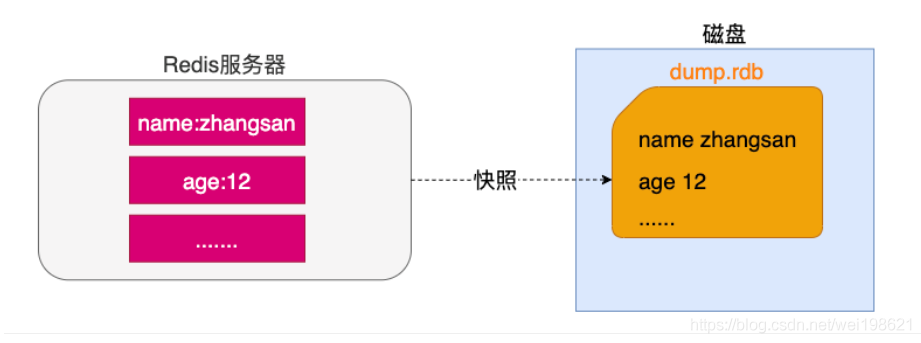

2、快照生成方式

-   客户端方式: BGSAVE 和 SAVE指令

```bash
# 1.客户端方式之BGSAVE
- a.客户端可以使用BGSAVE命令来创建一个快照,当接收到客户端的BGSAVE命令时,redis会调用fork¹来创建一个子进程,然后子进程负责将快照写入磁盘中,而父进程则继续处理命令请求。
	
	`名词解释: fork当一个进程创建子进程的时候,底层的操作系统会创建该进程的一个副本,在类unix系统中创建子进程的操作会进行优化:在刚开始的时候,父子进程共享相同内存,直到父进程或子进程对内存进行了写之后,对被写入的内存的共享才会结束服务`
```

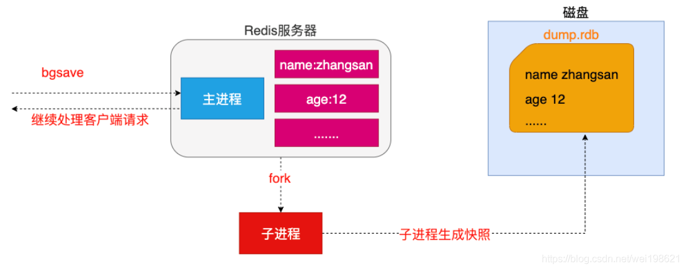

```bash
# 2.客户端方式之SAVE
- b.客户端还可以使用SAVE命令来创建一个快照,接收到SAVE命令的redis服务器在快照创建完毕之前将不再响应任何其他的命令
— SAVE命令并不常用,使用SAVE命令在快照创建完毕之前,redis处于阻塞状态,无法对外服务
```

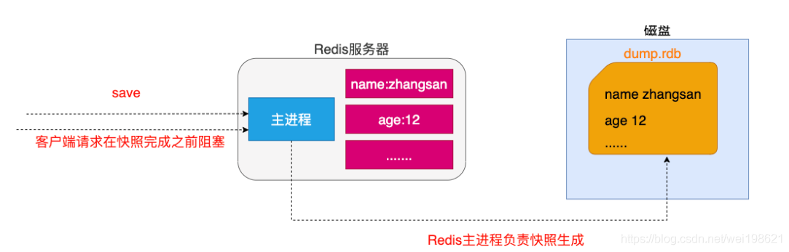

-   服务器配置自动触发

```bash
# 3.服务器配置方式之满足配置自动触发
- 如果用户在redis.conf中设置了save配置选项,redis会在save选项条件满足之后自动触发一次BGSAVE命令,如果设置多个save配置选项,当任意一个save配置选项条件满足,redis也会触发一次BGSAVE命令

################################ SNAPSHOTTING  ################################
#
# Save the DB on disk:
#
#   save <seconds> <changes>
#
#   Will save the DB if both the given number of seconds and the given
#   number of write operations against the DB occurred.
#
#   In the example below the behaviour will be to save:
#   after 900 sec (15 min) if at least 1 key changed
#   after 300 sec (5 min) if at least 10 keys changed
#   after 60 sec if at least 10000 keys changed
#
#   Note: you can disable saving completely by commenting out all "save" lines.
#
#   It is also possible to remove all the previously configured save
#   points by adding a save directive with a single empty string argument
#   like in the following example:
#
#   save ""

# 满足一个条件即可
save 900 1
save 300 10
save 60 10000

# 默认文件名
dbfilename dump.rdb
# 文件路径，  "./"代表redis-server所在的文件夹
dir ./


```

```bash
# 4.服务器接收客户端shutdown指令
- 当redis通过shutdown指令接收到关闭服务器的请求时,会执行一个save命令,阻塞所有的客户端,不再执行客户端执行发送的任何命令,并且在save命令执行完毕之后关闭服务器
```

## 3.2、AOF

1、特点

这种方式可以将所有客户端执行的写命令记录到日志文件中,AOF持久化会将被执行的写命令写到AOF的文件末尾,以此来记录数据发生的变化,因此只要redis从头到尾执行一次AOF文件所包含的所有写命令,就可以恢复AOF文件的记录的数据集.

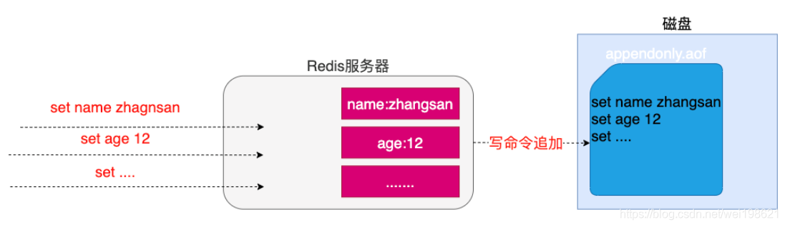

2、开启AOF持久化

在redis的默认配置中AOF持久化机制是没有开启的，需要在配置中开启

```bash
# 是否开启AOF
appendonly no

# 文件名，文件和.rdb文件在同一文件夹下
appendfilename "appendonly.aof"

# 同步频率
# appendfsync always	
#- 说明: 每个redis写命令都要同步写入硬盘,严重降低redis速度
#- 解释: 如果用户使用了always选项,那么每个redis写命令都会被写入硬盘,从而将发生系统崩溃时出现的数据丢失减到最少;遗憾的是,因为这种同步策略需要对硬盘进行大量的写入操作,所以redis处理命令的速度会受到硬盘性能的限制;
#- 注意: 转盘式硬盘在这种频率下200左右个命令/s ; 固态硬盘(SSD) 几百万个命令/s;
#- 警告: 使用SSD用户请谨慎使用always选项,这种模式不断写入少量数据的做

appendfsync everysec	
#- 说明: 每秒执行一次同步显式的将多个写命令同步到磁盘
#- 解释： 为了兼顾数据安全和写入性能,用户可以考虑使用everysec选项,让redis每秒一次的频率对AOF文件进行同步;redis每秒同步一次AOF文件时性能和不使用任何持久化特性时的性能相差无几,而通过每秒同步一次AOF文件,redis可以保证,即使系统崩溃,用户最多丢失一秒之内产生的数据。

# appendfsync no
#- 说明: 由操作系统决定何时同步 
#- 解释：最后使用no选项,将完全有操作系统决定什么时候同步AOF日志文件,这个选项不会对redis性能带来影响但是系统崩溃时,会丢失不定数量的数据,另外如果用户硬盘处理写入操作不够快的话,当缓冲区被等待写入硬盘数据填满时,redis会处于阻塞状态,并导致redis的处理命令请求的速度变慢。
```

## 3.3、AOF文件的重写

1、AOF带来的问题

AOF的方式也同时带来了另一个问题。持久化文件会变的越来越大。例如我们调用incr test命令100次，文件中必须保存全部的100条命令，其实有99条都是多余的。因为要恢复数据库的状态其实文件中保存一条set test 100就够了。为了压缩aof的持久化文件Redis提供了AOF重写(ReWriter)机制。

2、AOF重写

用来在一定程度上减小AOF文件的体积

3、触发重写方式

```bash
# 1.客户端方式触发重写
- 执行BGREWRITEAOF命令  不会阻塞redis的服务

# 2.服务器配置方式自动触发
- 配置redis.conf中的auto-aof-rewrite-percentage选项 参加下图↓↓↓
- 如果设置auto-aof-rewrite-percentage值为100和auto-aof-rewrite-min-size 64mb,并且启用的AOF持久化时,那么当AOF文件体积大于64M,并且AOF文件的体积比上一次重写之后体积大了至少一倍(100%)时,会自动触发,如果重写过于频繁,用户可以考虑将auto-aof-rewrite-percentage设置为更大

```

4、重写原理

**注意：重写aof文件的操作，并没有读取旧的aof文件，而是将整个内存中的数据库内容用命令的方式重写了一个新的aof文件,替换原有的文件这点和快照有点类似。**

重写流程

1.  redis调用fork ，现在有父子两个进程 子进程根据内存中的数据库快照，往临时文件中写入重建数据库状态的命令

1.  父进程继续处理client请求，除了把写命令写入到原来的aof文件中。同时把收到的写命令缓存起来。这样就能保证如果子进程重写失败的话并不会出问题。
2.  当子进程把快照内容写入已命令方式写到临时文件中后，子进程发信号通知父进程。然后父进程把缓存的写命令也写入到临时文件。
3.  现在父进程可以使用临时文件替换老的aof文件，并重命名，后面收到的写命令也开始往新的aof文件中追加。

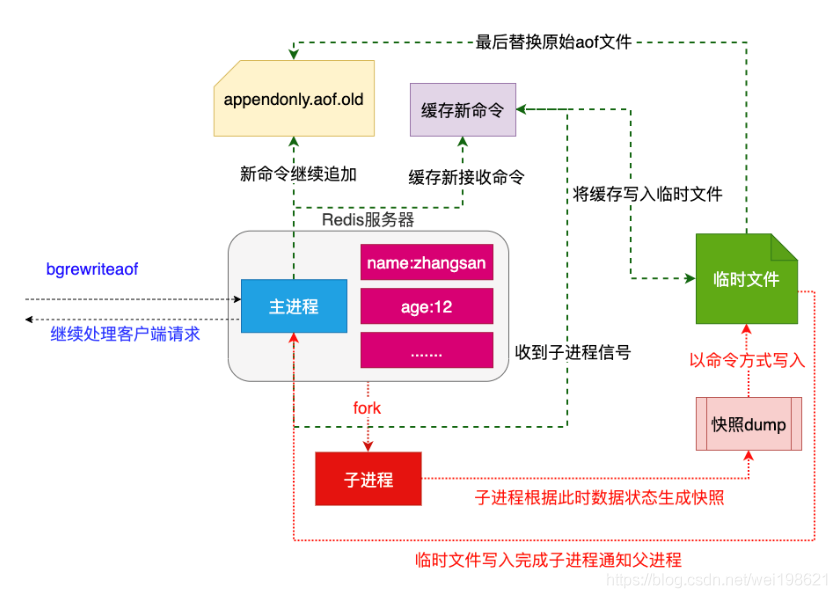

## 3.4、总结

两种持久化方案既可以同时使用(aof),又可以单独使用,在某种情况下也可以都不使用,具体使用那种持久化方案取决于用户的数据和应用决定。

无论使用AOF还是快照机制持久化,将数据持久化到硬盘都是有必要的,除了持久化外,用户还应该对持久化的文件进行备份(最好备份在多个不同地方)。


# 、SpringBoot整合

## 序列化

数据在网络传输中，需要被序列化，否则会乱码。

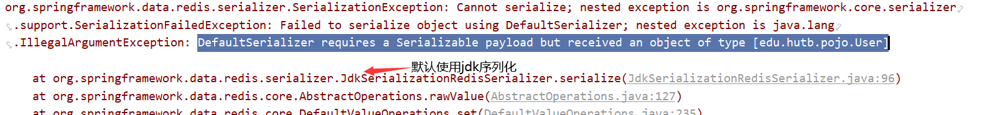

SpringBoot的redisTemplate使用的是默认的序列化规则，传到redis中乱码。我们可以自定义redisTemplate，改写序列化方式。

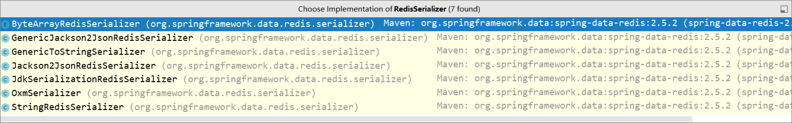

redisTemplate序列化规则

```java
@Configuration
public class RedisConfig {

    @Bean
    public RedisTemplate<String, Object> redisTemplate(RedisConnectionFactory redisConnectionFactory) {
        RedisTemplate<String, Object> template = new RedisTemplate<>();
        template.setConnectionFactory(redisConnectionFactory);

        // 对于key，使用StringRedisSerializer序列化
        StringRedisSerializer stringRedisSerializer = new StringRedisSerializer();
        template.setKeySerializer(stringRedisSerializer);

        // 对用value，使用Jackson2JsonRedisSerializer序列化，自动将object对象转化为json字符串
        Jackson2JsonRedisSerializer<Object> objectJackson2JsonRedisSerializer = new Jackson2JsonRedisSerializer<>(Object.class);
        ObjectMapper objectMapper = new ObjectMapper();
        // 设置可见度
        objectMapper.setVisibility(PropertyAccessor.ALL, JsonAutoDetect.Visibility.ANY);
        // 启动默认的类型
        objectMapper.activateDefaultTyping(LaissezFaireSubTypeValidator.instance , ObjectMapper.DefaultTyping.NON_FINAL, JsonTypeInfo.As.PROPERTY);
        // 序列化类，对象映射设置
        objectJackson2JsonRedisSerializer.setObjectMapper(objectMapper);
        template.setValueSerializer(objectJackson2JsonRedisSerializer);

        template.afterPropertiesSet();
        return template;
    }
}
```

```java
// 测试
@Test
void contextLoads() throws JsonProcessingException {
    Objects.requireNonNull(redisTemplate.getConnectionFactory()).getConnection().flushDb();
    User aizhong = new User("aizhong", 10);
    redisTemplate.opsForValue().set("oneuser",aizhong);
    System.out.println(redisTemplate.opsForValue().get("oneuser"));
}
```

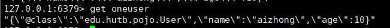


