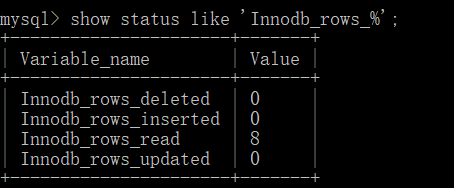

sql

# 1、SQL语句的分类

## 1.1、DQL

数据查询语言（凡是带有select关键字的都是查询语句）
				select...

## 1.2、DML

DML：
				数据操作语言（凡是对表当中的数据进行增删改的都是DML）
				insert 增
				delete 删
				update 改

​			这个主要是操作表中的数据data。

## 1.3、DDL

DDL：
				数据定义语言
				凡是带有create、drop、alter的都是DDL。
				DDL主要操作的是表的结构。不是表中的数据。
				create：新建，等同于增
				drop：删除
				alter：修改
				这个增删改和DML不同，这个主要是对表结构进行操作。

## 1.4、TCL

是事务控制语言
				包括：
					事务提交：commit;
					事务回滚：rollback;

## 1.5、DCL

是数据控制语言。
				例如：授权grant、撤销权限revoke....

# 2、约束

## 2.1、什么是约束

约束对应的英语单词：constraint
		在创建表的时候，我们可以给表中的字段加上一些约束，来保证这个表中数据的完整性、有效性！

## 2.2、约束包括

非空约束：not null
		唯一性约束: unique
		主键约束: primary key （简称PK）
		外键约束：foreign key（简称FK）
		检查约束：check（mysql不支持，oracle支持）

## 2.3、非空约束：not null

非空约束not null约束的字段不能为NULL。只有列级约束，没有表级约束！

## 2.4、唯一性约束：unique

唯一性约束unique约束的字段不能重复，但是可以为NULL。有列级约束，也有表级约束。

## 2.5、主键约束primary key

任何一张表都应该有主键，没有主键，表无效！！

主键的特征：not null + unique（主键值不能是NULL，同时也不能重复！）

有列级约束，也有表级约束。

主键除了：单一主键和复合主键之外，还可以这样进行分类？
		自然主键：主键值是一个自然数，和业务没关系。
		业务主键：主键值和业务紧密关联，例如拿银行卡账号做主键值。这就是业务主键！

在实际开发中使用业务主键多，还是使用自然主键多一些？
		自然主键使用比较多，因为主键只要做到不重复就行，不需要有意义。
		业务主键不好，因为主键一旦和业务挂钩，那么当业务发生变动的时候，
		可能会影响到主键值，所以业务主键不建议使用。尽量使用自然主键。

## 2.6、外键foreign key

子表中的外键引用的父表中的某个字段，不一定是主键，但至少具有unique约束。外键值可以为NULL。

# 3、存储引擎

## 3.1、存储引擎概述

​	和大多数的数据库不同, MySQL中有一个存储引擎的概念, 针对不同的存储需求可以选择最优的存储引擎。

​	存储引擎就是存储数据，建立索引，更新查询数据等等技术的实现方式 。存储引擎是基于表的，而不是基于库的。所以存储引擎也可被称为表类型。

​	Oracle，SqlServer等数据库只有一种存储引擎。MySQL提供了插件式的存储引擎架构。所以MySQL存在多种存储引擎，可以根据需要使用相应引擎，或者编写存储引擎。

​	MySQL5.0支持的存储引擎包含 ： InnoDB 、MyISAM 、BDB、MEMORY、MERGE、EXAMPLE、NDB Cluster、ARCHIVE、CSV、BLACKHOLE、FEDERATED等，其中InnoDB和BDB提供事务安全表，其他存储引擎是非事务安全表。

可以通过指定 **show engines** ， 来查询当前数据库支持的存储引擎 ：


创建新表时如果不指定存储引擎，那么系统就会使用默认的存储引擎，MySQL5.5之前的默认存储引擎是MyISAM，5.5之后就改为了InnoDB。

查看Mysql数据库默认的存储引擎 ， 指令 ：

```mysql
 show variables like '%storage_engine%' ； 
```


## 3.2、各种存储引擎特性

下面重点介绍几种常用的存储引擎， 并对比各个存储引擎之间的区别， 如下表所示 ： 

| 特点         | InnoDB               | MyISAM   | MEMORY | MERGE | NDB  |
| ------------ | -------------------- | -------- | ------ | ----- | ---- |
| 存储限制     | 64TB                 | 有       | 有     | 没有  | 有   |
| 事务安全     | ==支持==             |          |        |       |      |
| 锁机制       | ==行锁(适合高并发)== | ==表锁== | 表锁   | 表锁  | 行锁 |
| B树索引      | 支持                 | 支持     | 支持   | 支持  | 支持 |
| 哈希索引     |                      |          | 支持   |       |      |
| 全文索引     | 支持(5.6版本之后)    | 支持     |        |       |      |
| 集群索引     | 支持                 |          |        |       |      |
| 数据索引     | 支持                 |          | 支持   |       | 支持 |
| 索引缓存     | 支持                 | 支持     | 支持   | 支持  | 支持 |
| 数据可压缩   |                      | 支持     |        |       |      |
| 空间使用     | 高                   | 低       | N/A    | 低    | 低   |
| 内存使用     | 高                   | 低       | 中等   | 低    | 高   |
| 批量插入速度 | 低                   | 高       | 高     | 高    | 高   |
| 支持外键     | ==支持==             |          |        |       |      |

下面我们将重点介绍最长使用的两种存储引擎： InnoDB、MyISAM ， 另外两种 MEMORY、MERGE ， 了解即可。


## 3.3、InnoDB

InnoDB存储引擎是Mysql的默认存储引擎。InnoDB存储引擎提供了具有提交、回滚、崩溃恢复能力的事务安全。但是对比MyISAM的存储引擎，InnoDB写的处理效率差一些，并且会占用更多的磁盘空间以保留数据和索引。

**事务控制**

**外键约束**

**存储方式**	

InnoDB 存储表和索引有以下两种方式 ： 

①. 使用共享表空间存储， 这种方式创建的表的表结构保存在.frm文件中， 数据和索引保存在 innodb_data_home_dir 和 innodb_data_file_path定义的表空间中，可以是多个文件。

②. 使用多表空间存储， 这种方式创建的表的表结构仍然存在 .frm 文件中，但是每个表的数据和索引单独保存在 .ibd 中。


## 3.4、MyISAM

​	MyISAM 不支持事务、也不支持外键，其优势是访问的速度快，对事务的完整性没有要求或者以SELECT、INSERT为主的应用基本上都可以使用这个引擎来创建表 。

**不支持事务**

**文件存储方式**

每个MyISAM在磁盘上存储成3个文件，其文件名都和表名相同，但拓展名分别是 ： 

.frm (存储表定义)；

.MYD(MYData , 存储数据)；

.MYI(MYIndex , 存储索引)；


## 3.5、存储引擎的选择

在选择存储引擎时，应该根据应用系统的特点选择合适的存储引擎。对于复杂的应用系统，还可以根据实际情况选择多种存储引擎进行组合。以下是几种常用的存储引擎的使用环境。

- InnoDB : 是Mysql的默认存储引擎，用于事务处理应用程序，支持外键。如果应用对事务的完整性有比较高的要求，在并发条件下要求数据的一致性，数据操作除了插入和查询意外，还包含很多的更新、删除操作，那么InnoDB存储引擎是比较合适的选择。InnoDB存储引擎除了有效的降低由于删除和更新导致的锁定， 还可以确保事务的完整提交和回滚，对于类似于计费系统或者财务系统等对数据准确性要求比较高的系统，InnoDB是最合适的选择。
- MyISAM ： 如果应用是以读操作和插入操作为主，只有很少的更新和删除操作，并且对事务的完整性、并发性要求不是很高，那么选择这个存储引擎是非常合适的。
- MEMORY：将所有数据保存在RAM中，在需要快速定位记录和其他类似数据环境下，可以提供几块的访问。MEMORY的缺陷就是对表的大小有限制，太大的表无法缓存在内存中，其次是要确保表的数据可以恢复，数据库异常终止后表中的数据是可以恢复的。MEMORY表通常用于更新不太频繁的小表，用以快速得到访问结果。
- MERGE：用于将一系列等同的MyISAM表以逻辑方式组合在一起，并作为一个对象引用他们。MERGE表的优点在于可以突破对单个MyISAM表的大小限制，并且通过将不同的表分布在多个磁盘上，可以有效的改善MERGE表的访问效率。这对于存储诸如数据仓储等VLDB环境十分合适。


## 3.6、给表添加/指定“存储引擎”

```mysql
create table t_table(
		id int primary key,
		name varchar(255)
)engine=InnoDB default charset=gbk;
#	在建表的时候可以在最后小括号的")"的右边使用：
#		ENGINE来指定存储引擎。
#		CHARSET来指定这张表的字符编码方式。
```


# 4、事务 transaction

## 4.1、什么是事务

一个事务其实就是一个完整的业务逻辑。是一个最小的工作单元。不可再分。

## 4.2、DML语句才会有事务

只有以上的三个语句是数据库表中数据进行增、删、改的。

只要你的操作一旦涉及到数据的增、删、改，那么就一定要考虑安全问题。

**一个事务其实就是多条DML语句同时成功，或者同时失败！**

## 4.3、事务是怎么做到多条DML语句同时成功和同时失败的

InnoDB存储引擎：提供一组用来记录事务性活动的日志文件

在事务的执行过程中，每一条DML的操作都会记录到“事务性活动的日志文件”中。
		在事务的执行过程中，我们可以提交事务，也可以回滚事务。

>   提交事务？
>   	清空事务性活动的日志文件，将数据全部彻底持久化到数据库表中。
>   	提交事务标志着，事务的结束。并且是一种全部成功的结束。

>   回滚事务？
>   	将之前所有的DML操作全部撤销，并且清空事务性活动的日志文件
>   	回滚事务标志着，事务的结束。并且是一种全部失败的结束。

## 4.4、怎么提交事务，怎么回滚事务

提交事务：**commit**; 语句
		回滚事务：**rollback**; 语句（回滚永远都是只能回滚到上一次的提交点！）

1、mysql默认情况下是支持自动提交事务的。（自动提交）
			每执行一条DML语句，则提交一次！

2、关闭自动提交

```mysql
start transaction
```

## 4.5、ACID原则

-   A：原子性
    		说明事务是最小的工作单元。不可再分。

-   C：一致性
    	所有事务要求，在同一个事务当中，所有操作必须同时成功，或者同时失败，以保证数据的一致性。

-   I：隔离性
    	A事务和B事务之间具有一定的隔离。	

-   D：持久性
    	事务最终结束的一个保障。事务提交，就相当于将没有保存到硬盘上的数据保存到硬盘上！

## 4.6、隔离性

4个级别

-   读未提交：read uncommitted（最低的隔离级别）《没有提交就读到了》
    			什么是读未提交？
    				**事务A可以读取到事务B未提交的数据。**
    			这种隔离级别存在的问题就是：
    				脏读现象！(Dirty Read)
    				我们称读到了脏数据。
    			这种隔离级别一般都是理论上的，大多数的数据库隔离级别都是二档起步！

-   ​	读已提交：read committed《提交之后才能读到》
    ​		什么是读已提交？
    ​			事务A只能读取到事务B提交之后的数据。
    ​		这种隔离级别解决了什么问题？
    ​			解决了脏读的现象。
    ​		这种隔离级别存在什么问题？
    ​			不可重复读取数据。
    ​			什么是不可重复读取数据呢？
    ​				在事务开启之后，第一次读到的数据是3条，当前事务还没有
    ​				结束，可能第二次再读取的时候，读到的数据是4条，3不等于4
    ​				称为不可重复读取。

​		这种隔离级别是比较真实的数据，每一次读到的数据是绝对的真实。
​		oracle数据库默认的隔离级别是：read committed

-   ​	**可重复读**：repeatable read《提交之后也读不到，永远读取的都是刚开启事务时的数据》
    ​		什么是可重复读取？
    ​			事务A开启之后，不管是多久，每一次在事务A中读取到的数据
    ​			都是一致的。即使事务B将数据已经修改，并且提交了，事务A
    ​			读取到的数据还是没有发生改变，这就是可重复读。
    ​		可重复读解决了什么问题？
    ​			解决了不可重复读取数据。
    ​		可重复读存在的问题是什么？
    ​			可以会出现幻影读。
    ​			每一次读取到的数据都是幻象。不够真实！
    ​		
    ​		早晨9点开始开启了事务，只要事务不结束，到晚上9点，读到的数据还是那样！
    ​		读到的是假象。不够绝对的真实。

​		mysql中默认的事务隔离级别就是这个！！！！！！！！！！！

-   ​	序列化/串行化：serializable（最高的隔离级别）
    ​		这是最高隔离级别，效率最低。解决了所有的问题。
    ​		这种隔离级别表示事务排队，不能并发！
    ​		synchronized，线程同步（事务同步）
    ​		每一次读取到的数据都是最真实的，并且效率是最低的。

# 5、索引

## 5.1、索引概述

>MySQL官方对索引的定义为：索引（index）是帮助MySQL高效获取数据的数据结构（有序）。在数据之外，数据库系统还维护者满足特定查找算法的数据结构，这些数据结构以某种方式引用（指向）数据， 这样就可以在这些数据结构上实现高级查找算法，这种数据结构就是索引。如下面的==示意图==所示 : 


左边是数据表，一共有两列七条记录，最左边的是数据记录的物理地址（注意逻辑上相邻的记录在磁盘上也并不是一定物理相邻的）。为了加快Col2的查找，可以维护一个右边所示的二叉查找树，每个节点分别包含索引键值和一个指向对应数据记录物理地址的指针，这样就可以运用二叉查找快速获取到相应数据。

一般来说索引本身也很大，不可能全部存储在内存中，因此索引往往以索引文件的形式存储在磁盘上。索引是数据库中用来提高性能的最常用的工具。


## 5.2、索引优劣

**优势**

1.  类似于书籍的目录索引，提高数据检索的效率，降低数据库的IO成本。
2.  通过索引列对数据进行排序，降低数据排序的成本，降低CPU的消耗。

**劣势**

1.  实际上索引也是一张表，该表中保存了主键与索引字段，并指向实体类的记录，所以索引列也是要占用空间的。
2.  虽然索引大大提高了查询效率，同时却也降低更新表的速度，如对表进行INSERT、UPDATE、DELETE。因为更新表时，MySQL 不仅要保存数据，还要保存一下索引文件每次更新添加了索引列的字段，都会调整因为更新所带来的键值变化后的索引信息。


## 5.3、索引的结构

索引是在MySQL的存储引擎层中实现的，而不是在服务器层实现的。所以每种存储引擎的索引都不一定完全相同，也不是所有的存储引擎都支持所有的索引类型的。MySQL目前提供了以下4种索引：

- BTREE 索引 ：最常见的索引类型，大部分索引都支持 B 树索引。
- HASH 索引：只有Memory引擎支持 ， 使用场景简单 。
- R-tree 索引（空间索引）：空间索引是MyISAM引擎的一个特殊索引类型，主要用于地理空间数据类型，通常使用较少，不做特别介绍。
- Full-text （全文索引）：全文索引也是MyISAM的一个特殊索引类型，主要用于全文索引，InnoDB从Mysql5.6版本开始支持全文索引。

**MyISAM、InnoDB、Memory三种存储引擎对各种索引类型的支持**

| 索引        | InnoDB引擎      | MyISAM引擎 | Memory引擎 |
| ----------- | --------------- | ---------- | ---------- |
| BTREE索引   | 支持            | 支持       | 支持       |
| HASH 索引   | 不支持          | 不支持     | 支持       |
| R-tree 索引 | 不支持          | 支持       | 不支持     |
| Full-text   | 5.6版本之后支持 | 支持       | 不支持     |

我们平常所说的索引，如果没有特别指明，都是指B+树（多路搜索树，并不一定是二叉的）结构组织的索引。其中聚集索引、复合索引、前缀索引、唯一索引默认都是使用 B+tree 索引，统称为 索引。


### *BTREE 结构

BTree又叫多路平衡搜索树，一颗m叉的BTree特性如下：

- 树中每个节点最多包含m个孩子。
- 除根节点与叶子节点外，每个节点至少有[ceil(m/2)]个孩子。
- 若根节点不是叶子节点，则至少有两个孩子。
- 所有的叶子节点都在同一层。
- 每个非叶子节点由n个key与n+1个指针组成，其中[ceil(m/2)-1] <= n <= m-1 


### *B+TREE 结构

B+Tree为BTree的变种，B+Tree与BTree的区别为：

-   n叉B+Tree最多含有n个key，而BTree最多含有n-1个key。


-   B+Tree的叶子节点保存所有的key信息，依key大小顺序排列。


-   所有的非叶子节点都可以看作是key的索引部分。


由于B+Tree只有叶子节点保存key信息，查询任何key都要从root走到叶子。所以B+Tree的查询效率更加稳定。

### *MySQL中的B+Tree

MySql索引数据结构对经典的B+Tree进行了优化。在原B+Tree的基础上，增加一个指向相邻叶子节点的链表指针，就形成了带有顺序指针的B+Tree，提高区间访问的性能。

MySQL中的 B+Tree 索引结构示意图: 


## 5.4、索引分类

>单一索引：一个字段上添加索引。
			复合索引：两个字段或者更多的字段上添加索引。

>   主键索引：主键上添加索引。
>   		唯一性索引：具有unique约束的字段上添加索引。

**注意：唯一性比较弱的字段上添加索引用处不大。**


## 5.5、索引语法

```mysql
# 创建
CREATE 	[UNIQUE|FULLTEXT|SPATIAL]  INDEX index_name 
[USING  index_type]
ON tbl_name(index_col_name,...)

# 删除
DROP  INDEX  index_name  ON  tbl_name;

# 查看表的索引结构
show index  from  table_name\G;

# 查看DQL语句使用索引的情况
explain （DQL）
```


## 5.6、索引设计原则

​	索引的设计可以遵循一些已有的原则，创建索引的时候请尽量考虑符合这些原则，便于提升索引的使用效率，更高效的使用索引。

- 对查询频次较高，且数据量比较大的表建立索引。
- 索引字段的选择，最佳候选列应当从where子句的条件中提取，如果where子句中的组合比较多，那么应当挑选最常用、过滤效果最好的列的组合。
- 使用唯一索引，区分度越高，使用索引的效率越高。
- 索引可以有效的提升查询数据的效率，但索引数量不是多多益善，索引越多，维护索引的代价自然也就水涨船高。对于插入、更新、删除等DML操作比较频繁的表来说，索引过多，会引入相当高的维护代价，降低DML操作的效率，增加相应操作的时间消耗。另外索引过多的话，MySQL也会犯选择困难病，虽然最终仍然会找到一个可用的索引，但无疑提高了选择的代价。
- 使用短索引，索引创建之后也是使用硬盘来存储的，因此提升索引访问的I/O效率，也可以提升总体的访问效率。假如构成索引的字段总长度比较短，那么在给定大小的存储块内可以存储更多的索引值，相应的可以有效的提升MySQL访问索引的I/O效率。
- 利用最左前缀，N个列组合而成的组合索引，那么相当于是创建了N个索引，如果查询时where子句中使用了组成该索引的前几个字段，那么这条查询SQL可以利用组合索引来提升查询效率。

创建复合索引:

```mysql
CREATE INDEX idx_name_email_status ON tb_seller(NAME,email,STATUS);

就相当于
	对name 创建索引 ;
	对name , email 创建了索引 ;
	对name , email, status 创建了索引 ;
```


## 5.7、失效条件

>1、where条件中包含以 ==“%XXX”== 开头的模糊查询。
>
>2、使用==or==的时候会失效，如果使用or那么要求or两边的条件字段都要有索引，才会走索引，如果其中一边有一个字段没有索引，那么另一个字段上的索引也会实现。所以这就是为什么不建议使用or的原因。
>
>3、使用复合索引的时候，没有使用左侧的列查找，索引失效。
>
>4、在where当中索引列参加了运算，索引失效。
>
>5、在where当中索引列使用了函数
>
>6、字符串不加单引号，造成索引失效。
>
>7、 如果MySQL评估使用索引比全表更慢，则不使用索引。
>
>8、in 走索引， not in 索引失效。
>
>9、 is  NULL ， is NOT NULL  <font color='red'>有时</font>索引失效。


# 6、视图

## 6.1、视图概述

视图（View）是一种虚拟存在的表。视图并不在数据库中实际存在，行和列数据来自定义视图的查询中使用的表，并且是在使用视图时动态生成的。通俗的讲，视图就是一条SELECT语句执行后返回的结果集。所以我们在创建视图的时候，主要的工作就落在创建这条SQL查询语句上。

视图相对于普通的表的优势主要包括以下几项。

- 简单：使用视图的用户完全不需要关心后面对应的表的结构、关联条件和筛选条件，对用户来说已经是过滤好的复合条件的结果集。
- 安全：使用视图的用户只能访问他们被允许查询的结果集，对表的权限管理并不能限制到某个行某个列，但是通过视图就可以简单的实现。
- 数据独立：一旦视图的结构确定了，可以屏蔽表结构变化对用户的影响，源表增加列对视图没有影响；源表修改列名，则可以通过修改视图来解决，不会造成对访问者的影响。

## 6.2、创建、删除

```mysql
# 1、表复制
create table table_name as (DQL)

# 2、创建视图
CREATE [OR REPLACE] [ALGORITHM = {UNDEFINED | MERGE | TEMPTABLE}]
VIEW view_name [(column_list)]
AS select_statement
[WITH [CASCADED | LOCAL] CHECK OPTION]

# 3、修改
ALTER [ALGORITHM = {UNDEFINED | MERGE | TEMPTABLE}]
VIEW view_name [(column_list)]
AS select_statement
[WITH [CASCADED | LOCAL] CHECK OPTION]
#选项 : 
#	WITH [CASCADED | LOCAL] CHECK OPTION 决定了是否允许更新数据使记录不再满足视图的条件。
#	LOCAL ： 只要满足本视图的条件就可以更新。
#	CASCADED ： 必须满足所有针对该视图的所有视图的条件才可以更新。 默认值.

# 4、删除视图
DROP VIEW [IF EXISTS] view_name [, view_name] ...[RESTRICT | CASCADE]	

# 5、查看视图
# 从 MySQL 5.1 版本开始，使用 SHOW TABLES 命令的时候不仅显示表的名字，同时也会显示视图的名字，而不存在单独显示视图的 SHOW VIEWS 命令。
show tables

# 6、查询某个视图的定义
show create view view_name\G

```


# 7、SQL优化

## 7.1、查看SQL执行频率

MySQL 客户端连接成功后，通过 ==show [session|global] status== 命令可以提供服务器状态信息。==show [session|global] status== 可以根据需要加上参数“session”或者“global”来显示 session 级（当前连接）的计结果和 global 级（自数据库上次启动至今）的统计结果。如果不写，默认使用参数是“session”。

下面的命令显示了当前 session 中所有统计参数的值：

```mysql
show status like 'Com_______'
```


```mysql
show status like 'Innodb_rows_%'
```




| 参数                 | 含义                                                         |
| :------------------- | ------------------------------------------------------------ |
| Com_select           | 执行 select 操作的次数，一次查询只累加 1。                   |
| Com_insert           | 执行 INSERT 操作的次数，对于批量插入的 INSERT 操作，只累加一次。 |
| Com_update           | 执行 UPDATE 操作的次数。                                     |
| Com_delete           | 执行 DELETE 操作的次数。                                     |
| Innodb_rows_read     | select 查询返回的行数。                                      |
| Innodb_rows_inserted | 执行 INSERT 操作插入的行数。                                 |
| Innodb_rows_updated  | 执行 UPDATE 操作更新的行数。                                 |
| Innodb_rows_deleted  | 执行 DELETE 操作删除的行数。                                 |
| Connections          | 试图连接 MySQL 服务器的次数。                                |
| Uptime               | 服务器工作时间。                                             |
| Slow_queries         | 慢查询的次数。                                               |

Com_***      :  这些参数对于所有存储引擎的表操作都会进行累计。

Innodb_*** :  这几个参数只是针对InnoDB 存储引擎的，累加的算法也略有不同。


## 7.2、定位低效率执行SQL

可以通过以下两种方式定位执行效率较低的 SQL 语句。

- 慢查询日志 : 通过慢查询日志定位那些执行效率较低的 SQL 语句，用--log-slow-queries[=file_name]选项启动时，mysqld 写一个包含所有执行时间超过 long_query_time 秒的 SQL 语句的日志文件。

- ==show processlist==  : 慢查询日志在查询结束以后才纪录，所以在应用反映执行效率出现问题的时候查询慢查询日志并不能定位问题，可以使用show processlist命令查看==当前==MySQL在进行的线程，包括线程的状态、是否锁表等，可以实时地查看 SQL 的执行情况，同时对一些锁表操作进行优化。

    

>1） id列，用户登录mysql时，系统分配的"connection_id"，可以使用函数connection_id()查看
>
>2） user列，显示当前用户。如果不是root，这个命令就只显示用户权限范围的sql语句
>
>3） host列，显示这个语句是从哪个ip的哪个端口上发的，可以用来跟踪出现问题语句的用户
>
>4） db列，显示这个进程目前连接的是哪个数据库
>
>5） command列，显示当前连接的执行的命令，一般取值为休眠（sleep），查询（query），连接（connect）等
>
>6） time列，显示这个状态持续的时间，单位是秒
>
>7） state列，显示使用当前连接的sql语句的状态，很重要的列。state描述的是语句执行中的某一个状态。一个sql语句，以查询为例，可能需要经过copying to tmp table、sorting result、sending data等状态才可以完成
>
>8） info列，显示这个sql语句，是判断问题语句的一个重要依据


## 7.3、explain分析执行计划

查询到效率低的 SQL 语句后，可以通过 EXPLAIN或者 DESC命令获取 MySQL如何执行 SELECT 语句的信息，包括在 SELECT 语句执行过程中表如何连接和连接的顺序。

查询SQL语句的执行计划 ： 

```mysql
explain  DQL
```


| 字段          | 含义                                                         |
| ------------- | ------------------------------------------------------------ |
| id            | select查询的序列号，是一组数字，表示的是查询中执行select子句或者是操作表的顺序。 |
| select_type   | 表示 SELECT 的类型，常见的取值有 SIMPLE（简单表，即不使用表连接或者子查询）、PRIMARY（主查询，即外层的查询）、UNION（UNION 中的第二个或者后面的查询语句）、SUBQUERY（子查询中的第一个 SELECT）等 |
| table         | 输出结果集的表                                               |
| type          | 表示表的连接类型，性能由好到差的连接类型为( system  --->  const  ----->  eq_ref  ------>  ref  ------->  ref_or_null---->  index_merge  --->  index_subquery  ----->  range  ----->  index  ------> all ) |
| possible_keys | 表示查询时，可能使用的索引                                   |
| key           | 表示实际使用的索引                                           |
| key_len       | 索引字段的长度                                               |
| rows          | 扫描行的数量                                                 |
| extra         | 执行情况的说明和描述                                         |


## 7.4、数据导入优化

对于 InnoDB 类型的表，有以下几种方式可以提高导入的效率：

1） 主键顺序插入

因为InnoDB类型的表是按照主键的顺序保存的，所以将导入的数据按照主键的顺序排列，可以有效的提高导入数据的效率。如果InnoDB表没有主键，那么系统会自动默认创建一个内部列作为主键，所以如果可以给表创建一个主键，将可以利用这点，来提高导入数据的效率。

2） 关闭唯一性校验

在导入数据前执行 SET UNIQUE_CHECKS=0，关闭唯一性校验，在导入结束后执行SET UNIQUE_CHECKS=1，恢复唯一性校验，可以提高导入的效率。

3） 手动提交事务

如果应用使用自动提交的方式，建议在导入前执行 SET AUTOCOMMIT=0，关闭自动提交，导入结束后再执行 SET AUTOCOMMIT=1，打开自动提交，也可以提高导入的效率。


## 7.5、insert优化

1、使用单insert多values插入

2、在事务中插入

3、数据有序插入


## 7.6、order by优化

**两种排序方式**

1、第一种是通过对返回数据进行排序，也就是通常说的 filesort 排序，所有不是通过索引直接返回排序结果的排序都叫 FileSort 排序。

2、第二种通过有序索引顺序扫描直接返回有序数据，这种情况即为 using index，不需要额外排序，操作效率高。

了解了MySQL的排序方式，优化目标就清晰了：尽量减少额外的排序，通过索引直接返回有序数据。where 条件和Order by 使用相同的索引，并且Order By 的顺序和索引顺序相同， 并且Order  by 的字段都是升序，或者都是降序。否则肯定需要额外的操作，这样就会出现FileSort。

**Filesort** **的优化**

通过创建合适的索引，能够减少 Filesort 的出现，但是在某些情况下，条件限制不能让Filesort消失，那就需要加快 Filesort的排序操作。对于Filesort ， MySQL 有两种排序算法：

1） 两次扫描算法 ：MySQL4.1 之前，使用该方式排序。首先根据条件取出排序字段和行指针信息，然后在排序区 sort buffer 中排序，如果sort buffer不够，则在临时表 temporary table 中存储排序结果。完成排序之后，再根据行指针回表读取记录，该操作可能会导致大量随机I/O操作。

2）一次扫描算法：一次性取出满足条件的所有字段，然后在排序区 sort  buffer 中排序后直接输出结果集。排序时内存开销较大，但是排序效率比两次扫描算法要高。

MySQL 通过比较系统变量 max_length_for_sort_data 的大小和Query语句取出的字段总大小， 来判定是否那种排序算法，如果max_length_for_sort_data 更大，那么使用第二种优化之后的算法；否则使用第一种。

可以适当提高 sort_buffer_size  和 max_length_for_sort_data  系统变量，来增大排序区的大小，提高排序的效率。


## 7.7、group by 优化

由于GROUP BY 实际上也同样会进行排序操作，而且与ORDER BY 相比，GROUP BY 主要只是多了排序之后的分组操作。当然，如果在分组的时候还使用了其他的一些聚合函数，那么还需要一些聚合函数的计算。所以，在GROUP BY 的实现过程中，与 ORDER BY 一样也可以利用到索引。

如果查询包含 group by 但是用户想要避免排序结果的消耗， 则可以执行==order by null==禁止排序


## 7.8、嵌套插叙优化

Mysql4.1版本之后，开始支持SQL的子查询。这个技术可以使用SELECT语句来创建一个单列的查询结果，然后把这个结果作为过滤条件用在另一个查询中。使用子查询可以一次性的完成很多逻辑上需要多个步骤才能完成的SQL操作，同时也可以避免事务或者表锁死，并且写起来也很容易。但是，有些情况下，子查询是可以被更高效的连接（JOIN）替代。

连接(Join)查询之所以更有效率一些 ，是因为MySQL不需要在内存中创建临时表来完成这个逻辑上需要两个步骤的查询工作。


## 7.9、or优化

对于包含OR的查询子句，如果要利用索引，则OR之间的每个条件列都必须用到索引 ， 而且不能使用到复合索引； 如果没有索引，则应该考虑增加索引。

**建议使用 union 替换 or 。**


## 7.10、limit优化

1、在索引上完成排序分页操作，最后根据主键关联回原表查询所需要的其他列内容。

```mysql
select 
	* 
from 
	blog b
inner join
	(select id from blog order by id limit 2,3) t
on
	b.id = t.id
```


2、该方案适用于主键自增的表，可以把Limit 查询转换成某个位置的查询 。缺点很大。