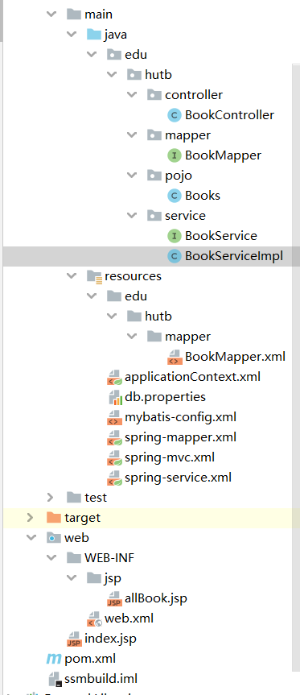

# 1、Mybatis

## 1、Mybatis的配置文件

mybatis-config.xml

```xml
<?xml version="1.0" encoding="UTF-8" ?>
<!DOCTYPE configuration
        PUBLIC "-//mybatis.org//DTD Config 3.0//EN"
        "http://mybatis.org/dtd/mybatis-3-config.dtd">

<configuration>
    <!--  数据库环境  -->
    <environments default="development">
        <environment id="development">
            <transactionManager type="JDBC"/>
            <dataSource type="POOLED">
                <property name="driver" value="com.mysql.jdbc.Driver"/>
                <property name="url" value="jdbc:mysql://localhost:3306/mybatis?useSSL=false&amp;useUnicode=true&amp;characterEncoding=utf8"/>
                <property name="username" value="root"/>
                <property name="password" value="root"/>
            </dataSource>
        </environment>
    </environments>
    <!--  指定路径 绑定Mapper.xml   -->
    <mappers>
        <mapper resource="edu/hutb/dao/UserMapper.xml"/>
    </mappers>
</configuration>
```

## 2、工具类

MybatisUtils

```java
// sqlSessionFactory ----> sqlSession
public class MybatisUtils {

    private static SqlSessionFactory sqlSessionFactory;
    static{
        try {
            // 获取sqlSession
            String resource = "mybatis-config.xml";
            InputStream inputStream = Resources.getResourceAsStream(resource);
            sqlSessionFactory = new SqlSessionFactoryBuilder().build(inputStream);
        } catch (IOException e) {
            e.printStackTrace();
        }
    }
    // 既然有了 SqlSessionFactory，顾名思义，我们可以从中获得 SqlSession 的实例。
    // SqlSession 提供了在数据库执行 SQL 命令所需的所有方法
    public static SqlSession getSqlSession(){
        return sqlSessionFactory.openSession();
    }
}
```

## 3、简单使用

1.创建接口

```java
public interface UserMapper {
    // 查询所有
    List<User> getUserList();

    // 根据id查询用户
    User getUserById(int id);

    //插入一个用户
    int addUser(User user);

    // 更新
    int updateUser(User user);

    // 根据id删除
    int deleteUserById(int id);
}
```

2.配置相应的Mapper.xml文件，用于实现接口中的方法，相当于以前的Impl实现类

```xml
<?xml version="1.0" encoding="UTF-8" ?>
<!DOCTYPE mapper
        PUBLIC "-//mybatis.org//DTD Mapper 3.0//EN"
        "http://mybatis.org/dtd/mybatis-3-mapper.dtd">

<!--  namespace ：绑定需要实现的接口  -->
<mapper namespace="edu.hutb.dao.UserMapper">
    <!--select all-->
    <select id="getUserList" resultType="edu.hutb.pojo.User">
        select * from mybatis.user
    </select>

    <!--  id ： 使用方法名
          parameterType ：参数类型
          parameterType ：结果类型
      -->
    <select id="getUserById" parameterType="int" resultType="edu.hutb.pojo.User">
        select * from mybatis.user where id = #{id}
    </select>

    <insert id="addUser" parameterType="edu.hutb.pojo.User">
        insert into mybatis.user (id,name,pwd) values (#{id},#{name},#{pwd})
    </insert>
    
    <update id="updateUser" parameterType="edu.hutb.pojo.User">
        update mybatis.user set name = #{name},pwd = #{pwd} where id = #{id}
    </update>
    
    <delete id="deleteUserById" parameterType="int">
        delete from mybatis.user where id = #{id}
    </delete>
</mapper>
```

3.测试

```java
@Test
public void test01(){
    // 第一步：获得SqlSession对象
    SqlSession sqlSession = MybatisUtils.getSqlSession();

    // 方式一 ： getMapper
    UserMapper userDao = sqlSession.getMapper(UserMapper.class);
    // mapper.xml中，id为方法名
    List<User> userList = userDao.getUserList();

    for (User user : userList) {
        System.out.println(user);
    }
    
    // 增、删、改 需要提交事务
    //sqlSession.commit();
    // 关闭
    sqlSession.close();
}
```

4.将配置文件中数据库连接信息提取出来

db.properties

```properties
driver=com.mysql.jdbc.Driver
url=jdbc:mysql://localhost:3306/mybatis?useSSL=false&useUnicode=true&characterEncoding=utf8
username=root
password=root
```

5.配置文件

```xml
<?xml version="1.0" encoding="UTF-8" ?>
<!DOCTYPE configuration
        PUBLIC "-//mybatis.org//DTD Config 3.0//EN"
        "http://mybatis.org/dtd/mybatis-3-config.dtd">
<configuration>
	<!--  数据库资源路径  -->
    <properties resource="db.properties"/>
    
    <settings>
        <!--  开启缓存，默认开启，在Mapper.xml文件中配置 <cache/> 标签  -->
        <setting name="cacheEnabled" value="true"/>
        <!--   开启日志     -->
        <setting name="logImpl" value="STDOUT_LOGGING"/>
        <!--   开启驼峰命名自动映射     -->
        <setting name="mapUnderscoreToCamelCase" value="true"/>
    </settings>

	<!--  开启别名，默认为类名首字母小写，可以在实体类上使用 @Alias("XX") 来自定义别名  -->
    <!--  包扫描，扫描报下所有的类  -->
    <typeAliases>
        <package name="edu/hutb/pojo"/>
    </typeAliases>

    <environments default="development">
        <environment id="development">
            <transactionManager type="JDBC"/>
            <dataSource type="POOLED">
                <property name="driver" value="${driver}"/>
                <property name="url" value="${url}"/>
                <property name="username" value="${username}"/>
                <property name="password" value="${password}"/>
            </dataSource>
        </environment>
    </environments>
    
    <mappers>
        <!--  包扫描  -->
        <package name="edu/hutb/dao"/>
        <mapper resource="edu/hutb/dao/UserMapper.xml"/>
    </mappers>
</configuration>
```

实体类与数据库的映射

```xml
<mapper namespace="edu.hutb.dao.UserMapper">
    <resultMap id="UserMapper" type="User">
        <!--  column ： 数据库列名
              property ：实体类属性名
          -->
        <result column="id" property="id"></result>
        <result column="name" property="name"></result>
        <result column="pwd" property="pwd"></result>
    </resultMap>
</mapper>
```

## 4、动态Sql

```xml
<mapper namespace="edu.hutb.dao.BlogMapper">

    <cache/>
    
    <!--  动态sql语句，where  -->
    <select id="getBlog" parameterType="map" resultType="Blog">
        select * from mybatis.Blog
        <where>
            <if test="id != null">
                and id = #{id}
            </if>
            <if test="title != null">
                and title = #{title}
            </if>
            <if test="author != author">
                and author = #{author}
            </if>
        </where>
    </select>

    <!--  动态sql语句，set  -->
    <update id="updateBlog" parameterType="map">
        update mybatis.blog
            <set>
                <if test="title != null">
                    title = #{title},
                </if>
                <if test="author != null">
                    author = #{author},
                </if>
                <if test="views != null">
                    views = #{views}
                </if>
            </set>
            where id = #{id}
    </update>
</mapper>
```


# 2、Spring

## 1、spring配置文件

```xml
<?xml version="1.0" encoding="UTF-8"?>
<beans xmlns="http://www.springframework.org/schema/beans"
       xmlns:xsi="http://www.w3.org/2001/XMLSchema-instance"
       xsi:schemaLocation="http://www.springframework.org/schema/beans
        http://www.springframework.org/schema/beans/spring-beans.xsd">

</beans>
```

### 1、通过spring配置文件实例化对象

```xml
 		<bean id="UserDaoImpl" class="edu.hutb.dao.UserDaoImpl"/>
    <bean id="UserDaoSqlImpl" class="edu.hutb.dao.UserDaoSqlImpl"/>
    <bean id="UserDaoOracleImpl" class="edu.hutb.dao.UserDaoOracleImpl"/>

    <!--   类型 变量名 = new 类型
            id = 变量名
            class = 类型
            property 是对象属性名
                基本类型和String 用 value 赋值，通过对象的 set 方法
                引用类型用 ref 赋值
    -->
    <!--  一个bean指定一个对象  默认使用无参构造-->
    <bean id="UserServiceImpl" class="edu.hutb.service.UserServiceImpl">
        <property name="str" value="Hello Spring"/>
        <property name="userDao" ref="UserDaoOracleImpl"/>
    </bean>

    <bean id="UserServiceImpl2" class="edu.hutb.service.UserServiceImpl">
        <property name="str" value="Hello Spring"/>
        <property name="userDao" ref="UserDaoOracleImpl"/>
    </bean>

    <!--  有参构造的三种赋值方式  -->
<!--    <bean id="" class="">-->
<!--        <constructor-arg index="" value=""/>-->
<!--        <constructor-arg type="" value=""/>-->
<!--        <constructor-arg name="" value=""/>-->
<!--    </bean>-->
```

### 2、注入

```xml
<bean id="address" class="edu.hutb.pojo.Address">
        <property name="address" value="湖南"/>
    </bean>
      <!--  autowire : 自动注入，byType、byName。寻找与属性名相匹配的bean id 或 类型  -->
    <bean id="student" class="edu.hutb.pojo.Student" autowire="byType">
       	<!--  8大基本类型和String  -->
        <property name="name" value="艾忠"/>
				<!--  引用类型  -->
        <property name="address" ref="address"/>
				<!--  数组  -->
        <property name="books">
            <array>
                <value>高等数学</value>
                <value>线性代数</value>
                <value>离散数学</value>
            </array>
        </property>
				<!--  list  -->
        <property name="hobbies">
            <list>
                <value>玩游戏</value>
                <value>学习</value>
            </list>
        </property>
				<!--  map  -->
        <property name="cards">
            <map>
                <entry key="身份证" value="123456"/>
                <entry key="银行卡" value="456789"/>
            </map>
        </property>
				<!--  set  -->
        <property name="games">
            <set>
                <value>LOL</value>
                <value>WOW</value>
            </set>
        </property>
				<!--  空置，null  -->
        <property name="wife">
            <null/>
        </property>
				<!--  property  -->
        <property name="info">
            <props>
                <prop key="driver">123456</prop>
                <prop key="url">asd</prop>
                <prop key="name">root</prop>
                <prop key="password">root</prop>
            </props>
        </property>
    </bean>
```

### 3、注解注入

```java
      @Value("艾忠")
      private String name;
      // 自动注入
      // @Autowired 先按byType找，后按byName找
      // 还可放在set方法上
      @Autowired
      private Dog dog;
      @Autowired
      private Cat cat;
```


## 2、注解实现bean

### 1、配置文件支持

```xml
<?xml version="1.0" encoding="UTF-8"?>
<beans xmlns="http://www.springframework.org/schema/beans"
       xmlns:xsi="http://www.w3.org/2001/XMLSchema-instance"
       xmlns:context="http://www.springframework.org/schema/context"
       xsi:schemaLocation="http://www.springframework.org/schema/beans
        http://www.springframework.org/schema/beans/spring-beans.xsd
        http://www.springframework.org/schema/context
        http://www.springframework.org/schema/context/spring-context.xsd">

  	<!--  包扫描 ： 自开启指定包的注解配置  -->
    <context:component-scan base-package="edu.hutb" />
  	<!--  开启所有的注解配置  -->
    <context:annotation-config/>

</beans>
```

### 2、pojo层

```java
//相当于在bean配置文件中实现 <bean id="user" class="*.*.*.User">
@Component("user")
public class User {
    @Value("艾忠")
    private String name;

    public String getName() {
        return name;
    }

    public void setName(String name) {
        this.name = name;
    }
}
```

### 3、service层

```java
@Service
public class UserService {
}
```

### 4、Controller层

```java
@Controller
public class Servlet {
}
//@Component
//@Service
//@Controller
//相同的效果
```

### 5、dao（mapper）层

```java
@repository
public interface UserMapper {
    List<User> selectUserList();
}
```

**@Component("user")、@Service、@Controller、@repository相同的效果，都是注册bean**


## 3、Spring-AOP

### 方式一：使用原生Spring API接口

创建切入类，并实现指定接口

```java
// 后置切入点
public class AfterLog implements AfterReturningAdvice {
    public void afterReturning(Object o, Method method, Object[] objects, Object o1) throws Throwable {
        System.out.println("调用了 " + method.getName());
    }
}
// 前置切入点
public class BeforeLog implements MethodBeforeAdvice {
    public void before(Method method, Object[] objects, Object o) throws Throwable {
        System.out.println(o.getClass().getName()+"调用了"+method.getName());
    }
}
```

在配置文件中创建相应的bean

```xml
<bean id="afterLog" class="edu.hutb.log.AfterLog"/>
<bean id="beforeLog" class="edu.hutb.log.BeforeLog"/>
```

配置切入点

```xml
<!--    方式一：使用原生Spring API接口  -->
<aop:config>
    <!--  切入点：expression  表达式 execution(修饰符 返回值 全限定方法名(参数)  -->
    <aop:pointcut id="pointcut" expression="execution(* edu.hutb.service.UserServiceImpl.*(..))"/>
	<!--  通知  -->
    <aop:advisor advice-ref="afterLog" pointcut-ref="pointcut"/>
    <aop:advisor advice-ref="beforeLog" pointcut-ref="pointcut"/>
</aop:config>
```

配置好后，通知点出会显示被切入的方法


### 方式二：自定义类

自定义切入类

```java
public class DiyLog {
    public void before(){
        System.out.println("=====================执行前==============");
    }

    public void after(){
        System.out.println("=====================执行后==============");
    }
}
```

配置bean

```xml
<!--    方式二 :自定义类 -->
<bean id="diyLog" class="edu.hutb.diy.DiyLog"/>
<aop:config>
    <!--   自定义切面，ref 需要引用的类-->
    <aop:aspect ref="diyLog">
        <!--   切入点  -->
        <aop:pointcut id="pointcut" expression="execution(* edu.hutb.service.UserServiceImpl.*(..))"/>
        <!--   前置通知、后置通知  -->
        <aop:before method="before" pointcut-ref="pointcut"/>
        <aop:after method="after" pointcut-ref="pointcut"/>
    </aop:aspect>
</aop:config>
```


### 方式三：使用注解

```java
@Aspect // 标记这是一个切面
public class AnnotationPointCut {

    @Before("execution(* edu.hutb.service.UserServiceImpl.*(..))")
    public void before(){
        System.out.println("============执行前============");
    }
    @After("execution(* edu.hutb.service.UserServiceImpl.*(..))")
    public void after(){
        System.out.println("============执行后============");
    }

    @Around("execution(* edu.hutb.service.UserServiceImpl.*(..))")
    public void around(@org.jetbrains.annotations.NotNull ProceedingJoinPoint jp) throws Throwable {

        System.out.println("环绕前");
        jp.proceed();
        System.out.println("环绕后");

    }
}
```

配置bean

```xml
<!--    方式三 : 使用注解-->
<bean id="annotationPointCut" class="edu.hutb.diy.AnnotationPointCut"/>
<!--    开启注解支持-->
<aop:aspectj-autoproxy/>
```


## 4、Spring-Mybatis整合

1.编写实体类

2.编写接口Mapper

3.编写对应接口Mapper.xml

4.前面和Mybatis一样，但整合后，Mybatis在配置文件中的配置**都**可以交给Spring的配置文件中去设置

mybatis-config.xml

```xml
<?xml version="1.0" encoding="UTF-8" ?>
<!DOCTYPE configuration
        PUBLIC "-//mybatis.org//DTD Config 3.0//EN"
        "http://mybatis.org/dtd/mybatis-3-config.dtd">
<configuration>
    <typeAliases>
        <!--  包扫描方式 ： 在没有注解的情况下，会使用 Bean 的首字母小写的非限定类名来作为它的别名  -->
        <package name="edu/hutb/pojo"/>
    </typeAliases>
</configuration>
```

applicationContext.xml

```xml
<?xml version="1.0" encoding="UTF-8"?>
<beans xmlns="http://www.springframework.org/schema/beans"
       xmlns:xsi="http://www.w3.org/2001/XMLSchema-instance"
       xmlns:aop="http://www.springframework.org/schema/aop"
       xmlns:context="http://www.springframework.org/schema/context"
       xsi:schemaLocation="http://www.springframework.org/schema/beans
       http://www.springframework.org/schema/beans/spring-beans.xsd
        http://www.springframework.org/schema/aop
        http://www.springframework.org/schema/aop/spring-aop.xsd
        http://www.springframework.org/schema/context
        http://www.springframework.org/schema/context/spring-context.xsd">

<!--    ===========================固定================================    -->
    <!--  dataSource : 使用Spring的数据源替换Mybatis的配置
          使用Spring提供的JDBC ： org.springframework.jdbc.datasource.DriverManagerDataSource
    -->

    <bean id="dataSource" class="org.springframework.jdbc.datasource.DriverManagerDataSource">
        <property name="driverClassName" value="com.mysql.jdbc.Driver"/>
        <property name="url" value="jdbc:mysql://localhost:3306/mybatis?useSSL=false&amp;useUnicode=true&amp;characterEncoding=utf8"/>
        <property name="username" value="root"/>
        <property name="password" value="root"/>
    </bean>
    <!--  sqlSessionFactory  -->
    <bean id="sqlSessionFactory" class="org.mybatis.spring.SqlSessionFactoryBean">
        <property name="dataSource" ref="dataSource"/>
        <!--  绑定Mybatis配置文件 -->
        <property name="configLocation" value="classpath:mybatis-config.xml"/>
        <property name="mapperLocations" value="classpath:edu/hutb/dao/*.xml"/>
    </bean>
    <!--  sqlSessionTemplate : 是sqlSession  -->
    <bean id="sqlSession" class="org.mybatis.spring.SqlSessionTemplate">
        <!--  只能通过构造器注入sqlSessionFactory，因为没有set方法 -->
        <constructor-arg index="0" ref="sqlSessionFactory"/>
    </bean>
<!--    =========================================================================    -->
    
    <bean id="userMapper" class="edu.hutb.dao.UserMapperImpl">
        <!--  注入，需要一个SqlSessionTemplate sqlSession，就将上面的sqlSession注入 -->
        <property name="sqlSession" ref="sqlSession"/>
    </bean>

</beans>
```

5.由于bean需要一个实体类，所以创建UserMapperImpl，**然后去Spring配置文件中注册bean**

```java
public class UserMapperImpl implements UserMapper{
    private SqlSessionTemplate sqlSession;

    public void setSqlSession(SqlSessionTemplate sqlSession) {
        this.sqlSession = sqlSession;
    }

    public List<User> getUserList() {
        // 通过配置文件，跳过之前Mybatis前面的步骤，直接拿到sqlSession
        UserMapper mapper = sqlSession.getMapper(UserMapper.class);
        return mapper.getUserList();
    }
}
```

## 5、事务

ACID ： 原子性、一致性、隔离性、持久性

```xml
<!--  配置声明式事务  -->
<bean id="transactionManager" class="org.springframework.jdbc.datasource.DataSourceTransactionManager">
    <property name="dataSource" ref="dataSource"/>
</bean>

<!--  结合AOP实现事务的织入  -->
<!--  配置事务的通知  -->
<tx:advice id="txAdvice" transaction-manager="transactionManager">
    <tx:attributes>
        <!--  需要通知的方法  -->
        <tx:method name="getUserList" propagation="REQUIRED" read-only="true"/>
        <tx:method name="*" propagation="REQUIRED"/>
    </tx:attributes>
</tx:advice>
<!--  配置事务切入  -->
<aop:config>
    <aop:pointcut id="txPointCut" expression="execution(* edu.hutb.mapper.*.*(..))"/>
    <aop:advisor advice-ref="txAdvice" pointcut-ref="txPointCut"/>
</aop:config>
```


# 3、SpringMVC

## 3.1、基础应用

1、web.xml配置文件

```xml
<?xml version="1.0" encoding="UTF-8"?>
<web-app xmlns="http://xmlns.jcp.org/xml/ns/javaee"
         xmlns:xsi="http://www.w3.org/2001/XMLSchema-instance"
         xsi:schemaLocation="http://xmlns.jcp.org/xml/ns/javaee http://xmlns.jcp.org/xml/ns/javaee/web-app_4_0.xsd"
         version="4.0">
    <!--  配置DispatcherServlet：这个是SpringMVC的核心，请求分发器，前端控制器  -->
    <servlet>
        <servlet-name>springmvc</servlet-name>
        <servlet-class>org.springframework.web.servlet.DispatcherServlet</servlet-class>
        <!--  DispatcherServlet要绑定Spring的配置文件  -->
        <init-param>
            <param-name>contextConfigLocation</param-name>
            <param-value>classpath:springmvcservlet.xml</param-value>
        </init-param>
    </servlet>

    <!--  在SpringMVC中
      / : 只匹配所有的请求，不回去匹配jsp页面
      /* : 匹配所有的请求，包括jsp页面
      -->
    <servlet-mapping>
        <servlet-name>springmvc</servlet-name>
        <url-pattern>/</url-pattern>
    </servlet-mapping>
    
    <!--  Spring的过滤器,处理乱码  -->
    <filter>
        <filter-name>CharacterEncodingFilter</filter-name>
        <filter-class>org.springframework.web.filter.CharacterEncodingFilter</filter-class>
        <init-param>
            <param-name>encoding</param-name>
            <param-value>utf-8</param-value>
        </init-param>
    </filter>
    <filter-mapping>
        <filter-name>CharacterEncodingFilter</filter-name>
        <url-pattern>/*</url-pattern>
    </filter-mapping>
</web-app>
```

2、springmvc.xml

```xml
<?xml version="1.0" encoding="UTF-8"?>
<beans xmlns="http://www.springframework.org/schema/beans"
       xmlns:xsi="http://www.w3.org/2001/XMLSchema-instance"
       xsi:schemaLocation="http://www.springframework.org/schema/beans
        http://www.springframework.org/schema/beans/spring-beans.xsd">


    <!--  处理器映射器  -->
    <bean class="org.springframework.web.servlet.handler.BeanNameUrlHandlerMapping"/>

    <!--  处理器适配器  -->
    <bean class="org.springframework.beans.factory.xml.SimpleConstructorNamespaceHandler"/>

    <!--  视图解析器：  -->
    <bean class="org.springframework.web.servlet.view.InternalResourceViewResolver" id="internalResourceViewResolver">
        <!--  前缀  -->
        <property name="prefix" value="WEB-INF/jsp/"/>
        <!--  后缀  -->
        <property name="suffix" value=".jsp"/>
    </bean>
    
	<!--  id为前端请求映射，类似于之前servlet在web.xml中的mapper配置  -->
    <bean id="/hello" class="edu.hutb.controller.HelloController"/>

</beans>
```

3、HelloController.java

```java
public class HelloController implements Controller {
    public ModelAndView handleRequest(HttpServletRequest httpServletRequest, HttpServletResponse httpServletResponse) throws Exception {
        ModelAndView modelAndView = new ModelAndView();

        modelAndView.addObject("msg","edu.hutb.controller.HelloController");
        modelAndView.setViewName("test");

        return modelAndView;

    }
}
```

4、配置成功后idea可以直接跳转至指定的页面


## 3.2、使用注解

1、现在spring配置文件中开启注解支持

```xml
<?xml version="1.0" encoding="UTF-8"?>
<beans xmlns="http://www.springframework.org/schema/beans"
       xmlns:xsi="http://www.w3.org/2001/XMLSchema-instance"
       xmlns:context="http://www.springframework.org/schema/context"
       xmlns:mvc="http://www.springframework.org/schema/mvc"
       xsi:schemaLocation="http://www.springframework.org/schema/beans
        http://www.springframework.org/schema/beans/spring-beans.xsd
        http://www.springframework.org/schema/context
        http://www.springframework.org/schema/context/spring-context.xsd
        http://www.springframework.org/schema/mvc
        http://www.springframework.org/schema/mvc/spring-mvc.xsd">

	<!--  开启注解支持，包扫描  -->
    <context:component-scan base-package="edu.hutb.controller"/>
    <mvc:default-servlet-handler/>
    <mvc:annotation-driven/>

    <!--  视图解析器：  -->
    <bean class="org.springframework.web.servlet.view.InternalResourceViewResolver" id="internalResourceViewResolver">
        <!--  前缀  -->
        <property name="prefix" value="WEB-INF/jsp/"/>
        <!--  后缀  -->
        <property name="suffix" value=".jsp"/>
    </bean>

    <!--  无需再配置bean  -->
</beans>
```

2、@PostMapping、@GetMapping分别对应前端请求的方法类型，@RequestMapping也可可以实现请求方式，字段**method**

```java
// 相当于在spring配置文件中配置bean
// 并通过视图解析器
@Controller
public class HelloController {

    // 请求路径
    @RequestMapping(value = "/h1",method = RequestMethod.GET)
    public String hello(Model model){

        model.addAttribute("msg", "asdfsdgf");

        // 跳转路径
        return "hello";
    }
    @PostMapping("/h2")
    public String test1(){
        return "hello";
    }

    @GetMapping("/h2")
    public String test2(){
        return "hello";
    }
}
```

## 3.3、json

1、首先需要导入jar包

```xml
<!-- json解析工具 -->
<dependency>
    <groupId>com.fasterxml.jackson.core</groupId>
    <artifactId>jackson-databind</artifactId>
    <version>2.12.2</version>
</dependency>
<!-- fastjson 阿里的json解析工具 -->
<dependency>
    <groupId>com.alibaba</groupId>
    <artifactId>fastjson</artifactId>
    <version>1.2.75</version>
</dependency>
```

2、在spring配置文件配置

```xml
<!--  处理json乱码  -->
<mvc:annotation-driven>
    <mvc:message-converters register-defaults="true">
        <bean class="org.springframework.http.converter.StringHttpMessageConverter">
             <constructor-arg value="UTF-8"/>
        </bean>
        <bean class="org.springframework.http.converter.json.MappingJackson2HttpMessageConverter">
            <property name="objectMapper">
                <bean class="org.springframework.http.converter.json.Jackson2ObjectMapperFactoryBean">
                    <property name="failOnEmptyBeans" value="false"/>
                </bean>
            </property>
        </bean>
    </mvc:message-converters>
</mvc:annotation-driven>
```

3、方法上使用@ResponseBody代表该方法不通过视图解析器，类上使用@RestController代表该类中所有方法都不同过视图解析器。不通过视图解析器，即哪里来的请求就将数据返回到哪里。

```java
@RestController
//@Controller
public class JsonController {

    @RequestMapping("h1")
//    @ResponseBody
    public String test1() throws JsonProcessingException {

        User user = new User("艾忠", 10);

        return JsonUtils.getJson(user);
    }

    @RequestMapping("h2")
//    @ResponseBody
    public String test2() throws JsonProcessingException {
        List<User> userList = new ArrayList<User>();
        userList.add(new User("艾忠", 10));
        userList.add(new User("艾忠1", 10));
        userList.add(new User("艾忠2", 10));
        userList.add(new User("艾忠3", 10));
        return JsonUtils.getJson(userList);
    }

    @RequestMapping("h3")
//    @ResponseBody
    public String test3() throws JsonProcessingException {
        Date date = new Date();
        String format = "yyyy-MM-dd HH:mm:ss";
        return JsonUtils.getJson(date,format);
    }
}
```

4、Jackson使用：需要一个ObjectMapper对象，writeValueAsString()方法将一个java对象转化为json字符串

```java
public static String getJson(Object o, String format){
    ObjectMapper mapper = new ObjectMapper();

    mapper.configure(SerializationFeature.WRITE_DATES_AS_TIMESTAMPS,false);

    SimpleDateFormat simpleDateFormat = new SimpleDateFormat(format);
    mapper.setDateFormat(simpleDateFormat);
    try {
        return mapper.writeValueAsString(o);
    } catch (JsonProcessingException e) {
        e.printStackTrace();
    }
    return null;
}
```

## 3.4、拦截器

在配置文件中中添加，当请求路径被拦截是，会去经过指定的拦截器

```xml
<mvc:interceptors>
    <mvc:interceptor>
        <mvc:mapping path="/**"/>
        <bean class="edu.hutb.config.MyInterceptor"/>
    </mvc:interceptor>
    <mvc:interceptor>
        <mvc:mapping path="/**"/>
        <bean class="edu.hutb.config.LoginInterceptor"/>
    </mvc:interceptor>
</mvc:interceptors>
```

拦截器实现类，在实现类中preHandle()方法中判断

```java
public class MyInterceptor implements HandlerInterceptor {
    public boolean preHandle(HttpServletRequest request, HttpServletResponse response, Object handler) throws Exception {
        System.out.println("=============preHandle==============");
        // true：放行
        // false：拦截
        return true;
    }

    public void postHandle(HttpServletRequest request, HttpServletResponse response, Object handler, ModelAndView modelAndView) throws Exception {
        System.out.println("=============postHandle==============");
    }

    public void afterCompletion(HttpServletRequest request, HttpServletResponse response, Object handler, Exception ex) throws Exception {
        System.out.println("=============afterCompletion==============");
    }
}
```

# 4、ssm项目整合

### 1、数据库连接数据

```properties
jdbc.driver=com.mysql.jdbc.Driver
jdbc.url=jdbc:mysql://localhost:3306/mybatis?useSSL=false&useUnicode=true&characterEncoding=utf8
jdbc.username=root
jdbc.password=root
```

### 2、Mybatis的配置文件

<typeAliases>、<settings>、<mappers>交由Mybatis自己的配置文件中设置，其余的都交给Spring去做。

```xml
<?xml version="1.0" encoding="UTF-8" ?>
<!DOCTYPE configuration
        PUBLIC "-//mybatis.org//DTD Config 3.0//EN"
        "http://mybatis.org/dtd/mybatis-3-config.dtd">
<configuration>

    <typeAliases>
        <!--  包扫描方式 ： 在没有注解的情况下，会使用 Bean 的首字母小写的非限定类名来作为它的别名  -->
        <package name="edu/hutb/pojo"/>
    </typeAliases>

<!--    <settings>-->
<!--        <setting name="" value=""/>-->
<!--    </settings>-->
    <mappers>
        <mapper class="edu.hutb.mapper.BookMapper"/>
    </mappers>

</configuration>
```

### 3、整合Mapper层的配置文件

```xml
<?xml version="1.0" encoding="UTF-8"?>
<beans xmlns="http://www.springframework.org/schema/beans"
       xmlns:xsi="http://www.w3.org/2001/XMLSchema-instance"
       xmlns:aop="http://www.springframework.org/schema/aop"
       xmlns:context="http://www.springframework.org/schema/context"
       xsi:schemaLocation="http://www.springframework.org/schema/beans
       http://www.springframework.org/schema/beans/spring-beans.xsd
        http://www.springframework.org/schema/aop
        http://www.springframework.org/schema/aop/spring-aop.xsd
        http://www.springframework.org/schema/context
        http://www.springframework.org/schema/context/spring-context.xsd">

    <!--  1、关联数据库配置文件  -->
    <context:property-placeholder location="classpath:db.properties"/>
    <!-- 2、连接池
        dbcp：半自动化操作，不能自动连接
        c3p0：自动化操作(自动化的加载文件，并且可以自动的设置到对象中去)
        druid、hikari
    -->
    <bean id="dataSource" class="com.mchange.v2.c3p0.ComboPooledDataSource">
        <property name="driverClass" value="${jdbc.driver}"/>
        <property name="jdbcUrl" value="${jdbc.url}"/>
        <property name="user" value="${jdbc.username}"/>
        <property name="password" value="${jdbc.password}"/>
        <!--  c3p0连接池的私有属性  -->
        <property name="maxPoolSize" value="30"/>
        <property name="minPoolSize" value="10"/>
        <!--  关闭连接后不会自动commit  -->
        <property name="autoCommitOnClose" value="false"/>
        <!--  获取连接超时时间  -->
        <property name="checkoutTimeout" value="10000"/>
        <!--  失败后重连次数  -->
        <property name="acquireRetryAttempts" value="2"/>
    </bean>
    
    <!--  3、sqlSessionFactory  -->
    <bean id="sqlSessionFactory" class="org.mybatis.spring.SqlSessionFactoryBean">
        <property name="dataSource" ref="dataSource"/>
        <!--  绑定Mybatis配置文件 -->
        <property name="configLocation" value="classpath:mybatis-config.xml"/>
    </bean>
    
    <!--  4、配置mapper接口扫描包，动态的实现mapper中接口注入到Spring容易中  -->
    <bean class="org.mybatis.spring.mapper.MapperScannerConfigurer">
        <property name="sqlSessionFactoryBeanName" value="sqlSessionFactory"/>
        <property name="basePackage" value="edu.hutb.mapper"/>
    </bean>

</beans>
```

### 4、整合Service层的配置文件

```xml
<?xml version="1.0" encoding="UTF-8"?>
<beans xmlns="http://www.springframework.org/schema/beans"
       xmlns:xsi="http://www.w3.org/2001/XMLSchema-instance"
       xmlns:context="http://www.springframework.org/schema/context"
       xsi:schemaLocation="http://www.springframework.org/schema/beans
       http://www.springframework.org/schema/beans/spring-beans.xsd
        http://www.springframework.org/schema/context
        http://www.springframework.org/schema/context/spring-context.xsd">

    <!--  1、扫描service下的包，开启注解支持  -->
    <context:component-scan base-package="edu.hutb.service"/>
    <!--  2、将所有业务类，注入到Spring，可以通过配置，也可以通过注解  -->
    <bean id="bookServiceImpl" class="edu.hutb.service.BookServiceImpl">
        <property name="bookMapper" ref="bookMapper"/>
    </bean>
    <!--  3、声明式事务配置  -->
    <bean id="transactionManager" class="org.springframework.jdbc.datasource.DataSourceTransactionManager">
        <!--  dataSource在-mapper中  -->
        <property name="dataSource" ref="dataSource"/>
    </bean>

</beans>
```

### 5、整合Controller层的配置文件

```xml
<?xml version="1.0" encoding="UTF-8"?>
<beans xmlns="http://www.springframework.org/schema/beans"
       xmlns:xsi="http://www.w3.org/2001/XMLSchema-instance"
       xmlns:context="http://www.springframework.org/schema/context"
       xmlns:mvc="http://www.springframework.org/schema/mvc"
       xsi:schemaLocation="http://www.springframework.org/schema/beans
       http://www.springframework.org/schema/beans/spring-beans.xsd
        http://www.springframework.org/schema/context
        http://www.springframework.org/schema/context/spring-context.xsd
        http://www.springframework.org/schema/mvc
        http://www.springframework.org/schema/mvc/spring-mvc.xsd">


    <!--  1、注解驱动  -->
    <mvc:annotation-driven/>
    <!--  2、静态资源过滤  -->
    <mvc:default-servlet-handler/>
    <!--  3、扫描包  -->
    <context:component-scan base-package="edu.hutb.controller"/>
    <!--  4、视图解析器  -->
    <bean class="org.springframework.web.servlet.view.InternalResourceViewResolver">
        <property name="prefix" value="/WEB-INF/jsp/"/>
        <property name="suffix" value=".jsp"/>
    </bean>
</beans>
```

### 6、汇总

```xml
<?xml version="1.0" encoding="UTF-8"?>
<beans xmlns="http://www.springframework.org/schema/beans"
       xmlns:xsi="http://www.w3.org/2001/XMLSchema-instance"
       xmlns:context="http://www.springframework.org/schema/context"
       xsi:schemaLocation="http://www.springframework.org/schema/beans
       http://www.springframework.org/schema/beans/spring-beans.xsd
        http://www.springframework.org/schema/context
        http://www.springframework.org/schema/context/spring-context.xsd">

    <import resource="classpath:spring-mapper.xml"/>
    <import resource="classpath:spring-service.xml"/>
    <import resource="classpath:spring-mvc.xml"/>
</beans>
```

7、web.xml

```xml
<?xml version="1.0" encoding="UTF-8"?>
<web-app xmlns="http://xmlns.jcp.org/xml/ns/javaee"
         xmlns:xsi="http://www.w3.org/2001/XMLSchema-instance"
         xsi:schemaLocation="http://xmlns.jcp.org/xml/ns/javaee http://xmlns.jcp.org/xml/ns/javaee/web-app_4_0.xsd"
         version="4.0">

    <!--  配置DispatcherServlet：这个是SpringMVC的核心，请求分发器，前端控制器  -->
    <servlet>
        <servlet-name>springmvc</servlet-name>
        <servlet-class>org.springframework.web.servlet.DispatcherServlet</servlet-class>
        <!--  DispatcherServlet要绑定Spring的配置文件  -->
        <init-param>
            <param-name>contextConfigLocation</param-name>
            <!--  配置的汇总文件  -->
            <param-value>classpath:applicationContext.xml</param-value>
        </init-param>
        <load-on-startup>1</load-on-startup>
    </servlet>
    <servlet-mapping>
        <servlet-name>springmvc</servlet-name>
        <url-pattern>/</url-pattern>
    </servlet-mapping>

    <!--  Spring的过滤器,处理乱码  -->
    <filter>
        <filter-name>CharacterEncodingFilter</filter-name>
        <filter-class>org.springframework.web.filter.CharacterEncodingFilter</filter-class>
        <init-param>
            <param-name>encoding</param-name>
            <param-value>utf-8</param-value>
        </init-param>
    </filter>
    <filter-mapping>
        <filter-name>CharacterEncodingFilter</filter-name>
        <url-pattern>/*</url-pattern>
    </filter-mapping>

    <session-config>
        <session-timeout>15</session-timeout>
    </session-config>
</web-app>
```

### 7、项目目录




### 8、注意

1、mapper层的每一个mapper接口在resources要有一个对应的mapper.xml

```xml
<?xml version="1.0" encoding="UTF-8" ?>
<!DOCTYPE mapper
        PUBLIC "-//mybatis.org//DTD Mapper 3.0//EN"
        "http://mybatis.org/dtd/mybatis-3-mapper.dtd">

<!--  namespace ：绑定需要实现的接口  -->
<mapper namespace="edu.hutb.mapper.BookMapper">

    <select id="selectAllBook" resultType="books">
        select * from ssmbuild.books;
    </select>

</mapper>
```

2、service层每一个实现类在-service中要注册一bean，或者直接使用注解@Service，实现

3、Controller层使用@Controller注册bean


# 5、整合jar包

```xml
<dependencies>
    <!--测试工具-->
        <dependency>
            <groupId>junit</groupId>
            <artifactId>junit</artifactId>
            <version>4.13</version>
        </dependency>
        <!--mysql驱动-->
        <dependency>
            <groupId>mysql</groupId>
            <artifactId>mysql-connector-java</artifactId>
            <version>5.1.47</version>
        </dependency>
        <!--  c3p0连接池 -->
        <dependency>
            <groupId>com.mchange</groupId>
            <artifactId>c3p0</artifactId>
            <version>0.9.5.2</version>
        </dependency>
        <!--  servlet - jsp -->
        <dependency>
            <groupId>javax.servlet</groupId>
            <artifactId>servlet-api</artifactId>
            <version>2.5</version>
        </dependency>
        <dependency>
            <groupId>javax.servlet.jsp</groupId>
            <artifactId>jsp-api</artifactId>
            <version>2.2</version>
        </dependency>
        <dependency>
            <groupId>javax.servlet</groupId>
            <artifactId>jstl</artifactId>
            <version>1.2</version>
        </dependency>
        <!--  mybatis -->
        <dependency>
            <groupId>org.mybatis</groupId>
            <artifactId>mybatis</artifactId>
            <version>3.5.2</version>
        </dependency>
        <dependency>
            <groupId>org.mybatis</groupId>
            <artifactId>mybatis-spring</artifactId>
            <version>2.0.6</version>
        </dependency>
        <!--  spring  -->
        <dependency>
            <groupId>org.springframework</groupId>
            <artifactId>spring-webmvc</artifactId>
            <version>5.3.5</version>
        </dependency>
        <dependency>
            <groupId>org.springframework</groupId>
            <artifactId>spring-jdbc</artifactId>
            <version>5.3.5</version>
        </dependency>
    </dependencies>

</dependencies>
 <!--  静态资源导出问题  -->
    <build>
        <resources>
            <resource>
                <directory>src/main/java</directory>
                <includes>
                    <include>**/*.properties</include>
                    <include>**/*.xml</include>
                </includes>
                <filtering>false</filtering>
            </resource>
            <resource>
                <directory>src/main/resources</directory>
                <includes>
                    <include>**/*.properties</include>
                    <include>**/*.xml</include>
                </includes>
                <filtering>false</filtering>
            </resource>
        </resources>
    </build>
```

