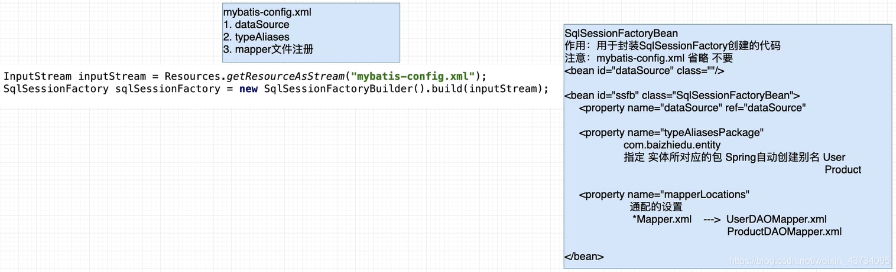

# 持久层整合总述

1、Spring 框架为什么要与持久层技术进行整合？

-   JavaEE开发需要持久层进行数据库的访问操作
-   JDBC、Hibernate、MyBatis 进行持久开发过程存在大量的代码冗余
-   Spring 基于模板设计模式对于上述的持久层技术进行了封装


2、Spring 可以与哪些持久层技术进行整合？

-   JDBC —— `JDBCTemplate`
-   Hibernate（JPA）—— `HibernateTemplate`
-   **MyBatis** —— `SqlSessionFactoryBean`、`MapperScannerConfigure`


# Mybatis开发回顾

1、提供配置文件，配置数据源

```xml
<?xml version="1.0" encoding="UTF-8" ?>
<!DOCTYPE configuration
        PUBLIC "-//mybatis.org//DTD Confi 3.0//EN"
        "http://mybatis.org/dtd/mybatis-3-config.dtd">
<configuration>
    
    <environments default="mysql">
        <environment id="mysql">
            <transactionManager type="JDBC"/>
            <dataSource type="POOLED">
                <property name="driver" value="com.mysql.jdbc.Driver"/>
                <property name="url" value="jdbc:mysql://localhost:3306/mybatis?useSSL=false"/>
                <property name="username" value="root"/>
                <property name="password" value="root"/>
            </dataSource>
        </environment>
    </environments>

</configuration>
```

2、提供实体类，并在配置文件中配置别名

```java
public class User {

    private Integer id;
    private String name;
    private String pwd;
    
    get、set。。。
```


```xml
<typeAliases>
    <typeAlias alias="user" type="com.aizhong.entity.User"/>
    <!--包下面的所以实体，默认为类名首字母小写-->
    <!--        <package name="com.aizhong.entity"/>-->
</typeAliases>
```

3、创建接口

```java
public interface UserDao {
    void save(User user);
}
```

4、实现Mapper.xml文件，并在配置文件中注册

```xml
<?xml version="1.0" encoding="UTF-8" ?>
<!DOCTYPE mapper
        PUBLIC "-//mybatis.org//DTD Mapper 3.0//EN"
        "http://mybatis.org/dtd/mybatis-3-mapper.dtd">
<mapper namespace="com.aizhong.dao.UserDao">

    <select id="save" parameterType="user">
        insert into mybatis.user(name, pwd) values (#{name}, #{pwd})
    </select>
</mapper>
```

```xml
<mappers>
    <mapper resource="com/aizhong/dao/UserDaoMapper.xml"/>
    <!--        <package name="com.aizhong.dao"/>-->
</mappers>
```

5、测试调用

```java
@Test
public void test(){
    InputStream inputStream = null;
    try {
        inputStream = Resources.getResourceAsStream("mybatis-config.xml");
    } catch (IOException e) {
        e.printStackTrace();
    }
    SqlSessionFactory sqlSessionFactory = new SqlSessionFactoryBuilder().build(inputStream);
    // mybatis 默认关闭自动提交事务
    SqlSession session = sqlSessionFactory.openSession(false);
   	// 获得的是MapperProxy代理对象
    UserDao userDAO = session.getMapper(UserDao.class);
    User user = new User("az22","222222");
    userDAO.save(user);

    session.commit();
    session.close();
}
```

6、存在的问题

```markdown
1. 实体
2. 实体别名					配置繁琐
3. 表
4. 创建 DAO 接口
5. 实现 Mapper 文件
6. 注册 Mapper 文件			配置繁琐
7. Mybatis API 调用		 代码冗余
```


# 整合思路




## 1、开发步骤

 0.    相关依赖

       ```xml
       <dependency>
           <groupId>mysql</groupId>
           <artifactId>mysql-connector-java</artifactId>
           <version>5.1.47</version>
       </dependency>
       <dependency>
           <groupId>org.springframework</groupId>
           <artifactId>spring-jdbc</artifactId>
           <version>5.2.6.RELEASE</version>
       </dependency>
       <dependency>
           <groupId>org.mybatis</groupId>
           <artifactId>mybatis-spring</artifactId>
           <version>2.0.6</version>
       </dependency>
       <dependency>
           <groupId>com.alibaba</groupId>
           <artifactId>druid</artifactId>
           <version>1.2.6</version>
       </dependency>
       <dependency>
           <groupId>org.mybatis</groupId>
           <artifactId>mybatis</artifactId>
           <version>3.5.6</version>
       </dependency>
       ```

	1.  配置文件(ApplicationContext.xml)

    ```xml
    <?xml version="1.0" encoding="UTF-8"?>
    <beans xmlns="http://www.springframework.org/schema/beans"
           xmlns:xsi="http://www.w3.org/2001/XMLSchema-instance"
           xsi:schemaLocation="http://www.springframework.org/schema/beans http://www.springframework.org/schema/beans/spring-beans.xsd">
    
        <!--连接池,数据源-->
        <bean id="dataSource" class="com.alibaba.druid.pool.DruidDataSource">
            <property name="driverClassName" value="com.mysql.jdbc.Driver"/>
            <property name="url" value="jdbc:mysql://localhost:3306/mybatis?useSSL=false"/>
            <property name="username" value="root"/>
            <property name="password" value="root"/>
        </bean>
    
        <!--创建SqlSessionFactory SqlSessionFactoryBean-->
        <bean id="sqlSessionFactoryBean" class="org.mybatis.spring.SqlSessionFactoryBean">
            <property name="dataSource" ref="dataSource"/>
            <!-- 指定实体类所在的包 -->
            <property name="typeAliasesPackage" value="com.aizhong.entity"/>
            <!--指定配置文件（映射文件）的路径，还有通用配置-->
            <property name="mapperLocations">
                <list>
                    <value>classpath:com/aizhong/dao/*Mapper.xml</value>
                </list>
            </property>
        </bean>
    
        <!--创建DAO对象 MapperScannerConfigure-->
        <bean id="scanner" class="org.mybatis.spring.mapper.MapperScannerConfigurer">
            <property name="sqlSessionFactoryBeanName" value="sqlSessionFactoryBean"/>
            <!--指定DAO接口放置的包-->
            <property name="basePackage" value="com.aizhong.dao"/>
        </bean>
    
    </beans>
    ```

	2.  实体类

	3. Dao接口

	4. Mapper配置文件

	5. 测试

    ```java
    @Test
    public void test1(){
        ApplicationContext ctx = new ClassPathXmlApplicationContext("/applicationContext.xml");
        // 获得的是MapperProxy代理对象
        UserDao userDAO = (UserDao) ctx.getBean("userDao");
        User user = new User("Se","ssf");
        userDAO.save(user);
    }
    ```

    

## 2、整合细节

Spring 与 Myabatis 整合后，为什么 DAO 不提交事务，但是数据能够插入数据库中？

```markdown
1. Mybatis 提供的连接池对象 —> 创建 Connection
Connection.setAutoCommit(false) 手工的控制了事务，操作完成后，需要手工提交。

2. Druid（C3P0、DBCP）作为连接池 —> 创建 Connection
Connection.setAutoCommit(true) 默认值为 true，保持自动控制事务，一条 sql 自动提交。

因为 Spring 与 Mybatis 整合时，引入了外部连接池对象，保持自动的事务提交这个机制Connection.setAutoCommit(true)，不需要手工进行事务的操作，也能进行事务的提交。

注意：实战中，还是会手工控制事务（多条SQL一起成功，一起失败），后续 Spring 通过 事务控制 解决这个问题。
```


# 事务开发

## 1、什么是事务

事务是保证业务操作完整性的一种**数据库机制**。

事务的4大特点：A、C、I、D

-   `A` 原子性
-   `C` 一致性
-   `I` 隔离性
-   `D` 持久性


## 2、如何控制事务

-   JDBC

    ```java
    Connection.setAutoCommit(false);
    Connection.commit();
    Connection.rollback();
    ```

-   MyBatis

    ```java
    Mybatis 自动开启事务
    sqlSession.commit();	底层还是调用的 Connection
    sqlSession.rollback();	底层还是调用的 Connection
    ```

    

## 3、Spring事务开发

1.   环境依赖

    ```xml
    <!--Spring事务-->
    <dependency>
        <groupId>org.springframework</groupId>
        <artifactId>spring-tx</artifactId>
        <version>5.3.8</version>
    </dependency>
    ```

2.   配置文件

    ```xml
    <!-- service层 -->
    <bean id="userService" class="com.aizhong.service.UserServiceImpl">
        <property name="userDao" ref="userDao"/>
    </bean>
    
    <!--DataSourceTransactionManager-->
    <bean id="dataSourceTransactionManager" class="org.springframework.jdbc.datasource.DataSourceTransactionManager">
        <property name="dataSource" ref="dataSource"/>
    </bean>
    
    <!--动态代理底层实现的切换，默认 false 是 JDK，true 是 Cglib。-->
    <tx:annotation-driven transaction-manager="dataSourceTransactionManager" proxy-target-class="false"/>
    ```

3.   service开启事务

    ```java
    @Transactional
    public class UserServiceImpl implements UserService{
        private UserDao userDao;
    ```


## 4、事务属性

```markdown
1.  隔离属性
2.  传播属性
3.  只读属性
4.  超时属性
5.  异常属性
```

```java
// 默认属性
@Transactional(
        isolation = Isolation.DEFAULT,
        propagation = Propagation.REQUIRED,
        readOnly = false,
        timeout = -1,
        rollbackFor = {}
)
```


### 4.1	隔离属性 ISOLATION

概念：**描述了事务解决并发问题的特征**。

并发产生的问题

```markdown
1. 脏读
    一个事务，读取了另一个事务中没有提交的数据，会在本事务中产生数据不一样的现象
    解决方案：@Transaction(isolation=Isolation.READ_COMMITTED)
2. 不可重复读
    一个事务中，多次读取相同的数据，但是读取结果不一样，会在本事务中产生数据不一样的现象
    注意：1.不是脏读 2.在一个事务中
    解决方案：@Transaction(isolation=Isolation.REPEATABLE_READ)
    本质：一把行锁（对数据库表的某一行加锁）
3. 幻读
    一个事务中，多次对整表进行查询统计，但是结果不一样，会在本事务中产生数据不一致的问题
    解决方案：@Transaction(isolation=Isolation.SERIALIZABLE)
    本质：表锁（对数据库某个表加锁）
```

安全效率对比

```markdown
1. 并发安全：SERIALIZABLE > READ_ONLY > READ_COMMITTED
2. 运行效率：READ_COMMITTED > READ_ONLY > SERIALIZABLE
```

默认的隔离属性

```markdown
1. Spring 会指定为 ISOLATION_DEFAULT，调用不同数据库所设置的默认隔离属性
    MySQL：REPEATABLE_READ
    Oracle：READ_COMMITTED
2. 查看数据库的默认隔离属性：
    MySQL：SELECT @@tx_isolation;
    Oracle：较麻烦，建议百度。
```


### 4.2	传播属性	PROPAGATION

概念：描述了事务解决 **嵌套 问题** 的特征。

**事务的嵌套**：指的是一个大的事务中，包含了若干个小的事务。

**事务嵌套产生的问题**： 大事务中融入了很多小的事务，他们彼此影响，最终就导致外部大的事务丧失了事务的原子性。

| **传播属性的值** | **外部不存在事务** |      **外部存在事务**      |                        **用法**                         |    **备注**    |
| :--------------: | :----------------: | :------------------------: | :-----------------------------------------------------: | :------------: |
|     REQUIRED     |    开启新的事务    |      融合到外部事务中      |   @Transactional(propagation = Propagation.REQUIRED)    | 增、删、改方法 |
|     SUPPORTS     |     不开启事务     |      融合到外部事务中      |   @Transactional(propagation = Propagation.SUPPORTS)    |    查询方法    |
|   REQUIRES_NEW   |    开启新的事务    | 挂起外部事务，创建新的事务 | @Transactional(propagation = Propagation.REQUIRES_NEW)  | 日志记录方法中 |
|  NOT_SUPPORTED   |     不开启事务     |        挂起外部事务        | @Transactional(propagation = Propagation.NOT_SUPPORTED) |   极其不常用   |
|      NEVER       |     不开启事务     |          抛出异常          |     @Transactional(propagation = Propagation.NEVER)     |   极其不常用   |
|    MANDATORY     |      抛出异常      |      融合到外部事物中      |   @Transactional(propagation = Propagation.MANDATORY)   |   极其不常用   |

Spring 中**传播属性的默认值**是：REQUIRED

推荐传播属性的使用方式：

-   增删改 方法：使用默认值 REQUIRED
-   查询 方法：显示指定传播属性的值为 SUPPORTS


### 4.3	只读属性	readOnly

针对于 **只进行查询操作的业务方法**，可以加入只读属性，提高运行效率。默认值为 flase。


### 4.4	超时属性	timeout

概念：指定了事务等待的最长时间。

为什么事务会进行等待？

```markdown
1. 当前事务访问数据时，有可能访问的数据被别的事务进行加锁的处理，那么此时本事务就必须进行等待。
等待时间，单位是 秒
如何使用：@Transactional(timeout = 2)
超时属性的默认值：-1
-1 表示超时属性由对应的数据库来指定（一般不会主动指定，-1 即可）
```


### 4.5	异常属性

Spring 事务处理过程中,发生异常：

-   默认对于 `RuntimeException` 及其子类，采用 **回滚** 的策略。
-   默认对于 `Exception` 及其子类，采用 **提交** 的策略。

建议：实战中使用 `RuntimeException` 及其子类，使用事务异常属性的默认值。


### 4.6	事务的常见配置

1.  隔离属性 默认值

2.  传播属性 Required（默认值）增删改、Supports 查询操作

3.  只读属性 readOnly=false 增删改，true 查询操作

4.  超时属性 默认值 -1

5.  异常属性 默认值

    即：

    ```markdown
    增删改操作：`@Transactional`
    查询操作：`@Transactional(propagation = Propagation.SUPPORTS, readOnly = true)`
    ```

    


