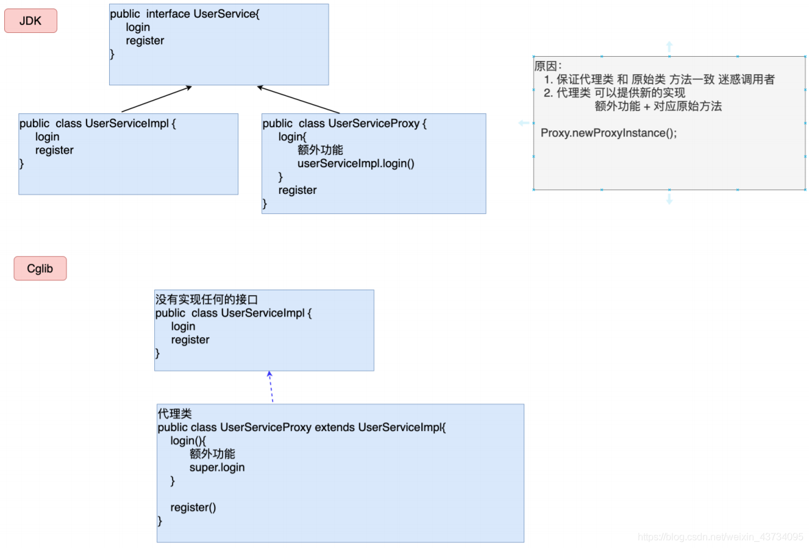

# 引言

## 1、什么是Spring？

Spring一个轻量级的JavaEE解决方案，整合众多优秀的设计模式。

```markdown
1. 轻量级：对运行环境没有额外要求，代码移植性高。
2. 解决方案：整合了Struts2、Mybatis等。
3. 设计模式：工厂、代理、模板、策略。
```


## 2、工厂设计模式

### 2.1 什么是工厂设计模式

```markdown
1. 概念：通过工厂类，创建对象。
2. 好处：解耦合
```


### 2.2 简单工厂模式

```properties
#-----applicationContext.properties

userService = com.aizhong.service.UserServiceImpl
userDao = com.aizhong.dao.UserDaoImpl
```

```java
//-----BeanFactory.java
public class BeanFactory {
    private static Properties env = new Properties();

    static {
        try {
            //获得IO输入流
            InputStream inputStream = BeanFactory.class.getResourceAsStream("/applicationContext.properties");
            //文件内容分装
            env.load(inputStream);
            inputStream.close();
        } catch (IOException e) {
            e.printStackTrace();
        }
    }

    /*
        对象的创建方式：
            1、直接通过调用构造方法 UserService userService = new UserService();
            2、通过反射的形式，创建对象，解耦合
     */
    public static UserService getUserService() {
        //return new UserServiceImpl();
        UserService userService = null;
        try {
            Class clazz = Class.forName(env.getProperty("userService"));
            userService = (UserService) clazz.newInstance();
        } catch (ClassNotFoundException e) {
            e.printStackTrace();
        } catch (IllegalAccessException e) {
            e.printStackTrace();
        } catch (InstantiationException e) {
            e.printStackTrace();
        }
        return userService;
    }

    public static UserDaoImpl getUserDao() {
        UserDaoImpl userDaoImpl = null;
        try {
            Class clazz = Class.forName(env.getProperty("userDao"));
            userDaoImpl = (UserDaoImpl) clazz.newInstance();
        } catch (InstantiationException e) {
            e.printStackTrace();
        } catch (IllegalAccessException e) {
            e.printStackTrace();
        } catch (ClassNotFoundException e) {
            e.printStackTrace();
        }
        return userDaoImpl;
    }
}

//-----AppTest.java
/**
*  用于测试：简单工厂
*/
@Test
public void test1(){
    //        UserServiceImpl userService = new UserServiceImpl();
    //        userService.saveUser(new User());
    UserService userService = BeanFactory.getUserService();
    userService.saveUser(new User());
}
```


### 2.3 通用工厂模式

简单工厂存在大量代码冗余，通用工厂如下。

```java
//-----BeanFactory.java
public class BeanFactory {
    private static Properties env = new Properties();

    static {
        try {
            //获得IO输入流
            InputStream inputStream = BeanFactory.class.getResourceAsStream("/applicationContext.properties");
            //文件内容分装
            env.load(inputStream);
            inputStream.close();
        } catch (IOException e) {
            e.printStackTrace();
        }
    }

    /*
            对象的创建方式：
                1、直接通过调用构造方法 UserService userService = new UserService();
            key 小配置文件中的key
    */
    public static Object getBean(String key) {
        Object obj = null;
        Class clazz = null;
        try {
            clazz = Class.forName(env.getProperty(key));
            obj = clazz.newInstance();
        } catch (ClassNotFoundException e) {
            e.printStackTrace();
        } catch (IllegalAccessException e) {
            e.printStackTrace();
        } catch (InstantiationException e) {
            e.printStackTrace();
        }
        return obj;
    }
}

//-----AppTest.java
/**
*  用于测试：通用工厂
*/
@Test
public void test1(){
    UserService userServiceImpl = (UserService) BeanFactory.getBean("userService");
    userServiceImpl.saveUser(new User());
}
```


## 3、总结

Spring的本质是一个工厂（applicationContext.xml）


# 第一个Spring

## 1、环境搭建

```xml
<dependency>
    <groupId>org.springframework</groupId>
    <artifactId>spring-context</artifactId>
    <version>5.3.9</version>
</dependency>
```


## 2、Spring的配置文件

```markdown
1. 配置文件的放置位置：任意位置 没有硬性要求
2. 配置文件命名：没有硬性要求 建议：applicationContext.xml
```


## 3、Spring的核心API

-   ApplicationContext

```markdown
1. 作用：Spring提供的ApplicationContext工厂，用于对象的创建
2. 好处：解耦合
```

-   ApplicationContext为借口类型

```markdown
1. 接口：屏蔽实现的差异
2. 非web环境：ClassPathXmlApplicationContext
3. web环境：XmlWebApplicationContext
```

-   ApplicationContext为重量级资源

```markdown
1. ApplicationContext工厂的对象占用大量内存
2. 不会频繁的创建对象：
		一个应用只会创建一个工厂对象
3. ApplicationContext工厂：
		一定是线程安全的（多线程并发访问）
```


## 4、程序开发

```xml
<!--applicationContext.xml-->
<?xml version="1.0" encoding="UTF-8"?>
<beans xmlns="http://www.springframework.org/schema/beans"
       xmlns:xsi="http://www.w3.org/2001/XMLSchema-instance"
       xsi:schemaLocation="http://www.springframework.org/schema/beans http://www.springframework.org/schema/beans/spring-beans.xsd">

    <bean id="user" class="com.aizhong.entity.User"/>
</beans>
```

```java
/**
*  用于测试：获取对象
*/
@Test
public void test2(){
    ApplicationContext ctx = new ClassPathXmlApplicationContext("/applicationContext.xml");
    // 1、只通过bean的id获取，需要强转
    //User user = (User) ctx.getBean("user");
    // 2、只通过类型获取，要求工厂中同种class类型的bean只有一个
    //User user = ctx.getBean(User.class);
    // 3、通过id加class类型
    User user = ctx.getBean("user",User.class);
    System.out.println("user = " + user.toString());
}
```


## 5、细节分析

-   名词解释

```markdown
Spring工厂创建的对象，叫做bean或者组件
```

-   Spring工厂的的相关方法

```java
ApplicationContext tcx = new ClassPathXmlApplicationContext("/applicationContext.xml");
//获取Spring工厂配置文件中所有bean标签的id的值
String[] beanDefinitionNames = ctx.getBeanDefinitionNames();
//根据类型获得Spring配置文件中对应的id值
String[] beanNamesForType = ctx.getBeanNamesFOrType(Person.class);
//判断是否存在指定的id值的bean，不能判断 name 值
boolean isExist = ctx.containBeanDefinition("a");
//判断是否存在指定的id值的bean，可以判断 name 值
boolean isExist = ctx.containBean("a");
```

-   配置文件中的细节

```markdown
1. 只配置class属性 <bean class=""/>
	a) Spring工厂会自动分配一个名字 （包名.类名#序号）
	b) 适合用于这个bean只用一次
2. name属性
	a) 作用：在Spring配置文件中，为bean对象定义别名。
	b) 相同点：
		getBean(id)或getBean(name)都可以创建或获取对象
	   	在配置文件中 id 与 name 属性等效
	c) 区别：
		别名可以定义多个,但是 id 属性只能有⼀个值。
		XML 的 id 属性的值，命名要求：必须以字母开头，可以包含 字母、数字、下划线、连字符；不能以特		  殊字符开头 “/person”。XML 的 name 属性的值，命名没有要求，“/person” 可以。
		**但其实 XML 发展到了今天：ID属性的限制已经不存在，“/person”也可以。
```


## 6、思考

问题：未来在开发过程中，是不是所有的对象，都会交给 Spring 工厂来创建呢？

回答：理论上是的，但是有特例 ：**实体对象(entity)** 是不会交给Spring创建，它由持久层框架进行创建。


# 整合日志

Spring5.X整合log4j。

引入依赖

```xml
<dependency>
    <groupId>org.slf4j</groupId>
    <artifactId>slf4j-log4j12</artifactId>
    <version>1.7.26</version>
</dependency>
<dependency>
    <groupId>log4j</groupId>
    <artifactId>log4j</artifactId>
    <version>1.2.17</version>
</dependency>
```

在resource目录下创建**log4j**.properties文件

```properties
### 配置根
log4j.rootLogger = debug,console

### 日志输出到控制台显示
log4j.appender.console=org.apache.log4j.ConsoleAppender
log4j.appender.console.Target=System.out
log4j.appender.console.layout=org.apache.log4j.PatternLayout
log4j.appender.console.layout.ConversionPattern=%d{yyyy-MM-dd HH:mm:ss} %-5p %c{1}:%L - %m%n
```


# 注入（injection）

## 1、什么是注入

通过Spring工厂及配置文件，为所创建的对象的成员变量赋值。


## 2、为什么要注入

通过编码方式赋值存在耦合


## 3、如何注入

1.  为类的成员变量提供**set方法**或**构造方法**
2.  配置Spring配置文件

```xml
<bean id="user" class="com.aizhong.entity.User">
    <property name="name">
        <value>ai</value>
    </property>
    <property name="age">
        <value>20</value>
    </property>
</bean>
```

property标签的name属性对应需要赋值的成员变量的名字，value标签为值。这种注入方式为**set**注入。


## 4、set注入详解

### 4.1	set注入的变量类型

-   JDK内置类型：8种基本类型、String类型、List、Set、Map、Properties，复杂类型（Data。。）需要用户自定义类型转换器来解决。
-   用户自定义类型

针对不同类型变量的注入，需要在`<property>`标签中，需要嵌套其他标签。


### 4.2	JDK内置类型

```java
private String name;
private Integer age;
private String[] hobbys;
private List<String> emails;
private Set<String> qqs;
private Map<String, String> addrs;
private Properties p;
```

-   8种基本类型+String，可简化

```xml
<property name="name">
    <value>Aizz</value>
</property>
<property name="age" value="20"/>
```

-   数组+List

```xml
<property name="hobbys">
    <list>
        <value>game</value>
        <value>pingpong</value>
    </list>
</property>
<property name="emails">
    <list>
        <value>123@qq.com</value>
        <value>456@qq.com</value>
    </list>
</property>
```

-   Set

```xml
<property name="qqs">
    <set>
        <value>123</value>
        <value>456</value>
    </set>
</property>
```

-   Map，可简化

```xml
<property name="addrs">
    <map>
        <entry>
            <key><value>NO.1</value></key>
            <value>hunan</value>
        </entry>
        <entry key="NO.2" value="Hangzhou"/>
    </map>
</property>
```

-   Properties

```xml
<property name="p">
    <props>
        <prop key="key1">value1</prop>
        <prop key="key2">value2</prop>
    </props>
</property>
```


### 4.3	用户自定义类型

```java
private String name;
private Teacher teacher;
```

-   第一种方式

```xml
<bean id="student" class="com.aizhong.entity.Student">
    <property name="name" value="Aizz" />
    <property name="teacher">
        <bean class="com.aizhong.entity.Teacher"/>
    </property>
</bean>
```

问题：每创建一次Student对象，Teacher就会被创建一次，浪费资源，且代码存在冗余。

-   第二种方式

```xml
<bean id="student" class="com.aizhong.entity.Student">
    <property name="name" value="Aizz" />
    <property name="teacher" ref="teacher"/>
</bean>
<bean id="teacher" class="com.aizhong.entity.Teacher"/>
```

先创建一个用户自定义类型的bean，再将bean的id赋给<property>标签的ref属性。


## 5、构造注入

-   提供不同的构造方法

```java
public User(String name) {
    this.name = name;
}

public User(Integer age) {
    this.age = age;
}

public User(Integer age, String name) {
    this.age = age;
    this.name = name;
}
public User(String name, Integer age) {
        this.age = age;
        this.name = name;
    }

```

-   在配置文件中配置

```xml
<bean id="user1" class="com.aizhong.entity.User">
    <constructor-arg value="Aizz" type="java.lang.String"/>
        <constructor-arg value="20" type="java.lang.Integer"/>
</bean>
```


### 构造方法的重载（参数的个数、类型、顺序）

-   个数

由<constructor-arg>标签的数量来控制。

-   类型

由<constructor-arg>标签的 type 属性来控制。

-   顺序

由Spring选择一一对应的。


## 6、注入总结


```markdown
未来的实战开发中，应用set注入还是构造注入？
	set注入更多
		1、构造注入麻烦（重载）
		2、Spring框架底层大量应用了Set注入
```


# 控制反转 和 依赖注入

## 1、反转控制（IOC Inverse of Control）

-   控制：**对象的创建**和**成员变量的复制**的控制权
-   反转控制：把控制权，从代码反转（转移）到Spring工厂和配置文件中完成。
-   好处：解耦合
-   底层实现：工厂模式


## 2、依赖注入 (Dependency Injection - DI)

-   注入：通过 Spring 的工厂及配置文件，为对象（bean，组件）的成员变量赋值
-   依赖注入：当⼀个类需要另⼀个类时，就意味着依赖，⼀旦出现依赖，就可以把另⼀个类作为本类的成员变量，最终通过 Spring 配置文件进行注入（赋值）。
-   好处：解耦合


# Spring工厂创建复杂对象

## 1、什么是复杂对象

-   简单对象：可以直接通过new构造方法创建的对象

```markdown
Integer
String
Map
Data
用户自定义
...
```

-   复杂对象：不可以直接通过new构造方法创建的对象

```markdown
Connection
SqlSessionFactory
......
```


## 2、方式一：FactoryBean接口

### 2.1	开发步骤

-   创建一个工厂类实现FactoryBean接口，实现接口中的方法。

```java
public class ConnectionFactoryBean implements FactoryBean<Connection> {
    // 用于创建复杂对象
    @Override
    public Connection getObject() throws Exception {
        Class.forName("com.mysql.jdbc.Driver");
        return DriverManager.getConnection("jdbc:mysql://localhost:3306/web?useSSL=false", "root", "root");
    }

    // 返回对象的类型
    @Override
    public Class<?> getObjectType() {
        return Connection.class;
    }
    
    // 是否单例
    // 在接口中有默认实现，默认是单例
    @Override
    public boolean isSingleton() {
        return false;
    }
}
```

-   在配置文件中配置：如果 class 中指定的类型是 `FactoryBean` 接口的实现类，那么通过 id 值获得的是这个类所创建的复杂对象。

```xml
<bean id="conn" class="com.aizhong.factory.ConnectionFactoryBean"/>
```

```java
Object conn = ctx.getBean("conn");
//conn = com.mysql.jdbc.JDBC4Connection@65d6b83b
```

-   细节1：如果想要获取`FactoryBean` 的对象，需要在getBean(“**&id**”)，id前加个**“&”**

```java
Object conn = ctx.getBean("&conn");
// conn = com.aizhong.factory.ConnectionFactoryBean@7bb58ca3
```

-   细节2：不管是获取复杂对象还是工厂对象，Spring容器中都不会保留`FactoryBean` 工厂对象


### 2.2	原理

原理：**接口回调**

问题：

```markdown
1. 为什么 Spring 规定 FactoryBean 接口实现 getObject()？
2. 为什么 ctx.getBean("conn") 获得的是复杂对象 Connection ⽽非 ConnectionFactoryBean？
```

Spring内部运行流程：

```markdown
1. 配置文件中通过 id = conn 获得 ConnectionFactoryBean 类的对象 ，进而通过 instanceof 判断出是 FactoryBean 接口的实现类
2. Spring 按照规定 getObject() —> Connection
3. 返回 Connection
```


### 2.3	总结

Spring 中用于创建复杂对象的⼀种方式，也是 Spring **原生提供的**，后续 Spring 整合其他框架时会大量应用 FactoryBean 方式。


## 3、实例工厂

-   创建ConnectionFactory 类

```java
public class ConnectionFactory {
    public Connection getConnection() {
        Connection conn = null;
        try {
            Class.forName("com.mysql.jdbc.Driver");
            conn = DriverManager.getConnection("jdbc:mysql://localhost:3306/web?useSSL=false", "root", "root");
        } catch (ClassNotFoundException | SQLException e) {
            e.printStackTrace();
        }
        return conn;
    }
}
```

-   配置文件

```xml
<!--实例工厂-->
<!--先创建出工厂的实例-->
<bean id="connFactory" class="com.aizhong.factory.ConnectionFactory"/>
<!-- 通过工厂实例里的方法创建复杂对象 -->
<bean id="conn1" factory-bean="connFactory" factory-method="getConnection"/>
```

工厂和复杂对象都有被创建，并保留在容器中


## 4、静态工厂

-   编写StaticFactoryBean类

```java
public class StaticFactoryBean {
    // 静态方法
    public static Connection getConnection() {
        Connection conn = null;
        try {
            Class.forName("com.mysql.jdbc.Driver");
            conn = DriverManager.getConnection("jdbc:mysql://localhost:3306/web?useSSL=false", "root", "root");
        } catch (ClassNotFoundException | SQLException e) {
            e.printStackTrace();
        }
        return conn;
    }
}
```

-   配置文件

```xml
<!--静态工厂-->
<bean id="conn2" class="com.aizhong.factory.StaticFactoryBean" factory-method="getConnection"/>
```

只有Connection对象创建并保留


## 5、DI改进

在工厂类中存在大量String，而且可能频繁修改，可以通过配置文件注入的方式来赋值，提高代码的**可维护性**。以FactoryBean工厂为例。

```java
public class ConnectionFactoryBean implements FactoryBean<Connection> {
    private String driveName;
    private String URL;
    private String user;
    private String password;
    
    //set()、get()
    
    @Override
    public Connection getObject() throws Exception {
        Class.forName(driveName);
        return DriverManager.getConnection(URL, user, password);
    }
    // ...
}  
```

```xml
<!--实现FactoryBean接口-->
<bean id="conn" class="com.aizhong.factory.ConnectionFactoryBean">
    <property name="driveName" value="com.mysql.jdbc.Driver"/>
    <property name="URL" value="jdbc:mysql://localhost:3306/web?useSSL=false"/>
    <property name="user" value="root"/>
    <property name="password" value="root"/>
</bean>
```


## 6、对象的创建次数

### 6.1	简单对象

bean标签的 **scope=“singleton|prototype”**

-   `singleton`：每一个 IoC 容器只会创建⼀次简单对象，默认值；

```markdown
1. 容器在创建成功后就会把对象创建出来
2. 一个bean标签，对应一个singleton对象，不管被多少个getBean()调用，获取的都是同一个对象
```

-   `prototype`：每⼀次都会创建新的对象

```markdown
1. 容器创建后不会创建prototype对象
2. 对象只有在getBean()调用后才会创建，并且不会留在IoC容器中，每次调用获取的对象都是不同的对象
```


### 6.2	复杂对象

-   实现FactoryBean的工厂通过

```java
public boolean isSingleton() {
		return true; // 只会创建⼀次
		// return false; // 每⼀次都会创建新的
}
```

-   实例工厂和静态工厂和简单对象一样，通过scope属性控制


### 6.3	为什么要控制创建对象的次数

-   好处：节约资源

-   适合单例的对象：重量级、可被共用、线程安全。。。

```markdown
SqlSessionFactory
DAO
Service
......
```

-   适合多例的对象：不能被共用、线程不安全。。。

```markdown
Connection
SqlSession | Session
Struts2 - Action
......
```


# 对象的生命周期

-   什么是对象的生命周期？

一个对象有创建、存活、消亡的一个过程。

-   生命周期的三个阶段

创建阶段——>初始化阶段——>销毁阶段。


## 1、创建阶段

-   Spring工厂何时创建对象

```markdown
1. scope="prototype"：Spring 工厂在获取对象 getBean() 的同时，创建对象。
2. scope="singleton"：Spring 工厂（IoC 容器）创建的同时，创建对象。通过配置 <bean lazy-init="true"/> 懒加载，也可以实现工厂获取对象的同时，创建对象。
```


## 2、初始化阶段

-   什么时候执行初始化

Spring工厂在创建对象、完成注入后，会调用该对象的初始化方法，完成初始化操作。


### 2.1	 实现InitializingBean接口

Spring工厂会自己调佣。

```java
public class Teacher implements InitializingBean {
    @Override
    public void afterPropertiesSet() throws Exception {
        System.out.println("Teacher.afterPropertiesSet");
    }
}
```


### 2.2	提供普通初始化方法

```java
public class Teacher {
    public void myInitMethod() {
        System.out.println("Teacher.myInitMethod");
    }
}
```

```xml
<bean id="teacher" class="com.aizhong.entity.Teacher" init-method="myInitMethod" />
```


### 2.3	初始化细节

```markdown
1. 执行顺序：先执行 InitializingBean，再执行普通初始化方法。
2. 初始化发生在注入之后
3. 资源的初始化：数据库、IO、网络...
```


## 3、销毁阶段

-   Spring 什么时候销毁所创建的对象？

工厂对象调用**close()**方法（AbstractApplicationContext的方法）


### 3.1	实现DisposableBean接口

```java
public class Teacher implements DisposableBean {
    @Override
    public void destroy() throws Exception {
        System.out.println("Teacher.destroy");
    }
}
```


### 3.2	提供普通方法

```java
public class Teacher implements DisposableBean {
    public void myDestroy() {
        System.out.println("Teacher.myDestroy");
    }
}
```

```xml
<bean id="teacher" class="com.aizhong.entity.Teacher" destroy-method="myDestroy"/>
```


### 3.3	销毁细节

```markdown
1. 销毁方法发生在工厂close()后
2. 销毁方法只适用于scope="singleton"的对象，初始化操作都适用
3. 顺序：先接口方法，后普通方法
4. 销毁的资源：io.close()、connection.close()...
```


## 4、总结

```java
public class Teacher implements InitializingBean, DisposableBean {

    @Override
    public void afterPropertiesSet() throws Exception {
        System.out.println("Teacher.afterPropertiesSet");
    }

    public void myInitMethod() {
        System.out.println("Teacher.myInitMethod");
    }

    @Override
    public void destroy() throws Exception {
        System.out.println("Teacher.destroy");
    }

    public void myDestroy() {
        System.out.println("Teacher.myDestroy");
    }
}
```

```xml
<bean id="teacher" scope="singleton|prototype" class="com.aizhong.entity.Teacher" init-method="myInitMethod" destroy-method="myDestroy"/>
```


# 配置文件参数化

将配置文件中需要经常修改的数据单独提出来，放在一个小一点、辨识度高的配置文件中( .properties)，利于后续Spring配置文件的**维护**。例如，将数据库连接的信息提取出来。

```properties
#----- db.properties
jdbc.driverClassName = com.mysql.jdbc.Driver
jdbc.url = jdbc:mysql://localhost:3306/web?useSSL=false
jdbc.username = root
jdbc.password = root
```

在配置文件中引入命名空间

```xml
xmlns:context="http://www.springframework.org/schema/context"
```

添加db.properties的引用配置，并修改connectionFactory工厂的注入信息

```xml
<context:property-placeholder location="classpath:/db.properties"/>
<!--实现FactoryBean接口-->
<bean id="conn" class="com.aizhong.factory.ConnectionFactoryBean">
    <property name="driveName" value="${jdbc.driverClassName}"/>
    <property name="URL" value="${jdbc.url}"/>
    <property name="user" value="${jdbc.username}"/>
    <property name="password" value="${jdbc.password}"/>
</bean>
```


# 自定义类型转换器

## 1、类型转换器

Spring 通过 类型转换器 把 配置文件 中 字符串 类型的数据，转换成了对象中成员变量对应类型的数据，进而完成了注入。


## 2、自定义类型转换器

当 Spring 内部没有提供特定类型转换器时，而程序员在应用的过程中还需要使用，那么就需要程序员自己定义类型转换器。如Date类。

-   实现Converter接口

```java
public class MyDateConverter implements Converter<String, Date> {
    private String pattern;

    @Override
    public Date convert(String source) {
        Date date = null;
        try {
            SimpleDateFormat sdf = new SimpleDateFormat(pattern);
            date = sdf.parse(source);
        } catch (ParseException e) {
            e.printStackTrace();
        }
        return date;
    }

    public String getPattern() {
        return pattern;
    }

    public void setPattern(String pattern) {
        this.pattern = pattern;
    }
}
```

-   在配置文件中配置，注意**ConversionServiceFactoryBean**类的id必须是**conversionService**

```xml
<!--创建 MyDateConverter 对象-->
<bean id="myDateConverter" class="com.aizhong.converter.MyDateConverter">
    <property name="pattern" value="yyyy-MM-dd"/>
</bean>
<!--用于注册类型转换器，可以有多个-->
<bean id="conversionService" class="org.springframework.context.support.ConversionServiceFactoryBean">
    <property name="converters">
        <set>
            <ref bean="myDateConverter"/>
        </set>
    </property>
</bean>
```


# 后置处理bean

BeanPostProcessor 作用：对 Spring 工厂所创建的对象，进行再加工。（AOP 的底层实现）


## 1、原理


**作用于初始化方法之前和之后。**


## 2、开发步骤

-   实现BeanPostProcessor接口

```java
public class MyBeanPostProcessor implements BeanPostProcessor {
    // 两个方法都有默认实现

    // Spring 创建完对象，并进行注入后，可以运行 Before ⽅法进行加工；
    @Override
    public Object postProcessBeforeInitialization(Object bean, String beanName) throws BeansException {
        System.out.println("MyBeanPostProcessor.postProcessBeforeInitialization");
        return bean;
    }


    // Spring 执行完对象的初始化操作后，可以运行 After ⽅法进行加工；
    @Override
    public Object postProcessAfterInitialization(Object bean, String beanName) throws BeansException {
        System.out.println("MyBeanPostProcessor.postProcessAfterInitialization");
        return bean;
    }
}
```

-   配置配置文件

```xml
<!--后置处理bean-->
<bean id="myBeanPostProcessor" class="com.aizhong.common.MyBeanPostProcessor"/>
```


## 3、细节

BeanPostProcessor 会对 Spring 工厂创建的**所有对象**进行加工。


# 静态代理设计模式

## 1、为什么需要代理设计模式？

对于JavaEE分层开发中，Service层中包含了

-   核心代码（代码量较多）：业务运算、DAO调用。。。
-   额外功能（附加功能，不属于业务，可有可无，代码量小）：事务、日志、性能。。。

额外功能写在Service层不利于维护。但

-   Service 层的调用者的角度（Controller)：需要在 Service 层书写额外功能。
-   软件设计者：Service 层不需要额外功能。


==房屋出租的经典代理案例。==


## 2、代理设计模式

概念：通过代理类，为原始类（目标类）增加额外的功能

好处：利于原始类（目标类）的维护


### 2.1、代理开发的核心要素

**代理类 = 目标类(原始类) + 额外功能 + 原始类(目标类)实现相同的接口**

```java
// 接口
public interface UserService {
	m1
	m2
}
// 原始类
public UserServiceImpl implements UserService {
	// 原始方法
    m1 ---> 业务运算、调用DAO
	m2 
}
----------------------------------------------------
// 代理类：要实现目标类相同的接口
public UserServiceProxy implements UserService {
    // 代理方法
	m1
	m2
}
```

编码实现

```java
public interface UserService {
    void register(User user);
    boolean login(String name, String password);
}
```

```java
public class UserServiceImpl implements UserService {
    @Override
    public void register(User user) {
        System.out.println("user = " + user);
    }

    @Override
    public boolean login(String name, String password) {
        System.out.println("name = " + name + ", password = " + password);
        return true;
    }
}
```

```java
public class UserServiceProxy implements UserService {
    private UserService userService = new UserServiceImpl();
    @Override
    public void register(User user) {
        System.out.println("---------------log-------------");
        userService.register(user);
    }

    @Override
    public boolean login(String name, String password) {
        System.out.println("---------------log-------------");
        return userService.login(name,password);
    }
}
```


### 2.2、静态代理存在的问题

-   类的数量翻倍，每一个需要代理的**原始类**都需要一个编写**代理类**
-   额外功能维护性差


# Spring的动态代理

概念：通过代理类为原始类（目标类）增加额外功能

好处：利于原始类（目标类）的维护


## 1、搭建环境

```xml
<dependency>
    <groupId>org.springframework</groupId>
    <artifactId>spring-aop</artifactId>
    <version>5.3.9</version>
</dependency>
<dependency>
    <groupId>org.aspectj</groupId>
    <artifactId>aspectjrt</artifactId>
    <version>1.8.9</version>
</dependency>
<dependency>
    <groupId>org.aspectj</groupId>
    <artifactId>aspectjweaver</artifactId>
    <version>1.9.6</version>
</dependency>
```


## 2、开发步骤

2.1	创建原始对象

```java
public interface UserService {
    void register(User user);
    boolean login(String name, String password);
}
```

```java
public class UserServiceImpl implements UserService {
    @Override
    public void register(User user) {
        System.out.println("user = " + user);
    }

    @Override
    public boolean login(String name, String password) {
        System.out.println("name = " + name + ", password = " + password);
        return true;
    }
}
```

2.2	实现额外功能 MethodBeforeAdvice 接口

```java
public class Before implements MethodBeforeAdvice {
    /**
     * 作用: 把需要运行在原始方法执行之前运行的额外功能, 书写在 before 方法中
     */
    @Override
    public void before(Method method, Object[] args, Object target) throws Throwable {
        System.out.println("----------method before advice log----------");
    }
}
```

2.3	配置文件

```xml
<!-- 1、原始对象-->
<bean id="userService" class="com.aizhong.service.impl.UserServiceImpl"/>
<!-- 2、额外功能类-->
<bean id="before" class="com.aizhong.common.Before"/>

<aop:config>
    <!-- 3、定义切点-->
    <!--切入点:额外功能的加入-->
    <!--目的: 由程序员根据自己的需要，决定额外功能加入给哪个原始方法(register、login)-->
    <!--简单测试：所有方法都作为切点-->
    <aop:pointcut id="pc" expression="execution(* * (..))"/>
    <!-- 4、组装: 所有的方法 都加入before的额外功能-->
    <aop:advisor advice-ref="before" pointcut-ref="pc"/>
</aop:config>
```

2.4	调用

-   目的：获得 Spring 工厂创建的动态代理对象，并进行调用

-   注意：

```markdown
1.  Spring 的工厂通过原始对象的 id 值获得的是  代理对象
2.  获得代理对象后，可以通过声明接口类型，进行对象的存储
```

```java
@Test
public void test1(){
    ApplicationContext cpx = new ClassPathXmlApplicationContext("applicationContext.xml");
    UserService userService = cpx.getBean("userService", UserService.class);
    System.out.println("userService.getClass() = " + userService.getClass());// class com.sun.proxy.$Proxy6
    userService.register(new User());
    userService.login("Aizz","123");
}
```


## 3、细节分析

-   Spring 创建的动态代理类在哪里？

```markdown
1. Spring 框架在运行时，通过动态字节码技术，在 JVM 创建的，运行在 JVM 内部，等程序结束后，会和 JVM 一起消失。
```

-   什么是 **动态字节码技术**？

```markdown
1. 通过第三方动态字节码框架，在 JVM 中创建对应类的字节码，进而创建对象，当虚拟机结束，动态字节码跟着消失。
```

-   结论

```markdown
1. 动态代理不需要定义类文件，都是 JVM 运行过程中动态创建的，所以不会造成静态代理的缺点：类⽂件数量过多，影响项目管理的问题。
2. 在额外功能不改变的前提下，创建其他目标类（原始类）的代理对象时，只需要指定原始（目标）对象即可。
```


## 4、额外功能

### 4.1	 MethodBeforeAdvice分析

接口作用：额外功能运行在原始方法执行之前，进行额外功能操作。

```java
public class Before implements MethodBeforeAdvice {
    /**
     * 作用: 把需要运行在原始方法执行之前运行的额外功能, 书写在 before 方法中
     *
     * Method: 额外功能所增加给的那个原始方法
     * Object[]:  额外功能所增加给的那个原始方法的参数
     * Object: 额外功能所增加给的那个原始对象
     * 三个参数都不常用
     */
    @Override
    public void before(Method method, Object[] args, Object target) throws Throwable {
        System.out.println("----------method before advice log----------");
    }
}
```


### 4.2	MethodInterceptor分析

```java
public class Around implements MethodInterceptor {
    @Override
    public Object invoke(MethodInvocation invocation) throws Throwable {
        // 执行原方法前
        System.out.println("Around.invoke 执行原方法前");
        Object proceed = null;
        try {
            // 执行原方法
            proceed = invocation.proceed();
        } catch(Exception e) {
            System.out.println("Around.invoke 执行异常处理");
            e.printStackTrace();
        }

        // 执行原方法后
        System.out.println("Around.invoke 执行原方法后");

        // 影响返回值
        return proceed;
    }
}
```


## 5、切入点详解

切入点决定额外功能加入位置（方法）

```xml
<!--execution(* * (..)) 匹配了所有方法-->
<aop:pointcut id="pc" expression="execution(* * (..))"/>
```

-   `execution()`：**切入点函数**
-   `* *(..)`：**切入点表达式**


### 5.1	切入点表达式

```markdown
* * (..)    --> 所有方法

*  --->  修饰符 返回值
*  --->  方法名（包全限定名+方法名）
() --->  参数表
.. --->  对于参数没有要求 (参数有没有，参数有⼏个都行，参数是什么类型的都行)
```


### 5.2	切入点函数

函数之间可进行 **and** 和 **or** 运算，但同一 and 算式中不能有相同的函数。

-   exectuion

`execution` 是最为重要的切入点函数，功能最全；可以执行执行 **方法切入点表达式**、**类切入点表达式**、**包切入点表达式**；

弊端：`execution` 执⾏切入点表达式 ，书写麻烦


-   args

主要用于 **函数(方法) 参数的匹配**

```xml
# 切入点：方法参数必须得是 2 个字符串类型的参数

# 使用 execution
<aop:pointcut id="pc" expression="execution(* *(String, String))"/>
# 使用 args
<aop:pointcut id="pc" expression="args(String, String)"/>
```


-   within

主要用于进行 **类、包切入点表达式** 的匹配

```xml
切入点: UserServiceImpl 这个类

# 使用 execution
<aop:pointcut id="pc" expression="expression(* *..UserServiceImpl.*(..))"/>

# 使用 within
<aop:pointcut id="pc" expression="within(*..UserServiceImpl)"/>
```


-   @annotation

为具有特殊注解的 **方法** 加入额外功能

自定义了一个注解：`Log`

```java
@Target(ElementType.METHOD)
@Retention(RetentionPolicy.RUNTIME)
public @interface Log {
}
```

配置文件

```xml
<aop:pointcut id="pc" expression="@annotation(com.aizhong.annotation.Log)"/>
```


# AOP编程

## 1、概念

```markdown
1. POP (Producer Oriented Programing）
	面向过程（方法、函数）编程 —— C
	以 过程 为基本单位的程序开发，通过过程间的彼此协同，相互调用，完成程序的构建。

2. OOP (Object Oritened Programing)
	面向对象编程 —— Java
	以 对象 为基本单位的程序开发，通过对象间的彼此协同，相互调用，完成程序的构建。

3. AOP (Aspect Oriented Programing)
	面向切面编程 = Spring动态代理开发
	以 切面 为基本单位的程序开发，通过切面间的彼此协同，相互调用，完成程序的构建。
	
	本质：通过代理类为原始类增加额外功能
	好处：利于原始类的维护
	注意：AOP 编程不可能取代 OOP，AOP 是 OOP 编程的补充
```


## 2、AOP开发步骤

1.  原始对象
2.  额外功能 (`MethodInterceptor`)
3.  切入点
4.  组装切面 (额外功能+切入点)

**切面 = 切入点 + 额外功能**


## 3、AOP底层实现原理

-   AOP如何创建代理对象

```markdown
通过动态字节码
```

-   Spring工厂如何加工创建代理对象

```markdown
通过原始对象的 id 值，获得的是代理对象
```


### 3.1	JDK的动态代理

`Proxy.newPorxyInstance` 方法参数详解


```java
/**
 * 1. 借⽤类加载器  TestJDKProxy 或 UserServiceImpl 都可以
 * 2. JDK8.x 前必须加 final
 * final UserService userService = new UserServiceImpl();
 */
public class TestJDKProxy {

    public static void main(String[] args) {
        // 1. 创建原始对象
        UserService userService = new UserServiceImpl();

        // 2. JDK 动态代理
        InvocationHandler handler = new InvocationHandler() {
            @Override
            public Object invoke(Object proxy, Method method, Object[] args) throws Throwable {
                System.out.println("---- proxy log ----");
                // 原始方法运行,反射
                Object ret = method.invoke(userService, args);
                return ret;
            }
        };

        // 创建代理对象
        UserService proxyInstance = (UserService) Proxy.newProxyInstance(
                Thread.currentThread().getClass().getClassLoader(),
                userService.getClass().getInterfaces(),
                handler);

        proxyInstance.register(new User());

        proxyInstance.login("Aizz", "123");
    }

}
```


### 3.2	CGlib的动态代理

CGlib 创建动态代理的原理：通过**父子继承关系**创建代理对象，原始类作为父类，代理类作为子类，这样既可以保证 2 者方法⼀致，同时在代理类中可以提供新的实现（额外功能+原始方法）



```java
public class TestCGlibProxy {
    public static void main(String[] args) {
        // 1. 创建原始对象
        UserService userService = new UserServiceImpl();

        /*
         2. 通过 cglib 方式创建动态代理对象
         对比 jdk 动态代理 ---> Proxy.newProxyInstance(classLoader, interface, invocationHandler);

         Enhancer.setClassLoader()
         Enhancer.setSuperClass()
         Enhancer.setCallBack() ---> MethodInterceptor(cglib)
         Enhancer.createProxy() ---> 创建代理对象
         */
        Enhancer enhancer = new Enhancer();

        enhancer.setClassLoader(Thread.currentThread().getClass().getClassLoader());
        enhancer.setSuperclass(userService.getClass());

        // 额外方法
        MethodInterceptor interceptor = new MethodInterceptor() {
            @Override
            public Object intercept(Object o, Method method, Object[] args, MethodProxy methodProxy) throws Throwable {
                System.out.println("--- cglib log ----");
                Object ret = method.invoke(userService, args); // 执行原始方法
                return ret;
            }
        };

        enhancer.setCallback(interceptor);
        UserService userServiceProxy = (UserService) enhancer.create();
        userServiceProxy.login("Aizz", "123456");
        userServiceProxy.register(new User());
    }
}
```


### 3.3	总结

1.  JDK 动态代理
    `Proxy.newProxyInstance`：通过接口创建代理的实现类
2.  Cglib 动态代理
    `new Enhancer()`：通过继承父类创建的代理类


## 4、Spring工厂如何加工原始对象

主要通过 `BeanPostProcessor` 将原始对象加工为代理对象


```java
public class ProxyBeanPostProcessor implements BeanPostProcessor {
    @Override
    public Object postProcessBeforeInitialization(Object bean, String beanName) throws BeansException {
        return bean;
    }

    @Override
    public Object postProcessAfterInitialization(Object bean, String beanName) throws BeansException {
//        InvocationHandler handler = new InvocationHandler() {
//            @Override
//            public Object invoke(Object proxy, Method method, Object[] args) throws Throwable {
//                System.out.println("--- beanPostProcessor log ---");
//                Object ret = method.invoke(bean, args);
//                return ret;
//            }
//        };
        return Proxy.newProxyInstance(
                ProxyBeanPostProcessor.class.getClassLoader(),
                bean.getClass().getInterfaces(),
                (Object proxy, Method method, Object[] args) -> {
                    System.out.println("--- beanPostProcessor log ---");
                    Object ret = method.invoke(bean, args);
                    return ret;
                });
    }
}
```


# 基于注解的AOP编程

## 1、开发步骤

1.   原始功能
2.   额外功能
3.   切入点
4.   组装切面

2、3、4全都放在一个类中

```java
@Aspect
public class MyAspect {

    @Around("execution(* *(..))")
    public Object around(ProceedingJoinPoint joinPoint) throws Throwable {
        System.out.println("---- aspect log ----");
        Object ret = joinPoint.proceed();
        return ret;
    }
}
```

配置文件

```xml
<bean id="userService" class="com.aizhong.service.impl.UserServiceImpl"/>
<!--
    切面:
        1. 额外功能
        2. 切入点啊
        3. 组装切面
-->
<bean id="around" class="com.aizhong.common.MyAspect"/>
<!--告知 Spring 基于注解进行 AOP 编程-->
<aop:aspectj-autoproxy/>
```


## 2、切入点复用

```java
@Aspect
public class MyAspect {

    // 定义一个切入点，方法是 public void 方法名无要求
    @Pointcut("@annotation(com.aizhong.annotation.Log)")
    public void myPointcut(){}

    @Around(value = "myPointcut()")
    public Object around(ProceedingJoinPoint joinPoint) throws Throwable {
        System.out.println("---- aspect log ----");
        Object ret = joinPoint.proceed();
        return ret;
    }
}
```


## 3、JDK 与 CGlib 的切换

**默认情况 Spring AOP 编程 底层应用 JDK动态代理创建方式**。

-   基于注解的 AOP 开发 中切换为 Cglib

```xml
<aop:aspectj-autoproxy proxy-target-class="true"/>
```

-   传统的 AOP 开发 中切换为 Cglib

```xml
<aop:config proxy-target-class="true">
	...
</aop:config>
```


## 4、AOP总结


# 注解

## 1、注解的作用

### 1.1	替换XML配置文件，简化配置。

```java
@Component
public class User{

} 
```

等效于

```xml
<bean id="user" class="...User"/>
```


### 1.2	替换接口，实现调用双方的契约性


## 2、发展历程

```markdown
1. Spring 2.x： 开始支持注解编程 @Component、@Service、@Scope…
目的：提供的这些注解只是为了某些 XML 的配置，作为 XML 开发的有益补充。
2. Spring 3.x： @Configuration、@Bean…
目的：彻底替换 XML，基于纯注解
3. Spring 4.x： SpringBoot 提倡使用注解进行开发
```


# 基本注解

配置文件：让Spring框架在设置包及其子包中扫描对应的注解，使其生效。

```xml
<context:component-scan base-package="com.aizhong.componentDemo"/>
```


## 1、对象创建的相关注解

### 1.1	@Component

作用：替换原有Spring配置文件中的 `<bean>` 标签

-   `id` 属性：在 `@Component` 中提供了默认的设置方式：首单词首字母小写（ComponentTest—>componentTest）
-   `class` 属性：通过反射获得的 `class` 的内容

```java
@Component
public class ComponentTest {
}
```

```java
@Test
public void test(){
    ApplicationContext context = new ClassPathXmlApplicationContext("ApplicationContext.xml");
    ComponentTest componentTest = (ComponentTest) context.getBean("componentTest");
    System.out.println(componentTest);
}
```

细节：

```markdown
1. 通过@Component("id") 来指定组件 id。
2. 在applicationContext.xml配置文件中配置相同的id和class可以覆盖注解所创建的bean
```


### 1.2	衍生注解

`@Repository`、`@Service`、`@Controller` 都是 `@Component` 的 **衍生注解**。

作用：**更加准确的表达一个类型的作用**。

```java
@Repository
public class UserDAO {}

@Service
public class UserService {}

@Controller
public class UserController {}
```

注意：Spring 整合 Mybatis 开发过程中，不使用 `@Repository`、`@Component`


### 1.3	@Scope

作用：控制对象创建次数

注意：不添加 `@Scope`，Spring 提供默认值 `singleton`

```java
@Scope("singleton|prototype")
```


### 1.4	@Lazy

作用：延迟创建单例对象

注意：一旦使用 `@Lazy` 注解后，Spring 会在使用这个对象的时候，才创建这个对象。


## 2、注入型注解

### 2.1	用户自定义类型注入

@Autowired

```java
@Repository
public class UserDaoImpl implements UserDao{
```

```java
@Service
public class UserServiceImpl implements UserService{
    @Autowired
    private  UserDao userDao;

    @Autowired
    public UserServiceImpl(UserDao userDao) {
        this.userDao = userDao;
    }
    @Autowired
    public void setUserDao(UserDao userDao) {
        this.userDao = userDao;
    }
```

注入方式

```markdown
1. @Autowired是基于类型注入
	注入对象的类型，必须与目标成员变量类型相同或者是其子类（实现类）
	
2. @Autowired、@Qualifier 注解联合实现 基于bean的 id 进行注入
```

注入位置

```markdown
1. 作用于Filed上，不需要提供set以及construction方法，Spring通过反射直接对其赋值
2. 作用于set方法上，提供set方法，注入时，set方法会被执行
3. 作用于construction方法上，提供construction方法，对象创建时赋值

方式1）虽然代码简洁但再次使用反射会降低效率；方式2）和3）的区别在于，构造方法在对象创建时就会执行，还能避免注入null（@Qualifier无法用在构造方法上）。Spring推荐使用构造方法注入
```


@Resource（java提供）

-   JSR250 提供的 `@Resource(name="xxx")` **基于名字进行注入**
    等价于 `@Autowired` 与 `@Qualifier` 联合实现的效果
    注意：`@Resource` 注解如果名字没有配对成功，会继续 **按照类型进行注入**，无法使用在构造方法上


### 2.2	基本类型

方式1：@value + 配置文件

```markdown
1. 设置xxx.properties 
   key1 = value1
   key2 = value2
2. Spring的工厂读取这个配置文件 
   <context:property-placeholder location=""/>
3. 代码中进行注入
   属性 @Value("${key}")
```

方式2：@value + @PropertySource

```markdown
1. 设置xxx.properties 
   key1 = value1
   key2 = value2
2. 在实体类上应用@PropertySource("classpath:/xx.properties")
3. 代码
   属性 @Value("${key}")
```

注意细节：

```markdown
1. @Value 注解不能应用在静态成员变量上，如果使用，获取的值为 null
2. @Value 注解 + Properties 这种方式，不能注入集合类型
	Spring 提供新的配置形式 YAML(YML) (更多的用于SpringBoot中)
```


## 3、包扫描

```xml
<context:component-scan base-package="com.aizhong"/>
```

这样配置会扫描当前包及其子包中的所有注解。


### 3.1	排除方式：设置不需要扫描的注解

```xml
<context:component-scan base-package="com.aizhong">
	 <context:exclude-filter type="" expression=""/>
</context>
```

1.  type="xxx"

```markdown
assignable：排除特定的类型
annotation：排除特定的注解
aspectj：切入点表达式，比较常用
包切入点： com.yusael.bean..*
类切入点： *..User
regex：正则表达式，不常用，与切入点类似
custom：自定义排除策略，常用于框架底层开发（在 SpringBoot 源码中大量使用）
```


### 3.2	包含方式：设置扫描哪些注解

```xml
<context:component-scan base-package="com.aizhong" use-default-filters="false">
   <context:include-filter type="" expression=""/>
</context:component-scan>
```

与排除方式使用的区别：

-   use-default-filters="false" 让 Spring 默认的注解扫描方式失效,

    

    type="xxx" 与排除方式完全一样，两种方式都可以叠加。
    


# 整合logback日志

相关依赖

```xml
<!--logback日志-->
<dependency>
    <groupId>org.slf4j</groupId>
    <artifactId>slf4j-api</artifactId>
    <version>1.7.31</version>
</dependency>
<dependency>
    <groupId>org.slf4j</groupId>
    <artifactId>jcl-over-slf4j</artifactId>
    <version>1.7.25</version>
</dependency>
<dependency>
    <groupId>ch.qos.logback</groupId>
    <artifactId>logback-classic</artifactId>
    <version>1.2.4</version>
</dependency>
<dependency>
    <groupId>ch.qos.logback</groupId>
    <artifactId>logback-core</artifactId>
    <version>1.2.4</version>
</dependency>
<dependency>
    <groupId>org.logback-extensions</groupId>
    <artifactId>logback-ext-spring</artifactId>
    <version>0.1.5</version>
</dependency>
```

配置文件：logback.xml

```xml
<?xml version="1.0" encoding="UTF-8"?>
<configuration>
    <!-- 控制台输出 -->
    <appender name="STDOUT" class="ch.qos.logback.core.ConsoleAppender">
        <encoder>
            <!--格式化输出：%d表示日期，%thread表示线程名，%-5level：级别从左显示5个字符宽度%msg：日志消息，%n是换行符-->
            <pattern>%d{yyyy-MM-dd HH:mm:ss.SSS} [%thread] %-5level %logger{50} - %msg%n</pattern>
        </encoder>
    </appender>

    <root level="DEBUG">
        <appender-ref ref="STDOUT" />
    </root>
</configuration>
```


# 高级注解

## 1、@Configuration

1	**配置 bean** 作用：由于替换xml配置文件，等效于 <Beans 标签

```java
@Configuration
public class AppConfig {
}
```

等效于一个空的ApplicationContext.xml配置文件


2	使用@Configuration后，没有了xml配置文件，工厂需要换成AnnotationConfigApplicationContext。

```markdown
1. 指定配置bean的Class
ApplicationContext ctx = new AnnotationConfigApplicationContext(AppConfig.class);

2. 指定配置bean所在的路径(某个包及其子包)
ApplicationContext ctx = new AnnotationConfigApplicationContext("com.aizhong");
```

```markdown
@Configuration 注解的本质：查看源码可知，它也是 @Component 注解的衍生注解
因此我们可以用 <context:component-scan 进行扫描，但我们不会这么做，因为注解就是为了取代 xml。
```


## 2、@Bean

1	作用：在 **配置 bean** 中进行使用，等同于 XML 配置文件中的 `<bean` 标签

```java
@Bean
public User user(){
	return new USer();
}
```

等效于

```xml
<Bean id="user" class="...User"/>
```

如果**@Bean**不指定id，则默认id为方法名。可以通过 **@Bean(“id”)** 来指定 id。@Scope(“singleton|prototype”) 注解也可作用在@Bean的方法上。


2	注入

用户自定义类型

```java
@Bean
public UserDao userDao(){
    System.out.println("AppConfig2.userDao");
    return new UserDaoImpl();
}

/*
    通过参数赋值，会有个自动注入的过程
 */
@Bean
public UserService userService(UserDao userDao){
    return new UserServiceImpl(userDao);
}

/*
    通过方法赋值，并没有再次调用方法
 */
@Bean
public UserService userService(){
    return new UserServiceImpl(userDao());
}
```

基本类型，可以直接在代码中调用set方法，结合@value从外部配置文件中读取值注入

```java
@Value("${name}")
private String name = null;

@Value("${age}")
private Integer age = 0;

@Bean
public User user(){
    User user = new User();
    user.setName(name);
    user.setAge(age);
    return user;
}
```

```properties
name = aizz
age = 20
```


## 3、@ComponentScan

1	作用：进行相关注解的扫描，整合到当前配置Bean中

```java
@Configuration
@ComponentScan(basePackages = "com.aizhong.configrution")
public class AppConfig{

}
```

等效于

```xml
<context:component-scan base-package="com.aizhong.configrution"/>
```


2	排除策略 excludeFilters | 包含策略 includeFilters

1.  特定的注解：type = FilterType.ANNOTATION, value={}
2.  特定的类型：type = FilterType.ASSIGNABLE_TYPE , value={]
3.  切入点表达式：type = FilterType.ASPECTJ, pattern=""
4.  正则表达式：type = FilterType.REGEX, pattern=""
5.  自定义策略：type = FilterType.CUSTOM, pattern=""

```java
@ComponentScan(basePackages = "com.yusael.scan",
               excludeFilters = {
                   @ComponentScan.Filter(type= FilterType.ANNOTATION, 
                                         value={Service.class}),                 
                   @ComponentScan.Filter(type= FilterType.ASPECTJ, 
                                         pattern = "*..User1")
               })
```


# Spring工厂创建对象的多种形式

## 1、@Component及其衍生注解

适用于自定义类型，如UserDao、UserService…


## 2、@Bean

在配置bean中使用，只用于别人开发的类型，如Connection、SqlSessionFactoryBean…


## 3、配置文件

在纯注解开发中不用。


## 4、@Import

Spring框架底层使用，以及多配制bean的整合


## 5、优先级

`@Component` 及其衍生注解 < `@Bean` < 配置文件`<bean>`标签

高优先级的配置会覆盖低优先级的，但必须保持 id 一致。


# 整合多个配置信息

为什么会有多个配置信息？

```markdown
拆分多个配置 bean 的开发，是一种模块化开发的形式，也体现了面向对象各司其职的设计思想
```

多配置信息整合的方式

```markdown
1. 多个配置 Bean 的整合
2. 配置 Bean 与 @Component 相关注解的整合
3. 配置 Bean 与 SpringXML 配置文件的整
```

整合多种配置需要关注那些要点

```markdown
1. 如何使多配置的信息汇总成一个整体
2. 如何实现跨配置的注入
```


## 1、多个配置Bean 的整合

1	基于 `basePackegs` 包扫描的方式整合多个配置 Bean


```java
ApplicationContext context = new AnnotationConfigApplicationContext("com.aizhong.configuration");
```


2	`@Import` 在一个配置 Bean 中引入另一个配置 Bean(@Configuration|@Component|…)


3	在工厂创建时，指定多个配置 Bean 的 Class 对象

```java
ApplicationContext context = new AnnotationConfigApplicationContext(AppConfig3.class, AppConfig2.class);
```


## 2、配置 Bean 与 @Component 相关注解的整合

```java
@Component(@Repository)
public class UserDAOImpl implements UserDAO{
}

@Configuration
@ComponentScan("")|@Import()
public class AppConfig3 {
   
    @Autowired
    private UserDAO userDAO;

    @Bean
    public UserService userService() {
        UserServiceImpl userService = new UserServiceImpl();
        userService.setUserDAO(userDAO);
        return userService;
    }
}

ApplicationContext ctx = new AnnotationConfigApplicationContext(AppConfig3.class);
```


## 3、配置 Bean 与配置文件整合

主要用于：整合遗留系统，配置覆盖

```java
@Configuration
@ImportResource("applicationContext.xml")
public class AppConfig{
}
```


## 4、配置Bean的底层实现

Spring 在配置 Bean 中加入了 `@Configuration` 注解后，底层就会通过 Cglib 的代理方式，来进行对象相关的配置、处理。


# 纯注解开发

## 1、AOP开发

1	开发步骤

```markdown
1. 原始方法
	@Service
	public class UserServiceImpl{}
2. 创建切面类
    @Aspect
    @Component
    public class MyAspect {
        @Pointcut("execution(* *(..))")
        public void myPointcut(){}

        @Around(value = "myPointcut()")
        public Object around(ProceedingJoinPoint proceedingJoinPoint) throws Throwable {
        System.out.println("---- aspect log ----");
        Object ret = proceedingJoinPoint.proceed();
        return ret;
        }
    }
3. 让注解生效
	配置文件 <aop:aspectj-autoproxy/>
	配置Bean @EnableAspectJAutoProxy
```

2	细节

```markdown
1. @EnableAspectJAutoProxy(proxyTargetClass = true)切换代理方式
2. SpringBoot已近设置好了@EnableAspectJAutoProxy
3. Spring默认代理是 JDK，SpringBoot默认是 CGlib
```


## 2、Spring + MyBatis

​	基础配置

```markdown
1. 连接池
	<!--连接池,数据源-->
    <bean id="dataSource" class="com.alibaba.druid.pool.DruidDataSource">
        <property name="driverClassName" value="com.mysql.jdbc.Driver"/>
        <property name="url" value="jdbc:mysql://localhost:3306/mybatis?useSSL=false"/>
        <property name="username" value="root"/>
        <property name="password" value="root"/>
    </bean>
    
    替换成
    @Bean
    public DruidDataSource dataSource(){
        DruidDataSource dataSource = new DruidDataSource();
        dataSource.setDriverClassName("com.mysql.jdbc.Driver");
        dataSource.setUrl("jdbc:mysql://localhost:3306/mybatis?useSSL=false");
        dataSource.setUsername("root");
        dataSource.setPassword("root");
        return dataSource;
    }
    
2. SqlSessionFactoryBean
	<!--创建SqlSessionFactory SqlSessionFactoryBean-->
    <bean id="sqlSessionFactoryBean" class="org.mybatis.spring.SqlSessionFactoryBean">
        <property name="dataSource" ref="dataSource"/>
        <!-- 指定实体类所在的包 -->
        <property name="typeAliasesPackage" value="com.aizhong.entity"/>
        <!--指定配置文件（映射文件）的路径，还有通用配置-->
        <property name="mapperLocations">
            <list>
                <value>classpath:com/aizhong/dao/*Mapper.xml</value>
            </list>
        </property>
    </bean>
    
    替换成
    
    @Bean
    public SqlSessionFactoryBean sqlSessionFactoryBean(){
        SqlSessionFactoryBean sqlSessionFactoryBean = new SqlSessionFactoryBean();
        sqlSessionFactoryBean.setDataSource(dataSource());
        sqlSessionFactoryBean.setTypeAliasesPackage("com.aizhong.myBatis");
        sqlSessionFactoryBean.setMapperLocations(new ClassPathResource("UserDaoMapper.xml"));
        return sqlSessionFactoryBean;
    }
    
3. MapperScannerConfigure
	<!--创建DAO对象 MapperScannerConfigure-->
    <bean id="scanner" class="org.mybatis.spring.mapper.MapperScannerConfigurer">
        <property name="sqlSessionFactoryBeanName" value="sqlSessionFactoryBean"/>
        <!--指定DAO接口放置的包-->
        <property name="basePackage" value="com.aizhong.dao"/>
    </bean>
    
    替换成
    
    @MapperScan(basePackages = "com.aizhong.myBatis")  
```


## 3、事务

```markdown
1. 原始对象 XXXService
   <bean id="userService" class="com.baizhiedu.service.UserServiceImpl">
     <property name="userDAO" ref="userDAO"/>
   </bean>

	替换成
	
   @Service
   public class UserServiceImpl implements UserService{
         @Autowired
         private UserDAO userDAO;
   }

2. 额外功能
   <!--DataSourceTransactionManager-->
    <bean id="dataSourceTransactionManager" class="org.springframework.jdbc.datasource.DataSourceTransactionManager">
      <property name="dataSource" ref="dataSource"/>
    </bean>
    
    替换成
    
    @Bean
    public DataSourceTransactionManager dataSourceTransactionManager(DruidDataSource dataSource){
        DataSourceTransactionManager dataSourceTransactionManager = new DataSourceTransactionManager();
        dataSourceTransactionManager.setDataSource(dataSource);
        return dataSourceTransactionManager;
    }

3. 事务属性
    @Transactional
    @Service
    public class UserServiceImpl implements UserService {
        @Autowired
        private UserDAO userDAO;

4. 基于Schema的事务配置 
   <tx:annotation-driven transaction-manager="dataSourceTransactionManager"/>
   
   替换成
   
   @EnableTransactionManager ---> 配置Bean
```

