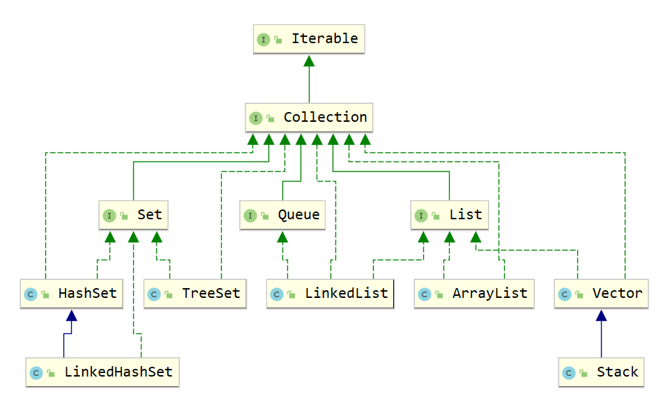
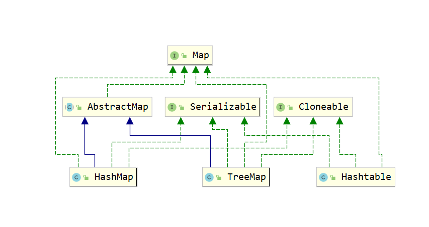

### 1、& 与 &&

&运算符有两种用法：(1)按位与；(2)逻辑与。

&&运算符是短路与运算。

逻辑与跟短路与的差别是非常巨大的，虽然二者都要求运算符左右两端的布尔值都是true整个表达式的值才是true。&&之所以称为短路运算是因为，如果&&左边的表达式的值是false，右边的表达式会被直接短路掉，不会进行运算。 

逻辑判断用 &&。


### 2、 基本数据类型 与 包装类

Java是一个近乎纯洁的面向对象编程语言，但是为了编程的方便还是引入了基本数据类型，但是为了能够将这些基本数据类型当成对象操作，Java为每一个基本数据类型都引入了对应的包装类型（wrapper class）。

从Java 5开始引入了自动装箱/拆箱机制，使得二者可以相互转换。

Java 为每个原始类型提供了包装类型：

​	- 原始类型: boolean，char，byte，short，int，long，float，double

​    - 包装类型：Boolean，Character，Byte，Short，Integer，Long，Float，Double


>   int 与 integer

```java
public class Demo {
    public static void main(String[] args) {
        int i = 128;
        Integer i2 = 128;
        Integer i3 = new Integer(128);
        /*
            在与基本数据类型做运算时，包装类会自动拆箱，
            底层调用 intValue()
        */
        System.out.println(i == i2); //true，
        System.out.println(i == i3); //true，
        /*
            底层会自动 valueOf(int i) 进行装箱,对于值在 -128 ~ 127 的对象预先进行了缓存，放在常量池中
            整型字面量的值在-128 到 127 之间，那么不会 new 新的 Integer 对象，而是直接引用常量池中的 Integer 对象，
            在此之外的值，自动装箱，会创建的Integer对象，都是不同的对象
         */
        Integer i4 = 127;
        Integer i5 = 127;
        System.out.println(i4 == i5);//true
        System.out.println(i4 == i5);//true
        /*
            对于Integer对象的 ++ 操作，
            会先调用intValue()获得int类型的值，
            在调用valueOf(int i)进行自动装箱
         */
        i4++;// 此时i4的对象已经改变
        Integer i6 = 128;
        Integer i7 = 128;
        System.out.println(i6 == i7);//false
        Integer i8 = new Integer(127);// 自己 new 出来的都是不同的对象
        System.out.println(i5 == i8); //false
    }
}
```


### 3、String 、StringBuffer、StringBuider

-   String 类是final类，底层通过char数组类保存字符串。

>   “对String对象的任何改变都不影响到原对象，相关的任何change操作都会生成新的对象”

-   StringBuilder可变数组，线程不安全。
-   StringBuffer可变数组，线程安全。


```java
public class Demo {
    public static void main(String[] args) {
        /*
            1、String str1 = "hello world";和 String str3 = "hello world"，
            都在编译期间生成了 字面常量和符号引用，运行期间字面常量"hello world"被存储在运行时常量池。
            new关键字来生成对象是在堆区进行，每一个new都会创建一个对象。
            2、intern()方法会在运行时常量池中查找是否存在内容相同的字符串，
            如果存在则返回指向该字符串的引用，如果不存在，则会将该字符串入池，并返回一个指向该字符串的引用
         */
        String str1 = "hello world";
        String str2 = new String("hello world");
        String str3 = "hello world";
        String str4 = str2.intern();
        System.out.println(str1==str2);// false
        System.out.println(str1==str3);// true
        System.out.println(str1==str4);// true

        /*
            1、String对象 += ，会
                1、调用StringBuilder的构造方法StringBuilder(str5)创建一个空StringBuilder对象
                2、再调用append(String str)方法拼接原本的 str5
                3、继续调用append(String str)方法拼接 "hello"（JVM会将 += 号右边多个字符串常量合并为一个，只做一次拼接）
                4、最后调用toString()方法将结果返回给 str5
            2、str5 = str5 + "hello"+"hello";一样

         */
        String str5 = "hello";
        for(int i=0;i<5;i++){
            str5 +=  "he"+"l"+"lo";
        }
        /*
            "hello"+2在编译期间就已经被优化成"hello2",
            str7会和str6一起指向常量池中的 "hello2"
        */
        String str6 = "hello2";
        String str7 = "hello" + 2;
        System.out.println(str6 == str7);// true
        /*
            不会被优化，会在堆中创建一个对象，str8指向堆中
        */
        String str8 = str7+2;
        System.out.println(str6 == str8);// false
        /*
            final的变量会在编译时替换成真实值
            即 String str10 = "hello" + 2;
        */
        final String str9 = "hello";
        String str10 = str9 + 2;
        System.out.println(str6 == str10);// true
        /*
            通过方法调佣赋值，只有在运行时才能确定值
        */
        final String str11 = getHello();
        String str12 = str11 + 2;
        System.out.println(str6 == str12);// false
    }
    public static String getHello(){
        return "hello";
    }
}
```


### 4、数组（Array）与列表（ArrayList）

Array和ArrayList的不同点：

-   Array可以包含基本类型和对象类型，ArrayList只能包含对象类型。
-   Array大小是固定的，ArrayList的大小是动态变化的（==ArrayList 默认大小为 10，按1.5倍扩容==）。
-   ArrayList提供了更多的方法和特性，比如：addAll()，removeAll()，iterator()等等。
-   对于基本类型数据，集合使用自动装箱来减少编码工作量。但是，当处理固定大小的基本数据类型的时候，这种方式相对比较慢。


### 5、值传递 和 引用传递

值传递是对基本型变量而言的,传递的是该变量的一个副本,改变副本不影响原变量.

引用传递一般是对于对象型变量而言的,传递的是该对象地址的一个副本, 并不是原对象本身 。 所以对引用对象进行操作会同时改变原对象.

一般认为,java内的传递都是值传递.


### 6、Lamda表达式的优缺点

优点：

1. 简洁。
2. 非常容易并行计算。
3. 可能代表未来的编程趋势。

缺点：

1. 若不用并行计算，很多时候计算速度没有比传统的 for 循环快。（并行计算有时需要预热才显示出效率优势）
2. 不容易调试。
3. 若其他程序员没有学过 lambda 表达式，代码不容易让其他语言的程序员看懂。


### 7、“==” 比较的是什么

“\=\=” 对比两个对象基于内存引用，如果两个对象的引用完全相同（指向同一个对象）时，“\=\=”操作将返回true，否则返回false。“\=\=”如果两边是基本类型，就是比较数值是否相等。


### 8、请你解释为什么重写equals还要重写hashcode？

HashMap中，如果要比较key是否相等，要同时使用这两个函数！因为自定义的类的hashcode()方法继承于Object类，其hashcode码为默认的内存地址，这样即便有相同含义的两个对象，比较也是不相等的。

HashMap中的比较key是这样的，先求出key的hashcode(),比较其值是否相等，若相等再比较equals(),若相等则认为他们是相等的。若equals()不相等则认为他们不相等。如果只重写hashcode()不重写equals()方法，当比较equals()时只是看他们是否为同一对象（即进行内存地址的比较）,所以必定要两个方法一起重写。HashMap用来判断key是否相等的方法，其实是调用了HashSet判断加入元素 是否相等。重载hashCode()是为了对同一个key，能得到相同的Hash Code，这样HashMap就可以定位到我们指定的key上。重载equals()是为了向HashMap表明当前对象和key上所保存的对象是相等的，这样我们才真正地获得了这个key所对应的这个键值对。


### 9、map的分类和常见情况

java为数据结构中的映射定义了一个接口java.util.Map;它有四个实现类,分别是**HashMap** 、**Hashtable、** **LinkedHashMap** 和**TreeMap**.

Map主要用于存储健值对，根据键得到值，因此不允许键重复(重复了覆盖了),但允许值重复。

Hashmap 是一个最常用的Map,它根据键的HashCode值存储数据,根据键可以直接获取它的值，具有很快的访问速度，遍历时，取得数据的顺序是完全随机的。 HashMap最多只允许一条记录的键为Null;允许多条记录的值为 Null;HashMap不支持线程的同步，即任一时刻可以有多个线程同时写HashMap;可能会导致数据的不一致。如果需要同步，可以用 Collections的synchronizedMap方法使HashMap具有同步的能力，或者使用**ConcurrentHashMap**。

Hashtable与 HashMap类似,它继承自Dictionary类，不同的是:它不允许记录的键或者值为空;它支持线程的同步，即任一时刻只有一个线程能写Hashtable,因此也导致了 Hashtable在写入时会比较慢。

LinkedHashMap 是HashMap的一个子类，保存了记录的插入顺序，在用Iterator遍历LinkedHashMap时，先得到的记录肯定是先插入的.也可以在构造时用带参数，按照应用次数排序。在遍历的时候会比HashMap慢，不过有种情况例外，当HashMap容量很大，实际数据较少时，遍历起来可能会比 LinkedHashMap慢，因为LinkedHashMap的遍历速度只和实际数据有关，和容量无关，而HashMap的遍历速度和他的容量有关。

TreeMap实现SortMap接口，能够把它保存的记录根据键排序,默认是按键值的升序排序，也可以指定排序的比较器，当用Iterator 遍历TreeMap时，得到的记录是排过序的。

一般情况下，我们用的最多的是HashMap,在Map 中插入、删除和定位元素，HashMap 是最好的选择。但如果您要按自然顺序或自定义顺序遍历键，那么TreeMap会更好。如果需要输出的顺序和输入的相同,那么用LinkedHashMap 可以实现,它还可以按读取顺序来排列.


### 10、final 关键字

当用final修饰一个类时，表明这个类不能被继承。也就是说，如果一个类你永远不会让他被继承，就可以用final进行修饰。final类中的成员变量可以根据需要设为final，但是要**注意final类中的所有成员方法都会被隐式地指定为final方法**。

“使用final方法的原因有两个。第一个原因是把方法锁定，以防任何继承类修改它的含义；第二个原因是效率。在早期的Java实现版本中，会将final方法转为内嵌调用。但是如果方法过于庞大，可能看不到内嵌调用带来的任何性能提升。在最近的Java版本中，不需要使用final方法进行这些优化了。“

对于一个final变量，如果是基本数据类型的变量，则其数值一旦在初始化之后便不能更改；如果是引用类型的变量，则在对其初始化之后便不能再让其指向另一个对象。


### 11、Synchronized 和 Lock

synchronized是Java的关键字，当它用来修饰一个方法或者一个代码块的时候，能够保证在同一时刻最多只有一个线程执行该段代码。JDK1.5以后引入了自旋锁、锁粗化、轻量级锁，偏向锁来有优化关键字的性能。

Lock是一个接口，而synchronized是Java中的关键字，synchronized是内置的语言实现；synchronized在发生异常时，会自动释放线程占有的锁，因此不会导致死锁现象发生；而Lock在发生异常时，如果没有主动通过unLock()去释放锁，则很可能造成死锁现象，因此使用Lock时需要在finally块中释放锁；Lock可以让等待锁的线程响应中断，而synchronized却不行，使用synchronized时，等待的线程会一直等待下去，不能够响应中断；通过Lock可以知道有没有成功获取锁，而synchronized却无法办到。


### 12、volatile

volatile保证可见性、有序性，不保证原子性

http://www.cnblogs.com/dolphin0520/p/3920373.html


### 13、请你介绍一下Syncronized锁，如果用这个关键字修饰一个静态方法，锁住了什么？如果修饰成员方法，锁住了什么？

synchronized修饰静态方法以及同步代码块的synchronized (类.class)用法锁的是类，线程想要执行对应同步代码，需要获得类锁。

synchronized修饰成员方法，线程获取的是当前调用该方法的对象实例的对象锁。


### 14、hashCode()和equals()

相同对象的hashCode()的值一定相同，不同对象hashCode()可能相同。

两个对象的HashCode相同，并不一定表示两个对象就相同，即equals()不一定为true，只能说明这两个对象在一个散列存储结构中。

如果两个对象是相等的，它们的 equals() 方法应该要返回 true，它们的 hashCode() 需要返回相同的结果。

https://www.cnblogs.com/tanshaoshenghao/p/10915055.html


### 15、方法重写(Overriding)和方法重载(Overloading)

重载（Overloading）

-   方法重载是让类以统一的方法处理不同类型数据的一种手段。多个同名函数同时存在，具有不同的参数个数（类型）。重载Override是**一个类中多态性**的一种表现。
-   java的方法重载，就是在类中可以创建多个方法，他们具有相同的名字，但具有不同参数和不同的定义。调用方法时通过传递给他们不同的参数个数和参数类型来决定具体使用那个方法，这就是多态性。
-   重载的时候，方法名要一样，但是参数类型和个数不一样，返回值类型可以相同也可以不同。**无法以返回类型来作为重载函数的区分标准。**

重写（Overriding）

-   父类与子类的多态性，对父类的函数进行重新定义。如果在子类中定义某方法与其父类有相同的名称和参数，我们说该方法被重写。在java中，子类可继承父类的方法，则不需要重新编写相同的方法。但有时子类并不想原封不动继承父类的方法，而是想做一定的修改，这就采用方法重写。方法重写又称方法**覆盖**。
-   若子类中的方法与父类的中的某一方法具有相同的方法名、返回类型和参数表，则新方法覆盖原有的方法。如需要父类的原有方法，可以使用super关键字，该关键字引用房钱类的父类。
-   子类函数访问权限大于父类。


### 16、"六原则一法则"

1、单一职责原则
一个类只做它该做的事情。（想表达的就是“高内聚”,高内聚就是一个代码块只完成一项功能，在面向对象中，如果只让一个类完成它该做的事，而不涉及与它无关的领域就是践行了高内聚的原则，这个类就只有单一职责。一个对象如果承担太多的职责，那么注定它什么都做不好。另一个是模块化，好的自行车是组装车，从减震叉、刹车到变速器，所有的部件都是可以拆卸和重新组装的,一个好的软件系统，它里面的每个功能模块也应该是可以轻易的拿到其他系统中使用的，这样才能实现软件复用的目标。)

2、开闭原则
软件实体应当对扩展开放，对修改关闭。（在理想的状态下，当我们需要为一个软件系统增加新功能时，只需要从原来的系统派生出一些新类就可以，不需要修改原来的任何一行代码。要做到开闭有两个要点：①抽象是关键，一个系统中如果没有抽象类或接口系统就没有扩展点；②封装可变性，将系统中的各种可变因素封装到一个继承结构中，如果多个可变因素混杂在一起，系统将变得复杂而换乱。）

3、依赖倒转原则
面向接口编程。（该原则说得直白和具体一些就是声明方法的参数类型、方法的返回类型、变量的引用类型时，尽可能使用抽象类型而不用具体类型，因为抽象类型可以被它的任何一个子类型所替代。)

4、里氏替换原则
任何时候都可以用子类型替换掉父类型。（简单的说就是能用父类型的地方就一定能使用子类型。里氏替换原则可以检查继承关系是否合理，**如果一个继承关系违背了里氏替换原则，那么这个继承关系一定是错误的，需要对代码进行重构。**例如让猫继承狗，或者狗继承猫，又或者让正方形继承长方形都是错误的继承关系，因为你很容易找到违反里氏替换原则的场景。需要注意的是：子类一定是增加父类的能力而不是减少父类的能力，因为子类比父类的能力更多，把能力多的对象当成能力少的对象来用当然没有任何问题。）

5、接口隔离原则
接口要小而专，绝不能大而全。（臃肿的接口是对接口的污染，既然接口表示能力，那么一个接口只应该描述一种能力，接口也应该是高度内聚的。例如，琴棋书画就应该分别设计为四个接口，而不应设计成一个接口中的四个方法，因为如果设计成一个接口中的四个方法，那么这个接口很难用，毕竟琴棋书画四样都精通的人还是少数，而如果设计成四个接口，会几项就实现几个接口，这样的话每个接口被复用的可能性是很高的。Java中的接口代表能力、代表约定、代表角色，能否正确的使用接口一定是编程水平高低的重要标识。）

6、合成聚合复用原则
优先使用聚合或合成关系复用代码。（通过继承来复用代码是面向对象程序设计中被滥用得最多的东西，因为所有的教科书都无一例外的对继承进行了鼓吹从而误导了初学者，类与类之间简单的说有三种关系，Is-A关系、Has-A关系、Use-A关系，分别代表继承、关联和依赖。其中，关联关系根据其关联的强度又可以进一步划分为关联、聚合和合成，但说白了都是Has-A关系，合成聚合复用原则想表达的是优先考虑Has-A关系而不是Is-A关系复用代码，记住：任何时候都不要继承工具类，工具是可以拥有并可以使用的，而不是拿来继承的。）

7、迪米特法则
迪米特法则又叫最少知识原则，一个对象应当对其他对象有尽可能少的了解。（迪米特法则简单的说就是如何做到"低耦合"，门面模式和调停者模式就是对迪米特法则的践行。对于门面模式可以举一个简单的例子，你去一家公司洽谈业务，你不需要了解这个公司内部是如何运作的，你甚至可以对这个公司一无所知，去的时候只需要找到公司入口处的前台美女，告诉她们你要做什么，她们会找到合适的人跟你接洽，前台的美女就是公司这个系统的门面。再复杂的系统都可以为用户提供一个简单的门面，Java Web开发中作为前端控制器的Servlet或Filter不就是一个门面吗，浏览器对服务器的运作方式一无所知，但是通过前端控制器就能够根据你的请求得到相应的服务。调停者模式也可以举一个简单的例子来说明，例如一台计算机，CPU、内存、硬盘、显卡、声卡各种设备需要相互配合才能很好的工作，但是如果这些东西都直接连接到一起，计算机的布线将异常复杂，在这种情况下，主板作为一个调停者的身份出现，它将各个设备连接在一起而不需要每个设备之间直接交换数据，这样就减小了系统的耦合度和复杂度。迪米特法则用通俗的话来将就是不要和陌生人打交道，如果真的需要，找一个自己的朋友，让他替你和陌生人打交道。）


### 17、Java类的五大成员

属性、方法、构造器、代码块、内部类（http://www.cnblogs.com/dolphin0520/p/3811445.html）。


### 18、抽象类和接口

http://www.cnblogs.com/dolphin0520/p/3811437.html

1.语法层面上的区别

　　1）抽象类可以提供成员方法的实现细节，而接口中只能存在public abstract 方法；

　　2）抽象类中的成员变量可以是各种类型的，而接口中的成员变量只能是public static final类型的；

　　3）接口中不能含有静态代码块以及静态方法，而抽象类可以有静态代码块和静态方法；

　　4）一个类只能继承一个抽象类，而一个类却可以实现多个接口。

2.设计层面上的区别

　　1）抽象类是对一种事物的抽象，即对类抽象，而接口是对行为的抽象。抽象类是对整个类整体进行抽象，包括属性、行为，但是接口却是对类局部（行为）进行抽象。举个简单的例子，飞机和鸟是不同类的事物，但是它们都有一个共性，就是都会飞。那么在设计的时候，可以将飞机设计为一个类Airplane，将鸟设计为一个类Bird，但是不能将 飞行 这个特性也设计为类，因此它只是一个行为特性，并不是对一类事物的抽象描述。此时可以将 飞行 设计为一个接口Fly，包含方法fly( )，然后Airplane和Bird分别根据自己的需要实现Fly这个接口。然后至于有不同种类的飞机，比如战斗机、民用飞机等直接继承Airplane即可，对于鸟也是类似的，不同种类的鸟直接继承Bird类即可。从这里可以看出，继承是一个 "是不是"的关系，而 接口 实现则是 "有没有"的关系。如果一个类继承了某个抽象类，则子类必定是抽象类的种类，而接口实现则是有没有、具备不具备的关系，比如鸟是否能飞（或者是否具备飞行这个特点），能飞行则可以实现这个接口，不能飞行就不实现这个接口。

　　2）设计层面不同，抽象类作为很多子类的父类，它是一种模板式设计。而接口是一种行为规范，它是一种辐射式设计。什么是模板式设计？最简单例子，大家都用过ppt里面的模板，如果用模板A设计了ppt B和ppt C，ppt B和ppt C公共的部分就是模板A了，如果它们的公共部分需要改动，则只需要改动模板A就可以了，不需要重新对ppt B和ppt C进行改动。而辐射式设计，比如某个电梯都装了某种报警器，一旦要更新报警器，就必须全部更新。也就是说对于抽象类，如果需要添加新的方法，可以直接在抽象类中添加具体的实现，子类可以不进行变更；而对于接口则不行，如果接口进行了变更，则所有实现这个接口的类都必须进行相应的改动。


### 19、final、finally和finalize

>   final

-   修饰类

当用final修饰类的时，表明该类不能被其他类所继承。当我们需要让一个类永远不被继承，此时就可以用final修饰，但要注意：final类中所有的成员方法都会隐式的定义为final方法。

-   修饰方法

使用final方法的原因主要有两个：

　　(1) 把方法锁定，以防止继承类对其进行更改。

　　(2) 效率，在早期的java版本中，会将final方法转为内嵌调用。但若方法过于庞大，可能在性能上不会有多大提升。因此在最近版本中，不需要final方法进行这些优化了。

-   修饰变量

final成员变量表示常量，只能被赋值一次，赋值后其值不再改变。

当final修饰一个基本数据类型时，表示该基本数据类型的值一旦在初始化后便不能发生变化；如果final修饰一个引用类型时，则在对其初始化之后便不能再让其指向其他对象了，但该引用所指向的对象的内容是可以发生变化的

final修饰一个成员变量（属性），必须要显示初始化。这里有两种初始化方式，一种是在变量声明的时候初始化；第二种方法是在声明变量的时候不赋初值，但是要在这个变量所在的类的所有的构造函数中对这个变量赋初值。

>   finally

finally作为异常处理的一部分，它只能用在try/catch语句中，并且附带一个语句块，表示这段语句最终**一定会被执行**（不管有没有抛出异常），经常被用在需要释放资源的情况下。

*当finally的try/catch块没有被执行时，finally块的代码不会被执行。

*在执行finally块之前，程序直接终止运行，finally块的代码不会被执行。

***finally会屏蔽try/catch块中的return语句**

>   finalize

finalize()是在java.lang.Object里定义的，也就是说每一个对象都有这么个方法。这个方法在gc启动，该对象被回收的时候被调用。其实gc可以回收大部分的对象（凡是new出来的对象，gc都能搞定，一般情况下我们又不会用new以外的方式去创建对象），所以一般是不需要程序员去实现finalize的。 
特殊情况下，需要程序员实现finalize，当对象被回收的时候释放一些资源，比如：一个socket链接，在对象初始化时创建，整个生命周期内有效，那么就需要实现finalize，关闭这个链接。 

使用finalize还需要注意一个事，调用super.finalize();

一个对象的finalize()方法只会被调用一次，而且finalize()被调用不意味着gc会立即回收该对象，所以有可能调用finalize()后，该对象又不需要被回收了，然后到了真正要被回收的时候，因为前面调用过一次，所以不会调用finalize()，产生问题。 所以，推荐不要使用finalize()方法，它跟析构函数不一样。


### 20、类加载器

https://blog.csdn.net/m0_38075425/article/details/81627349

类加载器负责加载所有的类，其为所有被载入内存中的类生成一个java.lang.Class实例对象。一旦一个类被加载如JVM中，同一个类就不会被再次载入了。正如一个对象有一个唯一的标识一样，一个载入JVM的类也有一个唯一的标识。在Java中，一个类用其全限定类名（包括包名和类名）作为标识；但在JVM中，一个类用其全限定类名和其类加载器作为其唯一标识。

JVM预定义有三种类加载器，当一个 JVM启动的时候，Java开始使用如下三种类加载器：

1、 根类加载器（bootstrap class loader）：它用来加载 Java 的核心类，是用原生代码来实现的，并不继承自 java.lang.ClassLoader（负责加载$JAVA_HOME中jre/lib/rt.jar里所有的class，由C++实现，不是ClassLoader子类）。由于引导类加载器涉及到虚拟机本地实现细节，开发者无法直接获取到启动类加载器的引用，所以不允许直接通过引用进行操作。

2、扩展类加载器（extensions class loader）：负责加载JRE的扩展目录，lib/ext或者由java.ext.dirs系统属性指定的目录中的JAR包的类。由Java语言实现，父类加载器为null。

3、系统类加载器（system class loader）：被称为系统（也称为应用）类加载器，它负责在JVM启动时加载来自Java命令的-classpath选项、java.class.path系统属性，或者CLASSPATH换将变量所指定的JAR包和类路径。程序可以通过ClassLoader的静态方法getSystemClassLoader()来获取系统类加载器。如果没有特别指定，则用户自定义的类加载器都以此类加载器作为父加载器。由Java语言实现，父类加载器为ExtClassLoader。


### 21、类的加载

>   加载时机

-   隐式加载 new 创建类的实例,
-   显式加载：loaderClass,forName等
-   访问类的静态变量，或者为静态变量赋值
-   调用类的静态方法
-   使用反射方式创建某个类或者接口对象的Class对象。
-   初始化某个类的子类
-   直接使用`java.exe`命令来运行某个主类

>   加载过程

编写的java文件都是保存着业务逻辑代码。java编译器（javac）将 .java 文件编译成扩展名为 .class 的文件。.class 文件中保存着java转换后，虚拟机将要执行的指令。当需要某个类的时候，java虚拟机（java）会加载 .class 文件，并创建对应的class对象，将class文件加载到虚拟机的内存，这个过程被称为类的加载。

1、加载
类加载过程的一个阶段，ClassLoader通过一个类的完全限定名查找此类字节码文件，并利用字节码文件创建一个class对象。

2、验证
目的在于确保class文件的字节流中包含信息符合当前虚拟机要求，不会危害虚拟机自身的安全，主要包括四种验证：文件格式的验证，元数据的验证，字节码验证，符号引用验证。

3、准备
为类变量（static修饰的字段变量）分配内存并且设置该类变量的初始值，（如static int i = 5 这里只是将 i 赋值为0，在初始化的阶段再把 i 赋值为5)，这里不包含final修饰的static ，因为final在编译的时候就已经分配了。这里不会为实例变量分配初始化，类变量会分配在方法区中，实例变量会随着对象分配到Java堆中。

4、解析
这里主要的任务是把常量池中的符号引用替换成直接引用

5、初始化
这里是类记载的最后阶段，如果该类具有父类就进行对父类进行初始化，执行其静态初始化器（静态代码块）和静态初始化成员变量。（前面已经对static 初始化了默认值，这里我们对它进行赋值，成员变量也将被初始化）

>   类的加载机制

1、全盘负责：所谓全盘负责，就是当一个类加载器负责加载某个Class时，该Class所依赖和引用其他Class也将由该类加载器负责载入，除非显示使用另外一个类加载器来载入。

2、**双亲委派**：所谓的双亲委派，则是先让父类加载器试图加载该Class，只有在父类加载器无法加载该类时才尝试从自己的类路径中加载该类。通俗的讲，就是某个特定的类加载器在接到加载类的请求时，首先将加载任务委托给父加载器，依次递归，如果父加载器可以完成类加载任务，就成功返回；只有父加载器无法完成此加载任务时，才自己去加载。https://blog.csdn.net/codeyanbao/article/details/82875064

3、缓存机制。缓存机制将会保证所有加载过的Class都会被缓存，当程序中需要使用某个Class时，类加载器先从缓存区中搜寻该Class，只有当缓存区中不存在该Class对象时，系统才会读取该类对应的二进制数据，并将其转换成Class对象，存入缓冲区中。这就是为很么修改了Class后，必须重新启动JVM，程序所做的修改才会生效的原因。


### 22、Object类的方法

1.  protected Object clone()： 创建并返回此对象的一个副本。 
2.  boolean equals(Object obj)： 指示某个其他对象是否与此对象“相等”。 
3.  protected void finalize() ：当垃圾回收器确定不存在对该对象的更多引用时，由对象的垃圾回收器调用此方法。 
4.  Class<? extendsObject> getClass() ：返回一个对象的运行时类。 
5.  int hashCode() ：返回该对象的哈希码值。 
6.  void notify()： 唤醒在此对象监视器上等待的单个线程。 
7.  void notifyAll() ：唤醒在此对象监视器上等待的所有线程。 
8.  String toString() ：返回该对象的字符串表示。 
9.  void wait() ：导致当前的线程等待，直到其他线程调用此对象的 notify() 方法或 notifyAll() 方法。 
10.  void wait(long timeout)： 导致当前的线程等待，直到其他线程调用此对象的 notify() 方法或 notifyAll() 方法，或者超过指定的时间量。 
11.  void wait(long timeout, int nanos)： 导致当前的线程等待，直到其他线程调用此对象的 notify()






### 23、List、Set、Map

>   List

-   可以允许重复的对象
-   可以插入多个null值
-   有序容器，保证插入与取出有一样的顺序

常用的实现类有ArrayList、LinkedList、Vector。

```java
public class Demo{
    public static void main(String[] args) {
        /*
            1、底层是数组
            2、默认无参创建的是一个空数组，可以通过有参构造器指定初始化大小
            3、需要扩容时按原大小1.5倍进行扩容
                int newCapacity = oldCapacity + (oldCapacity >> 1);
         */
        List<Integer> arrayList = new ArrayList<>(10);
        for (int i = 0; i < 16; i++) {
            arrayList.add(i);
        }
        arrayList.forEach(System.out::println);
        /*
            1、底层是链表，每个元素都放在 Node<E> 中
         */
        List<Integer> linkedList = new LinkedList<>();
        for (int i = 0; i < 16; i++) {
            linkedList.add(i);
        }
        /*
            1、底层是数组
            2、Vector是线程安全的
         */
        Vector<Integer> vector = new Vector<>();
    }
}
```

>   Set

-   不允许重复对象
-   无序容器
-   只允许一个null值

常用的实现类有HashSet、LinkedHashSet、TreeSet

```java
public class Demo{
    public static void main(String[] args) {
        /*
            1、HashSet 底层是 HashMap
            2、TreeSet 底层是 TreeMap
                存储的值作为 Map 的 key，
                value 统一为一个 Object() 对象
                    private static final Object PRESENT = new Object();
         */
        Set<Integer> hashSet = new HashSet<>();
        Set<Integer> treeSet = new TreeSet<>();
        Set<Integer> linkedHashSet = new LinkedHashSet<>();
    }
}
```


>   Map

https://www.cnblogs.com/chengxiao/p/6059914.html

https://blog.csdn.net/qq_40574571/article/details/97612100

-   Map 的 每个 Entry 都持有两个对象，也就是一个键一个值，Map 可能会持有相同的value对象但key对象必须是唯一的。
-   只允许有一个null值作为Key

常用的实现类有HashMap、LinkedHashMap、HashTable、TreeMap

```java
public class Demo{
    public static void main(String[] args) {
        /*
            1、默认的初始大小为 16，负载因子为 0.75，阈值为 16*0.75=12
            2、默认初始容量必须是 2 的幂。容量扩展 * 2,（newCap = oldCap << 1）
            3、如果一个链表的长度大于 8 && 数组长度大于 64，将该链表树化
         */
        Map<Person, Integer> hashMap = new HashMap<>();
        for (int i = 0; i < 20; i++) {
            hashMap.put(new Person(),i);
        }
    }
}
class Person{
    int age = 1;

    @Override
    public int hashCode() {
        return age;
    }
}
```

自写

```java
public interface MyMap<K,V> {
    int size();
    V put(K k,V v);
    V get(K k);
    int hashCode();
    interface Entry<K,V>{
        K getKey();
        V getValue();
    }
}

public class MyHashMap<K,V> implements MyMap<K,V>{
    int size;
    int len = 16;
    Node<K,V>[] table;
    public MyHashMap(){
        table = new Node[len];
    }
    @Override
    public int size() {
        return size;
    }

    @Override
    public V put(K k, V v) {
        // 求 k 的 hash
        int hash = hash(k);
        Node<K,V> p;
        // hash 对应的下标索引
        int i = hash & (len-1);
        // 该索引处是否为空，为空直接创建一个new的节点存放
        if((p = table[i]) == null){
            table[i] = new Node<>(hash, k, v, null);
        } else {
            Node<K,V> e;
            // 如果不为空，判断 k 与该链表的表头的 key 是否相同（hash相等 && （key是同一对象 || key的内容相同））
            if( (p.hash == hash) &&
                    (p.key == k) || (k != null && k.equals(p.key))){
                // 无作用？
                e = p;
            } else {
                // 表头不相等，开始遍历整个链表
                while(true){
                    // p 已经是最后一个 node，在上一轮循环中已做过比较，
                    // 说明整条链表中的 key 不重复， new 一个 node 放在链表最后
                    // 此时 e == null
                    if((e = p.next) == null){
                        p.next = new Node<>(hash, k, v, null);
                        break;
                    }
                    if(e.hash == hash &&
                            (e.key == k) || (k != null && k.equals(e.key))){
                        // 找到相同的，跳出循环，此时 e != null
                        break;
                    }
                    p = e;
                }
            }
            // 在前面的循环中
            // e != null 说明有重复的 key
            // 将value覆盖，并返回 oldValue
            if(e != null){
                V oldValue = e.value;
                e.value = v;
                return oldValue;
            }
        }
        size++;
        return null;
    }


    @Override
    public V get(K k) {
        int hash = hash(k);
        int index = hash & (len-1);
        Node<K,V> p;
        if( (p = table[index]) == null){
            return null;
        } else {
            Node<K,V> e;
            if( (p.hash == hash) &&
                    (p.key == k) || (k != null && k.equals(p.key))){
                return p.value;
            } else {
                while((e=p.next) != null){
                    if(e.hash == hash &&
                            (e.key == k) || (k != null && k.equals(e.key))){
                        return e.value;
                    }
                    p = e;
                }
            }
        }
        return null;
    }

    public int hash(K key){
        return key == null ? 0 : key.hashCode();
    }

    static class Node<K,V> implements MyMap.Entry<K,V>{
        int hash;
        K key;
        V value;
        Node<K,V> next;

        public Node(int hash, K key, V value, Node<K,V> node){
            this.hash = hash;
            this.key = key;
            this.value = value;
            this.next = node;
        }

        @Override
        public K getKey() {
            return key;
        }

        @Override
        public V getValue() {
            return value;
        }
    }
}
```


### 24、快速失败(fail-fast)和安全失败(fail-safe)

https://www.cnblogs.com/williamjie/p/11158588.html

一：快速失败（fail—fast）

​     在用迭代器遍历一个集合对象时，如果遍历过程中对集合对象的内容进行了修改（增加、删除、修改），则会抛出Concurrent Modification Exception。

​     原理：迭代器在遍历时直接访问集合中的内容，并且在遍历过程中使用一个 modCount 变量。集合在被遍历期间如果内容发生变化，就会改变modCount的值。每当迭代器使用hashNext()/next()遍历下一个元素之前，都会检测modCount变量是否为expectedmodCount值，是的话就返回遍历；否则抛出异常，终止遍历。

   注意：这里异常的抛出条件是检测到 modCount！=expectedmodCount 这个条件。如果集合发生变化时修改modCount值刚好又设置为了expectedmodCount值，则异常不会抛出。因此，不能依赖于这个异常是否抛出而进行并发操作的编程，这个异常只建议用于检测并发修改的bug。

   场景：java.util包下的集合类都是快速失败的，不能在多线程下发生并发修改（迭代过程中被修改）。

二：安全失败（fail—safe）

   采用安全失败机制的集合容器，在遍历时不是直接在集合内容上访问的，而是先复制原有集合内容，在拷贝的集合上进行遍历。

   原理：由于迭代时是对原集合的拷贝进行遍历，所以在遍历过程中对原集合所作的修改并不能被迭代器检测到，所以不会触发Concurrent Modification Exception。

   缺点：基于拷贝内容的优点是避免了Concurrent Modification Exception，但同样地，迭代器并不能访问到修改后的内容，即：迭代器遍历的是开始遍历那一刻拿到的集合拷贝，在遍历期间原集合发生的修改迭代器是不知道的。

​     场景：java.util.concurrent包下的容器都是安全失败，可以在多线程下并发使用，并发修改。


### 25、Iterator和ListIterator

我们在使用List,Set的时候，为了实现对其数据的遍历，我们经常使用到了Iterator(迭代器)。使用迭代器，你不需要干涉其遍历的过程，只需要每次取出一个你想要的数据进行处理就可以了。

但是在使用的时候也是有不同的。List和Set都有iterator()来取得其迭代器。对List来说，你也可以通过listIterator()取得其迭代器，两种迭代器在有些时候是不能通用的，Iterator和ListIterator主要区别在以下方面：

1.  ListIterator有add()方法，可以向List中添加对象，而Iterator不能

2.  ListIterator和Iterator都有hasNext()和next()方法，可以实现顺序向后遍历，但是ListIterator有hasPrevious()和previous()方法，可以实现逆向（顺序向前）遍历。Iterator就不可以。

3.  ListIterator可以定位当前的索引位置，nextIndex()和previousIndex()可以实现。Iterator没有此功能。

4.  都可实现删除对象，但是ListIterator可以实现对象的修改，set()方法可以实现。Iierator仅能遍历，不能修改。

因为ListIterator的这些功能，可以实现对LinkedList等List数据结构的操作。其实，数组对象也可以用迭代器来实现。


### 26、进程 和 线程

https://blog.csdn.net/yaosiming2011/article/details/44280797

https://www.cnblogs.com/qianqiannian/p/7010909.html

进程：是具有一定独立功能的程序关于某个数据集合上的一次运行活动,进程是系统进行资源分配和调度的一个独立单位.

线程：是进程的一个实体,是CPU调度和分派的基本单位,它是比进程更小的能独立运行的基本单位.线程自己基本上不拥有系统资源,只拥有一点在运行中必不可少的资源(如程序计数器,一组寄存器和栈),但是它可与同属一个进程的其他的线程共享进程所拥有的全部资源.

区别：

1.  线程是程序执行的最小单位，而进程是操作系统分配资源的最小单位

2.  一个进程由一个或多个线程组成，线程是一个进程中代码的不同执行路线

3.  进程之间相互独立，但同一进程下的各个线程之间共享程序的内存空间(包括代码段，数据集，堆等)及一些进程级的资源(如打开文件和信号等)，某进程内的线程在其他进程不可见；

4.  调度和切换：线程上下文切换比进程上下文切换要快得多


### 27、并发 和 并行

并发，指的是多个事情，在同一时间段内同时发生了。

并行，指的是多个事情，在同一时间点上同时发生了。

并发的多个任务之间是互相抢占资源

并行的多个任务之间是不互相抢占资源


### 28、线程的状态

https://blog.csdn.net/weixin_42092787/article/details/108048850

NEW、RUNNABLE、BLOCKED、WAITING、TIME_WAITING、TERMINATED;