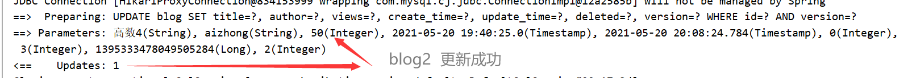

**mybatis-plus官网https://mp.baomidou.com/guide/**

#####  简介

[MyBatis-Plus (opens new window)](https://github.com/baomidou/mybatis-plus)（简称 MP）是一个 [MyBatis (opens new window)](http://www.mybatis.org/mybatis-3/)的增强工具，在 MyBatis 的基础上只做增强不做改变，为简化开发、提高效率而生。

##### 特性

-   **无侵入**：只做增强不做改变，引入它不会对现有工程产生影响，如丝般顺滑
-   **损耗小**：启动即会自动注入基本 CURD，性能基本无损耗，直接面向对象操作
-   **强大的 CRUD 操作**：内置通用 Mapper、通用 Service，仅仅通过少量配置即可实现单表大部分 CRUD 操作，更有强大的条件构造器，满足各类使用需求
-   **支持 Lambda 形式调用**：通过 Lambda 表达式，方便的编写各类查询条件，无需再担心字段写错
-   **支持主键自动生成**：支持多达 4 种主键策略（内含分布式唯一 ID 生成器 - Sequence），可自由配置，完美解决主键问题
-   **支持 ActiveRecord 模式**：支持 ActiveRecord 形式调用，实体类只需继承 Model 类即可进行强大的 CRUD 操作
-   **支持自定义全局通用操作**：支持全局通用方法注入（ Write once, use anywhere ）
-   **内置代码生成器**：采用代码或者 Maven 插件可快速生成 Mapper 、 Model 、 Service 、 Controller 层代码，支持模板引擎，更有超多自定义配置等您来使用
-   **内置分页插件**：基于 MyBatis 物理分页，开发者无需关心具体操作，配置好插件之后，写分页等同于普通 List 查询
-   **分页插件支持多种数据库**：支持 MySQL、MariaDB、Oracle、DB2、H2、HSQL、SQLite、Postgre、SQLServer 等多种数据库
-   **内置性能分析插件**：可输出 Sql 语句以及其执行时间，建议开发测试时启用该功能，能快速揪出慢查询
-   **内置全局拦截插件**：提供全表 delete 、 update 操作智能分析阻断，也可自定义拦截规则，预防误操作


# 0、准备

## 1、导入依赖

```xml
<dependency>
    <groupId>mysql</groupId>
    <artifactId>mysql-connector-java</artifactId>
</dependency>
<dependency>
    <groupId>com.baomidou</groupId>
    <artifactId>mybatis-plus-boot-starter</artifactId>
    <version>3.4.1</version>
</dependency>
```

## 2、连接数据库

```yaml
spring:
  datasource:
    url: jdbc:mysql://localhost:3306/mybatis?useSSL=false&useUnicode=true&characterEncoding=utf8
    username: root
    password: root
    driver-class-name: com.mysql.cj.jdbc.Driver  
```

## 3、使用

mapper层接口继承BaseMapper<>

```java
@Mapper
public interface BlogMapper extends BaseMapper<Blog> {
}

@Test
void contextLoads() {
    List<Blog> blogs = blogMapper.selectList(null);
    blogs.forEach(System.out::println);
}
```

BaseMapper中封装了基本很多方法，可以直接使用，简单SQL语句无需自己写

# 1、注解


## 1.1、@TableId

-   描述：主键注解

测试，未设置主键的值

```java
private Long id;

void insert01(){
    Blog blog = new Blog();
    blog.setTitle("高数3");
    blog.setAuthor("aizhong");
    blog.setViews(99);
    int insert = blogMapper.insert(blog);
    System.out.println(insert);
}
```

插入时默认使用IdType.NONE,结果


设置主键自增策略为IdType.AUTO

```java
@TableId(type = IdType.AUTO)
private Long id;

public enum IdType {
    AUTO(0), // 数据库ID自增
    NONE(1), // 无状态,该类型为未设置主键类型(注解里等于跟随全局,全局里约等于 INPUT)
    INPUT(2), // insert前自行set主键值
    ASSIGN_ID(3), // 分配ID(主键类型为Number(Long和Integer)或String)(since 3.3.0),使用接口IdentifierGenerator的方法nextId(默认实现类为DefaultIdentifierGenerator雪花算法)
    ASSIGN_UUID(4), // 分配UUID,主键类型为String(since 3.3.0),使用接口IdentifierGenerator的方法nextUUID(默认default方法)
    
    // 过时
    /** @deprecated */
    @Deprecated
    ID_WORKER(3),
    /** @deprecated */
    @Deprecated
    ID_WORKER_STR(3),
    /** @deprecated */
    @Deprecated
    UUID(4);

    private final int key;

    private IdType(int key) {
        this.key = key;
    }

    public int getKey() {
        return this.key;
    }
}
```

结果为


## 1.2、@TableField

-   描述：字段注解(非主键)

**0、数据库字段无需添加默认值、更新操作**

1、在实体类字段属性上添加注解

```java
@TableField(fill = FieldFill.INSERT)
private Date createTime;
@TableField(fill = FieldFill.INSERT_UPDATE)
private Date updateTime;

// 字段自动填充策略
public enum FieldFill {
    DEFAULT, // 默认不处理
    INSERT, // 插入时填充字段
    UPDATE, // 更新时填充字段
    INSERT_UPDATE; // 插入和更新时填充字段

    private FieldFill() {
    }
}
```

2、编写处理器来处理这个注解

```java
@Component
public class MyMetaObjectHandler implements MetaObjectHandler {
    @Override
    public void insertFill(MetaObject metaObject) {
        log.info("start insert fill.....");
        this.setFieldValByName("createTime",new Date(),metaObject);
        this.setFieldValByName("updateTime",new Date(),metaObject);
    }

    @Override
    public void updateFill(MetaObject metaObject) {
        log.info("start update fill.....");
        this.setFieldValByName("updateTime",new Date(),metaObject);
    }
}
```

3、测试结果


## 1.3、@version

-   描述：乐观锁注解、标记 `@Verison` 在字段上

**乐观锁**

>乐观锁 : 故名思意十分乐观，它总是认为不会出现问题，无论干什么不去上锁！如果出现了问题，
>
>再次更新值测试
>
>悲观锁：故名思意十分悲观，它总是认为总是出现问题，无论干什么都会上锁！再去操作！

乐观锁实现方式：

-   取出记录时，获取当前version
-   更新时，带上这个version
-   执行更新时， set version = newVersion where version = oldVersion
-   如果version不对，就更新失败


1、给实体类属性添加注解

```java
@Version
private int version;
```

**2、注册组件**

```java
@EnableTransactionManagement
@Configuration
public class MyBatisPlusConfig {

    @Bean
    public MybatisPlusInterceptor mybatisPlusInterceptor() {
        MybatisPlusInterceptor mybatisPlusInterceptor = new MybatisPlusInterceptor();
        mybatisPlusInterceptor.addInnerInterceptor(new OptimisticLockerInnerInterceptor());
        return mybatisPlusInterceptor;
    }
}
```

3、测试（成功）


4、测试（失败）

```java
@Test
void updateTest02(){
    Blog blog1 = blogMapper.selectById(1395333478049505284L);
    blog1.setViews(10);


    Blog blog2 = blogMapper.selectById(1395333478049505284L);
    blog2.setViews(50);
    blogMapper.updateById(blog2);

    blogMapper.updateById(blog1);
}
```




## 1.4、@TableLogic

-   描述：表字段逻辑处理注解（逻辑删除）

1、给实体类属性添加注解

```java
@TableLogic
private Integer deleted;
```

2、配置配置文件

```yaml
mybatis-plus:
  global-config:
    db-config:
      logic-delete-value: 1 # 逻辑已删除值(默认为 1)
      logic-not-delete-value: 0 # 逻辑未删除值(默认为 0)
      #logic-delete-field: flag  # 全局逻辑删除的实体字段名(since 3.3.0,配置后可以忽略不用在属性上加注解 @TableLogic )
```

3、测试，实际执行的是update语句


**注意，添加@TableLogic以后，查询是会自动带上 deleted=0 （未被删除）**


# 2、插件

## 2.1、分页

1、配置拦截器组件

```java
// 分页插件
@Bean public PaginationInterceptor paginationInterceptor() {
    return new PaginationInterceptor();
}
```

2、直接使用Page对象即可！

```java
// 分页
@Test
void selectTest01(){
    Page<Blog> page = new Page<>(2, 5);
    IPage<Blog> blogIPage = blogMapper.selectPage(page, null);
    blogIPage.getRecords().forEach(System.out::println);
}
```

3、结果


# 3、CRUD

## 3.1、ById

## 3.2、BatchIds

```java
@Test
void selectTest02(){
    List<Blog> blogs = blogMapper.selectBatchIds(Arrays.asList(1, 2, 3));
    blogs.forEach(System.out::println);
}
```


## 3.3、ByMap

自动的动态拼接SQL

```java
@Test
void selectTest03(){
    HashMap<String,Object> map = new HashMap<>();
    map.put("id",1);
    map.put("title","Mybatis2");
    List<Blog> blogs = blogMapper.selectByMap(map);
    blogs.forEach(System.out::println);
}
```


## 3.4、Wrapper

条件构造器，十分重要

