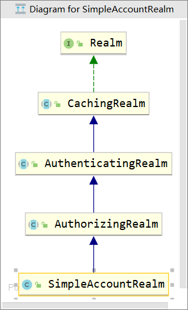
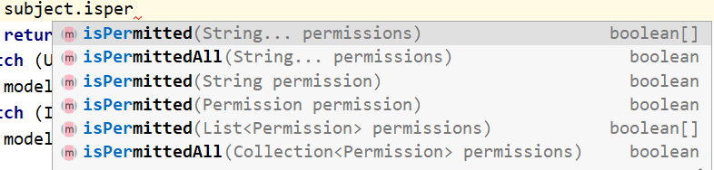
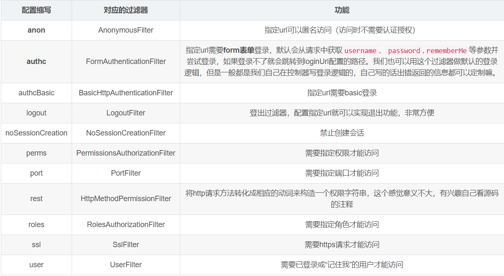

# 0、shiro

Apache Shiro™ is a powerful and easy-to-use Java security framework that performs authentication, authorization, cryptography, and session management. With Shiro’s easy-to-understand API, you can quickly and easily secure any application – from the smallest mobile applications to the largest web and enterprise applications.

Shiro 是一个功能强大且易于使用的Java安全框架，它执行身份验证、授权、加密和会话管理。使用Shiro易于理解的API，您可以快速轻松地保护任何应用程序—从最小的移动应用程序到最大的web和企业应用程序。
# 1、核心架构

## 1.1、外部架构


应用代码直接交互的对象是 Subject，也就是说 Shiro 的对外 API 核心就是 Subject；其每个 API 的含义：

**Subject**：主体，代表了当前 “用户”，这个用户不一定是一个具体的人，与当前应用交互的任何东西都是 Subject，如网络爬虫，机器人等；即一个抽象概念；所有 Subject 都绑定到 SecurityManager，与 Subject 的所有交互都会委托给 SecurityManager；可以把 Subject 认为是一个门面；SecurityManager 才是实际的执行者；

**SecurityManager**：安全管理器；即所有与安全有关的操作都会与 SecurityManager 交互；且它管理着所有 Subject；可以看出它是 Shiro 的核心，它负责与后边介绍的其他组件进行交互，如果学习过 SpringMVC，你可以把它看成 DispatcherServlet 前端控制器；

**Realm**：域，Shiro 从从 Realm 获取安全数据（如用户、角色、权限），就是说 SecurityManager 要验证用户身份，那么它需要从 Realm 获取相应的用户进行比较以确定用户身份是否合法；也需要从 Realm 得到用户相应的角色 / 权限进行验证用户是否能进行操作；可以把 Realm 看成 DataSource，即安全数据源。

## 1.2、内部架构


-   **Subject**：主体，可以看到主体可以是任何可以与应用交互的 “用户”；
-   **SecurityManager**：相当于 SpringMVC 中的 DispatcherServlet 或者 Struts2 中的 FilterDispatcher；是 Shiro 的心脏；所有具体的交互都通过 SecurityManager 进行控制；它管理着所有 Subject、且负责进行认证和授权、及会话、缓存的管理。
-   **Authenticator**：认证器，负责主体认证的，这是一个扩展点，如果用户觉得 Shiro 默认的不好，可以自定义实现；其需要认证策略（Authentication Strategy），即什么情况下算用户认证通过了；
-   **Authrizer**：授权器，或者访问控制器，用来决定主体是否有权限进行相应的操作；即控制着用户能访问应用中的哪些功能；
-   **Realm**：可以有 1 个或多个 Realm，可以认为是安全实体数据源，即用于获取安全实体的；可以是 JDBC 实现，也可以是 LDAP 实现，或者内存实现等等；由用户提供；注意：Shiro 不知道你的用户 / 权限存储在哪及以何种格式存储；所以我们一般在应用中都需要实现自己的 Realm；
-   **SessionManager**：如果写过 Servlet 就应该知道 Session 的概念，Session 呢需要有人去管理它的生命周期，这个组件就是 SessionManager；而 Shiro 并不仅仅可以用在 Web 环境，也可以用在如普通的 JavaSE 环境、EJB 等环境；所以呢，Shiro 就抽象了一个自己的 Session 来管理主体与应用之间交互的数据；这样的话，比如我们在 Web 环境用，刚开始是一台 Web 服务器；接着又上了台 EJB 服务器；这时想把两台服务器的会话数据放到一个地方，这个时候就可以实现自己的分布式会话（如把数据放到 Memcached 服务器）；
-   **SessionDAO**：DAO 大家都用过，数据访问对象，用于会话的 CRUD，比如我们想把 Session 保存到数据库，那么可以实现自己的 SessionDAO，通过如 JDBC 写到数据库；比如想把 Session 放到 Memcached 中，可以实现自己的 Memcached SessionDAO；另外 SessionDAO 中可以使用 Cache 进行缓存，以提高性能；
-   **CacheManager**：缓存控制器，来管理如用户、角色、权限等的缓存的；因为这些数据基本上很少去改变，放到缓存中后可以提高访问的性能
-   **Cryptography**：密码模块，Shiro 提供了一些常见的加密组件用于如密码加密 / 解密的。


# 2、认证

身份认证，就是判断一个用户是否为合法用户的处理过程。最常用的简单身份认证方式是系统通过核对用户输入的用户名和密码，看其是否与系统中存储的该用户的用户名和密码一致，来判断用户身份是否正确。

## 2.1、认证过程中的关键对象

-   Subject：主体
    访问系统的用户，主体可以是用户、程序等，进行认证的都称为主体；

-   Principal：身份信息
    是主体（subject）进行身份认证的标识，标识必须具有唯一性，如用户名、手机号、邮箱地址等，一个主体可以有多个身份，但是必须有一个主身份（Primary Principal）。

-   credential：凭证信息
    是只有主体自己知道的安全信息，如密码、证书等。

## 2.2、认证流程


## 2.3、认证测试

通过分析源码可得：

认证：

1.最终执行用户名比较是 在SimpleAccountRealm类 的 doGetAuthenticationInfo 方法中完成用户名校验

2.最终密码校验是在 AuthenticatingRealm类 的 assertCredentialsMatch方法 中

总结：

AuthenticatingRealm 认证realm doGetAuthenticationInf

AuthorizingRealm 授权realm doGetAuthorizationInf
## 2.4、自定义Realm

自定义Realm的作用：放弃使用.ini文件，使用数据库查询



`SimpleAccountRealm的部分源码中有两个方法一个是 认证 一个是 授权`,

```java
public class SimpleAccountRealm extends AuthorizingRealm {
    protected AuthenticationInfo doGetAuthenticationInfo(AuthenticationToken token) throws AuthenticationException {
        UsernamePasswordToken upToken = (UsernamePasswordToken) token;
        SimpleAccount account = getUser(upToken.getUsername());

        if (account != null) {

            if (account.isLocked()) {
                throw new LockedAccountException("Account [" + account + "] is locked.");
            }
            if (account.isCredentialsExpired()) {
                String msg = "The credentials for account [" + account + "] are expired";
                throw new ExpiredCredentialsException(msg);
            }

        }

        return account;
    }
    protected AuthorizationInfo doGetAuthorizationInfo(PrincipalCollection principals) {
        String username = getUsername(principals);
        USERS_LOCK.readLock().lock();
        try {
            return this.users.get(username);
        } finally {
            USERS_LOCK.readLock().unlock();
        }
    }
}
```

自定义Realm

```java
@Component
public class UserRealm extends AuthorizingRealm {

    @Autowired
    private UserServiceImpl userService;

    @Override
    protected AuthorizationInfo doGetAuthorizationInfo(PrincipalCollection principalCollection) {
        System.out.println("=========授权=========");
        String primaryPrincipal = (String) principalCollection.getPrimaryPrincipal();
        // 获得用户所拥有的角色
        SUser sUser = userService.selectRolesByUsername(primaryPrincipal);
        // 向simpleAuthorizationInfo中添加角色
        if(!CollectionUtils.isEmpty(sUser.getRoles())){
            SimpleAuthorizationInfo simpleAuthorizationInfo = new SimpleAuthorizationInfo();
            sUser.getRoles().forEach(role->{
                simpleAuthorizationInfo.addRole(role.getRole());
            });
            return simpleAuthorizationInfo;
        }
        return null;
    }

    @Override
    protected AuthenticationInfo doGetAuthenticationInfo(AuthenticationToken authenticationToken) throws AuthenticationException {
        System.out.println("=========认证=========");
        String principal = (String) authenticationToken.getPrincipal();
        // 根据用户名在数据库中查信
        SUser user = userService.login(principal);

        // 存在进行密码校验
        if(user != null){
            return new SimpleAuthenticationInfo(user.getUsername()
                                                ,user.getPassword()
                                                , ByteSource.Util.bytes(user.getSalt())
                                                ,this.getName());
        }
        // 不存在返回null，
        return null;
    }
}
```

# 3、授权

## 3.1、关键对象

-   Who，即主体（Subject），主体需要访问系统中的资源。


-   What，即资源（Resource)，如系统菜单、页面、按钮、类方法、系统商品信息等。资源包括资源类型和资源实例，比如商品信息为资源类型，类型为t01的商品为资源实例，编号为001的商品信息也属于资源实例。


-   How，权限/许可（Permission)，规定了主体对资源的操作许可，权限离开资源没有意义，如用户查询权限、用户添加权限、某个类方法的调用权限、编号为001用户的修改权限等，通过权限可知主体对哪些资源都有哪些操作许可。

## 3.2、授权流程


## 3.3、授权方式

-   基于角色的访问控制


-   基于资源的控制访问

    

## 3.4、编码实现

-   代码

```java
Subject subject = SecurityUtils.getSubject();
if(subject.hasRole(“admin”)) {
	//有权限
} else {
	//无权限
}
```

-   注解

```java
@RequiresRoles("admin")
public void hello() {
	//有权限
}
```

-   标签

```html
JSP/GSP 标签：在JSP/GSP 页面通过相应的标签完成：
<shiro:hasRole name="admin">
	<!— 有权限—>
</shiro:hasRole>
注意: Thymeleaf 中使用shiro需要额外集成!
```

# 4、整合SpringBoot Web项目

## 4.1、整合思路


## 4.2、环境配置

创建springboot web项目，添加依赖

```xml
<!--  shiro依赖  -->
<dependency>
    <groupId>org.apache.shiro</groupId>
    <artifactId>shiro-spring-boot-web-starter</artifactId>
    <version>1.7.1</version>
</dependency>
<!--  数据库驱动  -->
<dependency>
    <groupId>mysql</groupId>
    <artifactId>mysql-connector-java</artifactId>
</dependency>
```

## 4.3、使用

###### 1、创建配置类

用来整合shiro相关的配置

```java
@Configuration
public class ShiroConfig {

    // 1、创建shiroFilter，负责拦截所有请求
    @Bean(name = "shiroFilterFactoryBean")
    public ShiroFilterFactoryBean getShiroFilterFactoryBean(@Qualifier("defaultWebSecurityManager") DefaultWebSecurityManager defaultWebSecurityManager){
        ShiroFilterFactoryBean shiroFilterFactoryBean = new ShiroFilterFactoryBean();
        //给filter设置安全管理器
        shiroFilterFactoryBean.setSecurityManager(defaultWebSecurityManager);
        //配置系统受限资源
        //配置系统公共资源
        Map<String,String> map = new HashMap<String,String>();

        map.put("/login","anon");//anon 指定url可以匿名访问（访问时不需要认证授权）
        map.put("/register.html","anon");//anon 指定url可以匿名访问（访问时不需要认证授权）
        map.put("/register","anon");//anon 指定url可以匿名访问（访问时不需要认证授权）
        map.put("/**","authc");//authc 请求这个资源需要认证和授权

        //默认认证界面路径---当认证不通过时跳转
        shiroFilterFactoryBean.setLoginUrl("/index.html");
        shiroFilterFactoryBean.setFilterChainDefinitionMap(map);

        return shiroFilterFactoryBean;
    }


    // 2、创建安全管理器
    @Bean(name = "defaultWebSecurityManager")
    public DefaultWebSecurityManager getDefaultWebSecurityManager(@Qualifier("realm") Realm realm){
        DefaultWebSecurityManager defaultWebSecurityManager = new DefaultWebSecurityManager();
        defaultWebSecurityManager.setRealm(realm);
        return defaultWebSecurityManager;
    }


    // 3、创建自定义reaml
    @Bean(name = "realm")
    public Realm getRealm(){
        UserRealm UserRealm = new UserRealm();
        // 设置hash凭证匹配器
        HashedCredentialsMatcher credentialsMatcher = new HashedCredentialsMatcher();
        // 设置MD5加密
        credentialsMatcher.setHashAlgorithmName("md5");
        // 设置散列次数
        credentialsMatcher.setHashIterations(1024);
        UserRealm.setCredentialsMatcher(credentialsMatcher);

        // 开启缓存
        UserRealm.setCachingEnabled(true);
        UserRealm.setAuthenticationCachingEnabled(true);
        UserRealm.setAuthenticationCacheName("authenticationCache");
        UserRealm.setAuthorizationCachingEnabled(true);
        UserRealm.setAuthorizationCacheName("authorizationCache");

        return UserRealm;
    }

}
```

 常见过滤器

-   注意: **shiro提供和多个默认的过滤器，我们可以用这些过滤器来配置控制指定url的权限：**



###### 2、自定义realm

获取数据库数据

```java
@Component
public class UserRealm extends AuthorizingRealm {

    @Autowired
    private UserServiceImpl userService;

    @Override
    protected AuthorizationInfo doGetAuthorizationInfo(PrincipalCollection principalCollection) {
        System.out.println("=========授权=========");
        String primaryPrincipal = (String) principalCollection.getPrimaryPrincipal();
        // 获得用户所拥有的角色
        SUser sUser = userService.selectRolesByUsername(primaryPrincipal);
        // 向simpleAuthorizationInfo中添加角色
        if(!CollectionUtils.isEmpty(sUser.getRoles())){
            SimpleAuthorizationInfo simpleAuthorizationInfo = new SimpleAuthorizationInfo();
            sUser.getRoles().forEach(role->{
                simpleAuthorizationInfo.addRole(role.getRole());
            });
            return simpleAuthorizationInfo;
        }
        return null;
    }

    @Override
    protected AuthenticationInfo doGetAuthenticationInfo(AuthenticationToken authenticationToken) throws AuthenticationException {
        System.out.println("=========认证=========");
        String principal = (String) authenticationToken.getPrincipal();
        // 根据用户名在数据库中查信
        SUser user = userService.login(principal);

        // 存在进行密码校验
        if(user != null){
            return new SimpleAuthenticationInfo(user.getUsername()
                                                ,user.getPassword()
                                                , ByteSource.Util.bytes(user.getSalt())
                                                ,this.getName());
        }
        // 不存在返回null，
        return null;
    }
}
```

###### 3、controller层（登入）

```java
@RequestMapping("/loginout")
public String loginout(){
    Subject subject = SecurityUtils.getSubject();
    subject.logout();
    return "redirect:/index.html";
}

@RequestMapping("/login")
public String login(SUser user, Model model){
    System.out.println(user);
    try {
        Subject subject = SecurityUtils.getSubject();
        subject.login(new UsernamePasswordToken(user.getUsername(),user.getPassword()));
        return "redirect:/main.html";
    }catch (UnknownAccountException e){
        model.addAttribute("error","用户不存在");
    }catch (IncorrectCredentialsException e){
        model.addAttribute("error","密码错误");
    }
    return "index";
}
```

###### 4、controller层（授权）

```java
@Controller
public class OrderController {

    @RequestMapping("/le1")
    @RequiresRoles("admin")
    public String level1(){
        System.out.println("++++level1++++");
        return "main";
    }

    @RequestMapping("/le2")
    @RequiresRoles("user")
    public String level2(){
        System.out.println("++++level2++++");
        return "main";
    }

    @RequestMapping("/le3")
    @RequiresRoles(value = {"admin","user"},logical = Logical.OR)
    public String level3(){
        System.out.println("++++level3++++");
        return "main";
    }
}
```


