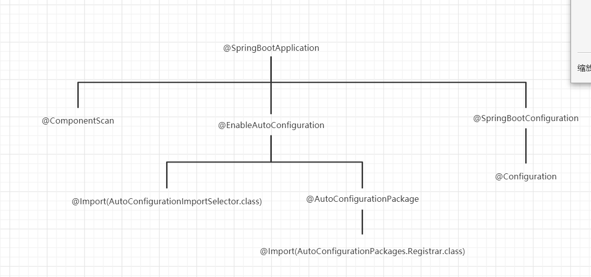
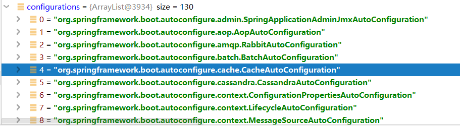
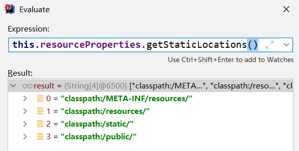
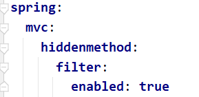
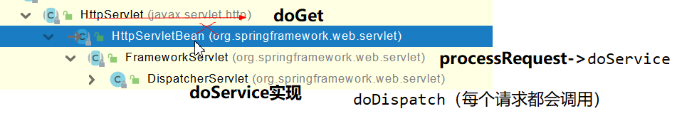
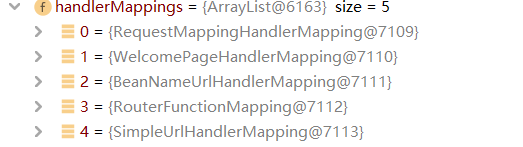
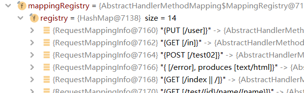

# 1、SpringBoot2入门

## 1.1、HelloWorld

1、创建maven工程

2、引入SpringBoot2的web工程依赖

```xml
<dependency>
    <groupId>org.springframework.boot</groupId>
    <artifactId>spring-boot-starter-web</artifactId>
</dependency>
```

3、创建主程序

```java
/**
 * 主程序类
 * @SpringBootApplication：这是一个SpringBoot应用
 */
@SpringBootApplication
public class Boot02WebApplication {

    public static void main(String[] args) {
        SpringApplication.run(Boot02WebApplication.class, args);
    }

}

```

4、编写业务

```java
@RestController
public class HelloController {


    @RequestMapping("/hello")
    public String handle01(){
        return "Hello, Spring Boot 2!";
    }


}
```

5、测试

运行main方法。

# 2、了解制动配置原理

## 2.1、SpringBoot2特点

### 2.1.1、依赖管理

-   父项目做依赖管理

```xml
<parent>
    <groupId>org.springframework.boot</groupId>
    <artifactId>spring-boot-starter-parent</artifactId>
    <version>2.4.5</version>
</parent>
```

-   他的父项目，几乎声明了所有开发中常用的依赖的版本号,自动版本仲裁机制

```xml
<parent>
  <groupId>org.springframework.boot</groupId>
  <artifactId>spring-boot-dependencies</artifactId>
  <version>2.4.5</version>
</parent>
```

-   开发导入starter场景起动器

1、见到很多 spring-boot-starter-* ： *就某种场景
		2、只要引入starter，这个场景的所有常规需要的依赖我们	都自动引入
		3、SpringBoot所有支持的场景
	https://docs.spring.io/spring-boot/docs/current/reference/	html/using-spring-boot.html#using-boot-starter
		4、见到的  *-spring-boot-starter： 第三方为我们提供的简	化开发的场景启动器。
		5、所有场景启动器最底层的依赖

-   无需关注版本号，自动版本仲裁，可以修改默认版本

    1、查看spring-boot-dependencies里面规定当前依赖的版本 用的 key。
    2、在当前项目里面重写配置

    ```xml
    <properties>      <mysql.version>5.1.43</mysql.version>
    </properties>
    ```

### 2.1.2、自动配置

-   自动配置好了Tomcat

    -   引入Tomcat依赖
    -   配置Tomcat

    ```xml
    <dependency>
        <groupId>org.springframework.boot</groupId>
        <artifactId>spring-boot-starter-tomcat</artifactId>
        <version>2.3.4.RELEASE</version>
        <scope>compile</scope>
    </dependency>
    ```

-   自动配好了SpringMVC
    -   引入SpringMVC全套组件
    -   自动配好SpringMVC常用组件（功能）

-   自动配好Web常见功能，如：字符编码问题

    -   SpringBoot帮我们配置好了所有web开发的常见场景

-   默认的包结构

    -   主程序所在包及其下面的所有子包里面的组件都会被默认扫描进来
    -   无需以前的包扫描配置
    -   想要改变扫描路径，@SpringBootApplication(scanBasePackages=**""**)

    -   -   或者@ComponentScan 指定扫描路径

-   各种配置拥有默认值

    -   默认配置最终都是映射到某个类上，如：MultipartProperties（文件相关）
    -   配置文件的值最终会绑定**每个**类上，**这个类会在容器中创建对象**

-   按需加载所有自动配置项

    -   非常多的starter
    -   **引入了哪些场景这个场景的自动配置才会开启**
    -   SpringBoot所有的自动配置功能都在 spring-boot-autoconfigure 包里面

## 2.2、容器功能

### 2.2.1、添加组件

1、@Configuration

-   基本使用

-   **Full模式与Lite模式**

    -   配置 类组件之间无依赖关系用Lite模式加速容器启动过程，减少判断
    -   配置类组件之间有依赖关系，方法会被调用得到之前单实例组件，用Full模式

    ```java
    /**
     * 1、配置类里面使用@Bean标注在方法上给容器注册组件，默认也是单实例的
     * 2、配置类本身也是组件
     * 3、proxyBeanMethods：代理bean的方法
     *      Full(proxyBeanMethods = true)、【保证每个@Bean方法被调用多少次返回的组件都是单实例的】默认
     *      Lite(proxyBeanMethods = false)【每个@Bean方法被调用多少次返回的组件都是新创建的】
     *      组件依赖必须使用Full模式默认。其他默认是否Lite模式
     */
    @Configuration(proxyBeanMethods = true) // 告诉SpringBoot这是一个配置类 == 配置文件.xml
    public class MyConfig {
    
        // bean的注册顺序会影响结果
        @Bean("cat")
        public Pet cat(){
            return new Pet("tom");
        }
    
        @Bean //给容器中添加组件。以方法名作为组件的id。返回类型就是组件类型。返回的值，就是组件在容器中的实例
        public Person people(){
            Person aizhong = new Person("aizhong", 20);
            aizhong.setPet(cat());// people组件依赖cat组件
            return aizhong;
        }
    }
    ```

2、`@ImportResource`("classpath:beans.xml") 导入原生配置文件

3、@Import({`xxx.class`, `xxx.class`})

​	给容器中自动创建出这两个类型的组件、默认组件的名字就是全类,添加的组件需要被@Configuration标注

4、@Conditional

​	条件装配：满足Conditional指定的条件，则进行组件注入容器

4、@ComponentScan 扫描指定包下组件

### 2.2.2、配置绑定

-   @ConfigurationProperties + @Component
-   @ConfigurationProperties + @EnableConfigurationProperties(Car.class)

```java
/**
 * 只有在容器中的组件，才会拥有SpringBoot提供的强大功能
 *  @ConfigurationProperties(prefix = "mycar") 可以在配置文件(.properties,.yaml)中配置类的属性
 *  必须在容器中添加，故需要和
 *      @Component 在本类上使用
 *      @EnableConfigurationProperties(Car.class) 在配置类上使用
 */
//@Component
@ConfigurationProperties(prefix = "mycar")
public class Car {
    private String brand;
    private Integer price;

    public Car() {
    }

    public Car(String brand, Integer price) {
        this.brand = brand;
        this.price = price;
    }

    public String getBrand() {
        return brand;
    }

    public void setBrand(String brand) {
        this.brand = brand;
    }

    public Integer getPrice() {
        return price;
    }

    public void setPrice(Integer price) {
        this.price = price;
    }

    @Override
    public String toString() {
        return "Car{" +
                "brand='" + brand + '\'' +
                ", price=" + price +
                '}';
    }
}
```

## 2.3、自动配置原理入门

### 2.3.1、引导加载自动配置类

-   @SpringBootApplication

```java
@SpringBootConfiguration	// @Configuration。代表当前是一个配置类
@EnableAutoConfiguration	// 
// @ComponentScan指定扫描哪些，Spring注解；
@ComponentScan(excludeFilters = { @Filter(type = FilterType.CUSTOM, classes = TypeExcludeFilter.class),
      @Filter(type = FilterType.CUSTOM, classes = AutoConfigurationExcludeFilter.class) })
public @interface SpringBootApplication{}
```

-   @EnableAutoConfiguration

```java
@AutoConfigurationPackage	// 自动配置包？指定了默认的包规则
@Import(AutoConfigurationImportSelector.class)
public @interface EnableAutoConfiguration{}
```

-   @AutoConfigurationPackage

```java
@Import(AutoConfigurationPackages.Registrar.class)  //给容器中导入一个组件
public @interface AutoConfigurationPackage {}

//利用Registrar给容器中导入一系列组件
//将指定的一个包下的所有组件导入进来？MainApplication 所在包下。
```

-   @Import(AutoConfigurationImportSelector.class)

```
1、利用getAutoConfigurationEntry(annotationMetadata);给容器中批量导入一些组件
2、调用List<String> configurations = getCandidateConfigurations(annotationMetadata, attributes)获取到所有需要导入到容器中的配置类
3、利用工厂加载 Map<String, List<String>> loadSpringFactories(@Nullable ClassLoader classLoader)；得到所有的组件
4、从META-INF/spring.factories位置来加载一个文件。
    默认扫描我们当前系统里面所有META-INF/spring.factories位置的文件
    spring-boot-autoconfigure-2.3.4.RELEASE.jar包里面也有META-INF/spring.factories
    
```





**springframework\boot\spring-boot-autoconfigure\2.4.5\spring-boot-autoconfigure-2.4.5.jar!\META-INF\spring.factories**文件里面写死了spring-boot一启动就要给容器中加载的所有配置类

### 2.3.2、按需装配

```
虽然我们127个场景的所有自动配置启动的时候默认全部加载。xxxxAutoConfiguration
按照条件装配规则（@Conditional），最终会按需配置。
```

总结：

-   SpringBoot先加载所有的自动配置类  xxxxxAutoConfiguration
-   每个自动配置类按照条件进行生效，默认都会绑定配置文件指定的值。xxxxProperties里面拿。xxxProperties和配置文件进行了绑定
-   生效的配置类就会给容器中装配很多组件
-   只要容器中有这些组件，相当于这些功能就有了
-   定制化配置

-   -   用户直接自己@Bean替换底层的组件
    -   用户去看这个组件是获取的配置文件什么值就去修改。

**xxxxxAutoConfiguration ---> 组件  --->** **xxxxProperties里面拿值  ----> application.properties******

# 3、配置文件

## 3.1、文件类型

1、properties

2、yaml

​	key: value；kv之间有空格

​	大小写敏感

​	使用缩进表示层级关系

​	缩进不允许使用tab，只允许空格

​	缩进的空格数不重要，只要相同层级的元素左对齐即可

​	'#'表示注释

​	字符串无需加引号，如果要加，''与""表示字符串内容 会被 转义/不转义

3、yml

**优先级 properties > yaml > yml**

# 4、web开发

Spring Boot provides auto-configuration for Spring MVC that **works well with most applications.(大多场景我们都无需自定义配置）**

## 4.1、简单功能分析

### 4.1.1、静态资源访问

只要静态资源放在类路径下： called `/static` (or `/public` or `/resources` or `/META-INF/resources`

访问 ： 当前项目根路径/ + 静态资源名 

原理： 静态映射/**。

请求进来，先去找Controller看能不能处理。不能处理的所有请求又都交给静态资源处理器。静态资源也找不到则响应404页面

改变默认静态资源访问路径，存放路径

**优先级 /META-INF/resources > /resources > /static > /public**



```yaml
spring:
	# 访问路径 默认为 无
	mvc:
		static-path-pattern: /res/**
	# 存放路径，默认为`/static` (or `/public` or `/resources` or `/META-INF/resources`
	resources:	
		static-locations: [classpath:/haha/]
```

### 4.1.2、欢迎页支持

静态资源路径下  index.html

controller能处理 /index 请求

### 4.1.3、静态资源配置原理

SpringBoot启动默认加载  xxxAutoConfiguration 类（自动配置类）

SpringMVC功能的自动配置类 WebMvcAutoConfiguration，生效

```java
@Configuration(proxyBeanMethods = false)
@ConditionalOnWebApplication(type = Type.SERVLET)
@ConditionalOnClass({ Servlet.class, DispatcherServlet.class, WebMvcConfigurer.class })
@ConditionalOnMissingBean(WebMvcConfigurationSupport.class)
@AutoConfigureOrder(Ordered.HIGHEST_PRECEDENCE + 10)
@AutoConfigureAfter({ DispatcherServletAutoConfiguration.class, TaskExecutionAutoConfiguration.class,
      ValidationAutoConfiguration.class })
public class WebMvcAutoConfiguration{}
```

给容器中配了 WebMvcProperties、WebProperties、ResourceProperties

```java
@SuppressWarnings("deprecation")
@Configuration(proxyBeanMethods = false)
@Import(EnableWebMvcConfiguration.class)
@EnableConfigurationProperties({ WebMvcProperties.class,
      org.springframework.boot.autoconfigure.web.ResourceProperties.class, WebProperties.class })
@Order(0)
public static class WebMvcAutoConfigurationAdapter implements WebMvcConfigurer{}
```

配置类只有一个有参构造器，所有参数的值都会从容器中确定

WebProperties webProperties,获取和spring.web绑定的所有的值的对象

WebMvcProperties mvcProperties 获取和spring.mvc绑定的所有的值的对象

ListableBeanFactory beanFactory Spring的beanFactory
		HttpMessageConverters 找到所有的HttpMessageConverters
		ResourceHandlerRegistrationCustomizer 找到 资源处理器的自定义器
		DispatcherServletPath  
		ServletRegistrationBean   给应用注册Servlet、Filter....

```java
public WebMvcAutoConfigurationAdapter(
    WebProperties webProperties, 
    WebMvcProperties mvcProperties,
    ListableBeanFactory beanFactory, 
    ObjectProvider<HttpMessageConverters> messageConvertersProvider,
    ObjectProvider<ResourceHandlerRegistrationCustomizer> resourceHandlerRegistrationCustomizerProvider,
    ObjectProvider<DispatcherServletPath> dispatcherServletPath,
    ObjectProvider<ServletRegistrationBean<?>> servletRegistrations) {
   this.mvcProperties = mvcProperties;
   this.beanFactory = beanFactory;
   this.messageConvertersProvider = messageConvertersProvider;
   this.resourceHandlerRegistrationCustomizer = resourceHandlerRegistrationCustomizerProvider.getIfAvailable();
   this.dispatcherServletPath = dispatcherServletPath;
   this.servletRegistrations = servletRegistrations;
   this.mvcProperties.checkConfiguration();
}
```

处理规则 addResourceHandlers()

```java
@Override
protected void addResourceHandlers(ResourceHandlerRegistry registry) {
   super.addResourceHandlers(registry);
   if (!this.resourceProperties.isAddMappings()) {
      logger.debug("Default resource handling disabled");
      return;
   }
   ServletContext servletContext = getServletContext();
   addResourceHandler(registry, "/webjars/**", "classpath:/META-INF/resources/webjars/");
   addResourceHandler(registry, this.mvcProperties.getStaticPathPattern(), (registration) -> {
      registration.addResourceLocations(this.resourceProperties.getStaticLocations());
      if (servletContext != null) {
         registration.addResourceLocations(new ServletContextResource(servletContext, SERVLET_LOCATION));
      }
   });
}
```

请求路径 **/webjars/****，映射路径 **classpath:/META-INF/resources/webjars/**

请求路径 **this.mvcProperties.getStaticPathPattern() -> staticPathPattern = "/**"**

​	映射路径**this.resourceProperties.getStaticLocations() -> CLASSPATH_RESOURCE_LOCATIONS = { "classpath:/META-INF/resources/","classpath:/resources/", "classpath:/static/", "classpath:/public/" }**

### 4.1.4、欢迎页处理原理

welcomePageHandlerMapping（）

```java
@Bean
public WelcomePageHandlerMapping welcomePageHandlerMapping(
    ApplicationContext applicationContext,
    FormattingConversionService mvcConversionService, 
    ResourceUrlProvider mvcResourceUrlProvider) {
    
    WelcomePageHandlerMapping welcomePageHandlerMapping = new WelcomePageHandlerMapping(
        new TemplateAvailabilityProviders(applicationContext), 
        applicationContext, 
        getWelcomePage(),
        this.mvcProperties.getStaticPathPattern());
    
    welcomePageHandlerMapping.setInterceptors(getInterceptors(mvcConversionService, mvcResourceUrlProvider));
    welcomePageHandlerMapping.setCorsConfigurations(getCorsConfigurations());
    return welcomePageHandlerMapping;
}

private Resource getWelcomePage() {
	// getStaticLocations() 遍历所有静态资源目录
    for (String location : this.resourceProperties.getStaticLocations()) {
        Resource indexHtml = getIndexHtml(location);
        if (indexHtml != null) {
            return indexHtml;
        }
    }
    ServletContext servletContext = getServletContext();
    if (servletContext != null) {
        return getIndexHtml(new ServletContextResource(servletContext, SERVLET_LOCATION));
    }
    return null;
}

private Resource getIndexHtml(String location) {
    return getIndexHtml(this.resourceLoader.getResource(location));
}

private Resource getIndexHtml(Resource location) {
    try {
        // 寻找是否存在index.html
        Resource resource = location.createRelative("index.html");
        if (resource.exists() && (resource.getURL() != null)) {
            return resource;
        }
    }
    catch (Exception ex) {
    }
    return null;
}

WelcomePageHandlerMapping(
    TemplateAvailabilityProviders templateAvailabilityProviders,
	ApplicationContext applicationContext, 
    Resource welcomePage, 
    String staticPathPattern) {
    	// 如果没有修改staticPathPattern静态资源访问路径，且存在
		if (welcomePage != null && "/**".equals(staticPathPattern)) {
			logger.info("Adding welcome page: " + welcomePage);
			setRootViewName("forward:index.html");
		}
		else if (welcomeTemplateExists(templateAvailabilityProviders, applicationContext)) {
			logger.info("Adding welcome page template: index");
			setRootViewName("index");
		}
	}
```

## 4.2、请求参数处理

### 4.2.1、请求映射

1、rest使用与原理

-   @xxxMapping；
-   Rest风格支持（*使用**HTTP**请求方式动词来表示对资源的操作*）

-   -   *以前：**/getUser*  *获取用户*   */deleteUser* *删除用户*   */editUser*  *修改用户*    */saveUser* *保存用户*
    -   *现在： /user*   *GET-**获取用户*   *DELETE-**删除用户*   *PUT-**修改用户*    *POST-**保存用户*
    -   核心Filter；HiddenHttpMethodFilter

-   -   -   用法： 表单method=post，隐藏域 _method=put
        -   SpringBoot中手动开启

    -   

###### ==使用==

表单

```html
<form action="/user" method="get">
    <input type="submit" value="get">
</form>
<form action="/user" method="post">
    <input type="submit" value="post">
</form>
<form action="/user" method="post">
    <input name="_method" type="hidden" value="delete">
    <input type="submit" value="delete">
</form>
<form action="/user" method="post">
    <input name="_method" type="hidden" value="put">
    <input type="submit" value="put">
</form>
```

controller

```java
//    @RequestMapping(value = "/user", method = RequestMethod.GET)
    @GetMapping("/user")
    public String get(){
        return "GET";
    }
//    @RequestMapping(value = "/user", method = RequestMethod.POST)
    @PostMapping("/user")
    public String post(){
        return "POST";
    }
//    @RequestMapping(value = "/user", method = RequestMethod.PUT)
    @PutMapping("/user")
    public String put(){
        return "PUT";
    }
//    @RequestMapping(value = "/user", method = RequestMethod.DELETE)
    @DeleteMapping("/user")
    public String delete(){
        return "DELETE";
    }
```

### 4.2.2、请求原理



SpringMVC功能分析都从 org.springframework.web.servlet.DispatcherServlet   ->   doDispatch（）

```java
@Override
protected void doService(HttpServletRequest request, HttpServletResponse response) throws Exception {
   logRequest(request);

   // Keep a snapshot of the request attributes in case of an include,
   // to be able to restore the original attributes after the include.
   Map<String, Object> attributesSnapshot = null;
   if (WebUtils.isIncludeRequest(request)) {
      attributesSnapshot = new HashMap<>();
      Enumeration<?> attrNames = request.getAttributeNames();
      while (attrNames.hasMoreElements()) {
         String attrName = (String) attrNames.nextElement();
         if (this.cleanupAfterInclude || attrName.startsWith(DEFAULT_STRATEGIES_PREFIX)) {
            attributesSnapshot.put(attrName, request.getAttribute(attrName));
         }
      }
   }
```

所有的请求都会经过这个方法



**RequestMappingHandlerMapping**：保存了所有@RequestMapping 和handler的映射规则。



-   SpringBoot自动配置欢迎页的 WelcomePageHandlerMapping 。访问 /能访问到index.html；
-   SpringBoot自动配置了默认 的 RequestMappingHandlerMapping
-   请求进来，挨个尝试所有的HandlerMapping看是否有请求信息。

-   -   如果有就找到这个请求对应的handler
    -   如果没有就是下一个 HandlerMapping

### 4.2.3、普通参数与基本注解

注解

@PathVariable  restful 传参

@RequestParam  ？号传参

@RequestHeader、@ModelAttribute、@MatrixVariable、@CookieValue、@RequestBody

```java
@GetMapping("/test/{id}/name/{name}")
public Map<String, Object> test(@PathVariable("id") Integer id,
                                @PathVariable("name") String name,
                                @RequestParam("id1") Integer id1,
                                @RequestParam("name1") String name1){
    HashMap<String, Object> map = new HashMap<>();
    map.put("id", id);
    map.put("name",name);
    System.out.println(id1);
    System.out.println(name1);
    return map;
}
```

### 4.2.4、参数处理原理

-   HandlerMapping中找到能处理请求的Handler（Controller.method()）
-   为当前Handler 找一个适配器 HandlerAdapter； **RequestMappingHandlerAdapter**
-   适配器执行目标方法并确定方法参数的每一个值


## 4.3、视图解析与模板引擎

### 4.3.1、视图解析

1、目标方法处理的过程中，所有数据都会被放在 **ModelAndViewContainer 里面。包括数据和视图地址**

**2、方法的参数是一个自定义类型对象（从请求参数中确定的），把他重新放在** **ModelAndViewContainer** 

**3、任何目标方法执行完成以后都会返回 ModelAndView（数据和视图地址）。**

**4、processDispatchResult  处理派发结果（页面改如何响应）**

-   1、**render**(**mv**, request, response); 进行页面渲染逻辑

-   -   1、根据方法的String返回值得到 **View** 对象【定义了页面的渲染逻辑】

-   -   -   1、所有的视图解析器尝试是否能根据当前返回值得到**View**对象
        -   2、得到了  **redirect:/main.html** --> Thymeleaf new **RedirectView**()
        -   3、ContentNegotiationViewResolver 里面包含了下面所有的视图解析器，内部还是利用下面所有视图解析器得到视图对象。
        -   4、view.render(mv.getModelInternal(), request, response);  视图对象调用自定义的render进行页面渲染工作

-   -   -   -   **RedirectView 如何渲染【重定向到一个页面】**
            -   **1、获取目标url地址**
            -   **2、response.sendRedirect(encodedURL);**

**视图解析：**

-   -   **返回值以 forward: 开始： new InternalResourceView(forwardUrl); -->  转发request.getRequestDispatcher(path).forward(request, response);** 
    -   **返回值以** **redirect: 开始：** **new RedirectView() --》 render就是重定向** 
    -   **返回值是普通字符串： new ThymeleafView（）--->** 

### 4.3.2、模板引擎-Thymeleaf

1、引入starter

```xml
<dependency>
    <groupId>org.springframework.boot</groupId>
    <artifactId>spring-boot-starter-thymeleaf</artifactId>
</dependency>
```

2、自动配置好了thymeleaf

```
@Configuration(proxyBeanMethods = false)
@EnableConfigurationProperties(ThymeleafProperties.class)
@ConditionalOnClass({ TemplateMode.class, SpringTemplateEngine.class })
@AutoConfigureAfter({ WebMvcAutoConfiguration.class, WebFluxAutoConfiguration.class })
public class ThymeleafAutoConfiguration {}
```

自动配好的策略

-   1、所有thymeleaf的配置值都在 ThymeleafProperties
-   2、配置好了 **SpringTemplateEngine** 
-   **3、配好了** **ThymeleafViewResolver** 
-   4、我们只需要直接开发页面

```java
public static final String DEFAULT_PREFIX = "classpath:/templates/";

public static final String DEFAULT_SUFFIX = ".html";
```

## 4.4、拦截器

1、实现HandlerInterceptor 接口，设置拦截规则

```java
public class LoginInterceptor implements HandlerInterceptor {
    @Override
    public boolean preHandle(HttpServletRequest request, HttpServletResponse response, Object handler) throws Exception {
        Object userSession = request.getSession().getAttribute("userSession");
        if(userSession != null){
            return true;
        }

        //拦截住。未登录。跳转到登录页
        request.setAttribute("msg","请先登录");
        request.getRequestDispatcher("/").forward(request,response);
        return false;

    }
}
```

2、配置拦截器，设置拦截那些请求

```java
/**
 * 1、编写一个拦截器实现HandlerInterceptor接口
 * 2、拦截器注册到容器中（实现WebMvcConfigurer的addInterceptors）
 * 3、指定拦截规则【如果是拦截所有，静态资源也会被拦截】
 */
@Controller
public class MyWebConfig implements WebMvcConfigurer {
    @Override
    public void addInterceptors(InterceptorRegistry registry) {
        registry.addInterceptor(new LoginInterceptor())
                .addPathPatterns("/**") // 所有请求都被拦截包括静态资源
                .excludePathPatterns("/","/index","/tologin");
    }
}
```

3、拦截器原理

1、根据当前请求，找到**HandlerExecutionChain【**可以处理请求的handler以及handler的所有 拦截器】

2、先来**顺序执行** 所有拦截器的 preHandle方法

-   1、如果当前拦截器prehandler返回为true。则执行下一个拦截器的preHandle
-   2、如果当前拦截器返回为false。直接   倒序执行所有已经执行了的拦截器的  afterCompletion；

**3、如果任何一个拦截器返回false。直接跳出不执行目标方法**

**4、所有拦截器都返回True。执行目标方法**

**5、倒序执行所有拦截器的postHandle方法。**

**6、前面的步骤有任何异常都会直接倒序触发** afterCompletion

7、页面成功渲染完成以后，也会倒序触发 afterCompletion

## 4.5、文件上传

1、页面表单

```html
<form th:action="@{/upload}" method="post" enctype="multipart/form-data">
    <input type="text" name="email">
    <input type="file" name="file">
    <input type="submit">
</form>
```

2、代码

```java
// 文件上传
@PostMapping("/upload")
public String upload(@RequestParam("email") String email,
                     @RequestPart("file") MultipartFile file){

    System.out.println("email======>"+email);
    System.out.println("filename===========>"+file.getOriginalFilename());
    //        file.transferTo(); // 存储
    return "ok!";
}
```

3、自动配置原理

**文件上传自动配置类-MultipartAutoConfiguration-**MultipartProperties

-   自动配置好了 **StandardServletMultipartResolver  【文件上传解析器】**
-   **原理步骤**

-   -   **1、请求进来使用文件上传解析器判断（**isMultipart**）并封装（**resolveMultipart，**返回**MultipartHttpServletRequest**）文件上传请求**
    -   **2、参数解析器来解析请求中的文件内容封装成MultipartFile**
    -   **3、将request中文件信息封装为一个Map；**MultiValueMap<String, MultipartFile>

**FileCopyUtils**。实现文件流的拷贝

## 4.6异常处理

在templates目录下新建error文件夹，springboot会自动匹配里面的自定义 .html 错误页面


