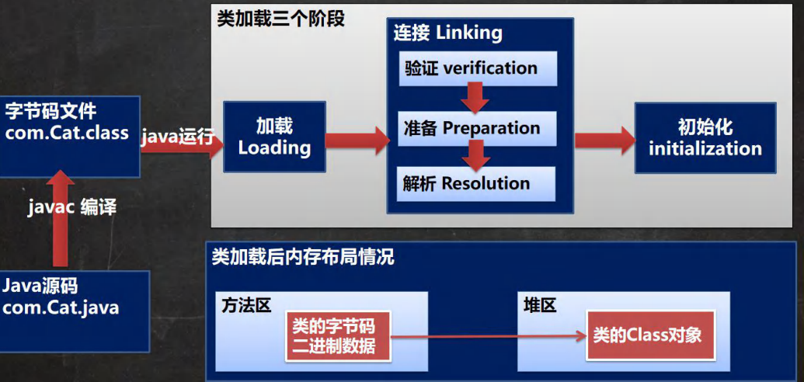
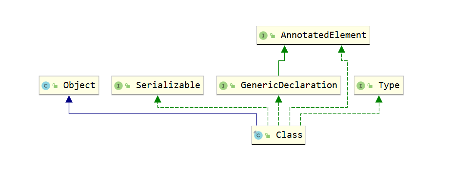
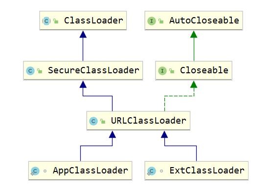

# 1、类的加载机制



## 1.1、加载

使用 java.lang.ClassLoader的loadClass()。

JVM在此阶段的主要目的是将字节码从不同的数据源（.class文件、jar包、网络。。。）转化成==二进制字节流==加载到内存中（**方法区**），并在生成一个代表该类的java.lang.Class对象（**堆**）


## 1.2.1、连接-验证

目的是为了确保Class文件的字节流中包含的信息符合当前虚拟机的要求，并且不会危害虚拟机自身的安全。 验证阶段大致会完成4个阶段的检验动作：

-   文件格式验证：验证字节流是否符合Class文件格式的规范(例如，是否以魔术**0xCAFEBABE**开头、主次版本号是否在当前虚拟机的处理范围之内、常量池中的常量是否有不被支持的类型)

-   元数据验证：对字节码描述的信息进行语义分析，以保证其描述的信息符合Java语言规范的要求(例如：这个类是否有父类，除了java.lang.Object之外)；


-   字节码验证：通过数据流和控制流分析，确定程序语义是合法的、符合逻辑的;


-   符号引用验证：确保解析动作能正确执行。

验证阶段是非常重要的，但不是必须的，它对程序运行期没有影响。如果所引用的类经过反复验证，那么可以考虑采用**-Xverifynone**参数来关闭大部分的类验证措施，以缩短虚拟机类加载的时间。


## 1.2.2、连接-准备

对静态变量分配内存并默认初始化（0,0L，null，false等），这些变量都存放在方法区中。

注意：final的静态变量会直接赋值。


## 1.2.3、连接-解析

解析阶段是虚拟机将常量池内的符号引用替换为直接引用的过程。解析动作主要针对类或接口、字段、类方法、接口方法、方法类型、方法句柄和调用点限定符7类符号引用进行。


## 1.3、初始化

类初始化阶段是类加载过程的最后一步。在前面的类加载过程中，除了在加载阶段用户应用程序可以通过自定义类加载器参与之外，其余动作完全由虚拟机主导和控制。到了初始化阶段，才真正开始执行类中定义的java程序代码(字节码)。

在准备阶段，变量已经赋过一次系统要求的初始值(零值)；而在初始化阶段，则根据程序猿通过程序制定的主观计划去初始化类变量和其他资源，或者更直接地说：初始化阶段是执行类构造器<clinit>()方法的过程。<clinit>()方法是由编译器自动收集类中的所有**静态变量的赋值动作**和**静态语句块static{}**中的语句合并产生的，编译器收集的顺序是由语句在源文件中出现的顺序所决定的，静态语句块只能访问到定义在静态语句块之前的变量，定义在它之后的变量，在前面的静态语句块可以赋值，但是不能访问。

　类构造器<clinit>()与实例构造器<init>()不同，它不需要程序员进行显式调用，虚拟机会保证在子类类构造器<clinit>()执行之前，父类的类构造<clinit>()执行完毕。由于父类的构造器<clinit>()先执行，也就意味着父类中定义的静态语句块/静态变量的初始化要优先于子类的静态语句块/静态变量的初始化执行。特别地，类构造器<clinit>()对于类或者接口来说并不是必需的，如果一个类中没有静态语句块，也没有对类变量的赋值操作，那么编译器可以不为这个类生产类构造器<clinit>()。

　　虚拟机会保证一个类的类构造器<clinit>()在多线程环境中被正确的加锁、同步，如果多个线程同时去初始化一个类，那么只会有一个线程去执行这个类的类构造器<clinit>()，其他线程都需要阻塞等待，直到活动线程执行<clinit>()方法完毕。特别需要注意的是，在这种情形下，其他线程虽然会被阻塞，但如果执行<clinit>()方法的那条线程退出后，其他线程在唤醒之后不会再次进入/执行<clinit>()方法，因为 在同一个类加载器下，一个类型只会被初始化一次。


# 2、Class类

## 2.1、Class对象

Class也是一个类，也继承了Object类。



每一个类有且仅有一个Class对象。获取Class对象有三种方式，创建出来的Class对象都是同一个。

```java
/*
    获取类Class的三种方式
 */
public class Main {
    public static void main(String[] args) throws Exception {
        // 1、Class.forName();
        Class<?> aClass = Class.forName("com.aizhong.pojo.Animal");
        System.out.println(aClass.hashCode());
        // 2、通过类的静态属性
        Class<Animal> animalClass = Animal.class;
        System.out.println(animalClass.hashCode());
        // 3、通过实例对象 getClass() 方法
        Animal animal = new Animal();
        Class<? extends Animal> aClass1 = animal.getClass();
        System.out.println(aClass1.hashCode());
        
    }
}
```

在反射中，通常使用的是第一种方式，后两种都需要导入相应的包，依赖性太强。第三种实例对象都有了，更不需要反射了。


## 2.2、Class类的加载



类加载器在 Launcher 类构造方法中进行了初始化。

```java
public Launcher() {
    Launcher.ExtClassLoader var1;
    try {
        // 获取扩展类加载器
        var1 = Launcher.ExtClassLoader.getExtClassLoader();
    } catch (IOException var10) {
        throw new InternalError("Could not create extension class loader", var10);
    }
    try {
        // 最终为AppClassLoader
        this.loader = Launcher.AppClassLoader.getAppClassLoader(var1);
    } catch (IOException var9) {
        throw new InternalError("Could not create application class loader", var9);
    }
    Thread.currentThread().setContextClassLoader(this.loader);
    String var2 = System.getProperty("java.security.manager");
    if (var2 != null) {
        SecurityManager var3 = null;
        if (!"".equals(var2) && !"default".equals(var2)) {
            try {
                var3 = (SecurityManager)this.loader.loadClass(var2).newInstance();
            } catch (IllegalAccessException var5) {
            } catch (InstantiationException var6) {
            } catch (ClassNotFoundException var7) {
            } catch (ClassCastException var8) {
            }
        } else {
            var3 = new SecurityManager();
        }
        if (var3 == null) {
            throw new InternalError("Could not create SecurityManager: " + var2);
        }
        System.setSecurityManager(var3);
    }
}
```

loader 最终赋值为 AppClassLoader 也就是应用类加载器。 通过上面的加载流程我们可知所有的类都是通过调用，loader.loadClass()方法来加载类 所以我们写的程序（未指定特殊加载方式的）都是通过应用类加载器开始加载。

AppClassLoader.loadClass() 方法：

```java
public Class<?> loadClass(String var1, boolean var2) throws ClassNotFoundException {
    int var3 = var1.lastIndexOf(46);
    if (var3 != -1) {
        SecurityManager var4 = System.getSecurityManager();
        if (var4 != null) {
            var4.checkPackageAccess(var1.substring(0, var3));
        }
    }
    if (this.ucp.knownToNotExist(var1)) {
        Class var5 = this.findLoadedClass(var1);
        if (var5 != null) {
            if (var2) {
                this.resolveClass(var5);
            }
            return var5;
        } else {
            throw new ClassNotFoundException(var1);
        }
    } else {
        return super.loadClass(var1, var2);
    }
}
```

经过一系列的校验判断会走到最后一行代码去调用父类加载器的类加载方法：

```java
return super.loadClass(var1, var2);
```

这里会调用ClassLoader的loadClass()方法

```java
protected Class<?> loadClass(String name, boolean resolve)
    throws ClassNotFoundException
{
    synchronized (getClassLoadingLock(name)) {
        // First, check if the class has already been loaded
        Class<?> c = findLoadedClass(name);
        if (c == null) {
            long t0 = System.nanoTime();
            try {
                if (parent != null) {
                    c = parent.loadClass(name, false);
                } else {
                    c = findBootstrapClassOrNull(name);
                }
            } catch (ClassNotFoundException e) {
                // ClassNotFoundException thrown if class not found
                // from the non-null parent class loader
            }
            if (c == null) {
                // If still not found, then invoke findClass in ord
                // to find the class.
                long t1 = System.nanoTime();
                c = findClass(name);
                // this is the defining class loader; record the st
                sun.misc.PerfCounter.getParentDelegationTime().addT
                sun.misc.PerfCounter.getFindClassTime().addElapsedT
                sun.misc.PerfCounter.getFindClasses().increment();
            }
        }
        if (resolve) {
            resolveClass(c);
        }
        return c;
    }
}
```

首先会先检查是否已经加载过该类，如果加载过则直接返回

```java
// First, check if the class has already been loaded
Class<?> c = findLoadedClass(name);
```

如果没有找到则会判断 parent 类加载器是否为 null ，如果不为 null 则委托 parent 类加载器去加载，否则则使用引导类加载器加载 findBootstrapClassOrNull 最终是一个本地 C++ 实现的方法，会使用引导类加载器去尝试加载

```java
if (parent != null) {
    c = parent.loadClass(name, false);
} else {
    c = findBootstrapClassOrNull(name);
}
```

这个流程就是向上委托流程。而如果委托 parent 未加载到则会调用自己实现的 findClass() 方法尝试自己加载：

```java
if (c == null) {
    // If still not found, then invoke findClass in order
    // to find the class.
    long t1 = System.nanoTime();
    c = findClass(name);
    // this is the defining class loader; record the stats
    sun.misc.PerfCounter.getParentDelegationTime().addTime(t1 - t0);
    sun.misc.PerfCounter.getFindClassTime().addElapsedTimeFrom(t1);
    sun.misc.PerfCounter.getFindClasses().increment();
}
```

## 2.3、引起类加载的操作

1.  new创建实例对象
2.  Class.forName()反射加载
3.  子类的加载会导致父类的加载，且先加载父类
4.  访问类的静态资源

注意：

1.  声明对象数组不会导致类的加载
2.  访问类的常量不会导致类的加载（Final 编译期间就会被保存起来，所以不会导致初始）


# 3、反射

## 3.1、反射的引出

==**如何不修改源代码的情况下动态的创建对象**==

1、用一个**.properties**文件来存储需要用到的信息

```properties
className=com.aizhong.Demo01.Animal
methodName=sleep
```

2、使用Properties类来读取配置文件信息，然后使用反射来调用方法

```java
public class Main {
    public static void main(String[] args) throws Exception {
        Properties properties = new Properties();
        properties.load(new FileInputStream("src/com/aizhong/Demo01/re.properties"));
        String className = properties.getProperty("className");
        String methodName = properties.getProperty("methodName");
        System.out.println("创建 "+className+",并调用 "+methodName);

        // 1、获取Class对象
        Class<?> aClass = Class.forName(className);
        // 2、通过class对象创建一个实例
        Object o = aClass.newInstance();
        // 3、通过class对象获取method对象
        Method method = aClass.getMethod(methodName);
        // 4、执行方法
        method.invoke(o);
		
    }
}
```

这样可以不修改java源码的情况下，动态的创建不同的对象，调用不同的方法。这也是java很多框架的底层，通过外部配置文件的修改来控制程序，也符合OCP原则（开闭原则：对扩展开放，对修改关闭）


## 3.2、反射的功能

1.  在运行时判断任意一个对象所属的类
2.  在运行时构造任意一个类的对象
3.  在运行时得到任意一个类所具有的成员变量和方法
4.  在运行时调用任意一个对象的成员变量和方法
5.  生成动态代理


## 3.3、反射的优缺点

优点：可以动态的创建和使用对象（框架底层的核心），使用灵活。

缺点：反射基本是解释执行，对执行速度有影响。破坏了java的封装。

反射调用的优化，关闭访问检查。Method、Field和Constructor都有setAccessible()方法，其作用是启用或关闭访问的安全检查。true为关闭，这同时也是反射访问private成员的必要条件。


## 3.4、常用方法


# 4、破坏单例

因为反射能够获取类的private成员变量，所以可以破坏单例。只需要获取私有化的构造器即可。

```java
/**
 * 饿汉式单例
 */
public class HungrySingleIns {
    private static HungrySingleIns hungrySingleIns = new HungrySingleIns();
    private HungrySingleIns(){};

    public static HungrySingleIns getInstance(){
        return hungrySingleIns;
    }
}
```

测试

```java
private static void unsafe01() throws Exception {
    Class<?> HSIns = Class.forName("com.aizhong.singleIns.HungrySingleIns");
    Constructor<?> constructor = HSIns.getDeclaredConstructor();
    constructor.setAccessible(true);
    Object o1 = constructor.newInstance();
    Object o2 = constructor.newInstance();
    Object o3 = constructor.newInstance();
    System.out.println(o1);
    System.out.println(o2);
    System.out.println(o3);
}
```

输出都是不同的对象，懒汉式同理。

解决方法：1、在私有的构造器中进行判断，如果自己的实例已创建，则抛出异常；

```java
class HungrySingleIns02 {
    private static HungrySingleIns02 hungrySingleIns02 = new HungrySingleIns02();
    private HungrySingleIns02(){
        if(hungrySingleIns02 != null){
            throw new RuntimeException();
        }
    };
    public static HungrySingleIns02 getInstance(){
        return hungrySingleIns02;
    }
}
```


